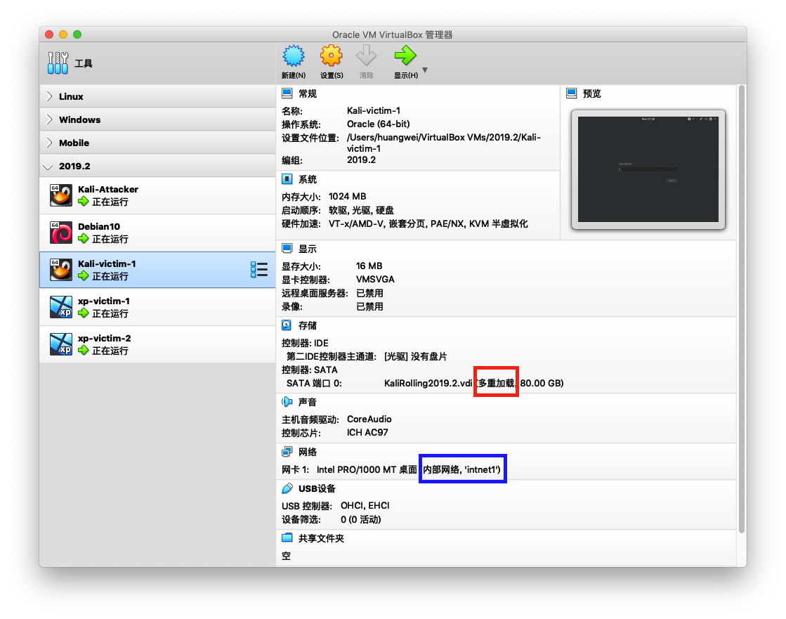
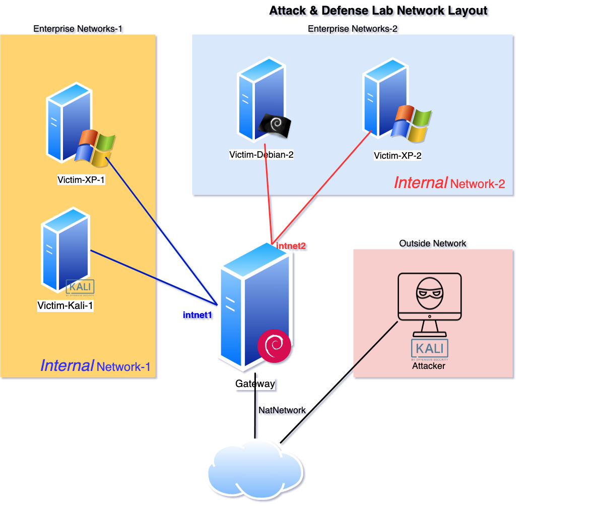

# 基于 VirtualBox 的网络攻防基础环境搭建

## 实验目的

* 掌握 VirtualBox 虚拟机的安装与使用；
* 掌握 VirtualBox 的虚拟网络类型和按需配置；
* 掌握 VirtualBox 的虚拟硬盘多重加载；

## 实验环境

以下是本次实验需要使用的网络节点说明和主要软件举例：

* VirtualBox 虚拟机
* 攻击者主机（Attacker）：Kali Rolling 2019.2
* 网关（Gateway, GW）：Debian Buster
* 靶机（Victim）：From Sqli to shell / xp-sp3 / Kali

## 实验要求

* 虚拟硬盘配置成多重加载，效果如下图所示；



* 搭建满足如下拓扑图所示的虚拟机网络拓扑；



> 根据实验宿主机的性能条件，可以适度精简靶机数量

* 完成以下网络连通性测试；
    - [ ] 靶机可以直接访问攻击者主机
    - [ ] 攻击者主机无法直接访问靶机
    - [ ] 网关可以直接访问攻击者主机和靶机
    - [ ] 靶机的所有对外上下行流量必须经过网关
    - [ ] 所有节点均可以访问互联网

## 实验报告要求

* Markdown 书写，且在 Github 上渲染出的排版效果正常，可读性强；
* 在 Github 上每次提交作业单独从 `master` 分支 **新** 开一个分支；
    * 每次作业均保存到 **独立不冲突** 的子目录；
* 图文并茂证明：
    * 实验关键步骤是自己做的；
    * **哪些** 实验结果符合实验要求预期；
* 如有涉及到代码、配置文件，请记得 `commit` **源代码** 文件；
* 规范的 Git 工作流程：
    * **提交作业等待批改**：提交 `PR` 请求将作业分支合并到 `master` 分支；
        * 未 `PR` 时的 `commit` 不会被批改；
    * 课程没有在教务处系统上查到分数之前，**禁止合并或关闭** 已有批改记录的 `PR`，可以在该 `PR` 对应的分支上继续提交新变更；；
    * 每次实验报告只保留一个 `Open` 状态的 `PR` ，禁止同一次作业发起多个 `PR`；
    * `PR` 的标题应体现本次实验报告的主题；

> 示例作业目录（所有分支合并到 master 分支后状态）如下：

```bash
.
├── .gitattributes
├── .gitignore
├── README.md
├── chap0x01
│   ├── README.md
│   └── img
│       ├── vb-setup.png
│       └── vb-victim-screenshot-1.png
├── chap0x02
│   └── README.md
├── chap0x03
│   └── README.md
├── chap0x04
│   └── README.md
└── chap0x05
    ├── README.md
    └── code
        ├── exp.py
        └── nginx.conf
```

> 示例 Git 分支结构如下：


