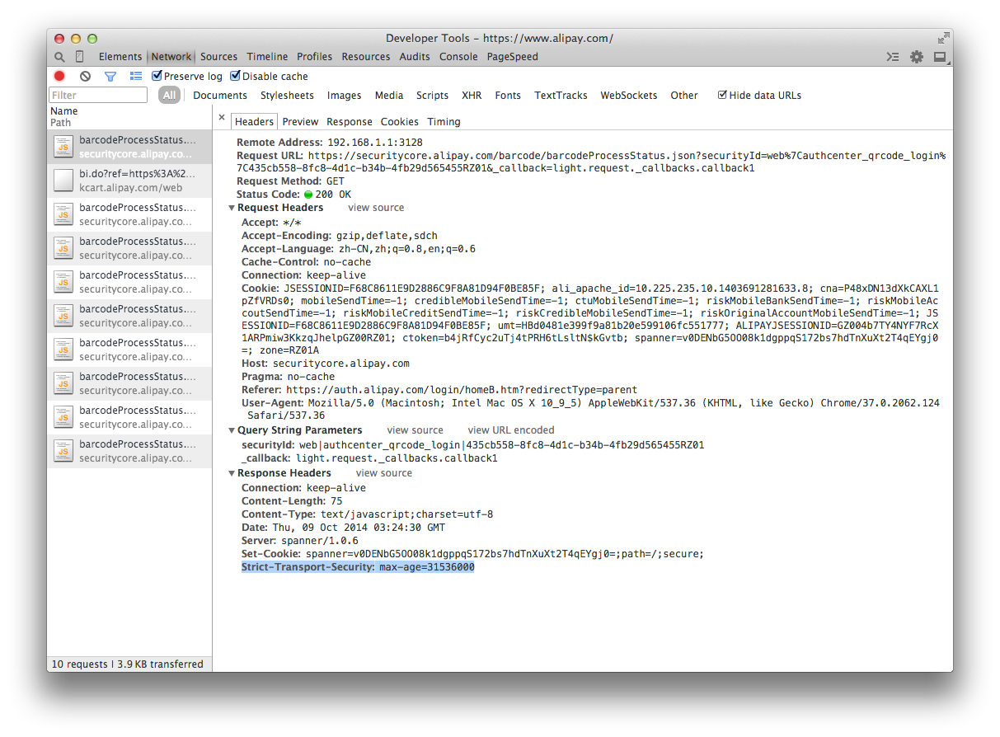
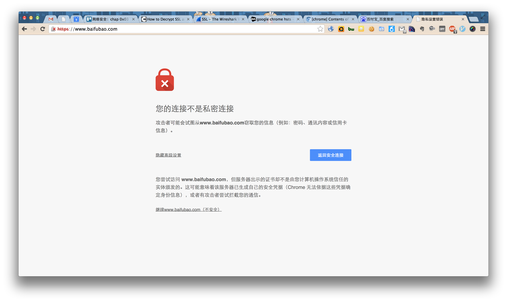
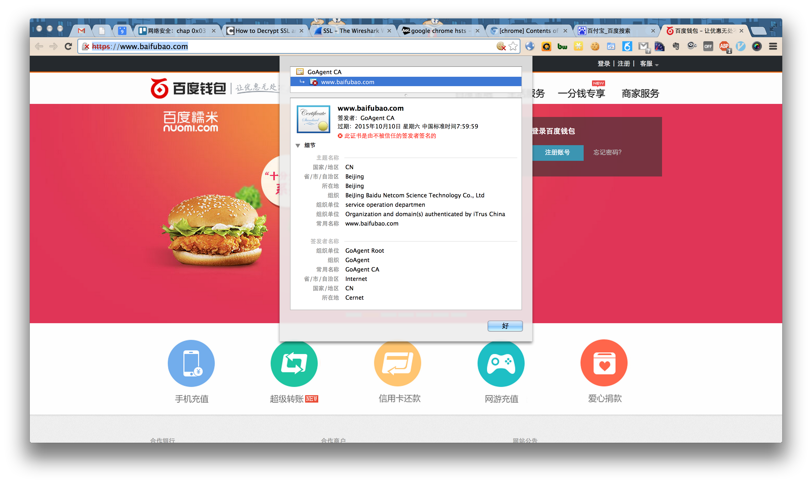
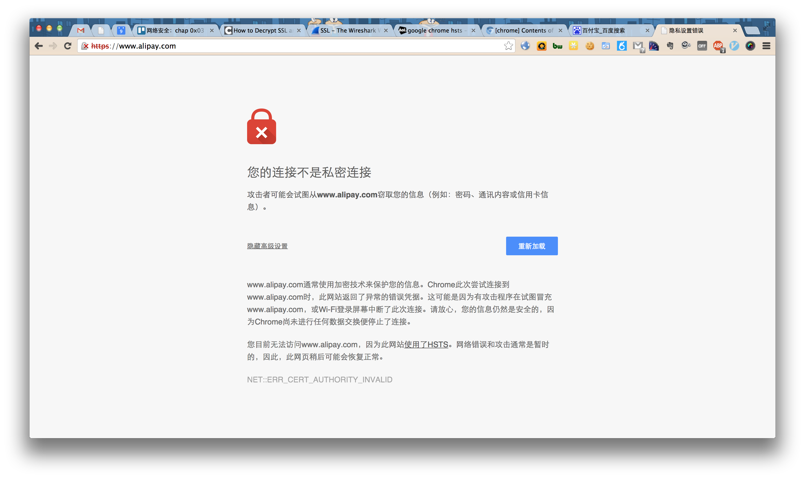

# 实验

## HTTP代理服务器实验

Q：使用http代理服务器访问HTTPS站点时，通信传输内容是否会被代理服务器“看到”？

A：结论是代理服务器不知道客户端和服务器的HTTPS通信内容，但代理服务器知道客户端访问了哪个HTTPS站点，这是由http代理的协议机制决定的：代理客户端会发送Connect请求到http代理服务器。

实验验证：在Kali Linux中安装tinyproxy，然后用主机设置浏览器代理指向tinyproxy建立的HTTP正向代理，在Kali中用wireshark抓包，分析抓包过程，理解HTTP正向代理HTTPS流量的特点。

提醒注意：

> HTTP代理服务器在转发客户端请求时，可能会添加Via字段，从而向目标站点暴露客户端正在使用代理访问。类似的，匿名通信应用tor的部分出口节点也会在http请求中自动加入via字段，向被访问站点宣告：当前请求正在使用匿名通信网络tor提供的匿名通信服务。

Q: 了解什么是HSTS

A: HSTS（HTTP Strict Transport Security）机制：

* [服务器通过实现HSTS机制，可以帮助客户端（例如浏览器）强制](https://www.owasp.org/index.php/HTTP_Strict_Transport_Security)
  * 客户端和服务器之间的所有通信流量必须使用HTTPS
  * SSL证书合法性校验









Ref:

- [使用HTTP代理服务器的安全性简评](http://www.williamlong.info/archives/2210.html) 
- [如何使用代理服务器上网](http://www.williamlong.info/archives/2057.html)

### tinyproxy

tinyproxy使用主要注意事项：

```bash
apt-get update
apt-get install tinyproxy

# 编辑tinyproxy，取消Allow 10.0.0.0/8行首注释
/etc/init.d/tinyproxy start

# 设置虚拟机联网方式为NAT和端口转发，默认tinyproxy监听8888端口
# 主机浏览器设置代理指向tinyproxy的服务地址
# 虚拟机里开启wireshark抓包
# 主机访问https站点
# 结束抓包，分析抓包结果
```

wireshark分析HTTP代理流量技巧：

* http.request.method eq CONNECT 查看所有HTTPS代理请求
* http.request.method eq GET 查看所有HTTP GET代理请求
* [使用wireshark解密HTTPS流量的方法](http://support.citrix.com/article/CTX116557) [方法2](https://wiki.wireshark.org/SSL)
* [使用wireshark提取pcap包中的SSL证书](http://mccltd.net/blog/?p=2036)
  * wireshark首选项中确认TCP协议的Allow subdissector to reassemble TCP streams选项处于启用状态
  * 通过显示筛选过滤规则（例如：tcp.port == 443），找到SSL会话
  * 通过packet list里的info列找到Certificate
      * 在packet details面板里依次展开Handshake Protocol: Certificate --> Certificates，如果有多个证书，会看到多个默认折叠起来的Certificate
      * 右键选中Certificate，在右键菜单里使用Export Selected Packet Bytes功能即可导出DER格式的SSL证书
  * 使用openssl命令行工具解析DER证书
openssl x509 -in xxx.der -inform der -text -noout


### buprsuite

- [铁器 · Burp Suite](http://daily.zhihu.com/story/3905128)

# 延伸阅读

- [微软hotmail SSL证书被劫持的真实案例](http://www.freebuf.com/news/45929.html)
- [GoAgent安全风险提示](https://www.bamsoftware.com/sec/goagent-advisory.html)
- [密码学应用实践的小学期Wiki（回顾签发证书和配置Apache的HTTPS站点方法）](https://c4pr1c3.github.io/cuc-wiki/ac.html)
