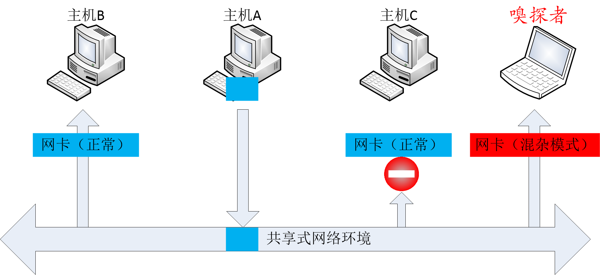
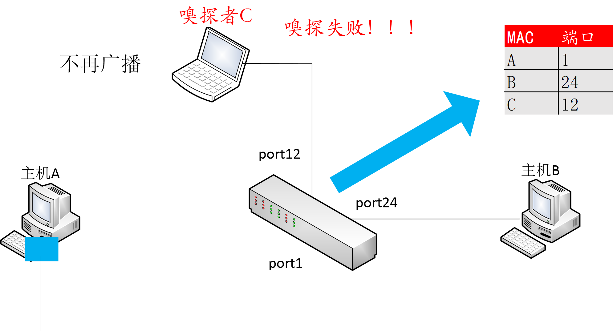
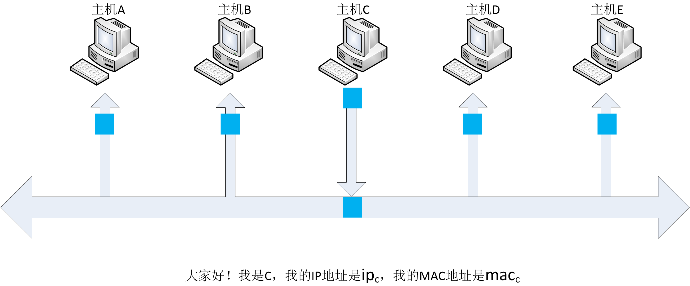
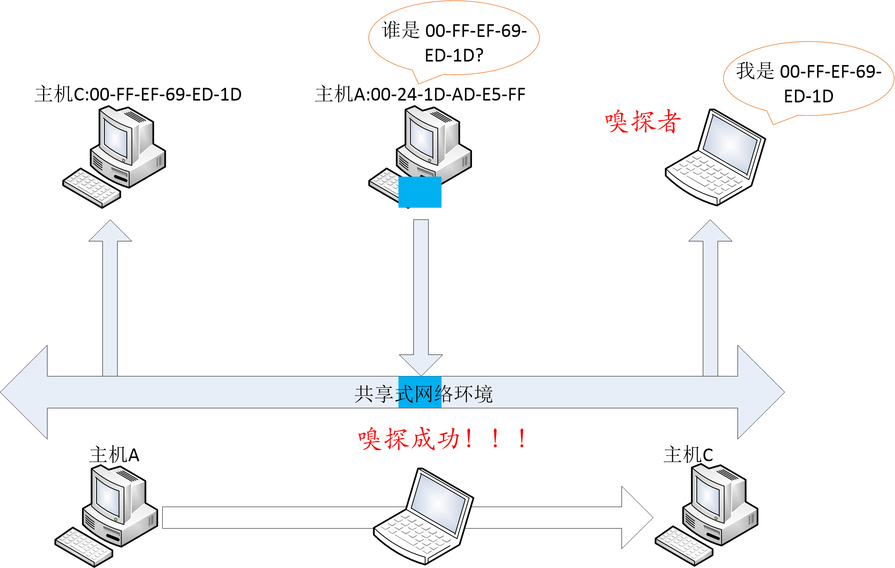
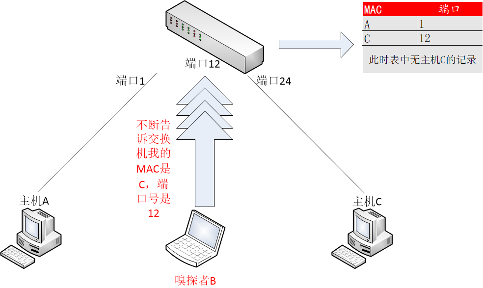
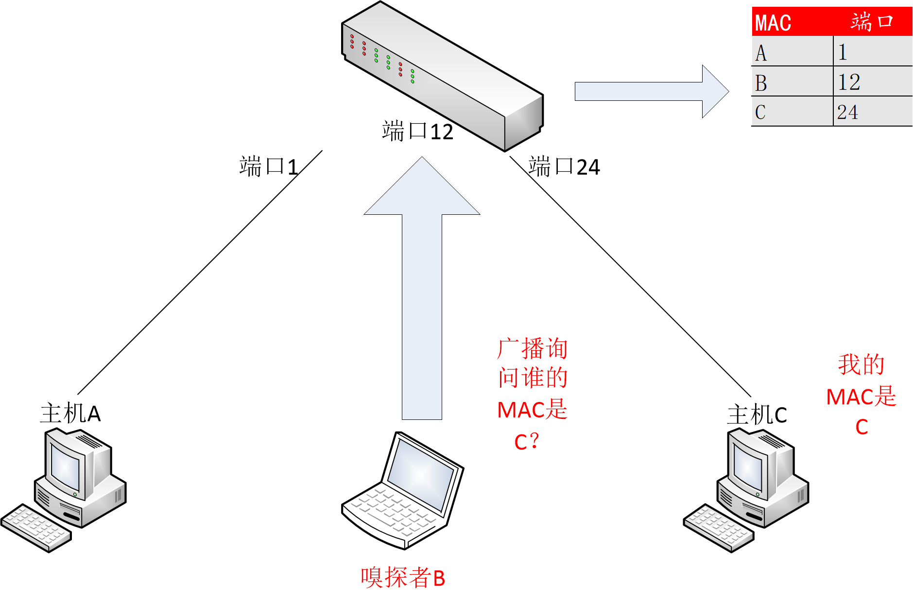
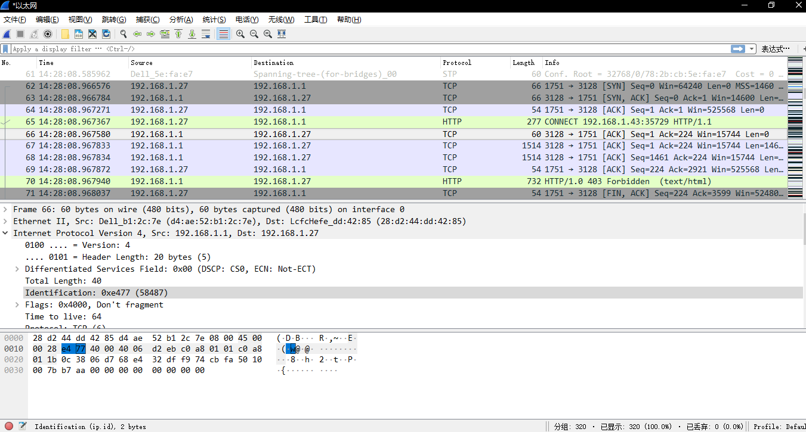
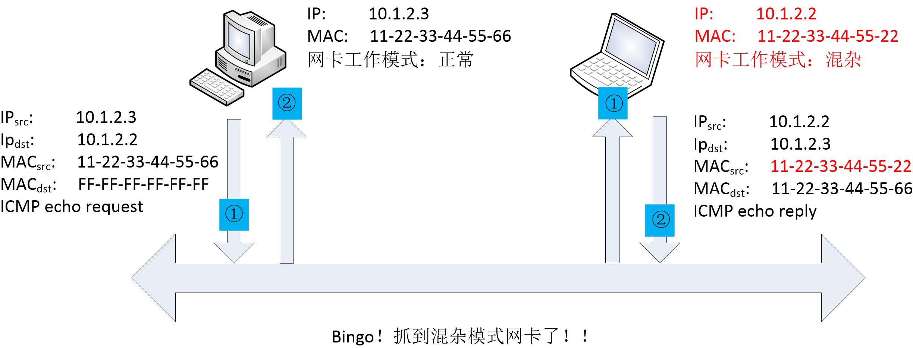
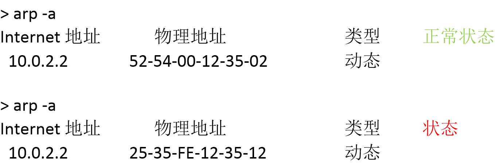

# 第四章 网络监听

重点内容：

* 网络监听原理
* 网络监听工具
* 网络监听的检测和防范

## 4.1 网络监听原理

网络监听技术可以监视获取网络的状态、数据流动情况以及网络中传输的信息等，使得网络管理人员可以用监听技术来进行网络管理、排除网络故障。但同时，监听技术也为网络安全带来了极大的隐患。实际上，许多入侵活动都基于网络监听技术，从而导致了密码口令被非法获取、敏感信息泄露被截等安全事件的发生。

作为网络安全中十分重要的技术之一，网络监听可分为被动监听和主动监听。下面我们便来对此进行进一步学习。

### 4.1.1 被动监听

#### 4.1.1.1 共享式网络环境

以太网是目前应用最广泛的局域网，而 IEEE 802.3 以太局域网采用广播机制，即局域网上的所有主机共享相同的通信链路。而数据的接发实际上是由网卡来完成，每个网卡都有一个唯一的 MAC 地址作为标识。网卡工作于数据链路层，当收到数据包时，会对数据包的目的 MAC 地址进行检查，并根据网卡驱动的设置对数据包进行过滤，判断是接收还是丢弃。以太网卡的工作模式有两种：正常模式和混杂模式。在正常模式下，只接收目的 MAC 地址的自己的数据包，其他将一律丢弃；而在混杂模式下，网卡并不检查目的 MAC 地址，对所有的数据包都来者不拒。

由此可见，网络监听所需的条件为：1. 网络上的数据能够到达监听主机。2.
监听主机的网卡设置为混杂模式。在共享网络环境下，网络数据能够到达同一网段的所有主机，被动监听正是利用这一特点：嗅探者在运行时将网卡设置为混杂模式，这样不用做其他工作，就可以隐蔽的捕获分析数据而不被发现。原理如图 4-1 所示：




主机A发送数据包给主机B，由于是共享网络环境，采用广播模式，数据包被广而告（传送）之局域网内所有在线主机，而主机B和主机C因为网卡设置为正常模式，所以经过对目的 MAC 地址的检查，只有主机B接收到数据包，这时，若嗅探者将网卡设置为混杂模式便可接收到A发送给B的数据包（混杂模式下，不对 MAC 地址做检查）。则嗅探成功！

这种形式是一种完全被动的嗅探，并且很难发现嗅探者。

### 4.1.2 主动监听

#### 4.1.2.1 交换式网络环境

随着交换机的广泛应用，更多的以太网属于交换类型。所有主机连接到交换机，对于发给某个特定主机的数据包会被交换机从特定的端口送出，而不是广播给网络中的所有主机。这种传输形式使得以太网的性能大大提高，但是也破坏了监听的第一条件，即其他的主机即使将网卡设置在混杂模式，也只能收到广播帧和目的地址是本机的帧，因而无法进行监听，但这并不意味着交换式网络环境就没有被嗅探的可能——使用主动监听就可以达到在交换式网络环境嗅探的目的。

交换机能够只将数据包发送给目标主机，这是因为交换机拥有内容可寻址存储器（Content Addressable Memory, CAM）表，表中存储有局域网内每台计算机的 MAC 地址和 MAC 地址所连接的交换机端口号。则交换机通过查找 CAM 表来进行数据包的转发，这样数据包便会被转发至特定的目标主机，而不是进行广播，使得嗅探难以进行。如图 4-2 所示：




对于交换式的网络环境，可以采用主动监听方式，即数据链路层的漏洞利用，ARP 欺骗来进行嗅探。

首先，我们先来复习一下地址解析协议（Address Resolution Protocol, ARP）。为了避免不必要的 ARP 报文查询，每台主机都维护有一个 ARP 高速缓存，它记录着同一链路上其他主机的 IP 地址到 MAC 地址的映射关系，ARP 便是用来进行主机在发送帧前将目标 IP 地址转换为目标 MAC 地址的协议。ARP 高速缓存表可以进行动态学习（当目标主机不在表中，发送一个广播 ARP 请求包，收到答复后将地址添加到表中并进行发送数据帧）和静态配置（该缓存可以手动添加静态条目）。局域网的主机间通信需依赖于 ARP 来找到目标主机，而局域网中的主机访问外网也需依赖于 ARP 来找到网关。

还有无故地址解析协议（Gratuitous ARP, GARP）。GARP 用来检查重复地址或 IP 地址冲突，当一台机器收到一个含有与自身 MAC 地址相对应的源 IP 地址的 ARP 请求包时，便可获知存在重复地址或 IP 地址冲突。同时还可以用于通告一个新的数据链路标识，当一个设备收到一个 ARP 请求时，发现 ARP 缓冲区中已有发送者的 IP 地址，则更新此 IP 地址的 MAC 地址条目。如图 4-3 所示：




关于 ARP 欺骗有三种模式：

1. 终端 ARP 缓存投毒，即主动嗅探/中间人攻击；
2. 交换机 DoS，强制交换机进入 Hub 模式：广播；
3. 交换机投毒，主动“污染”交换机的 MAC-Port 转发表，即 CAM 表。

1. 终端 ARP 缓存投毒

这种攻击利用 ARP 欺骗来嗅探主机间的通信，这需要提前知道通信双方的 MAC 地址。ARP 欺骗的发生来源于无故 ARP，ARP 缓存中毒的原理是：嗅探者向目标主机的 ARP 缓存投毒，来将自己的电脑添加到目标主机和源主机的数据转发链路之中一个节点来截获数据包。使嗅探者类似于一个代理。如图 4-4 所示：




如图主机A和主机C进行通信，主机A发送广播 ARP 请求，这时，嗅探者抢先进行应答，发送伪造的无故 ARP 向主机A作出相应，其中源主机 IP 地址是主机 CIP 的，但源 MAC 地址是嗅探者的 MAC 地址，当主机A接收到应答后，在 ARP 高速缓存中添加新纪录，信息则先发给嗅探者，嗅探成功，再由嗅探者转发给主机C，或者截获后停止发送。

2. 交换机 DoS

这种攻击也就是对 CAM 进行泛洪攻击。CAM 表中存储有 MAC 地址和交换机端口，以及他们的 VLAN 信息，CAM 表有固定的容量，只能存储一定数目的条目，而攻击者让网络中大量涌入含有不同源 MAC 地址的伪造的无故 ARP 数据包，逼迫交换机退化为集线器，如同共享式网络，只能进行广播，嗅探变得轻而易举。如图 4-5 所示：


3. 交换机投毒

利用 MAC 的泛洪攻击来嗅探两台主机间的通信，需得知目标主机的 MAC 地址，来通过「投毒」方式「篡改」目标主机 MAC 地址在交换机 CAM 表中对应的端口号。交换机通过对每个端口发来的数据包的源 MAC 地址进行 **学习** 并绑定到各个端口，这时攻击者发送伪造的无故 ARP 包覆盖 CAM 表中目标主机 MAC 地址对应的交换机端口号，这样后续交换机在查询 CAM 表转发数据时会将目标 MAC 地址为被攻击者的数据包从攻击者主机所连接的交换机端口上转发出去，发送到了攻击者主机，嗅探则成功。

如图 4-6 所示，攻击开始，嗅探者不断向交换机发送伪造的无故 ARP，其中源 MAC 地址是目标主机的 MAC 地址，因为交换机绑定 MAC 地址到一个单一的端口，如果攻击者够快，用于目标主机的数据包将被发送到攻击者的交换机端口，而不是目标主机。这时，攻击者已经窃取到目标主机的交换端口，并截获信息。




如图 4-7 所示，接下来，攻击者执行 ARP 请求要求目标主机的 IP 地址。当攻击者收到答复，则意味着该目标主机的交换机端口已回复到原来的约束。攻击者完成嗅探，并将数据包转发给所述的目标主机。




## 4.2 网络监听工具

网络监听工具有：被动监听软件 Wireshark，主动监听软件 dsniff 和 ettercap。

### 4.2.1 Wireshark 简介

Wireshark 是网络包分析工具，前身是 Ethereal，主要用来捕获网络包，并尝试显示包的尽可能详细的情况。可以把网络包分析工具当成是一种用来测量有什么东西从网线上进出的测量工具，就好像使电工用来测量进入电信的电量的电度表一样（当然比那个更高级）。过去的此类工具要么是过于昂贵，要么是属于某人私有，或者是二者兼顾。
Wireshark 出现以后，这种现状得以改变。Wireshark 可能算得上是今天能使用的最好的开源网络分析软件。

下面是 Wireshark 一些应用的举例：网络管理员用来解决网络问题、网络安全工程师用来检测安全隐患、开发人员用来测试协议执行情况、用来学习网络协议。具有以下特性：

1. 多平台支持：Win / Mac / \*nix。
2. 可实时捕获网络数据包。
3. 可详细显示数据包的协议信息。
4. 能读取/保存数据包。
5. 支持基于规则的数据包/协议统计分析。
6. 支持多种方式过滤捕获/显示网络数据包。
7. 能导入/导出其他网络嗅探程序支持的数据包格式。
8. 有多种方式来查找包。下图为 Wireshark 的界面展示。




如图 4.8 所示，Wireshark 主窗口由如下部分组成：

1. 菜单，用于开始操作。
2. 主工具栏，提供快速访问菜单中经常用到的项目的功能。
3. Fiter toolbar/ 过滤工具栏，提供处理当前显示过滤得方法。
4. Packet List 面板，显示打开文件的每个包的摘要。点击面板中的单独条目，包的其他情况将会显示在另外两个面板中。
5. Packet detail 面板，显示您在 Packet list 面板中选择的包德更多详情。Packet bytes 面板，显示您在 Packet list 面板选择的包的数据，以及在 Packet details 面板高亮显示的字段。
6. 状态栏，显示当前程序状态以及捕捉数据的更多详情。

### 4.2.2 Wireshark 功能和使用

tshark 是 Wireshark 的终端版本（无图形用户界面），Wireshark 常用命令有：

1) 捕获指定 IP 地址相关的数据包并保存到文件

```bash
sudo tshark -f "host <ip-address>" -w <output-file.pcap>
```

2) 获取当前系统上所有可捕获的网卡 ID

```bash
sudo tshark -D
```

3) 指定数据包捕获所使用的网卡

```bash
sudo tshark –I <capture interface>
```

Wireshark 具有强大的功能，例如：

1. 大流量数据捕获优化，Wireshark 并非实时更新报文窗口，并支持文件切割保存。禁用 MAC 地址/域名/协议类型反向解析，而且它可以自定义数据包的捕获终结条件，可按报文大小、个数、捕获时间来进行设定。
2. 自定义过滤规则，在 wireshark 中，数据包捕获时的过滤规则可根据需要自定义设置，使得大流量数据捕获得以优化。同时还可以自定义的有报文显示时的过滤条件，可对协议分析进行辅助。
3. 网络状况分析，可按协议分类报文的速度、丢包率/重传报文数/畸形包数量以及 TCP QoS 参数（RTT/ 带宽/时序图）来分析网络质量。
4. 一键导出防火墙规则，—Cisco IOS / iptables /windows firewall / IPFirewall。
5. Wireshark 是协议分析神器，可进行 TCP/UDP 会话跟踪(Follow TCP/UDP Stream)；
6. VoIP 协议分析，可对信令/语音数据自动识别和提取；
7. 对应用层负载数据关键词检索，二进制/十六进制/文本皆可；
8. 一键导出并保存应用层负载为文本/二进制原始数据/十六进制 /C 语言数组。
9. 报文统计规律，按报文长度/按协议分层会话/自定义报文显示来进行过滤。

下面举例介绍常用报文捕获过滤规则：

1. 只捕获 IP 地址为 172.18.5.4 的相关报文：host 172.18.5.4
2. 只捕获指定网段的相关报文：net 192.168.0.0/24
3. 只捕获特定端口流量：port 53 or port 80
4. 只捕获指定端口范围的 TCP 报文：tcp portrange 1501-1549

还有报文显示过滤规则:

1. 只显示 SMTP 和 ICMP 相关报文：tcp.port eq 25 or icmp
2. 只匹配显示 UDP 报文头部或负载的连续 3 字节值为 0x81, 0x60, 0x03：
```
udp contains 81:60:03
```
3. 应用层正则式匹配查找：
```
sip.To contains “^a1762$"，
http.request.uri matches “^id=[\d]*"
```

### 4.2.3 dsniff 简介

dsniff 是一系列密码嗅探和网络流量分析工具，用来解析不同的应用协议并提取相关信息，是网络安全审计和渗透测试工具集：

* arpspoof      指定目标的 arp 欺骗重定向
* dnsspoof      伪造 DNS 响应消息
* dsniff        口令嗅探
* filesnarf     NFS 文件流截获 dump
* macof         泛洪攻击交换机
* mailsnarf     截获 SMTP 和 POP 协议邮件正⽂并 dump 为 Berkeley mbox 格式
* msgsnarf      即时通信消息截获
* sshmitm       针对 Open SSH V1 的 SSH 中间⼈攻击
* sshow         SSH 流量分析⼯具
* tcpkill       强行终止局域网中的 TCP 连接
* tcpnice       强⾏降速局域网中的 TCP 连接
* urlsnarf      嗅探局域网中的所有 HTTP 连接请求
* webmitm       针对 HTTP/HTTPS 的局域网中间人攻击
* webspy        将嗅探到的 HTTP 流量发送到本地浏览器实时查看

## 4.3 网络监听的监测

### 4.3.1 检测共享式网络环境中的监听者

如上文提到，在共享式网络的环境下，网络监听所需的条件为：

1. 网络上的数据能够到达监听主机。
2. 监听主机的网卡设置为混杂模式。故而共享式网络中我们只需要检测是否存在混杂模式的网卡来探寻是否有监听者。

由于在正常模式下，主机只接收目的 MAC 地址是自己的数据包，其他将一律丢弃；而在混杂模式下，网卡并不检查目的 MAC 地址，对所有的数据包都来者不拒。所以，我们只需要构造并发送一个：疑似待排查为混杂模式目标主机的 IP 目的地址和与其真实 MAC 地址不同的虚假 MAC 目的地址 ICMP 回显请求（``echo request``）数据包，如果收到应答，则说明该被排查的目标主机网卡当前正工作于混杂模式，即当前网络中可能存在监听者。如图 4-9 所示：




### 4.3.2 检测交换式网络环境中的监听者

回顾前文，关于交换式网络环境的监听，主要采用主动监听方式，即数据链路层的漏洞利用，ARP 欺骗来进行嗅探。而 ARP 欺骗分为三种模式：

1. 终端 ARP 缓存投毒，即主动嗅探/中间人攻击。
2. 交换机 DoS，强制交换机进入 Hub 模式：广播。
3. 交换机投毒，主动“污染”交换机的 MAC-Port 转发表，即 CAM 表。

下面我们便针对这三种监听方式如何进行检测来一一进行讲解。

#### 4.3.2.1 检测终端 ARP 缓存投毒者

1) 检测终端用户的 ARP 缓存表

首先发送一个 ARP 广播包，这样 ARP 缓存表中便包括了所有在线的主机 IP 到 MAC 地址的映射，随后再发送一个非广播 ARP，接着查看当前 ARP 缓存表，检查两表是否一致，若有异常则说明存在监听。其中``arp -a``命令用来查看当前 ARP 缓存表。如图 4-10 所示：




2) 参见「检测共享式网络环境中的监听者」一节提到的 ARP 请求构造方法来检测目标主机的网卡是否工作在混杂模式，进而推断监听可能性大小。


#### 4.3.2.2 检测交换机 DoS 攻击

对于交换机 DoS 攻击的检测，可以使用网络抓包的方法进行分析。启用交换机的端口镜像，重点关注链路通信质量参数：丢包率和重传率，以及未知的 MAC 地址。即往怀疑有网络监听行为的网络发送大量不存在的物理地址的包，由于监听程序需要分析和处理这些数据包，会占用大量的 CPU 资源，这将导致机器性能下降。而正常系统的反应时间不会有什么变化。

通过比较该机器前后的性能(icmp echo delay 等方法)来加以判断。

#### 4.3.2.3 检测交换机投毒者

观察交换机 CMA 表中的异常更新记录，观察是否存在同一个 MAC 地址反复被映射到不同物理端口。

另外，由于大部分的网络监听软件都会进行地址反向解析，如果怀疑有网络监听，则可以在 DNS 系统上看到有没有明显增多的解析请求。

除去以上方法，也可以利用一些工具软件来发现网络监听更为方便快捷，如 AntiSniffer 等软件。

## 4.4 网络监听的防范

### 4.4.1 终端用户的防范措施

1. 作为一般用户我们可以安装桌面 ARP 防火墙，用来防护终端 ARP 投毒。
2. 配置静态 ARP 地址列表，绑定网关 IP 与 MAC 地址，命令如下：
```
arp –s <网关 IP> <网关 MAC>
```
3. 最后便是对于敏感数据应该进行加密后再传输并使用加密通信协议。

### 4.4.2 网络管理员的防范措施

1) 划分 VLAN

虚拟局域网（Virtual Local Area Network, VLAN）技术的运用可以将以太网通信变为点到点通信，从而防止大部分基于网络监听的入侵。

2) 启用并正确配置交换机的安全机制

将交换机物理端口和 MAC 地址静态绑定，限制交换机单个物理端口可以动态绑定的 MAC 地址数量。

3) 部署内网安全监控设备

监视异常的网络情况，例如：丢包、重传、畸形包、广播风暴等异常情况。

## 4.5 习题

1. 总结⼀下在交换式局域网环境中的网络攻防之术有哪些？
2. 如何理解“仅仅使用 VLAN 划分的⽅法是⽆法彻底解决 ARP 欺骗与攻击”问题？
