# 第五章 网络扫描

重点内容：

1. 网络扫描的基本概念、原理、分类
2. 网络扫描的防范方法

通过前面的学习，我们已经知道访问控制是（操作）系统安全的基础，而局域网的安全管理则是网络安全的网络基础。在一个不安全的局域网中，任何网络层的加密数据都有着被嗅探的风险，而一旦攻击者渗透进入内部网络，后果将不堪设想。对于内网安全，我们应该从管理好 ARP 协议开始。网络监听便是一种被动分析网络安全的重要手段。

在本章节将介绍网络扫描技术，网络扫描是主动分析网络安全的重要手段。对于黑客来说，网络扫描是网络入侵的序曲，是信息收集的手段之一；同时对于网络管理员来说，网络扫描是网络安全防御的自我检测手段。

## 5.1 网络扫描与信息收集

当进行军事攻击时，第一步便是收集情报，这是非常重要的，如果收集的数据量是不够的，或者目标是严密防守的，便不会轻易发动攻击，反之只有足够的信息方可确保任务顺利完成。正如《孙子兵法》中所说：知己知彼，方可百战不殆。网络扫描便是实现信息收集目的的手段之一。

信息收集的目标主要包括：目标主机、目标网络、目标应用/服务以及目标人。对于在线状态下的目标主机，信息收集的主要工作是获取其端口的开放情况和网络服务的详细信息。对于目标网络，获得其网络拓扑结构情况是重中之重。分析目标应用/服务的版本信息并在多种漏洞信息数据库中进行查找匹配，有助于快速判断目标是否存在已知漏洞。收集了解目标人的行为习惯、兴趣爱好，是进行针对性社会工程学攻击的必要条件。

除了对目标人的信息收集之外，技术相关信息收集可概括为三步：（1）踩点；（2）扫描；（3）枚举。

### 5.1.1 踩点

踩点便是构造一个关于目标站点的概要文件。通过简单的工具进行踩点，来进行以下方面的信息收集：（1）管理信息、技术信息、客户信息和一些账单的信息。包括员工姓名、电子邮件地址、电话和传真号码等；（2）IP 地址范围；（3）DNS 服务器；（4）邮件服务器。并且我们也可以识别一些直接连接到互联网上的系统。

这里大部分的信息在互联网上是可以自由访问的。这种对于目标主机、目标网络和目标应用/服务的信息采集的方式便是直接访问。而另外一种踩点便是黑盒测试，可使用特定的客户端连接指定端口/应用/服务，例如使用浏览器 /FTP/telnet 远程连接等；也可使用特定账号和口令尝试登录；或者进行交互模仿的方式进行信息采集。

### 5.1.2 扫描

扫描便是通过互联网检测在线并可访问的主机，以及他们所提供的服务。所使用到的技术例如：PING、端口扫描和操作系统识别均可称之为网络扫描。这里收集的信息类型包含有：（1）运行在每个系统的 TCP/UDP 服务的识别；（2）系统架构（Unix、windows 等）；（3）通过互联网访问系统特定的 IP 地址；（4）操作系统的类型和漏洞等级。简言之扫描就如同一个盗贼对想进入的房子的所有门和窗户进行检测。

### 5.1.3 枚举

枚举就是从系统中提取有效的账户或输出的资源信息的整个过程。主动连接系统查询完成信息的收集，在本质上比踩点和扫描有着更大的侵入性。大多是针对于操作系统，可收集的信息有：用户和用户组的名称、系统的类型、路由表和 SNMP 信息。

本章将主要关注于扫描，信息收集技术的第二阶段。

## 5.2 网络扫描原理

### 5.2.1 网络扫描的基本思想


基本思想如图 5-1 所示：首先进行查询即扫描知识库，构建探测报文；再向目标主机发送探测报文，然后接受目标响应报文并扫描知识库，比对响应报文；最后生成扫描结果报文。

### 5.2.2 网络扫描的基本原理

关于网络扫描的基本原理，我们主要从三个方面进行讲解：报文的发送与接收、扫描知识库的构建于规则匹配、扫描报告的生成。

#### 5.2.2.1 报文发送与接收

其实报文的发送和接收就是报文的封装和解封装的过程，故而必须了解报文的格式以及相关服务层。图 5-2 展示了 TCP/IP 协议栈标准：

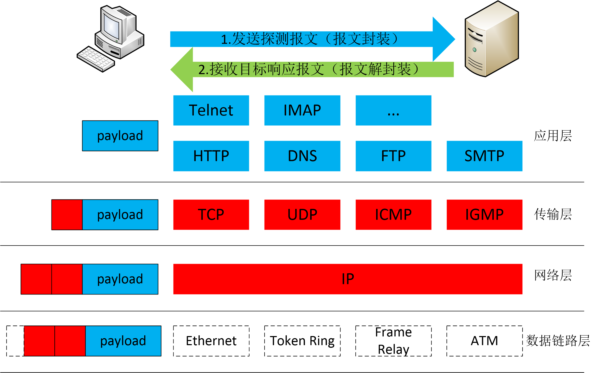

传输控制协议（Transmission Control Protocol, TCP）是一种面向连接的、可靠的传输层协议。采用三次握手建立一个连接。

第一次握手：建立连接时，主机A发送 syn 包(syn=j)到主机B，并进入 SYN\_SEND 状态，等待服务器确认；

第二次握手：主机B收到 syn 包，必须确认主机 A 的 SYN（ack=j+1），同时自己也发送一个 SYN 包（syn=k），即 SYN+ACK 包，此时主机B进入 SYN\_RECV 状态；

第三次握手：主机A收到主机 B 的 SYN＋ACK 包，向主机B发送确认包 ACK(ack=k+1)，此包发送完毕，主机A和主机B进入 ESTABLISHED 状态，完成三次握手。主机A与主机B开始传送数据。如图 5-3 所示：


图 5-4 为 TCP 报文的头部格式。图 5-5 为协议栈的实现举例。TCP 报文段首部为 20 个字节。

**源端口和目标端口：**各占 2 个字节，16 比特的端标语加上 32 比特的 IP 地址；

**序号字段：**占 4 个字节，是本报文段所发送的数据项目组第一个字节的序号。在 TCP 传送的数据流中，每一个字节都有一个序号。

**确认序号：**占 4 字节，是期望收到对方下次发送的数据的第一个字节的序号，也就是期望收到的下一个报文段的首部中的序号。

**数据偏移字段：**占 4 比特，默示数据开端的处所离 TCP 报文段的肇端处有多远。这实际上就是 TCP 报文段首部的长度。

**保存字段：** 6 比特，供以后使用。

**紧急比特 URGent：**当 URG=1 时，表明此报文应尽快传送，而不要按本来的列队次序来传送。与“紧急指针”字段共同应用，紧急指针指出在本报文段中的紧急数据的最后一个字节的序号，使接管方可以知道紧急数据共有多长；

**确认比特 ACK：**只有当 ACK=1 时，确认序号字段才有意义；

**急迫比特 PSH：**当 PSH=1 时，恳求远程 TCP 将本报文段立即传送给其应用层，而不要等到全部缓存都填满了之后再向上交付。

**复位比特 ReSeT：**当 RST=1 时，注解呈现严重错误，必须开释连接，然后再重建传输连接。复位比特还用来拒绝一个不法的报文段或拒绝打开一个连接；

**同步比特 SYN：**在建立连接时应用；

**终止比特 FINal：**用来断开一个连接，当 FIN=1 时，请求断开传输连接；

**窗口字段：**占 2 字节，默示报文段发送方的接收窗口，单位为字节。

**校验和：**TCP 首部和 TCP 数据。这是一个强迫性的字段，由发端策画和存储，由收端进行验证。

**选项字段：**容许每台主机设定可以或允许接管的最大 TCP 载荷才能（缺省 536 字节）
。


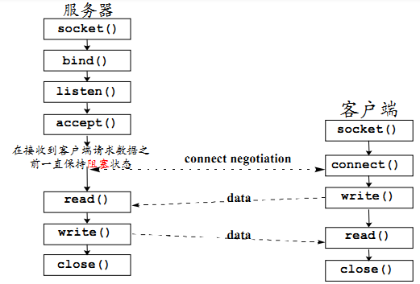

下面来介绍用户数据报协议（User Datagram Protocol, UDP）。UDP 是一种提供面向事物的简单不可靠信息传送服务。是一种无连接协议，源和目的端在数据传输之前不建立连接，收发双方均无需维护连接状态信息，应用层安需维护连接状态信息。与 TCP 协议相较是一种尽力而为的不可靠协议。

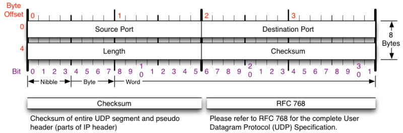

UDP 报头有４个域组成，其中每个域占两个字节，分别为：源端口号、目标端口号、数据包长度、校验值。下图为实现实例：


最后介绍互联网控制消息协议报文（Internet　Control　Message　Protocol, ICMP），ICMP 可提供反馈信息用于报告错误，网关或者目标主机也可利用 ICMP 与源主机通信。其本身是不可靠的传输，其控制能力也并不用于保证传输的可靠性，并且并非用来反映 ICMP 报文的传输情况。

其报头格式为：类型１个字节、代码１个字节、校验和１个字节和 ICMP 的数据部分（长度取决于类型）。如下图：

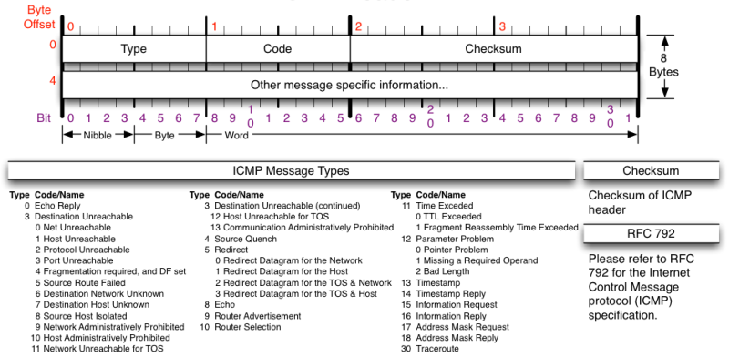

上面介绍了几种常见的协议，而关于协议的标准和（操作系统）协议栈的关系可以看作为：协议标准是种声明，是一种严格统一和规范的标准。如：[RFC 793 TRANSMISSION CONTROL PROTOCOL](https://tools.ietf.org/rfc/rfc793.txt) 、[RFC 768 User Datagram Protocol](https://tools.ietf.org/rfc/rfc768.txt) 、[RFC 791 INTERNET PROTOCOL](https://tools.ietf.org/rfc/rfc791.txt) 、[RFC 792 Internet Control Message Protocol](https://tools.ietf.org/rfc/rfc792.txt) 等。协议栈便是对协议标准的实现，理论上来说应严格遵守标准、完整实现。但从大量实践统计来看，不同开发者由于水平差异、任务优先级排序原因等会在实现协议标准时「偷工减料」或「简化实现」，这就造成了同一种协议标准在不同操作系统、不同应用系统中表现出了不同的「协议行为」，这种「行为差异」成为了网络扫描识别目标服务、目标主机信息的可行性基础。

#### 5.2.2.2 扫描知识库的构建和规则匹配

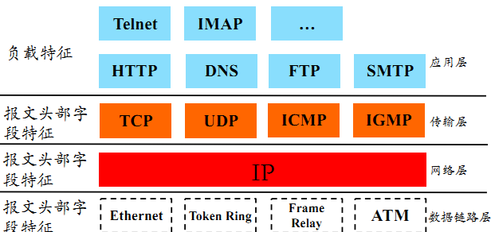

如上图所示：每一层都可构建知识库，收录其报文的头部特征或者负载特征，用于规则匹配。下面讲解两个关于扫描知识库构建的例子：

(1) 互联网地址指派机构（Internet Assigned Numbers Authority, IANA）注册端口号

根据传输层报文头部字段的特征进行构建。公用端口为：0\~1023；注册端口为：1024\~49151；动态的或私有端口为：49152\~65535。

(2) /etc/services 文件

/etc/services 文件是记录网络服务名和它们对应使用的端口号及协议。文件中的每一行对应一种服务，它由 4 个字段组成，中间用 TAB 或空格分隔，分别表示“服务名称”、“使用端口”、“协议名称”以及“别名”。如图 5-10 所示：

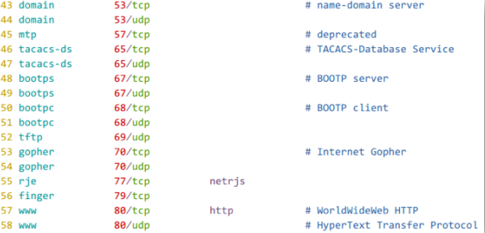

端口的状态是构建知识库的基础，是传输层的概念。可分为开放、关闭和被过滤三种。开放状态下应用／服务监听该端口，并且端口有条件有规则地响应请求数据报文；关闭状态下，无应用／服务监听该端口，并且端口有条件有规则地响应或忽略请求数据报文（操作系统会针对 SYN 请求报文回应 RST 报文）；在被过滤状态下，报文过滤程序监听该端口，而端口有条件有规则地响应或忽略请求数据报文（报文过滤程序可能会返回报文拒绝消息）。

主机状态可分为：可达（在线）和不可达（离线）两种。可达情况下至少有一种类型的请求数据包有响应（充要条件），并且一定有开放端口（这是充分非必要条件）。不可达状态下对任何类型的请求数据包均无响应（充分条件），无端口开放则一定是离线状态（必要非充分条件），例如一般 PC 机，在线时有可能并没有开放端口。还有就是在线主机在防火墙的保护下也可能是不可达状态。

关于主机状态详细信息包含有：操作系统信息，例如版本；端口/应用/服务状态信息，即端口状态、应用程序版本。主机扫描、TCP/IP 协议栈实现知识库（利用不同操作系统/应用程序的差异）是实现远程获取主机状态详细信息的基础。

关于网络扫描大致可分为两种：主机扫描和端口扫描。

##### 5.2.2.2.1 主机扫描

主机扫描是在可达状态下检测，局域网下的 ARP 扫描和广域网下的 ICMP Echo 扫描、ICMP Sweep 扫描、ICMP Broadcast 扫描、ICMP Non-Echo 扫描都是基本的扫描技术。还有绕过防火墙和网络过滤设备的高级技术。

（1）ARP 扫描

向目标主机所在的局域网发送 ARP 广播请求，在局域网连通状态下目标主机必定会响应正常的 ARP 广播请求。故而便可获得ＩＰ地址和 MAC 地址等信息。如图 5-11 所示：

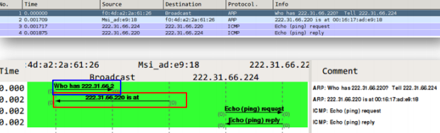

（2）ICMP Echo 扫描

我们可以使用 ICMP 数据包,以确定目标 IP 地址是否存活。首先简单发送一个 ICMP 回应请求(即 ICMP 类型为 8)数据包给目标系统并等待是否可以接收到一个 ICMP 回应答复(即 ICMP 类型为 0)。如果一个 ICMP 回应收到回复，则意味着目标是活的，若没有响应意味着目标已消失。使用这种方法来查询多个主机被称为 Ping 扫描。Ping 扫描是网络扫描最为基础的方法。原理采用 Ping 的实现机制，优点是简单，多种系统支持。缺点是速度慢且容易被防火墙限制。如图 5-12 所示：


（3）ICMP Sweep 扫描

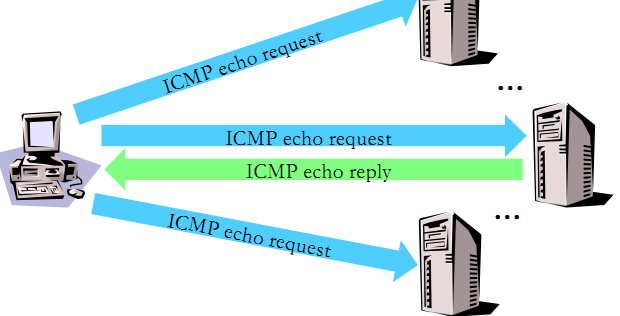

如图 5-13 所示,ICMP Sweep 扫描实际上就是并行多路 ICMP Echo 扫描，原理方法大致相同。

（4）ICMP Broadcast 扫描

如图 5-14 所示，将 ICMP 请求包的目的地址设为广播地址或网络地址，则可以探测广播域或整个网络范围的主机。但这种扫描只是适用于 UNIX／LinUX 系统，Windows 会忽略这种请求包，同时这种扫描方式容易引起广播风暴。


（5）ICMP Non-Echo 扫描

即使对 ICMP 回应报文进行阻拦和过滤，我们还可以用 non-Echo ICMP 协议来收集系统的其他信息。例如 ICMP 类型为 13（时间戳）可以请求获取系统的当前时间，还有 ICMP 类型为 17（子网掩码请求）是用于无盘系统来获取它引导程序时的子网掩码。我们可以使用它来请求一个特定设备的子网掩码。

（6）防火墙和网络过滤设备的存在常常导致传统的探测手段变得无效，为了突破这种限制有以下 5 种方式绕过防火墙和网络过滤设备：

① 异常的 IP 包头

向目标主机发送包头错误的 IP 包，目标主机或过滤设备会反馈 ICMP Parameter Problem Error 信息，可用来确定目标主机的操作系统。常见的伪造错误字段为 Header Length Field 和 IP Options Field。

② 在 IP 头中设置无效的字段值

向目标主机发送的 IP 包中填充错误的字段值，目标主机或过滤设备会反馈 ICMP Destination Unreachable 信息，可获取ＩＰ头部信息。

③ 错误的数据分片

当目标主机接收到错误的数据分片,并且在规定的时间间隔内得不到更正时，将丢弃这些错误数据包，并向发送主机反馈 ICMP Fragment Reassembly Time Exceeded 错误报文。

④ 通过超长包探测内部路由器

若构造的数据包长度超过目标系统所在路由器的 PMTU 且设置禁止分片标志，该路由器会反馈 Fragmentation Needed and Don’t Fragment Bit was Set 差错报文，从而获取目标系统的网络拓扑结构。

⑤ 反向映射探测

该技术用于探测被过滤设备和防火墙保护的网络和主机，构造可能的内部 IP 地址列表，并向这些地址发送数据包，对对方路由器进行 IP 识别并路由，或根据是否返回错误报文来进行探测。

##### 5.2.2.2.2 端口扫描

端口扫描技术是对主机状态的详细信息进行探测的技术。有开放扫描，会产生大量审计数据，容易被对方发现，但其可靠性较高；隐蔽扫描，能有效避免对方入侵检测系统和防火墙的检测，但这种扫描使用的数据包在通过网络时容易被丢弃，从而产生错误的探测信息；半开放检测，其隐蔽性和可靠性介于前两者之间。下面对端口扫描技术进行详细介绍：

（1）开放扫描

① TCP Connect 扫描

这种扫描方式可以使用 Connect()调用，使用最基本的 TCP 三次握手链接建立机制，建立一个链接到目标主机的特定端口上。首先发送一个 SYN 数据包到目标主机的特定端口上，接着我们可以通过接收包的情况对端口的状态进行判断：如果接收到的是一个 SYN/ACK 数据包，则说明端口是开放状态的；如果接收到的是一个 RST/ACK 数据包，通常意味着端口是关闭的并且链接将会被重置；而如果目标主机没有任何响应则意味着目标主机的端口处于过滤状态。

若接收到 SYN/ACK 数据包（即检测到端口是开启的），便发送一个 ACK 确认包到目标主机，这样便完成了三次握手连接机制。成功后再终止连接。如图 5-15 所示：

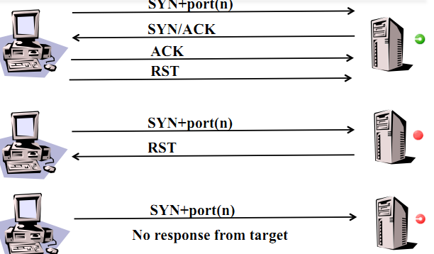

TCP Connect 扫描方式的优点是稳定可靠，不需要特殊的权限。但扫描方式不隐蔽，服务器日志会纪录下大量密集的连接和错误记录，并容易被防火墙发现和屏蔽。

② TCP 反向 ident 扫描

TCP 反向 ident 扫描主要是利用 TCP 的认证协议 ident 的漏洞。TCP 的认证协议是用来确定通过 113 端口实现 TCP 链接的主机的用户名。这需要建立一个到目标端口的完整的 TCP 链接，这也是其缺点。

③ UDP 扫描

UDP 是一个无链接的协议，当我们向目标主机的 UDP 端口发送数据,我们并不能收到一个开放端口的确认信息,或是关闭端口的错误信息。可是，在大多数情况下，当向一个未开放的 UDP 端口发送数据时,其主机就会返回一个 ICMP 不可到达(ICMP\_PORT\_UNREACHABLE)的错误，因此大多数 UDP 端口扫描的方法就是向各个被扫描的 UDP 端口发送零字节的 UDP 数据包，如果收到一个 ICMP 不可到达的回应，那么则认为这个端口是关闭的,对于没有回应的端口则认为是开放的，但是如果目标主机安装有防火墙或其它可以过滤数据包的软硬件,那我们发出 UDP 数据包后,将可能得不到任何回应,我们将会见到所有的被扫描端口都是开放的。如图 5-16 所示：

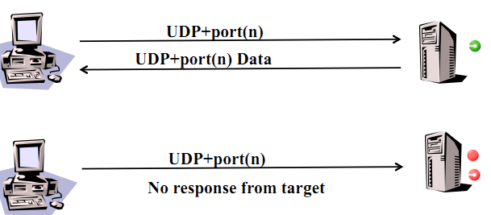

其缺点是，UDP 是不可靠的，UDP 数据包和 ICMP 错误报文都不保证到达；且 ICMP 错误消息发送效率是有限的，故而扫描缓慢；还有就是非超级用户无法直接读取端口访问错误。

（2）半开放扫描

① TCP SYN 扫描

与 TCP Connect 扫描不同，TCP SYN 扫描并不需要打开一个完整的链接。发送一个 SYN 包启动三方握手链接机制，并等待响应。如果我们接收到一个 SYN/ACK 包表示目标端口是开放的；如果接收到一个 RST/ACK 包表明目标端口是关闭的；如果端口是被过滤的状态则没有响应。当得到的是一个 SYN/ACK 包时通过发送一个 RST 包立即拆除连接。如图 5-17 所示：

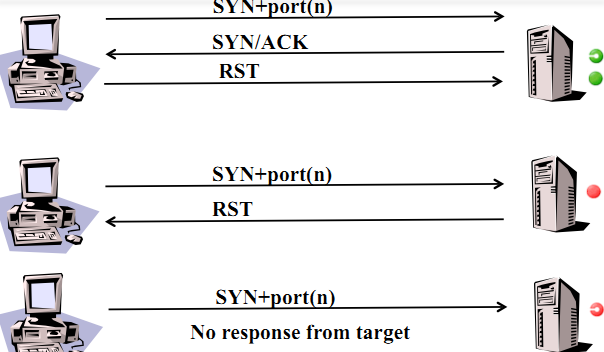

TCP/SYN 扫描的优点是隐蔽性较全连接扫描好，因为很多系统对这种半扫描很少记录。缺点是构建 SYN 报文需要超级用户权限，且网络防护设备会有记录。

②TCP 间接扫描

TCP 间接扫描就是伪造第三方源 IP 发起 SYN 扫描。在实施前要求扫描主机必须能监听到跳板主机的通信流量，且广域网上的路由器必须允许伪造源 IP 地址。首先扫描主机伪造源 IP 地址向目标端口发送 SYN 包，若端口是开启的则会发送响应 SYN/ACK 包到其伪造的源 IP 地址主机，这是扫描主机会监听到该响应包，并继续伪造源 IP 地址发送 RST 包拆除连接。如图 5-18 所示：

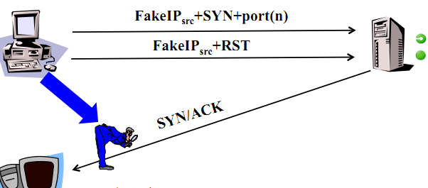

其优点是隐蔽性好，缺点是对跳板主机的要求较高，广域网中受制于路由器的包顾虑原则。

（3）隐蔽扫描

① TCP FIN 扫描

仅发送 FIN 包，它可以直接通过防火墙，如果端口是关闭的就会回复一个 RST 包，如果端口是开放或过滤状态则对 FIN 包没有任何响应。如图 5-19 所示。

其优点是 FIN 数据包能够通过只监测 SYN 包的包过滤器，且隐蔽性高于 SYN 扫描。缺点和 SYN 扫描类似，需要自己构造数据包，要求由超级用户或者授权用户访问专门的系统调用。

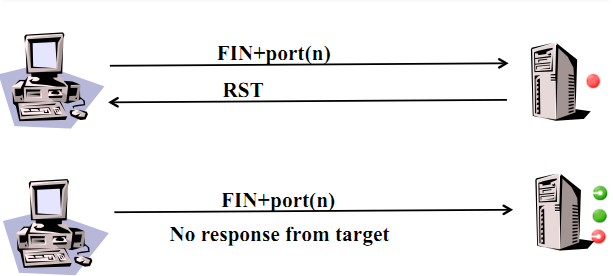

② TCP Xmas 扫描

Xmas 发送一个 TCP 包，并对 TCP 报文头 FIN、URG 和 PUSH 标记进行设置。若是关闭的端口则响应 RST 报文；开放或过滤状态下的端口则无任何响应。如图 5-20 所示。优点是隐蔽性好，缺点是需要自己构造数据包，要求拥有超级用户或者授权用户权限。


③ TCP Null 扫描

发送一个 TCP 数据包，关闭所有 TCP 报文头标记。只有关闭的端口会发送 RST 响应。其优点和 Xmas 一样是隐蔽性好，缺点也是需要自己构造数据包，要求拥有超级用户或者授权用户权限。如图 5-21 所示：

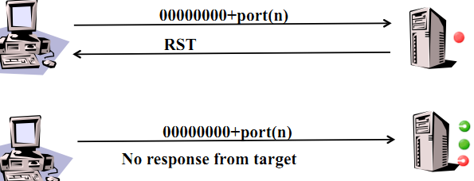

④ 分段扫描

将一个完整的 TCP 报文分割封装到 2 个或多个 IP 报文，分别独立发送。同样只有关闭的端口响应。优点是隐蔽性好，可穿越防火墙，缺点是可能被丢弃，某些程序在处理这些小数据包时会出现异常。

⑤ ACK 扫描

构造并发送 ACK 报文，包过滤防火墙会检查 TCP 会话状态列表，若发现无匹配会话则有可能返回 RST 报文，正常主机的关闭端口则不会响应该报文。优点是可探测目标主机的包过滤规则。缺点是可能会被丢弃，且不能用于判断端口是否开放。原理如图 5-22 所示：

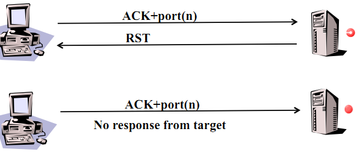

⑥ IDLE 扫描

IDLE 扫描的实施前提是（1）跳板主机处于网络空闲状态；（2）跳板主机的 IP 序列号产生规则是连续递增的；（3）广域网上的路由器必须允许伪造源 IP 地址。

IDLE 扫描是基于 IP 报头的 Identification 字段。其原理是扫描主机向跳板主机发送一些探测的 SYN 数据报（一般 10 个左右），以获得跳板主机的 ID 变化规律，并记下初始的 ID；接着，扫描主机以跳板主机的地址向目标主机的端口发送正真的扫描文件（SYN 包）。如果目标主机的端口开放，便会向跳板主机返回 SYN/ACK 数据包；如果目标主机的端口关闭，则向跳板主机返回 RST 数据包。由于跳板主机没有向目标主机发送过 SYN 报文，所以当跳板主机收到目标主机的报文时，如果是 SYN/ACK，则回应一个 RST，如果是 RST，则什么也不做，仅仅丢弃它。最后，扫描主机会向跳板主机发送探测 SYN 包，以获得的扫描之后的 ID。同初始 ID 比较，如果变化明显，则可认为目标端口是开放的，如此反复，便可得知目标端口的信息。如图 5-23 所示：

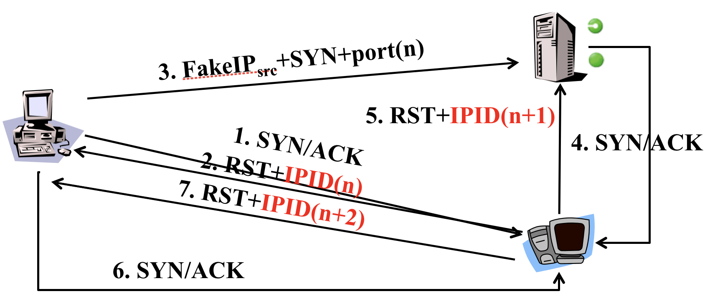

优点是相比较于 TCP 间接扫描，无需监听跳板主机的通信流量，且目标主机很难发现真正的扫描源，扫描隐蔽性高，缺点是对跳板主机的要求较多。

#### 5.2.2.3 扫描报告的生成

扫描报告的生成是一种可视化技术，并非本课程的关注重点，在不多加介绍。

对于扫描行为的检测，可利用[第四章（网络监听）](../chap0x04/main.md)中所学的知识、工具和方法来实现。关于扫描行为的防护，有防火墙和入侵检测，将在第八章和第九章进行介绍。

### 5.2.3 栈指纹 OS 识别技术

#### 5.2.3.1 实现原理

栈指纹 OS 识别技术的实现原理是根据各个操作系统在 TCP/IP 协议栈实现上的不同特点，采用黑盒测试方法来研究其对各种探测的响应来形成识别指纹进行识别。根据采集指纹信息的方式可分为被动扫描方式和主动扫描方式。

被动扫描是通过网络嗅探工具收集数据包，再对数据包的不同特征（TCP Window-size、IP TTL、IP TOS、DF 位等参数）进行分析，来识别操作系统。优点是隐蔽性好。缺点是速度慢，可靠性不高。

主动扫描采用向目标系统发送构造的特殊包并监控其应答的方式来识别操作系统的类型。优点是速度快，可靠性高。缺点是严重依赖目标系统网络拓扑结构和过滤规则。

#### 5.2.3.2 通过识别操作系统

在图 5-24 中可看到 Windows 主机上的 Ping 程序实现，其发送的 `ICMP echo request` 请求的 TTL 字段值设置为 127。Payload 的 Data 为 `6162636465666……`（固定填充），长度为 32 字节。

如图 5-25 中，Linux 主机上的 Ping 程序实现，其发送的 `ICMP echo request` 请求的 TTL 字段值设置为 64，Payload 的 Data 为 `908c8A4EEF000……`（随机填充），长度为 56 字节。

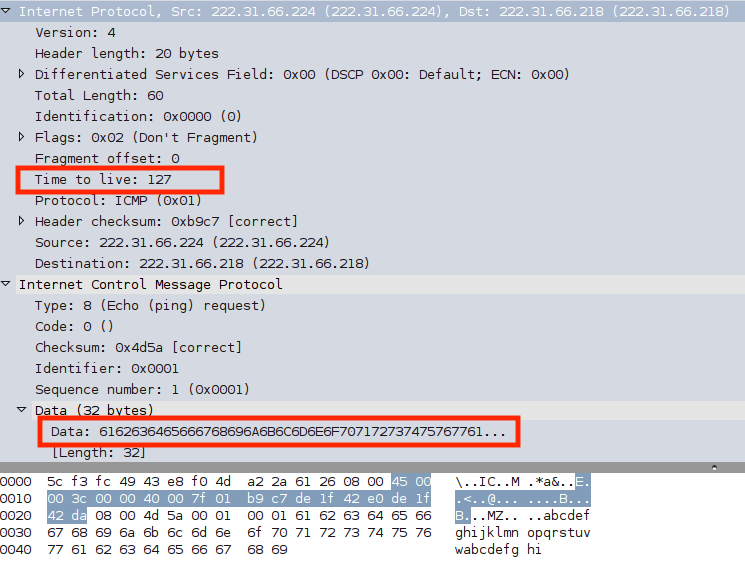

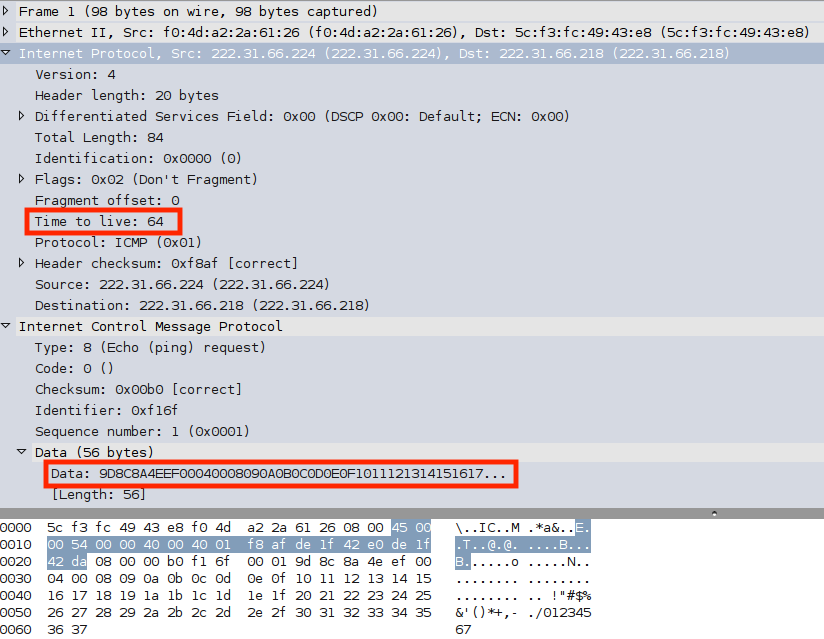

不仅 ping 命令在不同操作系统上的实现存在差异，不同操作系统对于相同 `ICMP echo request` 的响应报文也存在差异。

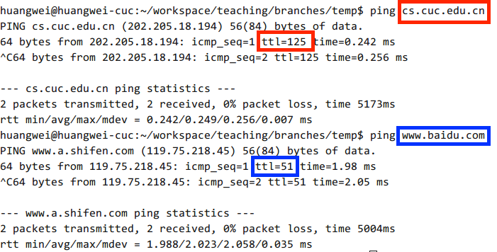

IP 报文中的 TTL 字段在互联网中传输时，路由器会检查 TTL 值并在 TTL 值大于 1 时先对 TTL 值做计数减 1 操作后继续转发传输该数据包。根据经验，互联网中任意两点间通信时，IP 报文会经过的路由器数量通常不会超过 32 个。所以，结合不同操作系统在主动发送 IP 报文时的 TTL 初始值设定经验（如图 5-24 和 图 5-25 所示，Windows 系统 TTL 值初始值有设定为 127，Linux 系统 TTL 值初始值设定为 64）以及根据目标 IP 的归属地信息和当前探测节点的地理位置信息估算出两点间通信距离（通常地理位置相距越远的两点间通信需要经历的转发路由器数量要高于位置相距较近的两点间通信所需要经历的转发路由器数量），如图 5-26 所示，可根据目标系统响应报文中的 TTL 值粗略的判断出目标主机的操作系统分别是 Windows 和 Linux 系统。

#### 5.2.3.3 栈指纹 OS 识别技术的其他技术

（1）FIN 探测

发送一个 FIN 包给一个打开的端口，一般的行为是不响应，但某些实现例如 MS Windows, BSDI, CISCO,HP/UX,MVS,和 IRIX 发回一个 RST。

（2）BOGUS 标记探测

设置一个未定义的 TCP 标记（64 或 128）在 SYN 包的 TCP 头里。

（3）不分段位

许多操作系统开始在送出的一些包中设置 IP 的 Don't Fragment 位。

（4）ACK 值

不同实现中一些情况下 ACK 域的值是不同的 。

（5）ICMP 错误信息终结

一些操作系统跟从限制各种错误信息的发送率。

（6）SYN 洪水限度

如果收到过多的伪造 SYN 数据包，这些操作系统会停止新的连接尝试，某些操作系统默认只处理 8 个伪造的 SYN 包。

## 5.3 网络扫描工具

### 5.3.1 Nmap 的简介

Nmap 是 network mapper 的简称，是一款开源的工具，能够快速的扫描大范围的设备并且能提供大量关于网络设备的有价值信息，他可以用来进行 IT 审计和网络相关的安全分析。

Nmap 使用原始 IP 数据包来确定网络中的可用主机、启用的服务、操作系统和主机版本，以及什么样的防火墙或者包过滤器，还有关于网络的其他方方面面。这些信息可以用来正确的识别安全漏洞和攻击者，以及攻击者侦查目标的类、数量和弱点。

可以进行多种协议扫描，例如：TCP/UDP/ICMP 等；能支持大多数系统，包括 Linux，macOS X，Microsoft Windows 等；并支持插件扩展，像 NSE 的 Nmap Script Engine。图 5-27 为一个典型的 Namp 扫描。

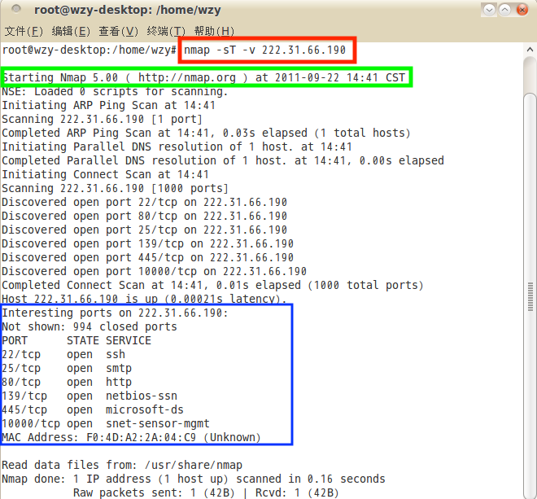

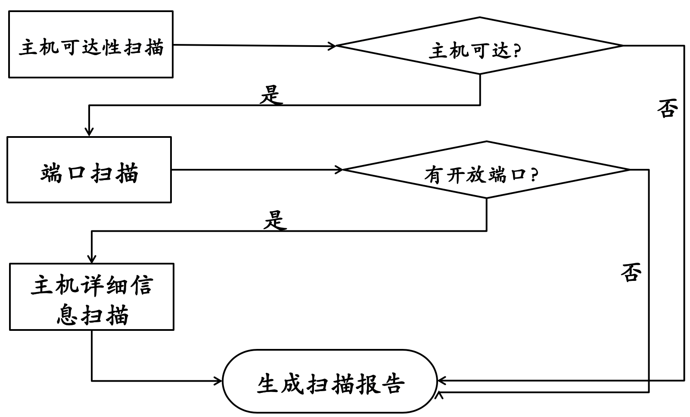

如图 5-28 所示，Nmap 扫描先进行主机可达性扫描，若可达进行端口扫描，若有开放端口则进行主机详细信息扫描并生成扫描报告。

### 5.3.2 Nmap 使用方法

由于 nmap 一直处于活跃的版本迭代开发中，部分命令行参数可能会存在版本兼容性差异，因此本书不去具体介绍这些参数的使用方法，而是着重介绍一下目前的 nmap 7.25beta1 版的目录结构和获取应用程序内置帮助手册的方法。

```bash
# 查看 nmap 版本信息
$ nmap -v

Starting Nmap 7.25BETA1 ( https://nmap.org ) at 2016-10-27 10:25 CST
Read data files from: /usr/bin/../share/nmap
WARNING: No targets were specified, so 0 hosts scanned.
Nmap done: 0 IP addresses (0 hosts up) scanned in 0.05 seconds
           Raw packets sent: 0 (0B) | Rcvd: 0 (0B)

# 获取 nmap 命令行帮助
$ nmap --help

# 查看 nmap 的 man 手册页
$ man nmap

# 基于 Deb 包管理系统的 Linux 发行版，可以使用以下命令查看 nmap 的已安装文件列表清单
$ dpkg -L nmap

# 可执行程序
/usr/bin/ncat
/usr/bin/nmap
/usr/bin/nping

# 文档目录
/usr/share/doc/nmap
/usr/share/doc/nmap/3rd-party-licenses.txt.gz
/usr/share/doc/nmap/changelog.Debian.gz
/usr/share/doc/nmap/changelog.gz
/usr/share/doc/nmap/committers.txt.gz
/usr/share/doc/nmap/copyright
/usr/share/doc/nmap/device-types.txt.gz
/usr/share/doc/nmap/leet-nmap-ascii-art.txt
/usr/share/doc/nmap/nmap.usage.txt.gz
/usr/share/doc/nmap/nmap_gpgkeys.txt.gz
/usr/share/doc/nmap/style
/usr/share/doc/nmap/style/README
/usr/share/doc/nmap/style/lua-format
/usr/share/doc/nmap/style/lua-format.lua.gz

# man 手册页文件（多语言支持）
/usr/share/man/de
/usr/share/man/de/man1
/usr/share/man/de/man1/nmap.1.gz
...
/usr/share/man/man1
/usr/share/man/man1/ncat.1.gz
/usr/share/man/man1/nmap.1.gz
/usr/share/man/man1/nping.1.gz
/usr/share/man/zh
/usr/share/man/zh/man1
/usr/share/man/zh/man1/nmap.1.gz

# 特征库文件
/usr/share/nmap/nmap-mac-prefixes
/usr/share/nmap/nmap-os-db
/usr/share/nmap/nmap-payloads
/usr/share/nmap/nmap-protocols
/usr/share/nmap/nmap-rpc
/usr/share/nmap/nmap-service-probes
/usr/share/nmap/nmap-services
/usr/share/nmap/nmap.dtd
/usr/share/nmap/nmap.xsl
/usr/share/nmap/nse_main.lua

# nmap 脚本引擎库文件
/usr/share/nmap/nselib
/usr/share/nmap/nselib/afp.lua
/usr/share/nmap/nselib/ajp.lua
...
/usr/share/nmap/nselib/comm.lua
/usr/share/nmap/nselib/creds.lua
/usr/share/nmap/nselib/cvs.lua

# nmap 脚本引擎库规则数据库文件
/usr/share/nmap/nselib/data
/usr/share/nmap/nselib/data/dns-srv-names
...
/usr/share/nmap/nselib/data/ike-fingerprints.lua
/usr/share/nmap/nselib/data/jdwp-class
/usr/share/nmap/nselib/data/wp-themes.lst
/usr/share/nmap/nselib/datafiles.lua

# namp 扫描插件脚本
/usr/share/nmap/scripts
/usr/share/nmap/scripts/acarsd-info.nse
/usr/share/nmap/scripts/afp-ls.nse
...
/usr/share/nmap/scripts/asn-query.nse
/usr/share/nmap/scripts/auth-owners.nse
/usr/share/nmap/scripts/auth-spoof.nse
```

## 5.4 课后思考题

* 通过本章网络扫描基本原理的学习，试推测应用程序版本信息的扫描原理，和网络漏洞的扫描原理。
* 网络扫描知识库的构建方法有哪些？
