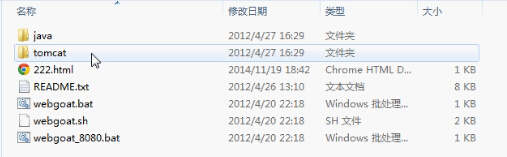
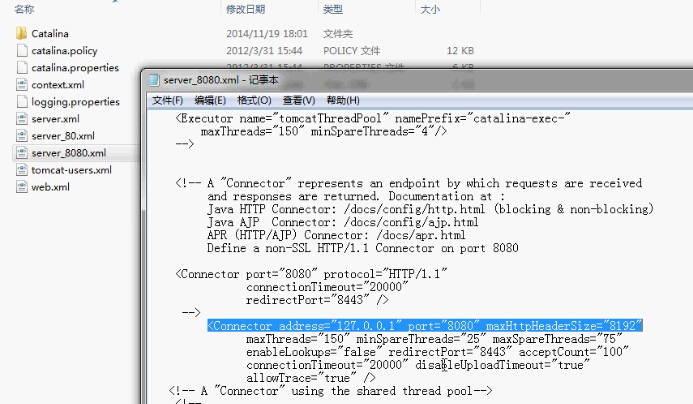
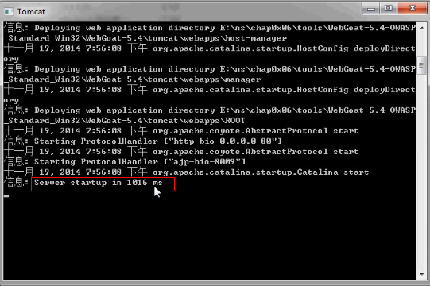
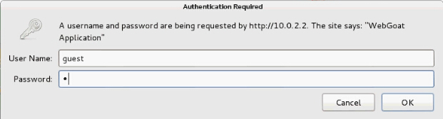
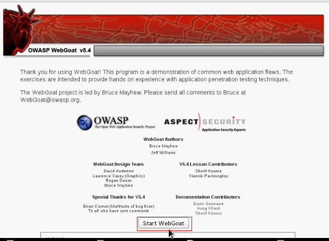
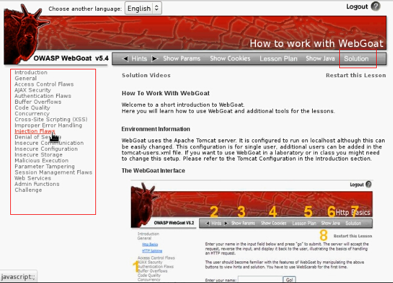

# 实验一：局域网内远程攻击WebGoat

**实验目的：**通过完成对webgoat的远程攻击，了解Web漏洞的原理。

**实验工具：**基于WebGoat，WebGoat是OWASP组织研制出的用于进行web漏洞实验的应用平台，用来说明web应用中存在的安全漏洞。WebGoat运行在带有java虚拟机的平台之上，当前提供的训练课程有30多个，其中包括：跨站点脚本攻击（XSS）、访问控制、线程安全、操作隐藏字段、操纵参数、弱会话cookie、SQL盲注、数字型SQL注入、字符串型SQL注入、web服务、Open
Authentication失效、危险的HTML注释等等。WebGoat提供了一系列web安全学习的教程，某些课程也给出了视频演示，指导用户利用这些漏洞进行攻击。

**实验步骤：**

1. 首先准备好实验工具：解压WebGoat—5.4，其文件中应含有：Java、tomcat和webgoat.bat文件，如下图：

2. 防止出现主机端口占用，无法运行Tomcat的情况，打开tomcat->conf，将与所用webgoat对应的Server文件打开，虚拟机为NET模式时，将地址127.0.0.1改为0.0.0.0，这样虽然可以使同一局域网内其他主机均可访问WebGoat，但是会有很大的安全隐患。最好是将虚拟机设置为仅主机模式，将其改为本地IP地址。

3. 运行webgoat.bat或webgoat_8080.bat。注意观察是否出现报错。如下图所示则是运行成功。

4. 在虚拟机中打开游览器，输入地址：（本地主机地址）/WebGaot/attack登录WebGoat页面，此时会跳出下图所示对话框，输入用户名：guest，密码：guest。

5. 登录成功，点击Start WebGoat，进入主页。

如上图，在左面是相关攻击Web漏洞内容的实践课程，我们可以点击进行实践学习。或者点开Solution，查看漏洞攻击的详细原理和方法。

