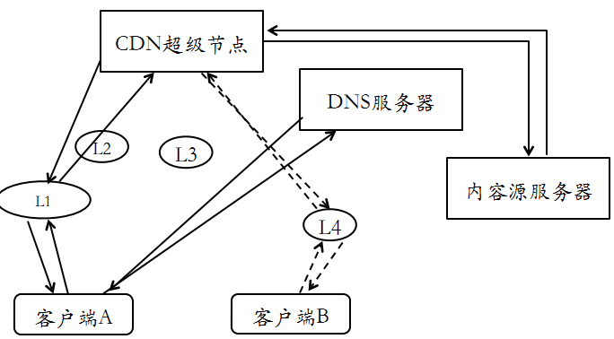
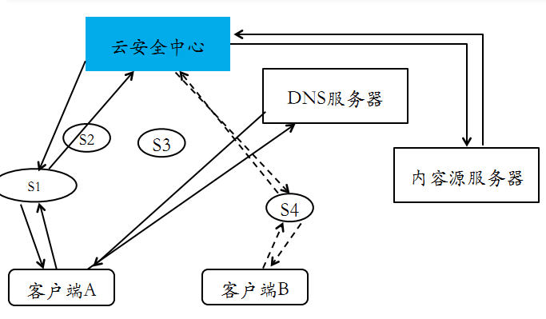
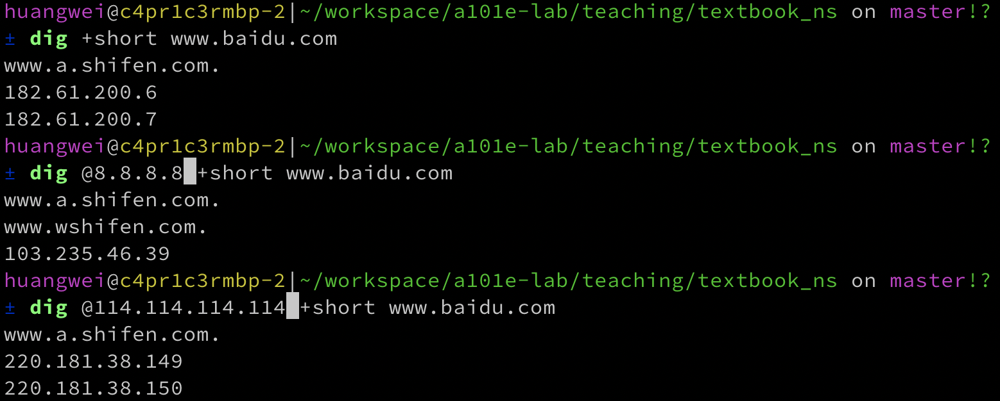
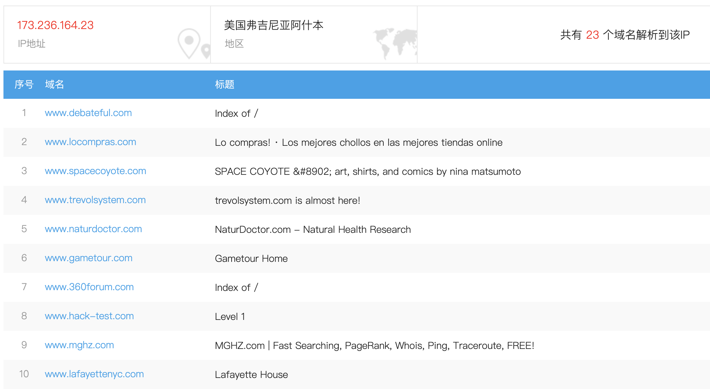
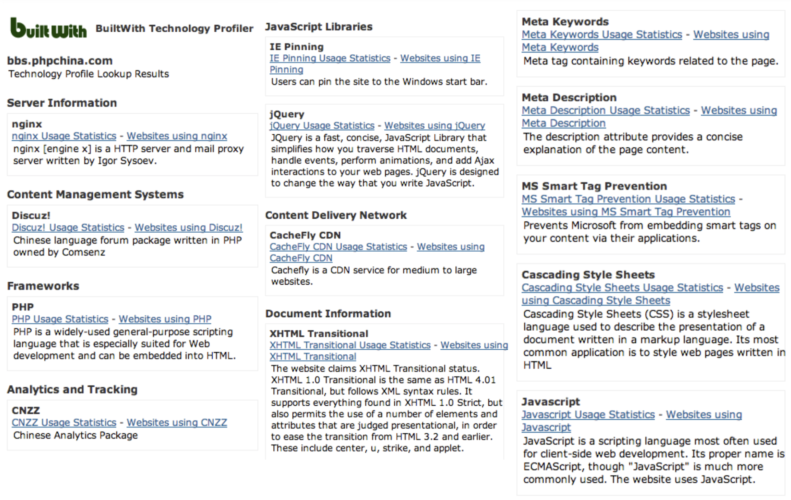
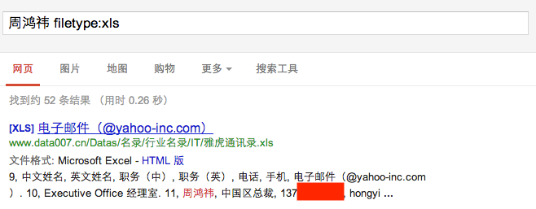

# 第六章 网络与系统渗透

## 6.1 序曲

### 6.1.1 引言

首先网络安全必须建立在网络应用的基础之上，脱离应用谈安全便是空谈。而保护资产价值是所有信息安全问题的本原需求。同时我们必须明白信息安全是一个持续对抗的过程，应用技术的发展带动了安全技术的发展，攻击技术的发展带动防御技术的发展，如同猫鼠游戏，网络攻击和网络安全此消彼长，持续对抗。

### 6.1.2 基本概念

交换机（Switch）：交换机就是将设备连接到网络的计算机网络设备，工作于数据链路层，具有端口转发、自动寻址和交换作用。

客户端（Client）：与服务器相对应，为用户提供本地服务，可以远程访问服务器的软件。

服务器（Server）：通过计算机网络来对请求进行响应，并提供网络服务的系统。

骨干网/广域网/局域网：局域网就是几台计算机相连，何以互相通信；广域网就是将不同地区的局域网进行互联，Internet 是世界范围内最大的广域网；骨干网用来描述大型网络结构，是重大的网络中的核心线路，这些线路可由商业、政府、学术和其他高容量网络中心、互联网交流点和网络访问点构建,实现国家之间的交换网络,可横跨大陆和整个海洋。

虚拟主机 /VPS/ 主机托管：虚拟私人服务器（Virtual Private Server, VPS）是一种以虚拟机作为服务器的网络托管服务。利用虚拟服务器软件(如 VMware 的 ESX Server、Linux 上的 KVM、Xen 等)在一台物理服务器上创建多个相互隔离的虚拟服务器。这些虚拟服务器（VPS）可以安装独立操作系统，它的运行和管理与独立服务器完全相同。虚拟专用服务器确保所有资源为用户独享，给用户最高的服务品质保证，让用户以虚拟主机的价格享受到独立主机的服务品质。

域名解析服务器（Domain Name System, DNS）：域名解析就是将域名翻译、转换成 IP 地址。

Web 服务器：提供静态页面服务，即网上信息浏览服务。

应用程序服务器（Application Server, App Server）：实现动态网页服务。

数据库服务器（Database Server, DS）：实现数据持久化存储和灵活查询需求。

网络渗透/系统渗透（Network Penetration / System Penetration）：网络渗透就是对计算机系统进行攻击，其目的是找到安全漏洞，获得访问和数据的可能。

内容分发网络（Content Delivery Network, CDN）：将源站内容分发至全国所有的节点，缩短用户查看对象的延迟，提高用户访问网站的响应速度与网站的可用性，解决网络带宽小、用户访问量大、网点分布不均等问题。如下图所示：

具体步骤如下：

1. 用户向浏览器提供要访问的域名。
2. 浏览器调用域名解析库对域名进行解析，由于 CDN 对域名解析过程进行了调整，所以解析函数库一般得到的是该域名对应的 CNAME 记录，为了得到实际 IP 地址，浏览器需要再次对获得的 CNAME 域名进行解析以得到实际的 IP 地址；在此过程中，使用的全局负载均衡 DNS 解析，如根据地理位置信息解析对应的 IP 地址，使得用户能就近访问。
3. 此次解析得到 CDN 缓存服务器的 IP 地址，浏览器在得到实际的 IP 地址以后，向缓存服务器发出访问请求。
4. 缓存服务器根据浏览器提供的要访问的域名，通过 Cache 内部专用 DNS 解析得到此域名的实际 IP 地址，再由缓存服务器向此实际 IP 地址提交访问请求。
5. 缓存服务器从实际 IP 地址得得到内容以后，一方面在本地进行保存，以备以后使用，二方面把获取的数据返回给客户端，完成数据服务过程。
6. 客户端得到由缓存服务器返回的数据以后显示出来并完成整个浏览的数据请求过程。

> 基于 CDN 的云安全，主要是保护第三方 Web 站点。关于云计算安全，涉及到：

1. 互联网数据中心（Internet Data Center, IDC）安全。
2. 虚拟化服务器（Virtual Private Server, VPS）安全。
3. Web 安全。

### 6.1.3 网络安全

下面先来回顾一下网络安全的简史：

* 1984 年，英国菲利普王子的电子邮箱被黑。
* 1988 年，莫瑞斯蠕虫感染了 6000 台主机（占全球互联网 1/10 的主机）。
* 1995 年，美国法院、CIA、空军的门户网站页面被篡改。
* 2003 年，出现了冲击波蠕虫针对 Windows 操作系统 RPC 服务（445 端⼝），导致运营商们大规模运用防火墙、访问控制技术封锁互联网上的非 Web 服务端口，它的破坏性达到每小时感染 2500 台主机。
* 2005 年，MySpace Samy 蠕虫是史上第一个利用 XSS 漏洞传播的蠕虫，传播速度惊人：20 小时感染了上百万台主机（每小时感染 50000 台主机）。
* 2008 年，全球范围内频繁出现大规模 SQL 注入攻击网站事件。
* 2010 年 6 月，震网（Stuxnet）病毒被曝光，这是史上第一个“超级破坏性武器”，就此揭开了「高级持续威胁（Advanced Persistent Threat, APT）」这个研究主题。
* 2012 年，Nikjju 大规模 SQL 注入篡改了至少 18 万个网页。
* 2016 年 8 月，一个名为 “Shadow Brokers” 的黑客组织号称入侵了方程式组织窃取了大量机密文件，并有选择的公开了一部分黑客工具（0day 漏洞利用工具），其中就包含一个名为 `Eternalblue（永恒之蓝）` 的针对 Windows 445 端口远程代码执行的漏洞利用工具。方程式（Equation Group）据称是美国国家安全局（NSA）下属的黑客组织，有着极高的技术手段。
* 2017 年 WannaCry **勒索** 病毒袭击了全球 150 多个国家和地区，影响领域包括政府部门、医疗服务、公共交通、邮政、通信和汽车制造业。这次事件的罪魁祸首正是来自于 `永恒之蓝` 漏洞利用工作所针对的漏洞。

从上面的简述中，我们通常将 1999 年~2002 年称为网络安全威胁的萌芽期，网络的初步发展也是网络攻击的摸索阶段，到 2003 年~2006 年便达到一个暗黑的时代：网络安全混乱、攻击事件频繁，随之而来 2007 年~2011 年终于迎来了光明：网络安全不断引起重视和发展，使网路更为有序、具有防御性，而在 2012 年后，网络安全威胁的发展趋势将是在移动互联网和物联网上，这也提醒我们安全措施待进一步加强，才能与新一轮的威胁攻击进行抗衡。网络安全威胁历史趋势如下：

关于网络安全的威胁分类，首先代码执行是网络安全的最严重威胁，而拒绝服务攻击永远是网络安全的主题，在当前 Web 安全则是网络安全主战场，随着 5G、云计算、物联网、工业互联网等的快速发展和普及应用，新应用场景下的多样化安全需求正在蓬勃发展。泛在网络已是进行时，应用时刻保持在线，从“+互联网”到“互联网+”再到“数字孪生世界”，网络安全问题已经不再是一个「上网时」才会存在的问题，今天和未来的网络安全问题就和今天的人身安全问题一样，这是现代社会人一生都需要面对的一个基础安全问题。

## 6.2 网络与系统渗透的基本原理

### 6.2.1 渗透测试

渗透测试就是模拟攻击者用来攻击安全控制和非法获得访问权限的方法，从而对网络与系统的安全进行评估和提升。

从方法论的角度来看，渗透测试必须取得被测试目标的法律授权，而网络入侵本身就是一种非法行为，紧接着因为渗透测试是对网络入侵的模仿，所以都经过信息收集、目标踩点、网络扫描、漏洞发现和漏洞利用的过程，不同的是在最后渗透测试会生成测试报告进行对漏洞修补的指导，而入侵可能会利用漏洞进行后门植入并尽力擦除一切痕迹，逃避法律责任。

关于渗透测试的核心技术，信息收集、目标踩点、网络扫描，我们都已在第五章网路扫描中学习过，接下来漏洞扫描和漏洞利用（以提升权限）将是本章重点。

### 6.2.2 入侵与预防

黑客入侵的一般过程都是不断地重复进行信息收集和目标踩点，来获取确认自己所需的信息，寻找发现系统漏洞，并利用漏洞实现目标攻击或进行后门植入来维持系统控制权，在最后清理访问痕迹。得知入侵的一般过程，关于防御我们也可能存在一些错误的认识。

例如认为购买并部署价格昂贵的安全设备便可完全的保证安全，这显然错误，因为任何安全设备都是由程序员开发而来，无论硬件还是软件都依赖于代码执行，本身便存在着一定得入侵可能。而有人说过滤所有监听端口的入站数据就可以高枕无忧，这显然也不是万无一失的，因为过滤策略和机制都可能由于存在漏洞而被绕过。至于攻击之前一定会有扫描行为，要知道社会工程学手段、滥用第三方服务器都可以实现信息收集而不留下任何行为记录。

上面的一切对告诉了我们黑客是不按常理出牌的，也不可能存在完全的安全性，只有相对的安全，而我们能做的就是尽最大的可能提高安全防御性，保证网络系统的安全。

### 6.2.3 案例一：从信息收集到入侵提权

案例“目标”：www.hack-test.com，但本案例讲解重「方法」，不重结果。部分方法的配图涉及到的目标站点和服务甚至与 www.hack-test.com 无关，主要是为了更好的说明具体的技术方法而选择更合适的测试目标。同时，这样写作可以避免本案例中提到的具体方法被“脚本小子”直接用来危害某个具体的网站。

1) 从域名获取 IP

可使用以下命令工具：ping、nslookup（交互式域名查询工具）、dig（DNS 查询高级工具），通过使用位于不同国家和地区的域名解析服务器来解析同一个域名有可能获得该服务器部署在不同地区的物理服务器或 CDN 节点服务器。

2) 从 IP 获取旁站

有时当对目标站点一点办法都没有时，可以利用一些「IP 地址反查域名」的在线工具来获取「旁站」信息。例如除了 www.hack-test.com 之外，还有多个其他注册域名配置解析到了 [173.236.164.23](https://dns.aizhan.com/173.236.164.23/) 。对于 www.hack-test.com 来说，运行在 173.236.164.23 这一台服务器上的其他网站就被称为「旁站」。目标站点没有漏洞并不意味着该站所在的服务器上配置的其他站点也不存在漏洞，很多时候可以通过攻陷同一个 IP 上的旁站获取到系统控制权限来达到攻陷目标站点的目标。

3) 收集系统与⽹络配置详细信息

收集网络拓扑信息，包括域名解析记录：域名注册人信息、公司信息、邮箱地址等；开放端口，服务器数量及分布。

收集系统配置信息，操作系统版本；Web 服务器版本；Web 应用系统架构信息：脚本类型、开发框架。

4) 踩点

是一个网站技术信息查询工具，利用该网站所提供的功能，可以查询出某网站背后是由哪些技术来支持的，比如操作系统的类型、所采用的访问量统计服务、采用的发布平台、广告平台、语言框架、聚合功能、页面文档信息、网站编码及操作系统信息等等。可帮助更深一层次了解该网站的运营情况。操作方法也很简单，只需输入想要查询的网站地址，就可实时提供相应的数据。正常的访问过程就是踩点。

5) 发现漏洞

发现漏洞可以使用漏洞扫描工具或者进行手工分析：针对开源软件，直接基于源代码分析；针对闭源软件，黑盒 Fuzz 测试。

6) 漏洞利用

对漏洞攻击可查询公开的漏洞利用程序数据库，例如：[exploit-db](http://www.exploit-db.com) 。或者利用自动化工具：[Acunetix Vulnerability Scanner](https://www.acunetix.com/vulnerability-scanner/)、[Metasploit](https://www.metasploit.com/) 、[BurpSuite](https://portswigger.net/burp) 。或针对具体漏洞的定制开发漏洞利用程序。

7) 维持系统控制权

为了维护系统控制权，可上传木马：如网页木马、系统及木马。也可以创建后门账户。

8) 清理访问痕迹

最后对访问痕迹进行清理，包括系统日志清理，临时文件删除，后门隐藏。其中常见的后门隐藏功能包括：安装软件隐藏、进程隐藏、账户隐藏、端口隐藏等。

以上便是一个网络攻击的典型过程。

### 6.2.4 案例二：2012 年新浪微博用户密码泄露漏洞（旁站注入）

据报道，2012 年元旦新浪微博网友 evilniang 发现新浪爱问频道存在 SQL 注入漏洞，利用该漏洞可读取爱问频道数据库内的内容，包括明文密码在内的 7000 多万新浪用户信息。刘谦微博被 PoC 代码进行了测试。

由上文知新浪爱问频道网站代码存在 SQL 注入漏洞，而新浪爱问和新浪微博共享同一用户信息数据库，相当于新浪微博同样会收到侵入；并且用户信息数据库并未加密用户的敏感信息，说明一旦数据泄漏，用户信息将被直接公开或盗用。

通过对漏洞的分析，对于其漏洞的修复应该从两个方面进行：一方面是修复新浪爱问频道的网站代码漏洞，另一方面是对用户信息数据库中的敏感信息进行脱敏操作，仅使用散列算法是不够的，应使用更安全的 [口令散列算法](https://cheatsheetseries.owasp.org/cheatsheets/Password_Storage_Cheat_Sheet.html) 处理用户的明文口令后再持久化存储，例如 `Argon2`，`PBKDF2` 和 `Bcrypt` 等。

### 6.2.5 案例三：Google Hacking

Google 是一个强大的搜索引擎；而对于黑客而言，则可能是一款绝佳的黑客工具。正因为 google 的检索能力强大，黑客可以构造特殊的关键字，使用 Google 搜索互联网上的相关隐私信息。通过 Google ，黑客甚至可以在几秒种内黑掉一个网站。这种利用 Google 搜索相关信息并进行入侵的过程就叫做 ``Google Hacking``。

先看 2 个有趣的 ``Google Hacking`` 案例，如下：

Google 高级搜索中的 ``inurl``、``filetype``、``site``、``intitle`` 常被用来构造复杂的 ``Google Hacking`` 指令。更是有好事者专门整理了一些常用 ``Google Hacking`` 指令并命名为：[``Google Hacking Database`` 或 ``Google Dorks``](https://www.exploit-db.com/google-hacking-database/)，直接使用这些指令意味着可以快速找到一系列可能存在已知安全漏洞的网站，稍加变形和改造这些指令就可以发现更多原本需要大量信息收集工作才能发现的漏洞网站。

那么如何防范 ``Google Hacking`` 呢？我们能做的有：机密信息不上网，小心使用 ``robots.txt`` ，使用[Google 的网站站长工具](https://support.google.com/webmasters/bin/answer.py?hl=zh-Hans&answer=1663688)删除被 Google 索引的内容。

其中 robots.txt 是专门针对搜索引擎机器人（「爬虫」）编写的一个纯文本文件。我们可以在这个文件中说明网站中不想被「爬虫」访问的部分，这样，我们网站的部分或全部内容就可以不被搜索引擎收录了，或者让搜索引擎只收录指定的内容。因此我们可以利用 ``robots.txt`` 让 Google 的爬虫不去抓取我们网站上的重要文件，``Google Hacking`` 的威胁也就不存在了。

除了 ``Google Hacking`` ，还有钟馗之眼（zoomeye.org）和“撒旦”搜索引擎（shodan.io，主要收录物联网设备）等互联网空间垂直搜索引擎，都可能被打造为类似 ``Google Hacking`` 这样的信息收集利器，成为黑客入侵的帮凶。

### 6.2.6 网络入侵的入口选择

对于信息安全，人为因素主要决定了决策层和执行层的安全，而技术则用来保证应用层、网络层和物理层的安全。而信息安全的目标和功能是实现主体与客体间通信的机密性保障、完整性约束、可用性保证以及主客体间的认证、授权和审计。

以社会工程学从人的角度来看，渗透的切入点多是一种通过对受害者心理弱点、本能反应、好奇心、信任、贪婪等心理陷阱进行诸如欺骗、伤害等的危害手段，进行骗取秘密（如口令）/
控制行为（如钓鱼）。

从技术的角度来看，nmap 的 [nmap-services](https://nmap.org/book/nmap-services.html) 文件记录了互联网大规模扫描之后的不同端口开放比例统计，Web 应用（80/443 TCP 端口开放）是最常见的网络渗透入口点，并且 Web 软件是最普遍的云服务实现载体，如云存储：Dropbox、百度网盘等，社交网络和即时通信：网页版微信、网页版钉钉、新浪微博等。

Web 应用的特点是异构应用和服务多、网络拓扑结构复杂、且业务应用模型多样。但对于具体应用应该具体分析，不能教条式的渗透。[下一章 Web 应用漏洞攻防](../chap0x08/main.md) 将通过详细讲解常见 Web 应用漏洞原理来说明典型的面向 Web 软件和系统的渗透思路、渗透方法和安全加固防御方法。

## 延伸阅读

* [A collection of awesome lists for hackers, pentesters & security researchers](https://github.com/Hack-with-Github/Awesome-Hacking)
* [A collection of awesome penetration testing resources, tools and other shiny things](https://github.com/enaqx/awesome-pentest)
* [Automated Pentest Recon Scanner ](https://github.com/1N3/Sn1per)
* [中国信息安全测评中心 - 信息安全服务资质 FAQ](http://www.itsec.gov.cn/export/sites/itsec/download/service/FAQ-V1.0.doc)
* [CISP-PTE 知识体系大纲](http://beta.b.360.cn/assets/doc/service/CISP-PTE%E7%9F%A5%E8%AF%86%E4%BD%93%E7%B3%BB%E5%A4%A7%E7%BA%B2.pdf) | [注册信息安全专业人员-渗透测试工程师（CISP-PTE）知识体系大纲 - 发表日期: 2017 年 5 月 22 日](attach/media/CISP-PTE 知识体系大纲.pdf)
