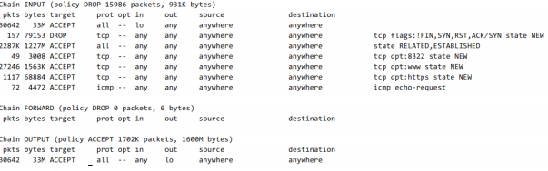

# 实验

## 课内实验

### 实验环境准备

* 虚拟机使用 NAT + Internal / Host-only 方式联网，安装 proftpd / Apache2
* 使用 stand alone 模式启动 proftpd
* 配置 proftpd 支持匿名访问

### iptables基本使用

#### 0. 建议的 iptables 规则编辑方法

```bash
# 导出当前防火墙规则到文件
iptables-save > iptables.rules

# 备份当前规则文件
cp iptables.rules iptables.rules.bak

# 用文本编辑器编辑上一步备份出来的当前 iptables 规则文件的副本 iptables.rules

# 应用编辑后的防火墙规则
# -c  指定在还原 iptables 时候，重置当前的数据包计数器和字节计数器的值为零
iptables-restore < iptables.rules

# 随时可以使用之前备份的 iptables.rules.bak 来重置回最近一次没问题的规则
```

#### 1. iptables 规则

iptables的命令格式为：

```bash
iptables [-t 表] 命令 匹配 操作
```

其中表选项，指定命令应用于哪个内置表(filter表、nat表或mangle表)，命令选项则如表8-1所示，匹配选项如表8-2所示，动作选项为表8-3所示，

|命令|说明|
|:---|:---|
|-P或--policy <链名>|定义默认策略|
|-L或--list <链名>  |查看iptables规则列表|
|-A或--append <链名> |在规则列表的最后增加1条规则|
|-I或--insert <链名>|在指定的位置插入1条规则|
|-D或--delete <链名>|从规则列表中删除1条规则|
|-R或--replace <链名>|替换规则列表中的某条规则|
|-F或--flush <链名>  |删除表中所有规则|
|-Z或--zero <链名>   |将表中数据包计数器和流量计数器归零|

表8-1 命令选项表

|匹配|说明|
|:---|:---|
|-i<网络接口名>|指定数据包从哪个网络接口进入，如ppp0、eth0和eth1等|
|-o<网络接口名>|指定数据包从哪块网络接口输出，如ppp0、eth0和eth1等|
|-p<协议类型>|指定数据包匹配的协议，如TCP、UDP和ICMP等|
|-s<源地址或子网>|指定数据包匹配的源地址|
|--sport <源端口号>|指定数据包匹配的源端口号，可以使用“起始端口号:结束端口号”的格式指定一个范围的端口|
|-d<目标地址或子网>|指定数据包匹配的目标地址|
|--dport目标端口号|指定数据包匹配的目标端口号，可以使用“起始端口号:结束端口号”的格式指定一个范围的端口|

表8-2 匹配选项表

|动作|说明|
|:---|:---|
|ACCEPT|接受数据包|
|DROP|丢弃数据包|
|REDIRECT|将数据包重新转向到本机或另一台主机的某个端口，通常用功能实现透明代理或对外开放内网某些服务|
|SNAT|源地址转换，即改变数据包的源地址|
|DNAT|目标地址转换，即改变数据包的目的地址|
|MASQUERADE|IP伪装，即是常说的NAT技术，MASQUERADE只能用于ADSL等拨号上网的IP伪装，也就是主机的IP是由ISP分配动态的；如果主机的IP地址是静态固定的，就要使用SNAT|
|LOG|日志功能，将符合规则的数据包的相关信息记录在日志中，以便管理员的分析和排错|

表8-3 动作选项表


关于iptables的使用，当数据包不属于链中任何规则时，iptables将根据该链预先定义的默认策略处理数据包。默认策略定义格式如下：

```bash
iptables [-t 表名] <-P 默认策略> <链名> <动作>
```

其中参数表名，默认策略将应用于哪个表；
参数-P，定义默认策略；
链名则用于默认策略应用于哪条链；而动作指处理数据包的动作。

下面介绍一些基本的iptables使用命令：

```bash
# （1）查看iptables规则

iptables [-t 表名] <-L> [链名]

# [-t 表名] 查看哪个表的规则列表；
# -L 查看指定表指定链的规则列表；链名，查看指定表中哪个链的规则链表。

# （2）增加、插入、删除、替换规则

iptables [-t 表名] <A|I|D|R>链名 [规则编号] [i|o 网卡名称] [-s 源IP地址] [-d 目标IP地址] <-j 动作>

# （3）清除规则和计数器

iptables [-t 表名] <-F|-Z>

# [-t 表名]，指定默认策略应用于哪个表；-F,删除表中所有规则；-Z,将指定表中的数据包计数器和流量计数器归零。
```

#### 2. iptables 配置实例

对于 iptables 配置示例，我们从三个方面来进行讲解和展示，分别是传输层防护实例、网络层防护实例、数据链路层防护实例。下面进行详细讲解。

```bash
# （1）传输层防护实例

# 禁止其它机器通过ssh连接自己

iptables -t filter -A INPUT -p tcp --dport 22 -j DROP

# 查看主机防火墙规则

iptables -t filter -L

# 防止各种端口扫描

# 以下规则设定，假设 FORWARD 链默认规则为 DROP 
# 限制 SYN 请求的频率为：每秒 1 个
# tcp-flags 的第一个参数 ALL 表示检查 TCP 的所有状态标志位
# ALL 等价于 SYN,ACK,FIN,RST,URG,PSH （顺序无关，这是一个集合匹配）
# tcp-flags 的第二个参数 SYN 表示仅匹配设置了 SYN 标志位的报文
# 其中参数--limit 1/s 表示每秒一次; 1/m 则为每分钟一次
iptables -A FORWARD -p tcp --tcp-flags ALL SYN -m limit --limit 1/s -j ACCEPT

# 禁止 XMAS 扫描
iptables -A INPUT -p tcp --tcp-flags ALL FIN,PSH,URG -j DROP

# 记录 XMAS 扫描到系统日志
iptables -A INPUT -p tcp --tcp-flags ALL FIN,PSH,URG -m limit --limit 3/m --limit-burst 5 -j LOG --log-prefix "XMAS scan "

# 限制 ping 20 秒内不得超过 6 次
iptables -A INPUT -p icmp --icmp-type echo-request -m recent --name ICMP_check --rcheck --seconds 20 --hitcount 6 -j DROP
iptables -A INPUT -p icmp --icmp-type echo-request -m recent --set --name ICMP_check
# 以下是示例测试结果
#PING 192.168.56.104 (192.168.56.104) 56(84) bytes of data.
#64 bytes from 192.168.56.104: icmp_seq=1 ttl=64 time=0.237 ms
#64 bytes from 192.168.56.104: icmp_seq=2 ttl=64 time=0.426 ms
#64 bytes from 192.168.56.104: icmp_seq=3 ttl=64 time=0.557 ms
#64 bytes from 192.168.56.104: icmp_seq=4 ttl=64 time=0.416 ms
#64 bytes from 192.168.56.104: icmp_seq=5 ttl=64 time=0.478 ms
#64 bytes from 192.168.56.104: icmp_seq=6 ttl=64 time=0.371 ms
#64 bytes from 192.168.56.104: icmp_seq=21 ttl=64 time=0.380 ms
#64 bytes from 192.168.56.104: icmp_seq=22 ttl=64 time=0.553 ms
#64 bytes from 192.168.56.104: icmp_seq=23 ttl=64 time=0.424 ms
#64 bytes from 192.168.56.104: icmp_seq=24 ttl=64 time=0.377 ms
#64 bytes from 192.168.56.104: icmp_seq=25 ttl=64 time=0.334 ms
#64 bytes from 192.168.56.104: icmp_seq=26 ttl=64 time=0.370 ms
#64 bytes from 192.168.56.104: icmp_seq=41 ttl=64 time=0.397 ms

# 禁止自己主机使用FTP协议下载（即封闭TCP协议的21端口）

iptables -I OUTPUT -p tcp --dprot 21 -j DROP

# 禁用主机的DNS端口(DNS为UDP协议，使用53端口)

iptables -I OUTPUT -p udp --dport 53 -j DROP

# （2）网络层防护实例

# 防止ping洪水攻击。例如，限制ping的并发数，每秒一次。
# 在 FORWARD 链上设置规则说明 iptables 所在主机是一个网关，可以限制内网主机去扫外网其他主机
# 如果在 INPUT 链上设置规则，则说明 iptables 保护的是主机自己
# FORWARD 上设置的这种限速措施可以理解为是从攻击源头进行治理，预防从自己管的这个片区出去的犯罪行为
iptables -A FORWARD -p icmp --icmp-type echo-request -m limit --limit 1/s -j ACCEPT

# 限制一个ip访问自己主机。例如，以下这条命令限制了ip地址为192.168.1.102主机对自己的访问。

iptables -A INPUT -s 192.168.1.102 -j DROP

# （3）数据链路层防护实例

# 阻断来自某个mac地址的数据包

iptables -A INPUT -m mac --mac-source 00:1e:ec:f0:ae:77 -j DROP

# 上面的命令阻断了mac地址为00:1e:ec:f0:ae:77 对本机的连接。

# 查看本机iptables表
iptables -L -n
iptables -L -n -t nat
```

### iptables 实现 NAT

#### 1. 使用实例

对于源 NAT，更改所有来自 192.168.1.0/24 的数据包的源 ip 地址为 1.2.3.4，需要注意的是，系统在路由及过虑等处理直到数据包要被送出时才进入 SNAT 。命令如下：

```bash
# 仅当进入 INPUT, FORWARD 和 PREROUTING 链的报文用 -i 参数指定网卡名称才有作用
iptables -t nat -A POSTROUTING -s 192.168.1.0/24 -j SNAT --to 1.2.3.4
```

目的SNAT(DNAT)则是更改所有来自 192.168.1.0/24 的数据包的目的 ip 地址为 1.2.3.4，系统是先进入 DNAT，然后才进入路由及过虑等操作。命令如下：

```bash
iptables -t nat -A PREROUTING -s 192.168.1.0/24 -i eth1 -j DNAT --to 1.2.3.4
```

#### 2. iptables 实现 NAT 综合实验


IP 映射原理是首先将分配给主机 A、B 的真实 IP 绑定到防火墙的外网接口，用如下命令：

```bash
ifconfig eth0 add 202.110.1.100 netmask 255.255.255.0
ifconfig eth0 add 202.110.1.101 netmask 255.255.255.0
```

然后对防火墙接收到的目的 ip 为 202.110.1.100 和 202.110.1.101 的所有数据包进行 DNAT ，命令如下所列：

```bash
iptables -A PREROUTING -i eth0 -d 202.110.1.100 -j DNAT --to 192.168.1.100
iptables -A PREROUTING -i eth0 -d 202.110.1.101 -j DNAT --to 192.168.1.200
```

最后对防火墙接收到的源 ip 地址为 192.168.1.100 和 192.168.1.200 的数据包进行 SNAT ，如下：

```bash
iptables -A POSTROUTING -o eth0 -s 192.168.1.100 -j SNAT --to 202.110.1.100
iptables -A POSTROUTING -o eth0 -s 192.168.1.200 -j SNAT --to 202.110.123.101
```

### 防火墙规则调试

（1）可以使用 iptables -L -v 命令来查看概要统计数据。




（2）采用日志法，命令如下，其中第一条命令中涉及的日志是 syslog，后两条日志为 /var/log/kern.log。

```bash
--j LOG --log-prefix "DEBUG_IPT"
--t raw -A PREROUTING -j TRACE
--t raw -A OUTPUT -j TRACE
```

（3）利用扫描器进行黑盒测试。

（4）备份导出防火墙规则到文本文件。

```bash
# 备份当前防火墙规则到文件
iptables-save > iptables.rules

# 从文件恢复防火墙规则
iptables-restore < iptables.rules
```

---


### 附录：iptables 常用配置指令

* 以下配置指令如果没有特别说明，均默认 `iptables` 规则是应用在单机上
* 如果 `iptables`规则期望保护的是「局域网」内其他主机，则需要相应调整规则中的 `INPUT` 或 `OUTPUT` 为 `FORWARD`

#### 重置 iptables 规则为允许所有

```bash
#!/bin/bash

IPT="/sbin/iptables"

# Flush old rules, old custom tables
$IPT --flush
$IPT --delete-chain

# Set default policies for all three default chains
$IPT -P INPUT ACCEPT
$IPT -P FORWARD ACCEPT
$IPT -P OUTPUT ACCEPT
```

#### 禁止指定 IP 访问

```bash
#!/bin/bash

# iptables script generated 2011-10-13
# http://www.mista.nu/iptables

IPT="/sbin/iptables"

# Flush old rules, old custom tables
$IPT --flush
$IPT --delete-chain

# Set default policies for all three default chains
$IPT -P INPUT DROP
$IPT -P FORWARD DROP
$IPT -P OUTPUT ACCEPT

# Enable free use of loopback interfaces
$IPT -A INPUT -i lo -j ACCEPT
$IPT -A OUTPUT -o lo -j ACCEPT

# All TCP sessions should begin with SYN
$IPT -A INPUT -p tcp ! --syn -m state --state NEW -s 0.0.0.0/0 -j DROP

# Accept inbound TCP packets
$IPT -A INPUT -m state --state ESTABLISHED,RELATED -j ACCEPT

# Block a specific IP address
$IPT -A INPUT -p IP -s 192.168.56.1 -j DROP
```

#### 禁止 TCP / UDP 指定端口访问

```bash
#!/bin/bash

# iptables script generated 2011-10-13
# http://www.mista.nu/iptables

IPT="/sbin/iptables"

# Flush old rules, old custom tables
$IPT --flush
$IPT --delete-chain

# Set default policies for all three default chains
$IPT -P INPUT DROP
$IPT -P FORWARD DROP
$IPT -P OUTPUT ACCEPT

# Enable free use of loopback interfaces
$IPT -A INPUT -i lo -j ACCEPT
$IPT -A OUTPUT -o lo -j ACCEPT

# All TCP sessions should begin with SYN
$IPT -A INPUT -p tcp ! --syn -m state --state NEW -s 0.0.0.0/0 -j DROP

# Accept inbound TCP packets
$IPT -A INPUT -m state --state ESTABLISHED,RELATED -j ACCEPT


$IPT -A INPUT -p tcp --dport 22 -m state --state NEW -s 0.0.0.0/0 -j DROP

# 通过在源和目的主机(防火墙所在主机)上抓包，对比DROP和REJECT指令在防火墙响应行为上的差异
#$IPT -A INPUT -p tcp --dport 22 -m state --state NEW -s 0.0.0.0/0 -j REJECT
```

#### 禁止 ICMP ping

```bash
#!/bin/bash

# iptables script generated 2011-10-13
# http://www.mista.nu/iptables

IPT="/sbin/iptables"

# Flush old rules, old custom tables
$IPT --flush
$IPT --delete-chain

# Set default policies for all three default chains
$IPT -P INPUT DROP
$IPT -P FORWARD DROP
$IPT -P OUTPUT ACCEPT

# Enable free use of loopback interfaces
$IPT -A INPUT -i lo -j ACCEPT
$IPT -A OUTPUT -o lo -j ACCEPT

# All TCP sessions should begin with SYN
$IPT -A INPUT -p tcp ! --syn -m state --state NEW -s 0.0.0.0/0 -j DROP

# Accept inbound TCP packets
$IPT -A INPUT -m state --state ESTABLISHED,RELATED -j ACCEPT

# DROP inbound ICMP messages
$IPT -A INPUT -p ICMP --icmp-type 8 -s 0.0.0.0/0 -j DROP
```

#### 允许 proftpd 的远程访问

```bash
#!/bin/bash

# iptables script generated 2011-10-13
# http://www.mista.nu/iptables

IPT="/sbin/iptables"

# Flush old rules, old custom tables
$IPT --flush
$IPT --delete-chain

# Set default policies for all three default chains
$IPT -P INPUT DROP
$IPT -P FORWARD DROP
$IPT -P OUTPUT ACCEPT

# Enable free use of loopback interfaces
$IPT -A INPUT -i lo -j ACCEPT
$IPT -A OUTPUT -o lo -j ACCEPT

# All TCP sessions should begin with SYN
$IPT -A INPUT -p tcp ! --syn -m state --state NEW -s 0.0.0.0/0 -j DROP

# Accept inbound TCP packets
$IPT -A INPUT -m state --state ESTABLISHED,RELATED -j ACCEPT
$IPT -A INPUT -p tcp --dport 22 -m state --state NEW -s 0.0.0.0/0 -j ACCEPT

# Allow FTP connection and transfer
$IPT -A INPUT -p tcp --dport 21 -m state --state NEW -s 0.0.0.0/0 -j ACCEPT
$IPT -A INPUT -p tcp --sport 49152:65534 --dport 49152:65534 -m state --state NEW -j ACCEPT
```

##### 附：proftpd 的一个示例配置文件

```ini
#
# /etc/proftpd/proftpd.conf -- This is a basic ProFTPD configuration file.
# To really apply changes reload proftpd after modifications.
#

# Includes DSO modules
Include /etc/proftpd/modules.conf

# Set off to disable IPv6 support which is annoying on IPv4 only boxes.
UseIPv6				on
# If set on you can experience a longer connection delay in many cases.
IdentLookups			off

ServerName			"Debian"
ServerType			standalone
DeferWelcome			off

MultilineRFC2228		on
DefaultServer			on
ShowSymlinks			on

TimeoutNoTransfer		600
TimeoutStalled			600
TimeoutIdle			1200

DisplayLogin                    welcome.msg
DisplayChdir               	.message true
ListOptions                	"-l"

DenyFilter			\*.*/

# Use this to jail all users in their homes
# DefaultRoot			~

# Users require a valid shell listed in /etc/shells to login.
# Use this directive to release that constrain.
# RequireValidShell		off

# Port 21 is the standard FTP port.
Port				21

# In some cases you have to specify passive ports range to by-pass
# firewall limitations. Ephemeral ports can be used for that, but
# feel free to use a more narrow range.
PassivePorts                  49152 65534

# If your host was NATted, this option is useful in order to
# allow passive tranfers to work. You have to use your public
# address and opening the passive ports used on your firewall as well.
# MasqueradeAddress		1.2.3.4

# This is useful for masquerading address with dynamic IPs:
# refresh any configured MasqueradeAddress directives every 8 hours
<IfModule mod_dynmasq.c>
# DynMasqRefresh 28800
</IfModule>

# To prevent DoS attacks, set the maximum number of child processes
# to 30.  If you need to allow more than 30 concurrent connections
# at once, simply increase this value.  Note that this ONLY works
# in standalone mode, in inetd mode you should use an inetd server
# that allows you to limit maximum number of processes per service
# (such as xinetd)
MaxInstances			30

# Set the user and group that the server normally runs at.
User				proftpd
Group				nogroup

# Umask 022 is a good standard umask to prevent new files and dirs
# (second parm) from being group and world writable.
Umask				022  022
# Normally, we want files to be overwriteable.
AllowOverwrite			on

# Uncomment this if you are using NIS or LDAP via NSS to retrieve passwords:
# PersistentPasswd		off

# This is required to use both PAM-based authentication and local passwords
# AuthOrder			mod_auth_pam.c* mod_auth_unix.c

# Be warned: use of this directive impacts CPU average load!
# Uncomment this if you like to see progress and transfer rate with ftpwho
# in downloads. That is not needed for uploads rates.
#
# UseSendFile			off

TransferLog /var/log/proftpd/xferlog
SystemLog   /var/log/proftpd/proftpd.log

<IfModule mod_quotatab.c>
QuotaEngine off
</IfModule>

<IfModule mod_ratio.c>
Ratios off
</IfModule>


# Delay engine reduces impact of the so-called Timing Attack described in
# http://security.lss.hr/index.php?page=details&ID=LSS-2004-10-02
# It is on by default.
<IfModule mod_delay.c>
DelayEngine on
</IfModule>

<IfModule mod_ctrls.c>
ControlsEngine        off
ControlsMaxClients    2
ControlsLog           /var/log/proftpd/controls.log
ControlsInterval      5
ControlsSocket        /var/run/proftpd/proftpd.sock
</IfModule>

<IfModule mod_ctrls_admin.c>
AdminControlsEngine off
</IfModule>

#
# Alternative authentication frameworks
#
#Include /etc/proftpd/ldap.conf
#Include /etc/proftpd/sql.conf

#
# This is used for FTPS connections
#
#Include /etc/proftpd/tls.conf

# A basic anonymous configuration, no upload directories.

 <Anonymous ~ftp>
   User				ftp
   Group				nogroup
#   # We want clients to be able to login with "anonymous" as well as "ftp"
   UserAlias			anonymous ftp
#   # Cosmetic changes, all files belongs to ftp user
   DirFakeUser	on ftp
   DirFakeGroup on ftp
#
   RequireValidShell		off
#
# Limit the maximum number of anonymous logins
   MaxClients			10
#
# We want 'welcome.msg' displayed at login, and '.message' displayed
# in each newly chdired directory.
   DisplayLogin			welcome.msg
   DisplayChdir		.message

# Limit WRITE everywhere in the anonymous chroot
   <Directory *>
     <Limit WRITE>
       DenyAll
     </Limit>
   </Directory>

# Uncomment this if you're brave.
# <Directory incoming>
#   # Umask 022 is a good standard umask to prevent new files and dirs
#   # (second parm) from being group and world writable.
#   Umask				022  022
#            <Limit READ WRITE>
#            DenyAll
#            </Limit>
#            <Limit STOR>
#            AllowAll
#            </Limit>
# </Directory>

 </Anonymous>
```

#### 匹配应用层指定字符串: cnssisbad

```bash
#!/bin/bash

# iptables script generated 2011-10-13
# http://www.mista.nu/iptables

IPT="/sbin/iptables"

# Flush old rules, old custom tables
$IPT --flush
$IPT --delete-chain

# Set default policies for all three default chains
$IPT -P INPUT DROP
$IPT -P FORWARD DROP
$IPT -P OUTPUT ACCEPT

# Enable free use of loopback interfaces
$IPT -A INPUT -i lo -j ACCEPT
$IPT -A OUTPUT -o lo -j ACCEPT

# All TCP sessions should begin with SYN
$IPT -A INPUT -p tcp ! --syn -m state --state NEW -s 0.0.0.0/0 -j DROP

# Block 'Bad String'
$IPT -A INPUT -p tcp -m string --algo bm --string 'cnssisbad' -j REJECT --reject-with tcp-reset

# Accept inbound TCP packets
$IPT -A INPUT -m state --state ESTABLISHED,RELATED -j ACCEPT
$IPT -A INPUT -p tcp --dport 22 -m state --state NEW -s 0.0.0.0/0 -j ACCEPT
$IPT -A INPUT -p tcp --dport 80 -m state --state NEW -s 0.0.0.0/0 -j ACCEPT

# Allow FTP connection and transfer
$IPT -A INPUT -p tcp --dport 21 -m state --state NEW -s 0.0.0.0/0 -j ACCEPT
$IPT -A INPUT -p tcp --sport 49152:65534 --dport 49152:65534 -m state --state NEW -j ACCEPT
```

#### 记录指定模式的数据报文信息到 syslog

探索：自行修改上述实验脚本中的 ``-j`` 参数为 ``LOG`` ，验证 ``iptables`` 在完成特定packet的特征匹配之后可以记录相关信息到系统日志。

## 课外实验

### 场景描述

局域网拓扑如下：

```
+----------------------+          +-------------------------+       +----------------------+     
|     host-1           |          |   host-2                |       |     host-3           |  
|     172.16.18.11     |          |   eth0:0 172.16.18.1    |       |     172.16.18.12     |  
|                      |          |   eth0: 192.168.1.123   |       |                      |  
+-------------+--------+          +----------+--------------+       +-------------+--------+  
              |                              |                                    |
              |                              |                                    |
     +--------+------------------------------+--+                                 |
     |                交换机                    |---------------------------------+
     +-----------------+------------------------+
                       |
                       |
                 +-----+-----------+
                 |   eth0          |   `
                 |   192.168.1.1   |
              +--+-----------------+---------+
              |                              |
              |        host-gw / dns-svr     |
              |                              |
              +------------------+----------++
                                 |  eth1    |
                                 +----------+
```

上图的补充文字说明如下：

* host-gw 指的是该局域网的网关，已经配置为 NAT 方式，局域网内的主机 host-2 可以正常无障碍访问互联网；
* dns-svr 指的是该局域网中的 DNS 解析服务器，可以正常提供域名解析服务；
* 交换机没有设置 VLAN，所有端口正常工作；
* host-2上配置了 iptables规则；
* host-1上配置了默认网关指向 IP 地址：172.16.18.1，域名解析服务器配置为 IP：192.168.1.1
* host-3上配置了默认网关指向 IP 地址：172.16.18.1，域名解析服务器配置为 IP：192.168.1.1

### host-2 上的 iptables 配置脚本如下：

```
#!/bin/bash

IPT="/sbin/iptables"

$IPT --flush
$IPT --delete-chain

$IPT -P INPUT DROP
$IPT -P FORWARD DROP
$IPT -P OUTPUT ACCEPT

$IPT -N forward_demo
$IPT -N icmp_demo

$IPT -A INPUT -i lo -j ACCEPT
$IPT -A OUTPUT -o lo -j ACCEPT

$IPT -A INPUT -p tcp ! --syn -m state --state NEW -s 0.0.0.0/0 -j DROP

$IPT -A INPUT -m state --state ESTABLISHED,RELATED -j ACCEPT

$IPT -A INPUT -p icmp -j icmp_demo

$IPT -A icmp_demo -p icmp -i eth0 -j ACCEPT
$IPT -A icmp_demo -j RETURN

$IPT -A FORWARD -j forward_demo

$IPT -A forward_demo -j LOG --log-prefix FORWARD_DEMO
$IPT -A forward_demo -p tcp --dport 80 -m string --algo bm --string 'baidu' -j DROP
$IPT -A forward_demo -p tcp -s 172.16.18.11 -j ACCEPT
$IPT -A forward_demo -p tcp -d 172.16.18.11 -j ACCEPT
$IPT -A forward_demo -p udp -s 172.16.18.11 --dport 53 -j ACCEPT
$IPT -A forward_demo -p udp -s 172.16.18.1  --dport 53 -j ACCEPT
$IPT -A forward_demo -p udp -s 192.168.1.1  --sport 53 -j ACCEPT
$IPT -A forward_demo -p tcp -s 172.16.18.1 -j ACCEPT
$IPT -A forward_demo -s 172.16.18.1 -j RETURN

$IPT -t nat -A POSTROUTING -s 172.16.18.1/24 -o eth0 -j MASQUERADE
```

### 实验任务要求

* 请对以上脚本逐行添加代码注释
* host-1可以ping通ip: 172.16.18.1吗？
* host-1可以ping通ip: 192.168.1.1吗？
* host-1可以ping通域名: www.baidu.com吗？
* host-1可以访问： http://www.baidu.com 吗？
* host-1可以访问：http://61.135.169.121 吗？
* host-3可以ping通ip: 172.16.18.1吗？
* host-3可以ping通ip: 192.168.1.1吗？
* host-3可以访问互联网吗？
