# 第八章 防火墙

## 8.1 概述

### 8.1.1 防火墙的定义


防火墙就是在两个信任程度不同的网络之间设置的、用于加强访问控制的软硬件保护措施。防火墙能够强化安全策略，能够有效记录因特网上的活动，限制暴露用户点，是一个安全策略检查站。

除去上面的优点防火墙也具有一定的局限性。防火墙防外而不防内；管理和配置复杂度较高，如果配置不当容易导致安全漏洞；且很难为用户在防火墙内外提供一致的安全策略；是一种粗粒度的访问控制。

### 8.1.2 防火墙的发展简史

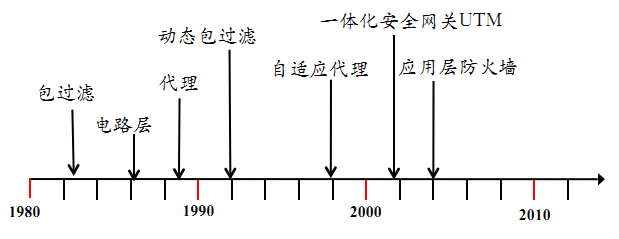

如上图，第一代防火墙是采用包过滤技术，随后在 1989 年推出了电路层防火墙和应用层防火墙的初步结构，诞生了第二代、第三代防火墙。第四代防火墙产生于 1992 年，开发出了基于动态包过滤技术的防火墙。1998 年，NAI 公司推出一种自适应代理技术，可以称之为第五代防火墙。

2000 年后的一体化安全网关 UTM（Universal Threat Management，统一威胁管理），整合了防火墙、入侵检测、入侵保护、防病毒、防垃圾邮件等综合功能。随后是新一代的应用层防火墙，又可以称为 IPS：入侵保护，包括病毒防火墙、Web 防火墙、VoIP 防火墙等等。

### 8.1.3 防火墙现状与发展

现有的防火墙开源产品有 Endian、ModSecurity、SmoothWall、pfSense、iptables、m0n0wall 等等，商业产品有：Juniper、华为、思科、联想网御神州、绿盟和 Safe3 等。吞吐能力常用计量单位有按带宽和按数据包处理量（每秒报文数量：Packet Per Second, pps），以带宽计量吞吐能力的防火墙可分为百兆 / 千兆 / 万兆防火墙。由于网络流量中报文长度不是单一的，TCP/IP 协议流量常见报文长度范围从 64 字节到 1518 字节均有，防火墙产品在用 `pps` 标称自己吞吐能力时通常使用 64 字节的测试报文流进行统计。按并发处理能力，有少于 5000 、5000 ~ 100,000、100,000 ~ 500,000、500,000 以上并发连接数等多种类型。若按防护类型，则有传统防火墙、应用层防火墙、防 DDoS 攻击防火墙、垃圾信息过滤防火墙。

防火墙技术的发展动态和趋势一直是面向更强的性能，可扩展的结构和功能，包括缓存加速、统一认证接口、防 DDoS 、路由器等等功能要求，并尽可能的简化安装和管理，积极适应持续变化的网络安全环境，可以防病毒和黑客、反垃圾信息（垃圾邮件
、垃圾短信 、垃圾电话等）。

## 8.2 防火墙技术原理

### 8.2.1 防火墙关键技术

本章主要介绍防火墙普遍采用的包过滤技术、状态检测技术和代理服务技术。

#### 8.2.1.1 包过滤技术

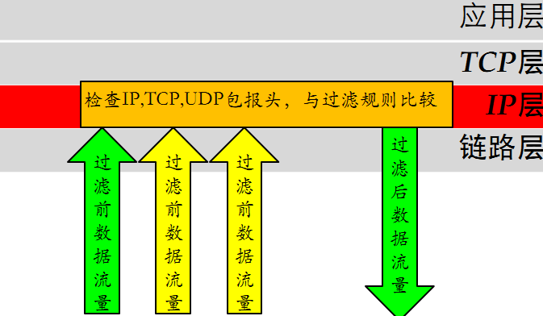


包过滤技术检查数据包的报头信息，依照过滤规则进行过滤，其检查的典型报头信息内容如下：

（1）IP 数据报的源 IP 地址、目的 IP 地址、协议类型，选项字段等。

（2）TCP 数据包的源端口、目标端口、标志段等。

（3）UDP 数据包的源端口、目标端口。

（4）ICMP 类型。

包过滤技术不需要内部网络用户做任何配置，对用户来说是完全透明的，过滤速度快，效率高。但不能进行数据内容级别的访问控制，一些应用协议也并不适合用数据报过滤，并且过滤规则的配置比较复杂，容易产生冲突和漏洞。

#### 8.2.1.2 状态检测技术

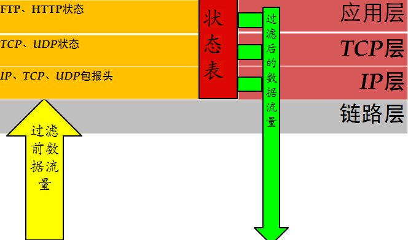

从收到的数据包中提取状态信息，并根据状态表进行判断，如果该包属于已建立的连接状态，则跳过包过滤的规则检测直接交由内网主机，如果不是已建立的连接状态则对其进行包过滤，依照规则进行操作。如下图:


在状态检测技术中，状态表是动态建立的，可以实现对一些复杂协议建立的临时端口进行有效的管理，状态检测技术为每一个会话连接建立状态信息，并对其维护，利用这些状态信息对数据包进行过滤。动态状态表是状态检测防火墙的核心，利用其可以实现比包过滤防火墙更强的控制访问能力。

状态检测技术的缺点是没有对数据包内容进行检测，不能进行数据内容级别的控制。由于允许外网主机与内网主机直接连接，增加了内网主机被外部攻击者直接攻击的风险。

#### 8.2.1.3 代理服务技术

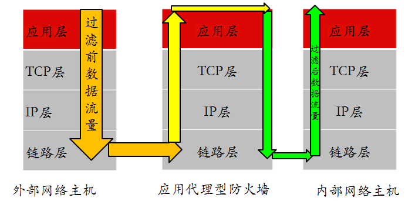

当接收到客户端发出的连接请求后，应用代理检查客户的源和目的 IP 地址，并依据事先设定的过滤规则决定是否允许该连接请求。如果允许该连接请求，进行客户身份识别。否则，则阻断该连接请求。通过身份识别后，应用代理建立该连接请求的连接，并根据过滤规则传递和过滤该连接之间的通信数据。当关闭连接后，应用代理关闭对应的另一方连接，并将这次的连接记录在日志内。如下是一个 Telnet 的例子：

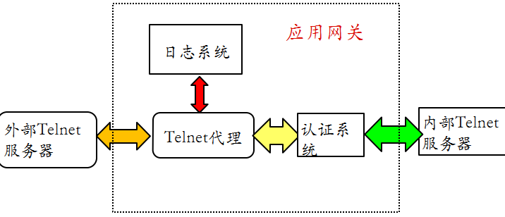

应用级代理的优点是内部网络的拓扑、IP 地址等被代理防火墙屏蔽，能有效实现内外网络的隔离。具有强鉴别和细粒度日志能力，支持用户身份识别，实现用户级的安全。能进行数据内容的检查，实现基于内容的过滤，对通信进行严密的监控。

代理服务的额外处理请求降低了过滤性能，导致其过滤速度比包过滤器处理速度慢。并且需要为每一种应用服务编写代理软件模块，提供的服务数目有限。对操作系统的依赖程度高，容易因操作系统和应用软件的缺陷而受到攻击。

## 8.3 防火墙的实现技术

### 8.3.1 软件技术

这里主要以 Linux 操作系统上的 Netfilter/iptables 机制为例。

#### 8.3.1.1 Netfilter/iptables框架简介

Netfilter/iptables 从 Linux 内核版本 2.4 开始，默认被包含在内核源代码树中可以对操作系统的流入和流出数据报文进行控制，如防火墙、NAT、数据报文自定义修改。Netfilter 工作在系统内核层，是 Linux 内核中一个强大的网络子系统，iptables 工作在用户层。

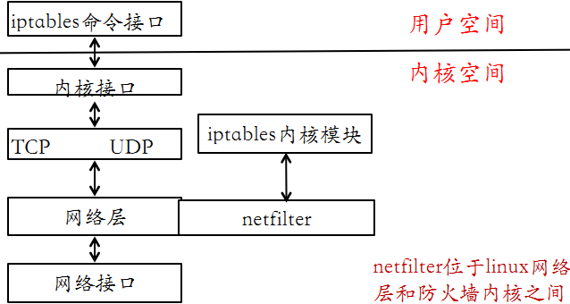

#### 8.3.1.2 Netfilter/iptable 基本概念

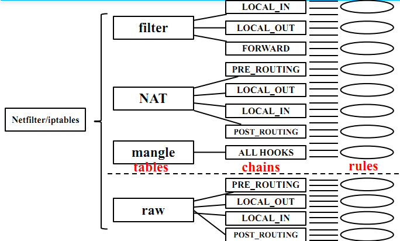

表（table），包含有 filter 表、nat 表、mangle 表、raw 表。filter 表用于报文过滤，只读过滤报文。nat 表实现NAT 服务。mangle 表进行报文处理，修改报文，附加额外数据到报文。raw 表，可以对收到的报文在连接跟踪前进行处理，只作用于 PreRouting 和 Output 链。表的处理优先级为

```
raw > mangle > nat > filter
```

链（chain），数据包的传输路径，每条链其实就是众多规则中的一个检查清单，分别有 INPUT、FORWARD、PREROUTING、POSTROUTING、OUTPUT。

规则（rule），网络管理员预定义的网络访问控制策略。

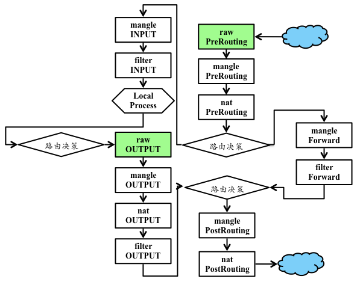

#### 8.3.1.3 Netfilter/iptable 防火墙工作原理

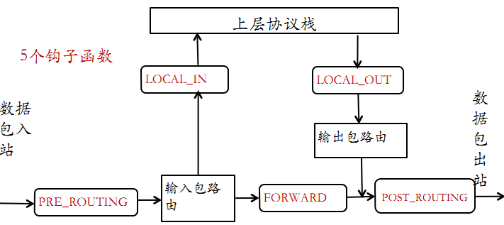

netfilter 模块将防火墙功能引入 IP 层，实现防火墙代码与 IP 协议栈代码完全分离。

对于 IPv4 协议来说，netfilter 在 IP 数据包处理流程中的 5 个关键位置定义了 5 个钩子函数，若数据包是送给本机的，则要经过钩子函数 LOCAL\_IN 处理后传给本机上层协议，若数据包应该被转发，则它将被钩子函数 FORWARD 处理，然后还要经过钩子函数 POST\_ROUTING 处理后才能传输到网络，本机进程产生的数据包要先经过钩子函数 LOCAL\_OUT 处理后，再进行路由选择处理，然后经过钩子函数 POST\_ROUTING 处理后再发送到网络。

关于 iptables 防火墙内核模块，正是通过把自己的函数注册到 netfilter 的钩子函数，这种方式介入了对数据包的处理，函数按功能分为 4 种：连接跟踪、数据包过滤、网络地址转换（SNAT、DNAT）、对数据包进行修改。

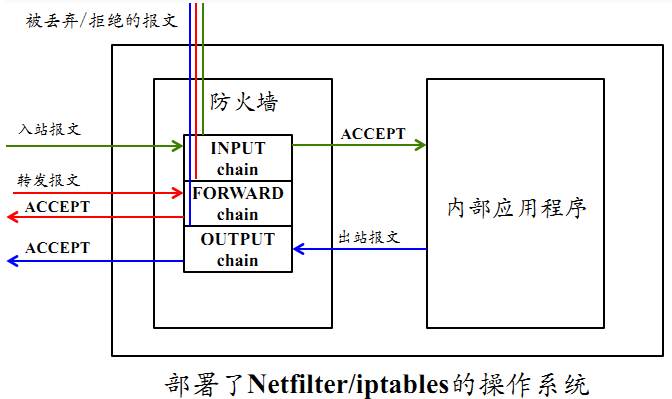

如果信息包源自外界并前往系统，而且防火墙是打开的，那么内核将它传递到内核空间信息包过滤表的 INPUT 链。如果信息包源自系统内部或系统所连接的内部网上的其它源，并且此信息包要前往另一个外部系统，那么信息包被传递到 OUTPUT 链。类似的，源自外部系统并前往外部系统的信息包被传递到 FORWARD 链。

接下来，将 netfilter/iptables IP 信息包的头信息与它所传递到的链中的每条规则进行比较，看它是否与某条规则完全匹配。如果信息包与某条规则匹配，那么内核就对该信息包执行由该规则的目标指定的操作。但是，如果信息包与这条规则不匹配，那么它将与链中的下一条规则进行比较。最后，如果信息包与链中的任何规则都不匹配，那么内核将参考该链的策略来决定如何处理该信息包。理想的策略应该告诉内核
DROP 该信息包。

### 8.3.2 硬件技术

在硬件技术中主要包括通用 CPU 架构、ASIC 架构、网络处理器架构。

通用 CPU 架构又被称为 x86 架构，采用通用 CPU 和 PCI 总线接口，可编程性高，更灵活、更易扩展。产品功能主要由软件实现，代表产品包含了大部分的开源/商业软件防火墙（基于\*nix 系统）。

ASIC 架构（Application Specific Integrated Circuit），专用集成电路，一种带有逻辑处理的加速处理器，把一些原先由 CPU 完成的经常性和重复工作交给 ASIC 芯片来负责完成，如交换机、路由器、智能 IC 卡，通常配合通用 CPU 单元来完成复杂运算。代表产品为大部分国外的商业硬件防火墙。

NP 架构（Network Processor），网络处理器，通用 CPU 架构和 ASIC 架构的折衷，开发难度较低，性能较好，具有灵活性/可扩展性。代表产品是大部分国内的商业硬件防火墙。

下图为三种硬件架构的横向比较：

|架构类型|X86|NP|ASIC|
|:---|:---|:---|:---|
|灵活性|★★★|★★|★|
|扩展性|★★★|★★|★|
|性能|★|★★|★★★|
|安全性|★|★★|★★★|
|价格|低|中等|较高|


## 8.4 防火墙的配置和应用

### 8.4.1 路由模式

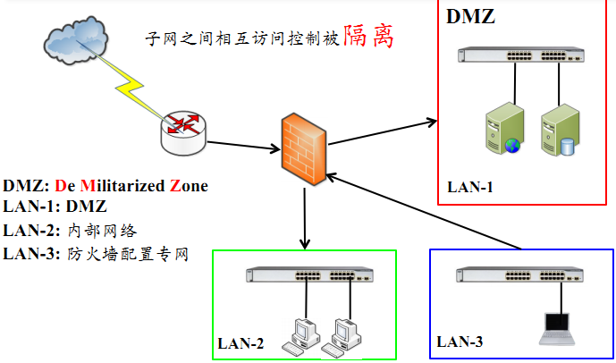

在路由模式中，防火墙的各个安全区域位于不同的网段且防火墙自身有 IP 地址。子网之间的相互访问控制被隔离。

### 8.4.2 透明模式

透明模式即网桥模式，只区分内部网络和外部网络。不需要对防火墙进行 IP 设置，内网用户意识不到防火墙的存在，隐蔽性较好。降低了用户管理的复杂性。

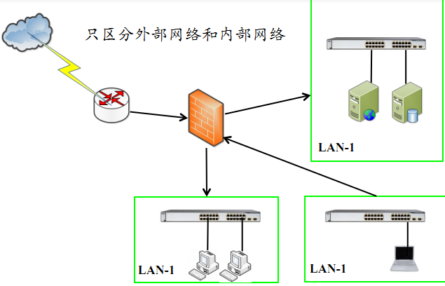

### 8.4.3 混合模式

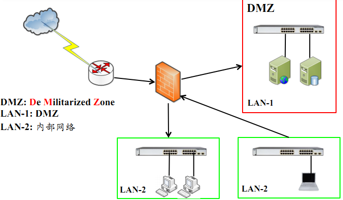

混合模式顾名思义混合了路由模式和透明模式，这种防火墙在实际生活中应用比较广泛，在混合模式中，内网和服务器区域是透明模式，与外网间则是路由模式。

### 8.4.4 防火墙部署的其他细节

在防火墙部署中还可以使用双机热备模式，可避免单点故障；或是负载均衡模式，使性能得到扩展同时也可避免单点故障。

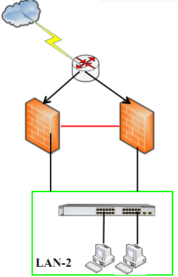

在实际部署中，防火墙可以串行接入在网络设备之前，如骨干网路由器防火墙和接入网核心交换机之后的防火墙。


或者串行接入在网络设备之后，像小型网络的接口防火墙和内网的子网防火墙。

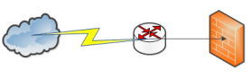

还有就是直接部署于应用服务器之上，例如单机网络防火墙和应用防火墙。


根据本节内容完成 [实验一：使用 ufw 配置单机防火墙](exp.md#实验一：使用-ufw-配置单机防火墙) 和 [实验二：iptables基本使用](exp.md#实验二：iptables基本使用)

## 8.5 基于防火墙实现NAT

### 8.5.1基本概念

私有地址（private address）属于非注册地址，是专门为组织机构内部使用而划定的。如下图：

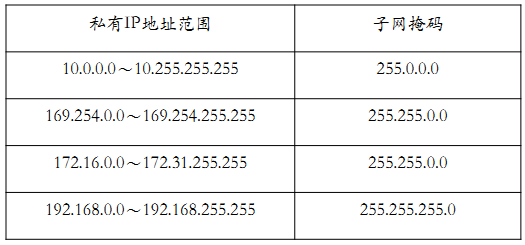

NAT 是将一个地址域（如专用 Intranet）映射到另一个地址域（如 Internet）的标准方法，NAT 可以将内部网络中的所有节点的地址转换成一个 IP 地址，反之亦然。可以应用到防火墙技术里，把个别 IP 地址隐藏起来不被外部发现，使外部无法直接访问内部网络设备。

### 8.5.2 NAT 工作原理

NAT 的实现方式有三种：静态网络地址转换、动态网络地址转换和网络地址端口映射。


所谓静态地址转换，是指将公网 IP 地址一一对应地转换为内部私有 IP 地址


动态地址转换将内部本地地址与内部合法地址一对一的进行转换，与静态地址转换不同的是它是从内部合法地址池动态分配临时的 IP 地址来对内部本地地址进行转换。


网络地址端口映射就是将公网 IP 映射到私有 IP ，而外网多个 IP 被映射到同一内部共有 IP 地址的不同端口。

根据本节内容完成 [实验三：iptables实现NAT](exp.md#实验三：iptables-实现-nat)

## 8.6 防火墙规则调试和审查

### 8.6.1 防火墙规则调试

根据 [实验四：防火墙规则调试](exp.md#实验四：防火墙规则调试) 动手实验完成。

### 8.6.2 防火墙规则安全审查

防火墙规则的安全审查，可使用静态分析工具。关于防火墙规则的语义理解，可采用数据流图分析，自动化规则树生成。例如 ITVal。也可以使用黑盒测试工具，如基于网络扫描器的模糊测试。

## 8.7 课后思考题

1. 防火墙的典型网络部署方式有哪些？
2. 防火墙能实现的和不能实现的防护各有哪些？
3. [课外实验](exp.md#课外实验)

# 参考文献

[How To Set Up a Firewall Using Iptables on Ubuntu 14.04](https://www.digitalocean.com/community/tutorials/how-to-set-up-a-firewall-using-iptables-on-ubuntu-14-04)
