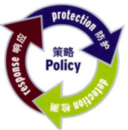
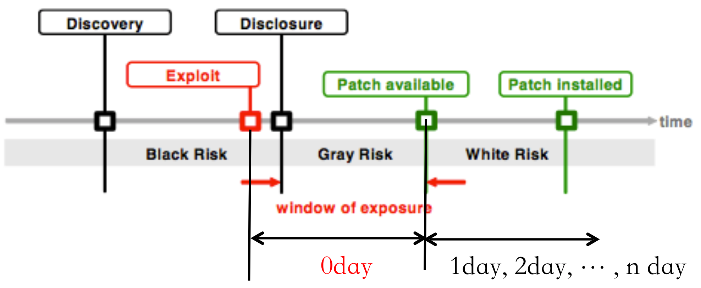
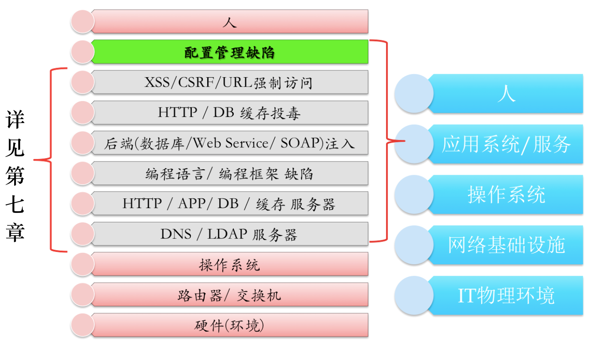
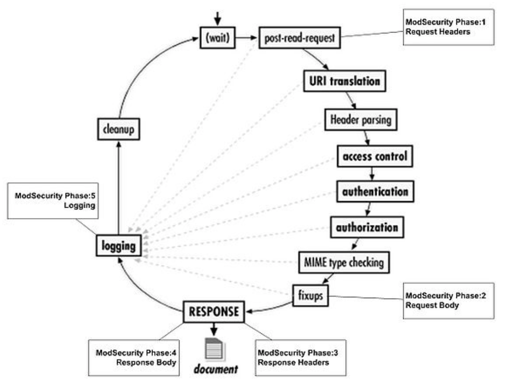

# 第十章 应用程序安全加固

## 10.1 信息安全技术体系与威胁模型

### 10.1.1 信息安全技术三维技术体系

信息安全内涵主要从功能、目标和时间三个维度来定义。

首先，根据信息系统按照功能层次划分的通用组成结构定义，信息安全功能包括人和技术两个大的层次。其中，和人有关的信息安全功能，包括决策层安全和执行层安全。和技术有关的信息安全功能，包括：应用层安全、网络层安全和物理层安全。

其次，从信息安全的整体目标来看，信息系统的防护目标主要包括：机密性、完整性、可用性、认证、授权和审计。信息系统的通用防护模型可以通过访问控制模型来刻画，因此上述 6 个目标的定义是建立在主体对客体的访问过程之上的。

最后，从时间过程来看，信息安全是一个“持续”改进过程，所有的改进措施围绕安全“策略”设计和展开。通过周而复始、不断迭代去建立和完善防护、检测和响应技术，如下图所示。



应用程序安全加固的指导方法可以从这 3 种不同视角出发，根据加固所处的阶段（时间）、具体的加固需求（目标）和加固对象（功能）规划和实现具体的加固方案。

### 10.1.2 基于信息安全三维技术体系的安全加固

#### 10.1.2.1 从“功能”视角出发看安全加固

功能视角的顶层是“决策层安全”，对应到一个企业就是管理层人员的安全责任和意识。按照顶层设计原则，决策层安全要求相关人员了解基本安全原则和安全常识，理解信息安全建设和投入对于企业生存和发展的各方面意义。例如我们熟知的信息安全基本原则有：“最小化授权”、“有条件安全（没有绝对安全）”、“木桶原理”和“等级安全”，这些既是基本原则和概念，同时也是指导和评估信息安全决策合理性和优劣的基本手段和方法。根据企业自身资产特点、信息化业务实际情况，基于成熟的信息安全管理规范，标准化制定企业、部门、系统、人员等各个方面的信息安全规章制度。

处于“决策层安全”之下的是“执行层安全”，对应到一个企业主要是与信息化应用和信息安全保障等岗位密切相关的一线从业人员的信息安全实践能力。在安全策略确定的前提下，一线从业人员需要理解和掌握安全管理规范、安全法律和法规，在实际工作中既要能做到令行禁止、遵照执行，同时应有具体对应的风险评估和制度执行评估实施能力。

应用层安全、网络层安全和物理层安全涉及到具体的技术层面安全问题。其中，应用层安全涉及到软件实现层面的漏洞挖掘、分析与利用能力，数据和内容安全能力，运维安全能力等等。网络层安全侧重于通信协议层面的漏洞挖掘、分析与利用能力。物理层安全主要指的是 IT 基础设施环境安全，包括电力供应安全、物理环境（温度、湿度和电磁辐射等）安全等。对于企业来说，这 3 个层面中所涉及到的各方面具体信息安全能力主要可以通过自主研发或付费购买（产品和服务）两种方式获得。

#### 10.1.2.2 从“目标”视角出发看安全加固

针对访问控制模型中涉及到的 6 大信息安全目标，结合“功能”视角的分层定义，我们可以构建出一个基于信息安全功能和目标的二维加固矩阵模型，矩阵中的每个单元格内容对应典型加固方法、措施或产品，如下表所示。

<table style="text-align:center">
   <tr>
      <td></td>
      <td>机密性</td>
      <td>完整性</td>
      <td>可用性</td>
      <td>认证 </td>
      <td>授权</td>
      <td>审计</td>
   </tr>
   <tr>
      <td>决策层</td>
      <td colspan="6">预算拍板</td>
   </tr>
   <tr>
      <td>执行层</td>
      <td colspan="5">遵守执行</td>
      <td>风险评估/渗透测试</td>
   </tr>
   <tr>
      <td>应用层</td>
      <td>文件系统加密</td>
      <td>主机入侵检测系统</td>
      <td>双机热备系统</td>
      <td>UKey/动态口令</td>
      <td>RBAC</td>
      <td>syslog</td>
   </tr>
   <tr>
      <td>网络层</td>
      <td colspan="2">SSL/TLS</td>
      <td>heartbeat</td>
      <td>交换机的端口接入</td>
      <td>VPN</td>
      <td>上网行为监管系统</td>
   </tr>
   <tr>
      <td>物理层</td>
      <td>保险柜</td>
      <td>电子安防</td>
      <td>双线供电</td>
      <td>门禁卡</td>
      <td>分级门禁</td>
      <td>视频监控</td>
   </tr>
</table>

这里的 6 大目标的内涵和外延定义，总结如下：

* 机密性：认证凭据的加密存储和传输，防⽌嗅探和复制仿冒。
* 完整性：主体/客体/消息/信号的存储和传输不被篡改。
* 可用性：主体随时可以访问客体。
* 认证：验明主体真实身份。
* 授权：验证主体有访问客体的权限。
* 审计：防⽌主体抵赖对客体的历史访问。

为了实现上述各信息安全加固目标，不同岗位、不同层次的人或技术一方面都有自己的代表性方法，另一方面，往往也在随着信息化技术的发展而变化和变革。

#### 10.1.2.3 从“时间”视角出发看安全加固

P<sup>2</sup>DR 模型是信息安全行业中的一个非常重要的动态网络安全体系模型，这个模型所传达出的信息安全专业和行业核心特点有两个：第一，安全是持续循环的过程。第二，安全是动态变化的。``零日漏洞``（0day）是信息安全行业发展过程中的一个不可回避的概念和研究对象，下图所示是一个漏洞的典型生命周期阶段图。



图中有几个非常重要的里程碑节点都是与漏洞的发生和发展时间密切相关：

* 漏洞发现（Discovery）
* 漏洞利用（Exploit）
* 漏洞曝光/披露（Disclosure）
* 补丁可用（Patch avaliable）
* 已安装补丁（Patch installed）

基于上述漏洞生命周期的里程碑节点定义，我们可以进一步定义出三个不同风险等级的时间窗口：

* 黑色（未知）风险：这个阶段处于新（未知）漏洞被发现和首次被公开披露、曝光之前，如果有黑客在这个阶段利用该漏洞进行网络攻击，往往是无法被现有的安全防御机制发现的。
* 灰色（不确定）风险：这个阶段主要是在漏洞被公开之后，等待厂商发布正式安全补丁之前的一个阶段。在这个阶段，除了厂商补丁之外，可能会有一些临时修复或缓解措施公布，可以用来应急性的对抗可能的漏洞利用行为。是否能够有效对抗、是否存在攻击绕过技术、是否已经出现该漏洞的利用行为往往都存在着不确定性。
* 白色（已知）风险：这个阶段开始于厂商正式公开发布了漏洞补丁，但只要最终用户没有在系统中正确安装应用该补丁，攻击者依然可能利用该漏洞攻击目标系统和网络。相比较于前面 2 个阶段，此时的风险和风险消除方法已经是比较确定的了。

一个新漏洞在被检测到利用行为之后到厂商正式发布补丁之前的这一段时间就被定义为零日漏洞（0day），信息安全的攻守双方都希望抢先对手一步掌握 0day 细节。攻方希望通过 0day 完成一次成功的网络攻击，守方希望通过 0day 预先研究出对策并抢在攻方动手行动之前部署防御到位。因此，对 0day 争夺的这个过程再一次体现了“信息安全是一个持续对抗过程”。对于绝大多数的信息系统管理员来说，保持自动更新是持续对抗的可行且必然的选择。

#### 10.1.2.4 安全加固的方法论小结

安全加固有 2 条基本原则：需求驱动和木桶原理。

**需求驱动**原则借鉴参考自等级保护的意义，通过明确安全需求，了解到安全防护是需要成本投入的，安全建设和管理需要兼顾系统性、针对性和可行性。在成本投入有限的约束条件下，安全加固要明确重点、突出重点、保护重点。

安全加固的**木桶原理**指的是安全防御中的任何一个短板都会导致整个安全防御体系的崩溃，一个完整有效的安全加固一定要全面分析系统的脆弱性和所采用的对应修补、加固措施，避免单点缺陷的遗忘和忽略导致系统整体安全性被单点突破风险破坏掉。

本节应用程序安全加固将要介绍和分析的方法重点集中在前述安全加固二维矩阵的应用层，更具体来说包括了操作系统安全加固和运行于操作系统之上的应用程序和信息系统本身的安全加固。

## 10.2 操作系统安全加固

围绕机密性、完整性、可用性、认证、授权和审计 6 大目标，我们依次来探讨操作系统安全加固在每一个目标上的需求场景、可行措施和手段。

### 10.2.1 围绕机密性目标

与机密性目标相关的典型需求场景包括：

* 认证凭据信息的存储。例如 Linux 系统上的 ``/etc/passwd`` 和 ``/etc/shadow``，分别存储了操作系统的用户账号和用户账号对应口令信息。这里的口令信息首先一定不是直接明文存储的，其次，并没有采用简单 Hash 的方法来存储散列值，而是采用了更安全的机密信息存储 API 和加密算法。既保证口令信息不被非授权恢复出明文，同时满足身份认证时机密信息的校验匹配需求。
* 配置文件中的口令信息。大量 Web 应用程序代码中，直接在配置文件里使用明文保存重要的认证账户信息，例如数据库连接用户名和密码。实际上，类似于 `Apache` 的 `htpasswd`、`proftpd` 的 `ftpasswd` 都使用到了 Linux 的原生应用层 `API crypt`，可以对这些明文口令进行安全加密存储，同时保证相同口令加密结果不同的前提下不影响身份认证时的口令校验。
* 加密通信。例如 HTTPS 通信。

在上述机密性需求场景中最常见的一类密码学算法误用就是用 Hash 算法去处理用户口令。此外，使用 DES/AES 等对称加密算法但加密密钥直接明文保存于文件系统也是一类常见的密码学算法误用。对于前者，可以基于查表法，快速查找出散列值对应的原始明文口令。对于对称加密算法，一旦密钥泄漏则会导致密文可以被轻易恢复出明文，破坏机密性。除此之外，加密程序本身的实现漏洞也是常见的认证凭据信息存储机制弱点之一。例如，CVE-2007-2844（PHP Crypt Function Not Re-entrant）就是一个 PHP 的 crypt 函数漏洞。

对于加密通信来说，协议设计缺陷（例如SSL 1.0/2.0/3.0, TLS 1.0/SSL 3.1已经被发现存在设计漏洞）、协议实现漏洞和网络环境漏洞等都是常见的加密通信弱点。以下列举了几个经典的SSL协议实现漏洞：

* New Tricks For Defeating SSL in Practice blackhat-dc-2009
* OpenSSL cipher downgrade attack (CVE-2010-4180)
* Padding Oracle Crypto Attack 2010.09
* BEAST attack on TLS 1.0 (SSL 3.1) 2011.09
* Heartbleed attack on OpenSSL CVE-2014-0160 2014.4
* Poodle: SSLv3 vulnerability CVE-2014-3566 2014.11

基于上述分析，在实践中我们建议：

* 勤打安全补丁，以减少程序实现漏洞。
* 基于『慢速』 Hash 算法去处理明文口令为密文口令形式存储，使得相同明⽂密码可以存储为不同 hash 结果，例如 password_hash() (PHP 5.5+)就是一个 PHP 代码可以使用的口令安全存储的函数。
* 使用更安全的加密算法。例如使用 AES/3DES 代替脆弱的 DES。同时，一定要避免自⼰设计加密算法，从而避免算法设计上的缺陷。
* 避免在配置文件中直接使用明文存储口令，例如可以使用操作系统加密 API，同时妥善保管对称加密的密钥。
* 设置合理的文件访问权限是对数据机密性建立的一层独立额外保护。例如我们可以限制非 Web 用户读取网站配置文件，配置 Web 服务器的 ACL 防止用户越权访问到重要本地配置文件。
* 使用成熟、经过安全评估的通信加密解决方案，例如 OpenSSH、VPN 等。很多明文传输协议可以借助 OpenSSH 实现加密隧道传输，例如 `SVN over ssh`、`git over ssh` 等。
* 做好网络通信基础设施安全加固，具体可以参考《第四章 网络监听》。

### 10.2.2 围绕完整性目标

与完整性有关的典型需求场景包括：

* 文件完整性签名。确保文件来源的可信、确保文件未被非法篡改。
* 各种防篡改解决方案。例如网页防篡改、数据库防篡改。
* 运行时完整性保护。
    * 资源载入。第三方库加载过程如何确保载入的资源真实可信未被篡改？典型漏洞如：dll 加载污染漏洞。
    * 内存变量。全局变量存储的敏感数据可能被进程中的任意线程意外修改。
    * API 调用过程是否存在 `API hook`，API 返回结果是否被拦截篡改。
* 通信过程完整性保护。

以网页防篡改为例，主流的网页防篡改技术分类如下表所示：

| | 外挂轮询技术 | 事件触发技术 | 核心内嵌技术|
| --- | --- | --- | --- |
| 访问篡改网页 | 可能 | 可能 | 不可能 |
| 保护动态内容 | 不能  | 不能  | 能  |
| 服务器负载 | 中  | 低  | 低  |
| 带宽占用 | 中  | 无  | 无  |
| 检测时间   | 分钟级  | 秒级  | 实时  |
| 绕过检测机制   | 不可能  | 可能  | 不可能  |
| 防范连续篡改攻击   | 不能  | 不能  | 能  |
| 保护所有网页   | 不能  | 能  | 能  |
| 动态网页脚本   | 不支持  | 支持  | 支持  |
| 适用操作系统   | 所有  | 受限  | 所有  |
| 上传时检测   | 不能  | 受限  | 能  |
| 断线时保护   | 不能  | 不能  | 能  |
### 10.2.3 围绕可用性目标

与可用性有关的典型需求场景包括：

* 数据备份。数据备份是容灾的基础，主要为了防止系统出现操作失误或系统故障导致数据丢失。典型的备份方式包括定期磁带机的冷备份、数据库的备份、网络数据备份、远程镜像等。
* 业务备份。业务连续性要求在计划外故障时间和计划内停机期间提供公司数据，且要求业务工作负载处于运行状态。
* 备份还原测试。对于数据及业务的备份，在灾害发生后的还原过程中需要充分对整个业务的状态进行可用性测试，确保可以恢复到原先的正常状态。
* 负载均衡。例如基于域名、应用层协议、后端计算/存储/带宽资源消耗占比的各种负载均衡技术。
* 防 DoS/DDoS。主要是对拒绝服务攻击的各种方式采取一定的方法策略。

负载均衡的基本思想就是通过合理的资源分配和调度，确保数据、业务、系统和网络等有限计算资源的可用性。

### 10.2.4 围绕认证目标

与认证有关的典型需求场景包括：

* 身份识别。例如对于一次网站请求来说，网站后端代码需要区分这次请求的主体身份是普通用户？爬虫？管理员？API 客户端？为了准确分类用户身份，如何唯一准确标识一个请求就成为了关键问题。
* 身份验证。在身份识别的基础之上，进一步验证用户是谁。例如可以通过用户名和密码的匹配来验证用户身份，也可以通过二维码扫码方式来验证用户身份。采用什么样的验证方式，要在易用性和安全性两个方面进行平衡设计。

现有的身份验证系统大多采用的是单因素认证机制，特别是基于用户名和口令方式，但这种简单认证方式固有的弱口令风险、暴力破解风险等使得身份验证强度面临极大挑战。因此诸如口令强度限制、定期强制更换口令就成为了常用的单因素认证加固手段。双因素/多因素认证的出现则从验证原理的根本上提高了身份验证的强度，辅助以 CAPTCHA 机制可以更好的防止自动化暴力破解认证。常见的 CAPTCHA 机制包括：图片验证码、音频验证码和客户端图灵测试（例如基于 Web 浏览器的客户端 JS 代码执行能力设计并实现的客户端 JS 认证代码，可以用于区分浏览器访问行为和非浏览器访问行为）。


### 10.2.5 围绕授权目标

与授权有关的典型需求场景包括：

* 已认证用户的滥用/误用行为。例如 Web 应用程序漏洞里的 CSRF 攻击就是利用了网站对已认证用户的信任，在用户不知情的情况下被攻击者执行了预定的恶意代码完成特定授权操作。
* 代码漏洞导致的任意指令执行/任意资源访问。例如 Web 应用程序中存在的 SQL 注入漏洞，攻击者可以直接访问数据库，甚至是借助数据库的代码执行能力进一步控制整个服务器。
* 可靠的授权变更机制：取消授权、新授权和变更授权。例如公司中常见的新员工入职、老员工离职、员工岗位和职级的变更带来的授权变动需求。行政上的权限和技术上的权限如何做到同步变更、同步生效对于一个企业来说是非常重要的一项能力。取消授权可以采取取消已认证的身份数字标识来实现，也可以通过取消身份绑定的资源/权限来实现。新授权过程主要包括：新建主体和客体、新建主体对客体的访问授权（关联）。变更授权过程则是重新配置和变更主体对客体的访问授权（关联）。

为了解决上述前 2 个问题，我们按照最小化授权原则去设计认证用户、代码执行的权限分配方案。特别的，对于代码执行，还可以通过额外的权限隔离机制来限制越权访问行为的发生。例如操作系统的沙盒安全机制、jailed 机制等。对于系统运维管理员来说，最小化安装和配置生产环境，删除/禁用所有非必需服务/应用是一项简单可行的最小化授权方法。

### 10.2.6 围绕审计目标

与审计有关的典型需求场景包括：入侵取证和历史行为审计（面向用户和面向资源）。具体来说，主要是针对日志系统的CIA加固和实现自动化审计。代表性自动化审计技术如：自动分析日志和主机入侵检测。

一个满足审计性需求的、经过 CIA 加固的日志系统应具备以下几个方面的特征：

* 机密性：避免在日志中记录敏感信息，如认证凭据。
* 完整性：日志系统防篡改，大多数日志系统都是被设计并实现成只能追加不能覆盖写入或删除。
* 可用性：日志系统要确保持续可用，才能确保所有行为都能被及时记录下来。这里最常见的可用性故障就是海量日志耗尽了磁盘存储导致无法写入新日志，解决方案主要是正确配置应用程序日志的轮转策略，设置合理的日志最大保存时间周期，对于超过保存有效期的日志可以安全的删除掉以及时释放存储空间。

### 10.2.7 小结

* CIA+AAA 是安全加固的基本目标。
* 操作系统安全加固是所有安全加固的基础，除此之外，应用程序、网络通信和人的安全意识/安全（执行）的能力是安全加固的主要工作内容。
* 操作系统安全加固的原则和经验是可借鉴、可推广和可移植的。

## 10.3 运行环境安全加固

本节重点讨论应用程序运行所依赖环境的安全加固需求，主要将介绍三大应用服务器的安全加固方法，分别是 Web 服务器、SSH 服务器和 DNS 服务器。

### 10.3.1 Web 服务器安全加固

首先我们来看 Web 服务器，如下图所示是我们在第七章用分层的方法来刻画的 Web 威胁模型：



第七章主要讲解的是其中的应用系统/服务相关漏洞的基本原理、利用方法和基于代码级别的防御加固方法，服务器软件的配置加固方法可以参考 10.2 节操作系统安全加固的原则和经验，应用系统/服务的配置管理缺陷我们将在本小节通过具体 Web 服务器的例子来讲解。

ModSecurity 是知名开源 Web 服务器 Apache 的一个网站应用级入侵防御系统（Web Application Firewall, WAF）模块，其主要功能特性如下：

* HTTP 流量记录
* 实时监控和攻击检测
* 攻击防护和虚拟补丁
* ⿊名单/白名单/已知弱点和漏洞（规则）
* 灵活的（检测和响应）规则引擎
* 支持嵌⼊式部署
* 支持⽹络部署
* 跨平台支持

OWASP 上的 ModSecurity CRS（Core Rule Set）项目基于 ModSecurity 定制了一系列通用的 WAF 防护规则，开放下载。防护规则种类主要覆盖：

* HTTP 防护
* 常见 Web 攻击防护
* 自动化检测
* ⽊马防护
* 错误消息隐藏

如下图所示是 Apache 请求处理生命周期图，从该图上可以看到：ModSecurity 已经完整覆盖了 Apache 的 HTTP 请求和响应消息处理的所有阶段，能够对请求头部、请求消息体、响应头部、响应消息体和日志等进行完整的监控和数据拦截实时修改。



以下几个简单（但不可直接用于生产系统，仅为示范基本原理用）的规则应用可以很好的展示 ModSecurity 的典型应用场景——Web 应用的“热补丁”。特别是一些暂时无法在代码层面修复的漏洞，可以通过 ModSecurity 临时设置规则来保护 Web 应用系统。无需重启后台的应用系统和 Web 服务器，“补丁”可以立刻生效。

```bash
# 拒绝SQL注⼊:
 SecFilter "delete[[:space:]]+from"
 SecFilter "insert[[:space:]]+into"
 SecFilter "select.+from"
# 拒绝Googlebot访问
 SecFilter HTTP_USER_AGENT "Google" nolog,redirect:http://www.google.com
# 拒绝特定命令执⾏
 SecFilter /etc/password
 SecFilter /bin/ls
# 拒绝目录遍历
 SecFilter "\.\./"
```

一个健壮的 Web 应用程序一定不能依赖于 WAF 保护，健壮和经过严格设计、安全编码、安全测评的代码才是加固 Web 应用程序的治本解决方案，WAF 属于纵深防御和应急响应手段。除了 ModSecurity 之外，Apache 官方还提供了一些其他的安全加固相关模块，例如：

* `mod_evasive`：防 DoS/DDoS。
* `mod_bandwidth`：可以用于限制并发连接数和带宽使用。

### 10.3.2 SSH服务器安全加固

* 更换默认的 SSH 监听端⼝，可以减少来自互联网的大量漫无目的扫描器的广撒网式扫描。虽然不会改变服务器的安全性等级，但是可以有效的减少一些自动化扫描程序的进一步试探。
* sshd 配置安全加固。建议只使用 SSH 协议版本 2，使用更长的服务器密钥长度，例如 2048，默认登录超时时间建议缩短到 30 秒，禁止 root 用户直接登录，停用基于口令的登录方式，保留公钥方式认证。
* 使用第三⽅安全加固⼯具。主要是防⽌⼝令暴⼒破解，例如 `fail2ban、denyhosts、pam_abl` 等。但如果 SSH 服务器禁止明文口令认证方式，只保留了公钥证书方式认证，则口令破解类攻击很难成功。第三方工具通过限制错误尝试次数，借助主机防火墙可以从网络层禁止暴力破解尝试，减少不必要的服务器带宽消耗和登录认证处理资源消耗。

### 10.3.3 DNS 服务器安全加固

使用 DNSSEC 可以基于 PKI 体系对抗 DNS 缓存污染、DNS 域名劫持和 DNS 解析重定向攻击。正确配置 DNS 服务器的域传送设置，避免恶意请求通过 `Zone Transfer` 获取所有的域名配置记录。对于内网域名解析，需要做好请求客户端的白名单配置，避免内网信息泄漏。

同时，由于 DNS 的工作是依赖于域名服务提供商和域名注册服务提供商的，管理好域名注册服务提供商和域名服务提供商的站点账号，预防口令安全问题，防止社会工程学攻击直接恶意篡改域名解析配置。

## 10.4 安全加固基准检查清单

Google 的 `security checklist` 可以快速了解常用的安全检查清单。除此之外，XCCDF（Extensible Configuration Checklist Description Format）是美国国家标准与技术研究院制订的一项可扩展配置清单描述标准，通过对配置信息的标准化描述，第三方安全检查工具可以直接对符合该格式规范对系统配置进行自动化的检查和安全评估。

参考第三方的安全加固基准检查清单切忌教条式照搬，一定要因地制宜，结合实际的业务需求、运行环境和管理制度制订符合自身特点和需求的安全加固策略和实施方案。


## 参考文献

* [微软 MBSA](http://technet.microsoft.com/en-us/security/cc184924)
* [美国国家漏洞数据库（NVD）的检查清单](http://web.nvd.nist.gov/view/ncp/repository)
* [Ubuntu 官⽅的安全指南](https://help.ubuntu.com/lts/serverguide/security.html)
* [mod_security 参考⼿册](https://sourceforge.net/projects/mod-security/)

## 课后思考题

试举⼀例说明“⼈的安全意识和安全能⼒在应用程序安全加固中是不可忽视的重要环节”。
