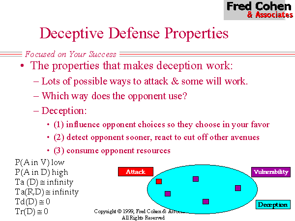
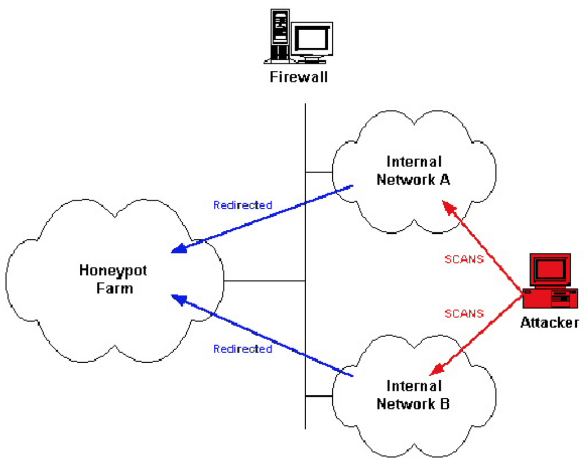
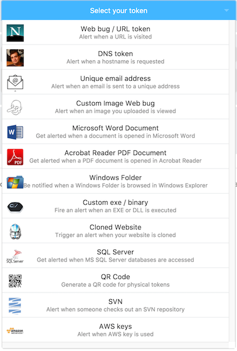
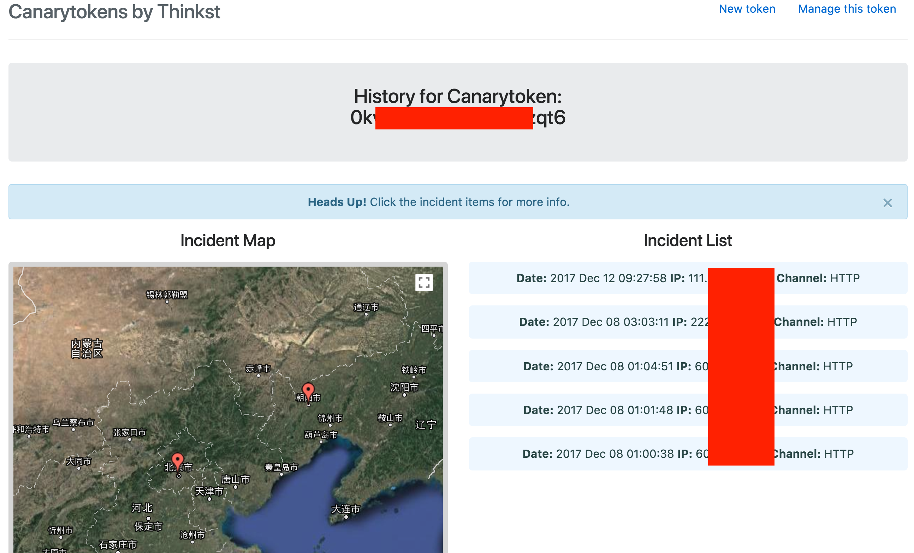
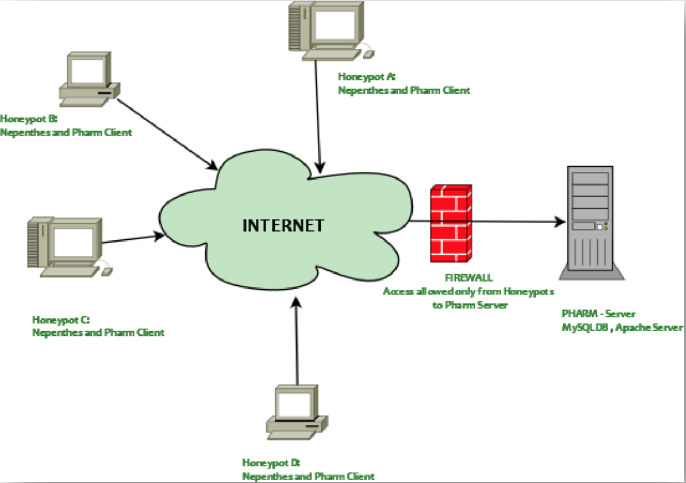
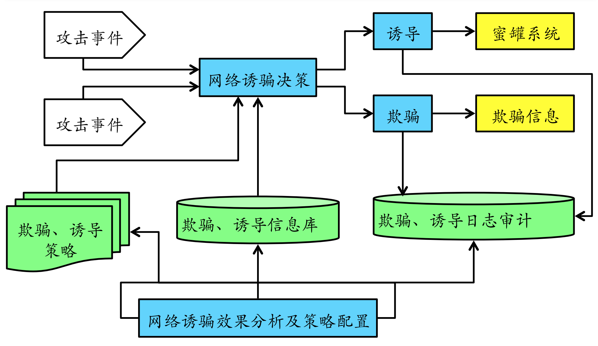
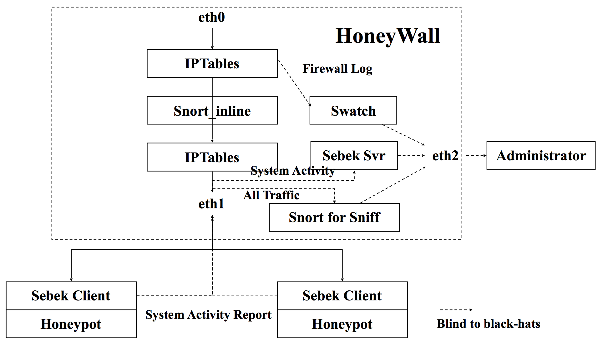
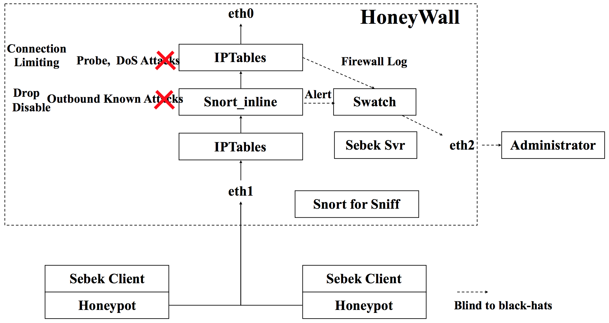

# 第十一章 蜜罐和蜜网

## 11.1 蜜罐发展史

### 11.1.1 引言

信息安全的本质是持续对抗，例如网络渗透与系统入侵要面对防火墙、入侵检测和应用程序安全加固等等。在前面的章节中我们已经看到，一方面，防火墙、入侵检测和应用程序安全加固分别都有自己的应用场景，都能解决一些特定条件下的网络攻击防御、预警、缓解和加固需求，但由于零日漏洞的存在和安全策略设计缺陷、安全机制配置和实现不当，攻击者总能找到一些缺口突破保护。所以，在实际的网络安全战场上持续对抗的双方实际是在进行着一场**非对称**的对抗。具体来说，这种**非对称性**主要体现在以下几个方面：

* 工作量不对称

攻击方可以选择在白天和工作日养精蓄锐，夜深人静、节假日展开攻击行动，攻其不备。防守方为了保障网络和系统安全，一刻不能懈怠，“24 小时 x 7 日“不间断、全面防护，即使这样，还要随时承受木桶原理给自己带来的致命突破。

* 信息不对称

攻击方通过信息收集、网络扫描、探测、踩点可以随时对攻击目标进行全面了解，而防守方由于处在“明处”，对“暗处”的攻击者一无所知，不知道它是谁、有何攻击意图、掌握哪些攻击手段和本方信息等。

* 后果不对称

攻击方一次任务失败，极少受到损失。重整旗鼓，随时可以发起第二次，第三次，第 N 次攻击。防守方的安全机制一旦被突破，资产立刻面临损失风险并可能带来其他不良影响。

正是由于上述对防御一方的种种不利因素和现状，蜜罐和蜜网的出现就是为了扭转这种不对称的对抗局面。通过设置“假目标”，增加攻击成本，扭转工作量不对称。通过持续观察攻击者在蜜罐和蜜网中的行动了解攻击者是谁，用什么工具，如何操作，为什么攻击你。蜜罐和蜜网被攻陷是可预期和可控的结果，通常不会对真实资产造成损失和不利影响。防御一方反而可以有机会通过计算机取证技术发现和定位攻击者身份，借助司法行为对网络犯罪行为给予严厉打击，或者通过计算机取证技术分析和提取出攻击者使用的零日漏洞利用工具，使得这些工具不能第一时间被用于攻击真实网络和系统，反而暴露了最新的攻击技术，为防御者及时研发和部署更新安全系统争取了更多时间，降低了攻击者的攻击成功率，这些都能起到对攻击方的威慑和限制作用。

### 11.1.2 蜜罐概念和分类

``蜜罐``（Honeypot）一词首次出现在 Cliff Stoll 的小说“The Cuckoo's Egg"(1990)，蜜网项目组给蜜罐的定义（包含了价值和意义的阐述）如下：

> A security resource who's value lies in being probed, attacked or compromised.
>
> 一种存在价值即为被探测、被攻击和被攻陷的安全资源。

根据上述蜜罐的概念定义，我们还可以得出蜜罐的两个重要特点：

* 没有业务上的用途。换句话来说就是所有流入或流出蜜罐的流量都预示着扫描、攻击及攻陷可能性。
* 用以监视、检测和分析攻击。

在 [A Note on the Role of Deception in Information Protection (c) 1998 Fred Cohen](http://all.net/journal/deception/deception.html) 中，Cohen 对欺骗的特点做了如下非正式总结：

* 欺骗增加了攻击者工作量，因为他们无法轻易预测哪些攻击行为会成功哪些会失败；
* 欺骗允许防御者追踪攻击者的种种入侵尝试并在攻击者找到防御者的真实漏洞之前进行响应；
* 欺骗消耗攻击者资源；
* 欺骗增加了对攻击者的更高技能要求；
* 欺骗增加了攻击者的不确定性；

基于上述理论，Cohen 设计的欺骗防御基本结构如下：

* 影响攻击者的策略选择，使其按照防御者设计的攻击路径执行；
* 尽快检测到攻击者，联动切断其他攻击路径；
* 消耗攻击者资源；

防御者在构建系统时的基本假设是：攻击者情报收集工作的目的是减少对目标防御者系统的不确定性增加技术攻击成功的可能性。按照香农理论就是向防御系统增加信息量。完美欺骗防御过程指的是攻击者的情报收集结果在符合攻击者预期的前提下既不能太容易也不能太困难。从长期来看，成功的防御应该是引诱攻击者相信技术攻击已经得手但尚存在一些未解决的难题导致整体攻击目标未达成。

目前的现状是，长期视角的防御成功还不具备技术成熟度，因此我们退而求其次：检测到每一次“攻击序列”并且使得攻击者通过多次“攻击序列”尝试后依然无法攻击成功。

Cohen 在 [A Mathematical Structure of Simple Defensive Network Deceptions, Copyright (c) 1999 Fred Cohen](http://all.net/journal/deception/mathdeception/mathdeception.html) 一文中用一个基本的概率论模型总结了欺骗防御的一些基本属性：

如上图所示是一个基本的欺骗防御系统基本组成结构图和攻防双方的概率视角属性定义：

* ``P(A in V) low`` 攻击到真实漏洞的概率较低。这需要增加攻击者情报收集目标空间足够大，且其中包含的漏洞数量足够少。
* ``P(A in D) high`` 攻击到达欺骗环境的概率较高。这需要欺骗系统的数量远远大于系统中真实漏洞的数量。
* ``Ta(D) ~= inifinity`` 识破和绕过欺骗所需要的时间接近无穷大。这就意味着欺骗仿真程度非常高，并且可以保证即使欺骗系统被识破，但进一步的情报收集工作和以此为跳板的攻击路径延伸都无法达成。
* ``Ta(R, D) ~= inifinity`` 攻击者一旦进入欺骗陷阱再试图发现真实漏洞所需要时间接近无穷大。这就意味着欺骗系统中检测到攻击行为中的情报收集行为应该非常容易，后续该攻击者的所有情报收集行为都应该被欺骗系统重定向到欺骗系统中而不能收集到真实系统漏洞相关的任何信息。这里的挑战主要存在于要么没有检测到攻击者的情报收集行为要么即使检测到了情报收集行为但无法阻止对真实系统漏洞相关情报的收集。
* ``Td(D) ~= 0`` 检测到攻击者情报收集行为所需时间应尽可能短。在欺骗系统中快速检测到情报探测行为的假设是合理的。在实践中，技术扫描手段很容易被检测到，但如果是被动信息收集行为则很难检测。
* ``Tr(D) ~= 0`` 从发现攻击者情报收集行为到做出响应的时间应尽可能短。如果能实现可编程的响应，则上述响应时间是满足要求的，尤其是对于远程扫描方式的情报收集是可行的。

蜜罐技术的发展里程碑主要有 3 个：

* 1990 年：小说《The Cuckoo's Egg》发表，蜜罐的概念第一次出现在公众视野。
* 1997 年：Fred Cohen 发布 DTK 项目，一个用于模拟网络服务的虚拟系统，这是第一个公开的蜜罐系统。
* 2000 年：蜜网项目组成立，同时发布了 Gen II 蜜网项目，在这个项目中，真实系统被用于蜜罐用途。

根据蜜罐的部署目标不同，我们可以把蜜罐分类为产品型和研究型。其中，产品型侧重于分流真实的网络攻击流量，吸引攻击者把注意力和目标从真实系统转移到蜜罐，常见于非安全业务为主的公司和网络，不需要网管做很多工作。这一类的代表产品如：KFSensor, Specter, ManTrap。研究型蜜罐主要是由安全公司和安全研究人员部署，主要目的是收集攻击流量，研究攻击行为、了解攻击意图和提取攻击主体特征等，基于蜜罐来获得第一手、最真实的网络攻击数据并应用于安全防御产品的改进升级和测试，这需要大量时间和人力的投入。这一类的代表产品如：Gen II蜜网和Honeyd。

根据蜜罐的交互性差异，即根据攻击者在蜜罐中活动的交互性级别，蜜罐又可以细分为：低交互型、高交互型和混合型。其中：

* 低交互型蜜罐通常表现为模拟部分网络服务和操作系统特征，只能捕获少量信息，容易部署，被彻底攻陷沦为肉鸡的风险较小。典型代表实例如：Specter, KFSensor, Dionaea, Honeyd。
* 高交互型蜜罐通常表现为提供真实的操作系统和服务，而不是模拟。攻击行为信息获取方面更有优势，可以捕获更丰富的信息。但这一类蜜罐通常也存在部署复杂，自身安全风险较高的缺陷。典型代表实例如：ManTrap, Gen II蜜⽹。

除了上述两种分类方法，新型蜜罐的出现则更加丰富和完善了蜜罐的存在形式。例如：

* 主动式蜜罐

表现为使用了动态蜜罐和被动指纹识别技术。具备即插即用、自动调整等特性，被动指纹识别意味着不会在信息收集过程中主动发出探测数据，降低了被攻击者发现的概率。结合虚拟化技术，蜜罐的动态可配置性更加完备。

* 蜜场（HoneyFarm）

如上图所示，蜜场又被称为蜜罐场（Honeypot Farm），这是一个由很多个蜜罐组成的蜜罐集群。通常被配置为真实网络中的高价值目标主机的替身主机，当网络中的入侵检测设备检测到高价值主机被攻击时会动态的将攻击流量重定向到蜜场中的预定义蜜罐。这样做的好处是不需要创建新的目标，直接使用已存在的目标，恶意的、未经授权的活动被透明的重定向到蜜罐，在攻击者无法察觉的情况下实现秘密监视和捕获攻击者在蜜罐中的活动，同时可以应用计算机取证技术。

在蜜场的诸多关键技术中，重定向技术是其中的核心和关键。什么时候重定向流量将直接影响到正常业务是否会受到影响，攻击流量是否可以及时被转移走。典型的重定向策略主要从以下几个方面进行设计和考虑：

* 非预期的流量。例如非业务目标端口（例如当前网络中只开放了 80、443 两个 WEB 服务器的监听端口，但接收到了目标端口非 80 和 443 端口的流量）流量、非业务源端口（类似非业务目标端口，在只有 80 和 443 端口监听的情况下，服务器上监测到了源端口非 80 和 443 的流量）、工作时间窗口流量（例如非工作时间办公网络的所有流量）都可以先重定向到蜜场中观察分析一段时间。这种基于“非预期的流量”的重定向技术又被称为：`Hot Zoning`。

* 已知攻击。例如可以基于 snort 进行二次开发，让 snort 工作在内联网关模式，一旦检测到已知攻击活动就直接将关联的流量重定向到蜜罐中。

* 基于主机的监控。通过在主机上安装入侵检测类系统，监控主机上的未授权活动、恶意活动并重定向。代表性系统如：PaX、Systrace等。

除此之外，由于蜜场本质上是一个蜜罐的集群，因此蜜罐的欺骗性是蜜场欺骗性的基础。从攻击者视角来看，蜜场中都是真实的系统环境，有着真实的系统标识（IP、traceroute路径、主机名和操作系统内核版本信息等）、系统配置和应用程序（有开放的网络服务、可以枚举出已安装应用程序列表）、可以读取到数据内容（可能来自代理和缓存等）。因此，通过蜜场，防御者可以在一个高度可控的环境中愚弄和观察攻击者的所有行动。

* 蜜信（HoneyToken）

威胁不仅仅是针对信息系统，很多情况下攻击者的目的就是为了窃密，获取重要数据，针对信息本身。因此，蜜信指的是正常情况下不会使用和传输的一些诱饵数据。例如：数据库中设置的诱饵记录，伪造的弱口令用户数据等。一旦在系统中检测到蜜信数据被访问或在网络中蜜信数据被传输，则预示着攻击很可能已经发生，这时需要对蜜信的访问和传输行为进行密切监视跟踪。在实践中，基于蜜信的设计理念，又衍生出了一些具体的蜜信产品，如 HoneyFile（在 doc、pdf 等常见文档中嵌入可追踪和可自动回源的脚本代码，在打开文档时触发文件打开报警发送给 HoneyFile 所有者）、HoneyDatabase（故意设置的存在漏洞的数据库，内含大量伪造的机密数据）、HoneyCredential（故意泄漏的系统登录凭据，诱惑攻击者使用这些凭据进行身份认证）、HoneyURL、HoneyEmail等等。

[Canarytokens](https://github.com/thinkst/canarytokens) 是一个免费且开源的蜜信制作工具，可以通过快速、便捷的方式（可以自建监视服务器和蜜信生成工具，也可以直接使用开发团队官方提供的在线生成器和官方监视服务）帮助防御方发现他们已经被攻击了的客观事实。为了实现这个目标，防御方可以使用 [Canarytokens 应用来生成 token](https://canarytokens.org/generate)。

如下图所示为 Canarytokens 的 Token 生成页面截图，从图中我们可以看到 Canarytokens 支持生成的所有蜜信类型。

下图是用 CanaryTokens 生成的样本在联网状态下被打开后，捕获到的所有打开过该样本文档所在主机的一些基本信息。

* 应用层蜜罐（HoneyApp）

模拟应用层的服务对非自动化的攻击更具吸引力，同时可以在应用层能够更有效的对攻击进行分析。例如配置一个真实缺陷网站，专门用于等待攻击。

* 客户端蜜罐（HoneyClient）

越来越多的攻击针对客户端软件（例如网页浏览器和电子邮件客户端），而这些攻击本身并不会主动去寻找攻击目标，而是被动的等待有人使用有缺陷客户端访问。从触发方式上来说，很多客户端蜜罐也是主动式蜜罐，例如基于网页爬虫技术的浏览器蜜罐，对于发现网页挂马类攻击、钓鱼攻击等具有可行性。当然，也有一些客户端蜜罐并不会主动去搜索攻击者，而是被动的等待攻击者的攻击流量到达，例如电子邮件蜜罐、文档阅读器蜜罐等。这些被动式的客户端蜜罐通常是从网络流量中读取从流量中提取和还原出的文档附件，模拟用户去打开加载文档。无论是主动还是被动的客户端蜜罐，在设计时都需要考虑应用协议（也包括文档解析协议）本身和需要捕获的攻击类型。除此之外，在攻击行为检测算法设计方面通常是基于完整性测试判断是否发现了攻击行为：例如蜜罐程序本身、配置文件和注册表等是否被是否被篡改。对于主动型的客户端蜜罐通常采用的是同步交互方式，被动型的客户端蜜罐则采用的异步交互方式。

### 11.1.3 蜜罐实例

经典蜜罐项目包括：DTK、Honeyd 和 Nepenthes(猪笼草) 。

* DTK (Deception Toolkit)

  Fred Cohen 等⼈于1997年首次对外公开发布，提供⼀些欺骗的⼿段（⼯具）来阻⽌攻击，是低交互蜜罐的雏形，支持简单的脚本编程自定义交互行为。

* Honeyd

  搭建虚拟蜜罐与蜜罐⽹络的轻量级守护进程，模拟⼏乎任何类型的应用层服务与任何发⾏版的操作系统，例如：IIS、FTP、telnet 等。属于低交互蜜罐，支持脚本定制和配置。建议运⾏在沙盒环境中，例如可以通过 systrace 来监控蜜罐中的 API 调用和文件 IO 等行为。

* Nepenthes(猪笼草)

Georg Wicherski 独立开发 mwcollect，Paul Baecher 和 Markus Koetter 开发了 Nepenthes。2006 年 2 月 mwcollect 被整合进 Nepenthes，mwcollected v4 的开发得到了卡巴斯基实验室资助（2009.2-2010.1）。这同样是一个运⾏在 Linux 上的低交互虚拟蜜罐，可以模拟多种 Windows 服务，自动下载恶意代码并发送到预定义服务器进⾏集中检测和分析。

Nepenthes 包含4大模块：漏洞模块、Shellcode 处理器和模拟器、下载模块和上传模块。漏洞模块模拟包含已知漏洞的 Windows 服务(lsass, dcom, veritas, dameware等)。Shellcode 处理器和模拟器加载 shellcode 并模拟执⾏。下载模块执⾏恶意代码中的下载指令(http, ftp, curl等)。上传模块则提交恶意样本到 Norman, CWSandbox, postgres 等供深⼊分析。

如上图所示，Nepenthes PHARM是基于 Nepenthes 搭建的分布式客户端蜜罐集群，主要组件包括：分布式部署的 Nepenthes 客户端、可控的数据汇总收集和分析服务器端和分析结果展示的信息门户。

* Dionaea

起始于 2009 年的 Nepenthes 后继项目，设计用于诱捕恶意攻击，得到恶意程序样本。属于低交互式蜜罐，支持分布式诱捕和与其他模块协同，如 p0f。

### 11.1.4 蜜罐小结

* 蜜罐技术优势

由于蜜罐就是被设计用来诱捕攻击行为的，因此所有捕获的数据都是攻击行为强相关的。这就是一个高质量的小数据集，实现了攻击行为的高保真记录。由于减少了正常流量数据的“干扰”，基于蜜罐数据的入侵检测算法可以较容易获得很低的误报率和漏报率，进而有更大的概率捕获新的攻击及战术。同时，大部分非高交互型蜜罐都不是资源密集型的安全措施，实现简单，在实战中具有较高性价比的可行性。

* 蜜罐技术劣势

虽然蜜罐捕获的数据都是攻击行为强相关的，但对于未知的攻击行为依然需要大量的人工分析介入，所以蜜罐通常是一种劳力和技术密集型防御措施。同时，由于蜜罐技术的专业和聚焦性，很难获得完整的攻击图和所有的攻击路径，所以更多的时候得到的是一个局限的攻击视图。另外，蜜罐无法直接串联部署于网络中，因此不能直接防护信息系统，只能借助重定向技术把识别出的攻击流量导入到蜜罐，未识别出的攻击流量以及识别之前已经发生的攻击流量已经到达过真实系统了。最后，蜜罐一旦被攻陷，对于真实网络和系统也会存在风险。攻击者可能会绕过蜜罐的隔离和限制措施，借助蜜罐作为跳板继续去攻击真实系统和网络。

一个好的基于蜜罐的欺骗防御系统设计，应提高欺骗质量使得攻击者无法区分欺骗和真实环境。具体来说，可以在以下几个方面进行重点研究和设计：

* （背景）流量仿真。在欺骗系统中进行真实流量重放或远程真实流量注入。
* 欺骗网络的动态配置变化。因为真实网络是动态变化的，所以欺骗网络需要尽可能的多维度去仿真。
* 创建有组织的欺骗。通常企业网络是会按照组织结构进行划分和布局的，因此欺骗网络也需要去完整的搭建一整套有组织、有结构的网络环境。
* 使用真实系统。将低交互和高交互蜜罐适时的用真实系统来替换，实现高精度的真实系统复刻和还原。可以使用“多地址翻译”方式（例如通过代理服务器来实现），实现更低成本的流量重定向和按服务流量牵引。

## 11.2 蜜罐关键技术

通过上一节对蜜罐技术发展历史和典型蜜罐的介绍，我们可以总结出蜜罐的设计目标主要包括：

* 捕获数据。
* 避免被识别。
* 防止被攻陷。
* 提供有价值的分析报告。例如防御者最为关注的攻击特征包括：攻击来源、攻击意图、攻击过程和攻击结果。

进一步的，蜜罐的基本功能可以总结如下：

* 伪装和模拟。例如伪装和模拟成一个正常的服务、应用程序、系统、网络和主机。
* 数据捕获。主要包括网络流量、系统操作记录和相关应用服务日志。
* 数据控制。例如重定向技术、防火墙技术等。
* 数据分析。

如上图所示是蜜罐基本体系架构图。其中主要的几个模块功能罗列如下：

* 决策：监听收集事件，根据策略与欺骗、诱导信息库中的记录进⾏比较后决定诱导或欺骗。
* 诱导：将攻击者的连接转向蜜罐系统。
* 欺骗（误导）。
* 分析：系统所作的欺骗和诱导事件都记录到日志中，由分析模块进⾏分析，调整欺骗诱导策略

蜜罐关键技术主要包括以下几大类：

* ⽹络欺骗技术。其设计目标是为了让网络攻击者产生攻击或入侵蜜罐的兴趣。典型技术如：蜜罐主机、陷阱网络、诱导和欺骗信息设计。
    * 蜜罐主机主要分为：空系统，无业务模拟的真实完整操作系统及应用程序。镜像系统，对生产业务进行镜像模拟。虚拟系统，基于虚拟机软件不包含真实业务和业务数据的镜像系统。
    * 陷阱网络，由多个蜜罐主机、路由器、防火墙、IDS、审计系统等组成的供攻击者入侵的网络。目前的陷阱网络已经进化到主要通过虚拟化和云计算来实现，不再需要大量真实物理主机和网络设备。
    * 诱导主要指的是基于地址转换技术和基于代理技术将蜜罐主机隐藏在一个受控隔离内网，引诱攻击者主动攻击，从而可以在网关或代理服务器上进行便利的数据捕获。
    * 欺骗信息设计例如：端⼝扫描欺骗设计、主机操作系统信息欺骗设计、后门欺骗信息设计、Web 扫描欺骗信息设计和⼝令欺骗信息设计。
* 端⼝重定向技术主要包括客户端重定向和服务器端重定向两大类。其中，服务器端重定向又可以分为代理模式和直接响应模式。
* 攻击（⼊侵）报警。由于蜜罐设计的目的就是为了**被入侵**，因此部署在蜜罐之上的入侵检测系统总是能在第一时间发现入侵，从而触发网络报警、系统报警或数据报警。根据预置的蜜罐策略，可以及时限制入侵，控制对关键数据的访问。
* 数据控制。之所以需要数据控制，是因为在蜜罐捕获到（恶意）访问行为时要么是自动响应要么是需要人工干预。无论是哪种方式，都可能存在联动操作的延时，这就给了攻击者时间和机会彻底攻陷蜜罐系统，从而以被攻陷的蜜罐为跳板攻击真实主机和网络。因此在设计蜜罐的数据控制机制时，通常至少需要设计两层数据控制。第一，这是符合纵深防御原则的，充分考虑了单一数据控制失败的情况，增加自动发现并阻止提权和破坏性强攻击（入侵）行为的机会。第二，可以设置多重伪装，尽可能避免被攻击者察觉他在攻击的是一个蜜罐系统。
* 数据捕获。在第九章入侵检测中，我们已经介绍过了入侵检测的数据捕获来源。蜜罐相比较于入侵检测既有继承，同时又有一些特别的数据捕获来源。例如：在系统层面，蜜罐可以实现键盘捕获、屏幕记录和进程访问历史记录。网络层面，蜜罐支持攻击图（路径）的重建。数据层面，蜜罐支持基于蜜信的传播路径重构。为了保证捕获数据的安全性，通常不能在蜜罐系统本地存储捕获的数据，必需采用远程存储方式。
* 数据分析。在第九章入侵检测介绍过的入侵检测数据分析算法都可以用于蜜罐中的数据分析，例如基于异常的算法：基于特征选择异常检测、基于贝叶斯推理异常检测、基于模式预测异常检测和基于神经⽹络异常检测。但是在实践中，蜜罐和入侵检测对于数据分析的应用还是存在一些差异的，如下表格所示：

| | 蜜罐 | 入侵检测 |
|---|---|---|
| 目的   | 还原入侵  | 发现入侵  |
| 手段  | 异常检测  | 误用检测、异常检测  |

入侵检测对于数据分析的应用主要专注于对于入侵行为的发现，识别入侵类型及入侵来源；而蜜罐则通过对入侵行为的精确还原，在发现入侵行为的基础上进一步分析出攻击意图、攻击者身份，并进行风险影响的评估。

## 11.3 蜜网技术

蜜网是一种研究型、高交互型蜜罐技术，可以对攻击者活动进行收集。蜜网是一个体系框架，包括一个或多个蜜罐组成的高可控蜜罐网络。由于虚拟化和云计算技术的快速发展，目前在一台物理机器上也可以部署一个蜜网。这可以大大减少部署成本，管理更容易。当然，基于虚拟化技术的蜜网也继承了虚拟化技术的主要风险：虚拟机控制软件缺陷可能导致整个蜜网沦陷，另外虚拟化指纹也会增加攻击者识别出攻击目标非真实服务的概率。

蜜网是由蜜罐所组成的，因此在需求方面基本完全继承了蜜罐的设计需求，同样包括：数据捕获、数据控制、数据收集和数据分析四大类。另外，提到蜜网就不得不提到知名的非盈利性研究机构 —— The Honeynet Project，该组织的使命是：

> To learn the tools, tactics, and motives of the blackhat community and share these lessons learned.
>
> 致力于学习黑帽子社区的工具、技术和动机并分享所学。

蜜网项目组的目标包括：

* 意识：让所有人意识到威胁的存在性。
* 信息：通告威胁并进行相关教育。
* 研究：提供研究机构展开独立安全研究的能力。

蜜网项目组的5阶段规划：

* Phase I: 1999-2001
    * Gen I 蜜⽹技术: 概念验证
* Phase II: 2001-2003
    * Gen II 蜜⽹技术: 成熟的蜜⽹技术⽅案
* Phase III: 2003-2004
    * HoneyWall － Eeyore : 可引导的 CDROM，集成数据控制和数据捕获⼯具
* Phase IV: 2004-2005
    * 对分布式的蜜⽹捕获的数据进⾏收集和关联的集中式系统 － kanga
* Phase V: 2005-
    * Data Analysis Framework － Walleye
    * New HoneyWall CDROM － Roo (2005 年 5 月 1 日发布)

以下 2 张图分别对应 Gen II 蜜网技术的数据捕获和数据控制架构的数据流。

需要注意的是，snort_inline 项目的原作者已经终止了项目的继续开发和维护，转而投入到新项目 [Suricata](https://oisf.net/)，snort_inline 的下一代入侵保护系统。

## 11.4 蜜罐与蜜网技术的应用

蜜罐与蜜网技术在网络安全领域中的具体应用，包括通过对网络攻击流量的捕获，进而捕获到目标恶意代码。在捕获到恶意代码之后，可以进行进一步的恶意代码行为分析。除此之外，蜜罐与蜜网技术的应用还包括入侵取证以及对攻击流量进行分流。经分析未知的攻击活动，可以进一步构建完善的安全行为特征库，以便为处理各种网络安全问题提供强有力的支持。结合入侵人员活动、入侵的目的，制定针对性的防御措施，以为日后处理不同类型的网络信息安全问题，提供有利的参照。

## 参考文献

* [Honeypot Farms](https://www.symantec.com/connect/articles/honeypot-farms)
* [Honeypots: Catching the Insider Threat](https://www.acsac.org/2003/papers/spitzner-slides.pdf)
* [The Honeynet Project: Trapping the Hackers](http://citeseerx.ist.psu.edu/viewdoc/download?doi=10.1.1.121.7750&rep=rep1&type=pdf)
