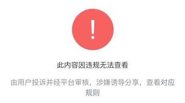
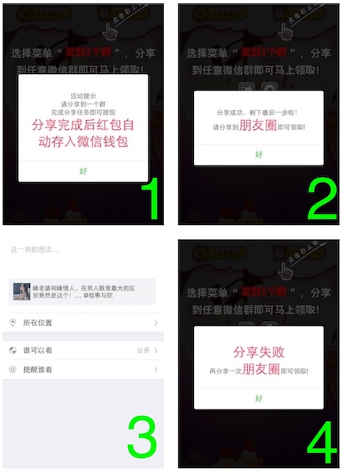
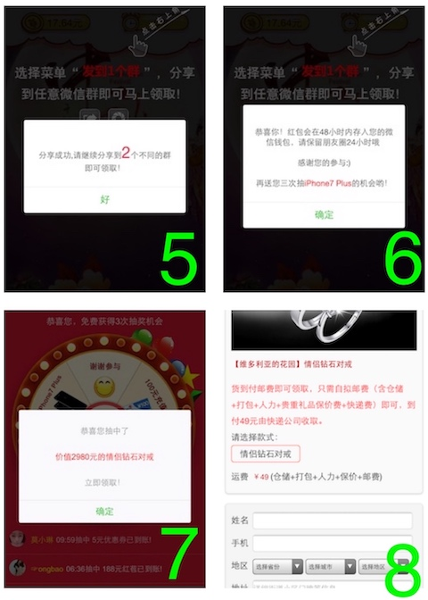
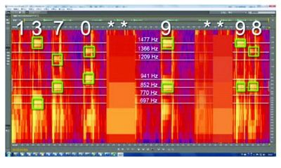
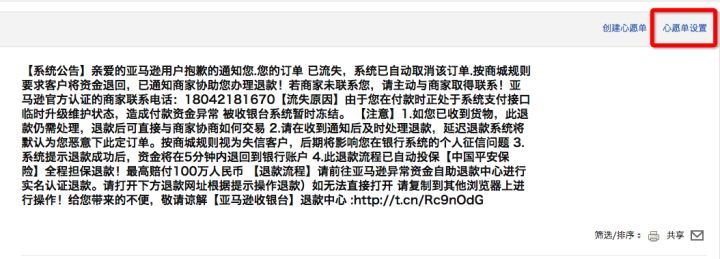
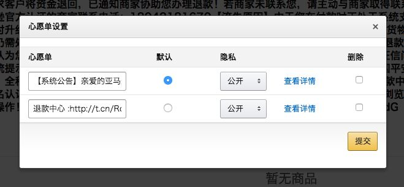
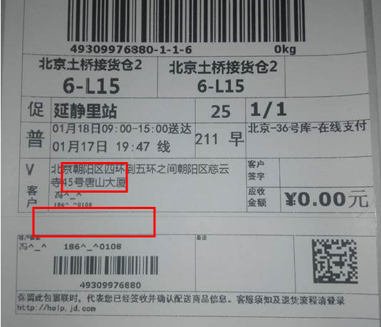
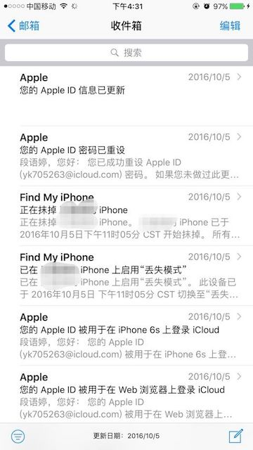

# 第十三章 社会化网络安全

## 13.1 社会化网络基本概念

`社会不仅是由于传递、传播而得以持续存在, 而且还应该是在传递、传播之间存在着。在共同、共同体、沟通这几个语词之间不仅存在字面上的联系，人们因享有共同的东西而生活于共同体，而沟通是使他们享有共同的东西的途径。` 这是美国早期传播学实用主义三大代表之一，也是芝加哥学派的先驱 **约翰·杜威** 提出的经典传播学论断。从这句表述中我们可以提炼出一个非常重要的观点：**沟通**。

在远距离通信还未发明的时代，人与人之间通过面对面谈话的方式完成沟通，通过教育、口口相传、书面记录的方式完成代际 **传承** 和沟通。在语音通信时代，人与人之间通过固定电话网络完成 **传播** 和沟通。广播电台、广播电视发明之后，单向的广播方式承载了「一对多」的沟通使命。在计算机网络出现之后，特别是覆盖全球的互联网普及发展，全球公民都能随时随地建立起沟通渠道，并在沟通内容的呈现形式方面经历了从单一到多样化的发展过程：语音、纯文字、富文本、图像、录播视频、直播/实时视频、VR/AR 等等。

本书把「社交网络」视作社会化网络的众多表现形式之一，特别是互联网时代的「社交网络」通常特指构建在互联网技术之上的各种社交应用搭建起来的人与人沟通网络。例如当前国内流行的社交网络应用包括了：微信、微博、抖音、快手等等，国外流行的社交网络应用包括了：脸书、推特、Instagram 等等。除了社交网络之外，各类基础电信和增值电信业务、电子商务也是社会化网络的重要组成形式。通过电子商务，世界各地的买家和卖家可以「在线」逛商场、讨价还价、下单支付完成交易的全过程沟通。而支撑和构建现代社会化网络的底层技术则离不开基础电信和增值电信业务，例如语音和数据传送服务、宽带接入服务等。

随着社会化网络运行历史越来越长，人们在网络上长期活动和沟通沉淀下来的数据越来越多，完全满足大数据的 [5V](../ds-security/why.md) 特征。和机器通信产生的大数据相比，社会化网络的“通信”主体是「人」，对应产生的数据具备额外的「隐私」性质。因此，相比较于计算机网络中已知的 **数据窃取** 威胁之外，**数据滥用** 和 **数据误用** 是针对「隐私保护」的另外 2 种常见的威胁类型。

## 13.2 社交网络安全

社交网络与计算机网络、互联网、广播电视网络、电信网络相比，首先也是具备网络拓扑性质，其次与这些由机器构建的技术型网络相比，社交网络连接的是人和人。因此，研究社交网络的安全问题，离不开对底层的支撑技术型网络的安全研究，社交网络面临的威胁也包括了来自底层支撑网络的各类威胁：例如拒绝服务攻击、数据窃取攻击、数据篡改攻击等等。本书前十二章内容都在关注以计算机网络为主的技术型网络中存在的各类威胁原理和安全防御方法，本小节专注于社交网络本身特有的三类威胁形式，通过一些具体案例来揭开社交网络安全的神秘面纱。

### 13.2.1 社会工程学与网络钓鱼

「社会工程学」（以下简称“社工”）在信息安全专业语境条件下泛指人们对执行行为或泄露机密信息的心理操纵。这与社会科学中的社会工程不同，后者不包含泄露机密信息。作为一种信息安全专业技术，“社工”是一种用于信息收集，欺诈或系统访问的信任技巧，它与传统的“骗局”不同，它通常是更复杂的欺诈方案中的众多步骤之一。它也被定义为“任何影响他人采取可能符合或不符合其最佳利益的行为的行为。” 所有社会工程学攻击都建立在使人决策产生认知偏差的基础上。这种认知偏差可以被称为“人类意识漏洞”。不同于网络与系统攻击利用的是软硬件漏洞，使用社会工程学进行攻击主要利用的是存在于人体的「安全意识漏洞」，但同时也会配合使用一些技术手段的漏洞利用技巧。[CAPEC-403](https://capec.mitre.org/data/definitions/403.html) 定义的就是“社工”。

常见的“社工”手段可以分为：钓鱼、窥视、垃圾搜索、反向社工、水坑攻击和诱饵，在不同的通信、网络和应用场景下，这些手段也有不同的演绎形式。

|   | 钓鱼  | 窥视  | 垃圾搜索  | 反向社工  | 水坑攻击  | 诱饵  |
|:-:|:-:|:-:|:-:|:-:|:-:|:-:|
| 电邮      | ✓ | ✓ | ✓  | ✓ |   | ✓ |
| 即时通信  | ✓ | ✓ | ✓  | ✓ |   | ✓ |
| 电话      | ✓ | ✓ |    | ✓ |   |   |
| 社交网络  | ✓ | ✓ | ✓  | ✓ |   | ✓ |
| 云计算    | ✓ | ✓ | ✓  |   |   |   |
| 网站      | ✓ | ✓ | ✓  | ✓ | ✓ | ✓ |
| 物理实体  | ✓ | ✓ | ✓  | ✓ |   | ✓ |

窥视是一种历史悠久的社工手段，例如在款台刷卡结账时，排在后面的顾客偏偏就要凑上来看你输密码，类似这种偷窥别人密码和想窃听别人谈话的这种行为就叫肩窥（shoulder surfing）。在高级持续威胁事件层出不穷的今天，电邮服务、即时通信、电话、社交网络、云计算、网站等运营商都可能被攻陷，攻击者可以通过网络和主机上的监听软件来窥视用户行为和保存在服务器上的数据。除了被攻陷情况下的外部威胁窥视，社工者通过主动应聘的方式成为这些网络服务提供商的内部工作人员，在已曝光的诸多监守自盗、数据转卖等事件中也暴露了社工者的身影。

“垃圾搜索”最开始指的是在企业的垃圾箱中搜索可能有价值的物品，所以归类到物理实体渠道。大数据技术的发展，从海量电子数据中进行数据挖掘也可以被视为技术手段的「垃圾搜索」。除此之外，盗取和敲诈勒索也是获取信息的一些简单粗暴方式。
社交手段。主要利用社会心理学技术例如恰尔蒂尼（Cialdini）劝说原则。例如经典的电信诈骗就主要是通过电话完成的，在新技术、新应用出现之后，即时通信、社交网络等催生了新型电信诈骗。为了提高社工攻击成功率，劝说者会在开始攻击之前努力建立起一个信任关系。

除了通过“劝说”来建立信任关系，身份仿冒是一种更快速建立信任关系的手段。例如通过钓鱼网站收集用户密码，再利用同一用户密码在多个站点重复使用的特点借助“撞库”攻击攻破用户在其他站点的账号。此时利用社工者就控制了一个一个真实的用户身份，再基于这些真实用户身份去欺骗他的“好友”将更容易获得信任。不仅如此，很多用户没有意识到自己在无意之中主动泄漏了自己的很多个人信息，搜索引擎和一些专用信息聚合工具（例如 Maltego）被社工者用来收集个人信息，社交网络、社交应用越来越成为社工者获取用户个人信息的重要渠道。社工者利用掌握的用户身份、兴趣数据在社交网络中建立仿冒用户去欺骗他的“好友”也会提高社工成功率。

“反向社会工程学”与主动联系受害者不同的是，反向社工会让受害者主动联系攻击者，通常包括 3 个阶段：蓄意攻击（制造问题）、广而告之自己有办法解决（增加曝光，提供联系方式，吸引受害者）和协助解决（取得信任，顺手牵羊）。

钓鱼邮件和即时通信钓鱼则是另一大类常见的综合了“劝说”和 IT 技术的社工手段，有别于垃圾邮件的广撒网，钓鱼邮件和即时通信钓鱼会更有针对性、目标接收者范围更小，进而发展出了“鱼叉式”钓鱼这一更细分的技术手段。

水坑攻击主要指的是社工者通过分析目标人的网站访问规律、兴趣，攻陷其中的一些网站、篡改网站内容、植入后门软件或主动攻击代码，当目标人访问到这些被攻陷网站时，由于目标人对被攻陷网站的已有信任会按照网页上的说明执行社工者设计好的欺骗操作或由目标人使用的浏览器自动执行其中包含的自动攻击代码，达到让目标人主动泄密、被安装远程控制软件等社工目的。

“诱饵（baiting）”作为社工手段之一，最早指的是在目标受害者可能出现的区域主动遗弃一个植入了恶意软件的移动存储设备，攻击者利用受害者的猎奇心理甚至会在存储介质上粘贴一个更具诱惑性的标签，提高受害者在捡到存储设备后插入目标计算机的概率。恶意存储设备一旦被连入目标计算机，就可以自动执行预置的恶意代码完成攻击。实际上，利用电子邮件附件、即时通信文件分享功能、社交网络的链接分享、网站上的文件替换植入后门等均属于“诱饵”社工。

下面我们“虚构”一个使用电子邮件附件进行社工的案例，在这个案例中我们将从社工者视角展示“技术”特性、“技术”漏洞和“人”漏洞是如何被组合利用来达到一次成功社工目的。

1. 社工者拿到了目标人的电子邮件地址（假设该电邮地址为 victim@target.com ）后打算实施一次「鱼叉式钓鱼邮件」社工攻击；
2. 通过对目标电邮的邮件服务器进行了一番安全测试，发现目标邮件服务器没有启用「发信人地址真实性检查」策略，社工者可以「任意仿冒 @target.com 的发信人地址」。根据对目标人所在公司门户网站的信息浏览，社工者打算冒充公司的系统管理员身份（ admin@target.com ）给目标人发送一封包含「恶意诱饵附件」的钓鱼邮件；
3. 在构造「诱饵附件」时，社工者基于前期对目标人的信息收集，了解到目标人的工作电脑上使用的文件解压缩软件是 WinRAR 4.20，该电脑的操作系统版本是 Windows 7 简体中文版；
4. 在搜索了一番该版本软件的所有已知漏洞信息后，打算基于「[WinRAR 3.80/4.11/4.20 版本的一个文件扩展名欺骗漏洞](https://www.rarlab.com/vuln_zip_spoofing_4.20.html)」来构建包含远控木马程序的压缩文件。目标人一旦在电脑上双击打开这个压缩文件后，在 WinRAR 的文件浏览器中查看到的「文件名」和「文件类型」都可以被社工者通过漏洞利用手段伪造成「安全的文件类型」，例如看上去是一个文本文件，从而提高目标人在 WinRAR 的文件管理器窗口里直接双击执行这个木马文件的可能性；
5. 如果目标人选择解压缩该文件后，再决定是否打开，则需要进一步在操作系统的文件浏览器中伪装木马文件的外观为「安全的文件类型」。此时，社工者首先将该木马文件的图标替换为 Windows 7 上默认的文本文件类型的图标，然后在命名文件时使用了一种特殊的 Unicode 元字符：'RIGHT-TO-LEFT MARK, RLM' (U+200F) 。正常情况下，目标系统里的文字书写和显示顺序为：从左向右。例如当我们看到 `readme.txt` 时，我们想到的是该文件的扩展名是 `.txt`。但是如果在文件名中注入 Unicode RLM 字符，在文件管理器中，这个文件看起来像是`readmexe.txt`，而实际上它的文件名为 `readm[RLM]txt.exe`。而由于 Windows 7 的文件管理器默认设置是「隐藏已知文件类型的扩展名」，所以上述 `readmexe.txt` 在被隐藏了已知扩展名 `.exe` 之后的实际呈现出来的名称为 `readm.txt`。对于可执行文件来说，文件图标替换修改是一个常规功能。所以社工者将可执行文件的图标用 Windows 7 默认的文本文件图标替换之后，无论目标系统是否开启了「隐藏已知文件类型的扩展名」设置，这个可执行程序文件看上去都像是一个普通的文本文件，目标人双击打开这个“文本文件”的概率是要大于打开“可执行文件”的；
6. 一旦目标人双击执行了上述「木马文件」，此次「鱼叉式钓鱼邮件」社工攻击就成功的完成了目标。

我们再次小结一下在上述虚构的「社工」案例里用到了哪些技术手段：

* 电子邮件发信人伪装
* Windows 默认的“隐藏已知文件类型的扩展名”特性
* Unicode 'RIGHT-TO-LEFT MARK, RLM' (U+200F) 
* WinRAR 4.20 版本的一个文件扩展名欺骗漏洞
* 可执行文件的图标替换修改

上述虚构案例里的「诱饵」文件实现效果展示本书做了一个录屏动画如下所示：

### 13.2.2 谣言

在中文词典里可以查到的谣言的释义大约有这样几种：1) [`没有事实而捏造的话`](http://www.zdic.net/c/3/15c/351873.htm)，2) [`为了达到某些目的，利用各种渠道传播的捏造`](http://dacihai.com.cn/search_index.html?_st=1&keyWord=%E8%B0%A3%E8%A8%80&itemId=1647948)，3) [`民间流行的歌谣或谚语`](http://dacihai.com.cn/search_index.html?_st=1&keyWord=%E8%B0%A3%E8%A8%80&itemId=512110) 。作为对照参考，谣言的英文单词 `rumor` 在剑桥词典里的释义为：`an unofficial, interesting story or piece of news that might be true or invented, and that is communicated quickly from person to person`。根据这些释义和我们对谣言的认知经验，我们可以总结出谣言的一些关键特征：

1. 内容特征：没有事实依据或有真有假（为了提高内容的可信度）的信息，往往具备明显的「话题性」和「争议性」；
2. 渠道特征：言论发布者、转载者均非官方权威渠道；
3. 传播特征：快速传播，类似网络空间中的蠕虫病毒传播；

谣言的传播有时只是为说而说，具有娱乐性，并无明显的利益动机，但在已经公开曝光的众多网络谣言事件背后，我们发现谣言已经成为一些利益集团用于恐吓营销、操纵民意和舆情、煽动民意的惯用武器。各种谣言的传播已经在事实上对社会和谐、经济发展和政治稳定造成了不同程度的负面影响，所以从网络安全学科特点出发，我们有责任、也有能力去参与到对谣言的治理活动之中。

谣言的内容特征识别问题是内容安全的一个重要研究方向，例如新闻内容的情感分析、多媒体内容的语义理解等均可以提高谣言内容鉴别的效率。通过建立安全可靠的举报和申诉制度，既可以让真正的谣言被广大正直、有鉴别能力的人民群众及时发现和报告，又可以避免恶意举报和申诉混淆视听。如下图所示是微信平台提供的针对微信内打开的网页内容的举报功能页面，如果选择举报网页可能包含谣言信息，在下一个页面里会出现「提交给微信团队审核」。对于曾经被鉴定为谣言的内容，基于机器学习技术的智能内容审核判定机制就可以代替人工内容审核更快的给出判定结果。否则，则会由专门的内容审核团队人工进行谣言鉴定。

目前主流的社交网络平台如微信、微博等均已开通各自的官方辟谣类帐号。例如微信的「微信辟谣助手」，微博的「@微博辟谣」，中央网信办（国家互联网信息办公室）违法和不良信息举报中心开通了[中国互联网联合辟谣平台](http://www.piyao.org.cn/)。在遇到谣言中包含的图片不确定是否是后期制作篡改的还是用的其他不相关新闻里的网图等行为，还可以通过搜索引擎的「以图搜图」功能，查一查原图出处，对于鉴别虚假新闻常常会收到奇效。

针对谣言传播的渠道特征，可以通过对媒体的严格有效监管来及时阻止谣言的继续扩散和传播。例如，2017 年 6 月 1 日起，[《互联网新闻信息服务管理规定》正式实施](http://www.xinhuanet.com/yuqing/2017-05/09/c_129596824.htm)，将各类新媒体纳入管理范畴。规定提出，通过互联网站、应用程序、论坛、博客、微博客、公众账号、即时通信工具、网络直播等形式向社会公众提供互联网新闻信息服务，应当取得互联网新闻信息服务许可，禁止未经许可或超越许可范围开展互联网新闻信息服务活动。

针对谣言的快速传播特征，可以充分利用大数据技术来及时发现舆情热点，结合内容审查来二次确认热点舆情内容是否涉及谣言。另外，通过对谣言的传播路径进行分析，可以定量评估谣言传播造成的影响范围，这对于谣言的制造者进行法律定罪提供了技术支持手段。[2013 年 9 月 9 日](http://cpc.people.com.cn/n/2013/0910/c87228-22871736.html)，最高人民法院、最高检察院关于办理利用信息网络实施诽谤等刑事案件的司法解释（下称《解释》）公布。该司法解释通过厘清信息网络发表言论的法律边界，为惩治利用网络实施诽谤等犯罪提供明确的法律标尺。《解释》规定，利用信息网络诽谤他人，同一诽谤信息实际被点击、浏览次数达到5000次以上，或者被转发次数达到500次以上的，应当认定为刑法第246条第1款规定的“情节严重”，可构成诽谤罪。

和网络安全的攻防对抗一样，谣言的制造者们也会不断学习监管者的谣言治理方法，不断尝试找到「治理方法漏洞」。例如，越来越多的谣言开始重视断章取义式的「引经据典」，重视「规范排版」，很多谣言甚至都会用到`图片 PS`技术来嫁接权威事实和杜撰虚构，让一些流传已久的「谣言鉴定科普」在这些升级版的谣言面前失效。所以，**持续对抗** 理念在谣言治理问题上也是需要坚持执行的。

### 13.2.3 恶意营销

在上一节我们介绍谣言的时候，提到过一个词：恐吓营销。恐吓营销，顾名思义，就是让消费者感受到对某种东西，或者是某种可能的担忧，从而促使他们购买了商家的产品。而这种担忧，往往来源于人性的弱点，每个人都会有的负面情绪。害怕生病，害怕变老，害怕自己的孩子学习不好，这是每个人都会想到的，而这些就成为了恐吓营销的内容设计关注点。恐吓营销这个术语本身其实是中性的，前提是向受众客观描述威胁和风险，但如果利用谣言夸大威胁影响和风险发生概率进行恐吓营销则属于恶意营销范畴了。

世界知名的营销学专家格隆罗斯对营销的定义是：`营销是在一种利益之上下，通过相互交换和承诺，建立、维持、巩固与消费者及其他参与者的关系，实现各方的目的。` 从这个定义中我们不难看出，恶意营销会破坏消费者及其他参与者（例如媒体、社交网络运营者等）的利益或正常运行秩序。所以，我们可以据此总结出几种典型的恶意营销行为：

1. 消费者被推销的商品是恶意（例如：劣质，价高，量不足等）的；
2. 滥用或过度消耗其他参与者和消费者之间的信任关系；
3. 过度套取或滥用消费者隐私；

对于第一种行为，和谣言类似，捏造事实、夸大效果，消费者的真实需求不能得到有效满足甚至还会带来负面影响，产生新问题等。解决这一类行为主要依赖于从商品生产和制造的源头上把关，质量监督和管理部门、行业和政府主管部门需要加大监督和市场准入制度建设和执行。

对于第二种行为，在社交网络时代的典型案例如：在论坛、贴吧、微博等社交平台用发贴机器大量发布垃圾广告贴，影响社区内容消费者的正常内容阅读体验，长此以往会让这些社交平台的用户对平台失去兴趣，转投其他垃圾内容少的平台。耸人听闻标题骗点击、蹭热点事件夹带小广告、博取同情心顺销（微信和微博上常见的“爱心传递”诈骗）等行为除了让营销制造者获利之外，从消费者、网民到社交平台运营方无一受益，甚至更多的时候是被欺骗、被冤枉等。以微信平台的投诉机制为例，专门针对「诱导分享」行为有封禁机制，目的就是为了避免恶意营销行为污染了朋友圈的正常用户时间线。

对于第三种行为，我们分享一个微信平台上的「诱导分享+裂变+诈骗+最后让你乖乖的送上自己的姓名、手机号和地址」案例。如下图所示：

在这个案例中我们可以清晰的看到恶意营销的作者一步一步的诱导用户，从诱导用户分享低劣低俗文章赚取点击量和推广费用，到用「货到付款」骗局既套取了用户隐私，还顺手销售给用户劣质产品。另外，“点赞诈骗”也是常见的过度套取消费者隐私的恶意营销行为。点赞诈骗主要分为两种，第一种是集满多少个赞就可以获得什么礼品或优惠，实际等你集满了要求的“赞”，去兑换礼品或领取免费消费卡时，发现拿到手的奖励“缩水”。第二种是商家发布“点赞”信息但需要填写提供姓名和手机号码，一旦所征集的信息数量够多，这种网站、公众号会自动消失，目的是套取更多人的真实个人信息。

至于滥用消费者隐私，则体现在一些营销手段还会通过黑灰产渠道直接购买目标消费者群体的隐私信息，再利用数据挖掘技术去分析出哪些是潜在消费者，分析他们的购物习惯、兴趣爱好和性格缺陷等，使用精准恐吓营销的方式来达到恶意营销目的。

恶意营销和谣言是社交网络中的两个相伴相生的毒瘤，谣言是恶意营销的常见手段，恶意营销加速了谣言的传播速度和影响范围。因此，社交网络安全治理必需重视谣言和恶意营销的防范查处。对于上述微信中的诱导分享方式的恶意营销案例，看到了就请顺手「举报」，共同构建和谐清朗的网络空间和社交网络。

## 13.3 电信诈骗与防范

### 13.3.1 网络听号诈骗

> 2011年5月，浙江王某在网上采购原材料，与对方签订了合同，并将定金付到对方的银行账号。之后，王某接到自称该公司送货司机电话，要求其办理建设银行的电话银行转账业务，待验货后，用电话银行支付余款，然后卸货。王某在办理了电话转账业务后，对方以测试电话银行转账业务是否正常为由，让王某先用电话向其指定的建行账号打款1元钱。接着，王某便在未挂断通话手机的情况下，使用固定电话的免提功能，让对方听到向其账号成功打入1元钱的操作。其间，对方多次称听不清楚。王某换了一只声音比较响的电话机再次操作，对方终于表示认可。而此后，对方王姓司机以天色已晚为由，推说第二天送货。当晚，王某建行账户中的资金被人分两次转走，总计81940元

作案人在与被害人通话过程中，通过录音设备偷录被害人使用固定电话拨电话银行的拨号音，然后对录音进行分析，破译银行账号和密码等数字。通过对固定电话拨号音进行语音分析，能够准确、快捷地分析出所拨的具体数字号码。无独有偶，2012 年 8 月 30 日，南京大学学生刘靖康突发奇想，利用视频中记者采访 360 总裁周鸿祎时视频中的拨号声音还原出了手机号码。

如上图所示是手机拨号音在专业音频处理软件中呈现出的波形图，从图上标注可知这种「网络听号」的基本原理是利用了固定电话和手机拨号过程中输入不同的数字会发出不同的声音，经过专业音频处理软件的处理之后就可以根据拨号音逆向分析出对应的号码了。

在了解到听号诈骗的基本原理之后，避免在语音或视频通话过程中使用拨号功能就是一个十分有益的建议了。

### 13.3.2 网络改号诈骗

> 杨女士收到一个自称某银行的电话告知自己的信用卡欠款逾期未还，需要在当天下午4点前还清。杨女士称自己的信用卡没有欠款，对方称杨女士可能涉嫌信用卡诈骗。并轮番冒充警方、检查院的电话对杨女士进行恐吓。为了洗脱罪名，诈骗分子让杨女士去开通了网银，并将密码器上的支付密码告诉诈骗分子，结果银行卡中的资金被瞬间转走44万元。由于目前资金已经被转到境外，所以仍然无法追回。

这是一起典型的冒充公检法的电信诈骗，利用网络改号软件冒充银行、公安局、检察院打电话给受害人，利用社会工程学原理取得受害人信任，然后以帮助洗脱罪名为由骗取受害人银行密码器的密码，最终完成转账，并迅速将款转移到境外。
 
由于这是一起利用高科技手段进行的诈骗，主要工具就是网络改号软件。网络改号软件要想最终在用户手机上显示篡改过的电话号码，是需要通过给“落地网关”预先设定好要显示的号码，设定完成后再通过运营商的“通信网络”发送至被叫网关，从而实现了来电号码的更改。

通过图解我们可以看出，其实诈骗分子通过网络改号软件进行改号的关键是在“落地网关”上，也就是说诈骗分子是通过网络改号软件在落地网关上将号码更改为“银行”、“公检法机关”等号码。不法分子购买这些“落地网关”设备后，然后接入了运营商的网络。

所以在日常生活中，即使接收到「官方号码」发来的短信、电话，也不能掉以轻心，避免点击短信中的链接，不要在电话交谈中泄漏自己的隐私信息和帐号口令等。在必要的时候，可以通过更换一个不同运营商的号码**回拨**「官方号码」的方式来验证来电内容。

在微信、微博等社交网络时代，伪造官方帐号、盗取官方帐号后发布诈骗内容也算是新型的「网络改号」诈骗行为了。

所以，在社交网络时代对于「身份」的真实性鉴别并不是仅仅根据号码、昵称、头像、加V认证等就能断定的，要「听其言、观其行、多源交叉验证」其言行。

### 13.3.3 伪基站诈骗

关于伪基站诈骗，知乎上的一篇文章[深度揭秘：伪基站短信诈骗产业传奇始末！](https://zhuanlan.zhihu.com/p/20694237) 深度分析了这个产业链的上下游各个环节的技术原理和商业模式。对于手机用户来说，伪基站造成的最直接影响有点类似于「网络改号诈骗」：不能仅仅根据主叫号码来判断是否是官方短信或官方来电。利用伪基站，也能任意伪造来电号码、短信发送号码。

当中国移动用户接到一条来自 10086 的积分兑换或中奖短信时，相比较于陌生号码发送的类似短信，自带官方身份背书的短信内容更容易让用户放松警惕，用户一旦点击短信中的链接就有很大可能掉入一个精心设计和组织的钓鱼骗局，甚至会被安装手机上的远程控制木马软件。手机上的远控木马软件最常见的功能之一就是“短信拦截马”：对受害者进行全程短信监控记录，用户银行卡转账的短信验证码、手机支付的二次确认验证码、忘记口令的重置验证码等等均会被自动拦截并发送给木马软件控制者。所以在很多手机网银被盗案件中，由于受害者的信息安全知识不足，无法完整描述自己的手机使用情况，总感觉自己手机没有问题、也没有点击过「陌生」链接、也设置了手机二次验证保护等，为什么还会“莫名其妙”出现资金被盗的情况。在案件告破之后才会发现，伪基站、手机木马是最常见的 2 类电信诈骗关键推手。

### 13.3.4 木马远控

在上一节伪基站诈骗中我们提到了手机木马的危害，实际上在智能手机诞生以前，针对 PC 的木马远控已经有了很多年的发展历史和技术积累。例如在钓鱼邮件中常会在一些文档类附件（例如：pdf、docx、pptx、xlsx、zip等）中植入后门代码，用于在受害者电脑上安装远控木马。下载站点中的盗版软件、破解补丁和黑客工具等，盗版篡改后的操作系统（包括手机上的第三方定制 ROM）镜像，均是木马的常见藏身之处。社交网络、论坛、新闻网站的评论区出现的评论内容中也会包含恶意链接，这和伪基站诈骗里常见的短信中包含的恶意链接属于同源性威胁。Wi-Fi 的出现，一方面方便了用户随时随地接入互联网，另一方面，用户会有更多机会接入到黑产精心设计和搭建的恶意无线网络。用户一旦接入了这种恶意无线网络，用户的所有联网流量都存在被中间人劫持风险，下载的文件可能会被替换、植入木马后门，查看的网页可以被任意篡改，上行提交的隐私数据可能会被窥视和窃取。

木马远控对于电信诈骗犯来说，可以大大提高自己远程操作和控制受害者的能力，受害者「眼见不再为实」，配合诈骗话术运用，电信诈骗的成功率会大大提升。所以，做好终端安全防护（例如保持操作系统和应用软件的自动更新功能处于可用状态，使用处在安全更新支持周期内的操作系统和应用软件版本，安装终端安全软件等）不仅是 PC 时代的一项基本信息安全常识，在后 PC 、移动互联网时代，甚至是即将到来的物联网时代仍然是一项行之有效、应当坚持执行的基本信息安全防护措施。

### 13.3.5 换号诈骗

> “我换号了 敬请惠存”
>
> 骗子：（发短信）“我是××，本人今起启用此新号码，原号码已经停止使用，敬请惠存，收到请回复，谢谢。”
>
> 事主：（回拨新号码）你是……
>
> 骗子：想起来了吧，这个是我新号，你记一下（然后挂断）。
>
> 第二天，骗子又打来电话
>
> 骗子：昨晚在广州叫小姐被查到了，能不能帮我打点钱过来，帮个忙。
>
> 事主：你是谁？
>
> 骗子：我小吴啊，你昨天没存我号码吗？
>
> 事主：哪个小吴，吴什么？
>
> 骗子知道骗不下去了，马上挂电话。
>
> “我换号了，敬请惠存”。先是以朋友名义通知换号，再要你“帮忙”。最近几天，有市民反映遭遇新型“换号骗术”：被骗子假冒自己，给手机里的联系人发短信，声称换了新号码，然后行骗被假冒者的朋友和亲戚。警方提醒，这依然属于冒充熟人的电信诈骗，只不过又进行了“升级”，通过非法渠道获得市民群众的通讯录资料，冒充事主向其手机里的联系人进行诈骗。“换号了，最好跟机主证实下！”
>
> 平日，我们更换手机号码后，都习惯通过群发短信告知亲友更改通讯录资料，方便日后联系。广州市公安局反电信诈骗中心最近几天通过警情检测发现，这个看似平常的动作，已经被诈骗分子盯上。市民稍有不慎，就会落入骗局！
>
> 最近几天，就有市民反映遭遇这种新型的“换号骗术”：被骗子假冒自己，声称换了号码，行骗被假冒者的朋友和亲戚，骗子号码以132开头。
>
> “我是××，我换号码了，你记一下我的新号码……”收到这样一个陌生号码的短信，你可能并不会在意，现在不少人有几个手机号，换个号码是很正常的事情，于是，留存下来，将陌生号码存为你熟悉的朋友名字。
>
> 过几天，这个新号码又会发来短信：在忙什么呢？有事请你帮忙。一看是手机里存的朋友或亲戚名字，热心的你也许马上会回复：什么事情需要帮忙，虽然说。
>
> 接下来，就是老套的骗局台词：“我生病了，你资金还充裕吗？我周转不过来了，想问你借下，最晚下周还你……”或者是新的剧本“要求帮忙转账，帮忙购买机票之类的”，然后就是套路了。如果事主不打电话核实，说不定就会上当受骗。

换号诈骗不仅存在于电信网络，微信上也存在类似的诈骗手段。诈骗者往往会通过一些信息收集手段，在确认「原版」帐号暂时不可用状态（例如可以通过盗号改密码、恶意投诉等方式让目标帐号暂时无法使用）之后，用「山寨版」帐号去添加「原版」帐号社交关系网络中的好友，加好友的理由就是冠冕堂皇的「换号」。对于一些警惕性高的人，可能会试图联系「原版」帐号并发现确实无法联系了，则会相信骗子的「换号」加好友请求的真实性。一旦「换号」加好友成功，后续的骗局展开就和电话换号诈骗如出一辙了。

## 13.4 电子商务网络安全

### 13.4.1 消费端

亚马逊中国的[心愿购物单](https://www.zhihu.com/question/28173417/answer/122551812)功能曾经被网络诈骗团伙用于钓鱼套取网银交易账密信息。骗子（可能是通过“撞库”的方式）拿到了受害者的亚马逊帐号密码，登录了受害者的帐号修改了「心愿单」设置，添加了一个文本内容为「系统公告」的心愿。再照着受害者最近一个订单重新下了一个订单，然后拨通了受害者电话开始以「交易异常」为理由展开电信诈骗。

骗子之所以在拿到受害者的电商平台帐密之后依然不满足，还要设计一系列复杂的骗局继续行骗，主要原因就在于关键的支付环节帐密并没有被骗子拿到。这也说明个人口令管理应该有分级意识，对于涉及资金操作的口令应独立于登录口令。另外，应避免在绑定了短信二次验证手机号的手机上同时登录资金交易帐号，避免双因素认证机制被单因素化：接收验证码短信和输入口令都是在同一个手机设备上完成的。

电商购物后进行晒单评价是很多人表达对商品的喜爱或不满的一种常见行为。早期的电商平台默认评价设置都是完全暴露消费者的昵称和头像的，一些网络爬虫会抓取并分析这些评价数据，进而建立起不同消费者的消费行为用户画像数据库。后续，这个用户画像数据库往往会被出售给广告商或商家，用于精准营销。随着民众对隐私保护的认识提高，电商平台开始推出匿名评价功能，甚至主流电商平台目前默认的评价设置就是匿名评价。但不同电商平台的匿名机制设计上存在着差异。有针对其他买家和网络爬虫的匿名实现方案：用户昵称首字母和尾字母是固定的，中间所有字符采取星号遮蔽方式。也有针对包括卖家在内的除平台运营方之外所有人均匿名的实现方案：每一次显示的用户昵称都是随机的首字母和尾字母，中间所有字符同样采取星号遮蔽方式。相比较而言，后者的匿名评价方案对隐私的保护程度更高。

建议消费者在电商平台进行晒单评价时，首先一定要启用匿名评价。其次，避免在晒单图片和视频中泄漏个人隐私、家庭地址等。最后，定期修改昵称和头像，也有助于提高第三方爬虫收集和统计追踪用户的难度。

对于网络购物来说，填写的收货地址和联系方式信息也存在卖家或物流公司泄漏隐私的可能性。这时候，第三方代收货平台（例如菜鸟驿站）和收快递专用“小号”（例如阿里小号、电信的天翼小号等）就成为了挡在消费者真实家庭地址和联系方式之前的一道替身。

和微信平台上的“点赞诈骗”、“中奖诈骗”类似，电商平台上也有“延时发货骗局”：骗子开了家新网店，然后在各种特价的社区之类宣传他的一款非常划算的商品，关键是付款和发货之间有时间差。这个在商品描述里会写明，比如声称这批海淘的货物现在还在路上，所以要大约一个月之后才发货，那时候才会改成“已发货”状态，明确说没耐心等的不要下单，下单后也可以点击退款。然后消费者觉得既然不是“已发货”状态，就不会自动打款，想点退款也能退回，很安全啊，就下单付款了。等了一个多月还没发货，这时候这款商品的销量已经很高了，搜索结果按销量排序时排名靠前，全是前期冲着低价下单的买家帮他冲的销量。这时候骗子把价格改高，按销量搜索进来的新买家一旦按高价下单，骗子就会给高价买的人真的发货。而低价买的人？一律不发，等消费者自己退款。后续甚至发展出了：「低价付款抽奖，不中奖退款」的套路。对于卖家来说，除了吸引到流量、提高店铺自然搜索排名之外，免费收集买家的联系方式信息也是一个不可忽视的目的。所以，收货地址和联系方式使用替身信息就很重要了。即使替身手机号泄漏了，也可以更换小号。当然，收快递专用“小号”一定不要绑定任何网络帐号和交易帐号，也不要用于除收快递以外的任何其他通信联络场景。只有这样，小号的更换才能做到随心所欲、没有后顾之忧。

在收到快递送来的商品之后，很多人选择随意丢弃包裹外包装。殊不知随着包装一起被遗弃的还有贴在上面的包含你联系方式信息的纸质快递单，我们在[13.2.1 节介绍过的「垃圾搜索」](#1321-社会工程学与网络钓鱼)就是在人们的日常遗弃物中搜寻有价值信息的一种常见社工手段。所以，如果不是用的收快递专用小号，那么请销毁快递单上的隐私信息后再丢掉废弃的快递单。京东从 2016 年 6 月份开始试行“微笑面单”，利用技术手段从包裹生成时即部分隐藏用户的姓名和手机号信息，以笑脸（^_^）代替，以一种更温情化的方式有效保护用户隐私。如下图所示：

国内其他快递公司，如顺丰的[丰密运单](http://www.xinhuanet.com//fortune/2017-10/22/c_1121838667.htm)，阿里旗下物流数据平台菜鸟网络，2017 年 5 月中旬联手EMS、百世快递、中通快递、申通快递等，共同推动使用“隐私面单”，将面单上用户电话号码的中间四位用符号*代替。这些措施都是针对物流环节原先的隐私泄漏风险进行改进和加强保护，体现了整个物流行业在对待用户隐私问题上的重视和进步。

如果自己没有网购下单，却突然收到一个“珠宝”快递要求支付运费即可签收你会怎么选择？类似的，有人以[厂家测试的名义免费送一对号称价值近千元的高级羽毛球拍，限量300副，只需支付“运费”即可](https://mp.weixin.qq.com/s/Qg_s5bXPk0MylxDWuAbllg)。其实这些都是我们在[13.2.3 恶意营销](#1323-恶意营销)一节介绍过的「诱导分享+货到付款」骗局变种，类似的案例还有[圆通快递到付骗局让人哭笑不得：做工粗糙的财神不请自来](http://tech.sina.com.cn/i/2016-10-18/doc-ifxwvpar8323456.shtml)。

可见，消费者在享受电商购物带来的便利性和物美价廉同时，也要小心无处不在的骗局和陷阱，提高隐私保护意识，掌握安全防骗技能，时刻关注和学习最新的骗局案例，不断更新和完善自己的防骗能力。

### 13.4.2 企业端

对于电商生态的企业端而言，评价管理、库存管理和价格管理中均存在风险管理需求。

随着电商行业的快速发展，营造好口碑成为企业发展壮大的一个重要助力手段，商品的评价、评分会影响店铺的总体评价和评分。而消费者在进行购物决策时，会特别重视店铺和商品的评价、评分。企业在收到用户差评后，都会想尽办法联系上用户，尝试找到解决用户差评的原因并寻求得到用户谅解和理解，进而期望用户删除差评或改为有正面和积极态度的评价。职业差评师正是看中了企业对差评的「恐惧感」，而利用差评为手段勒索企业或帮助企业的同行进行恶性竞争。因此，恶意差评的管理是电商企业不可忽视的一项工作内容。例如，淘宝针对恶意差评管理在淘宝大学推出了新手卖家成长计划：[有效解决中差评](https://daxue.taobao.com/markets/daxue/tuikuai)。电商平台对于恶意差评的识别和管控负有重要的治理责任，面向企业的完善、有效申诉机制是构建健康发展电商生态的必要途径。

和网络和系统中存在的拒绝服务攻击类似，库存管理就是对「有限资源」的管理，而有限资源的存在就是拒绝服务攻击最喜欢的目标。企业在每年的各类电商大促时，经常会遇到爆款商品被「秒完」的情况。如果是被真正的消费者下单买走了倒是一件好事，但如果是被同行恶意拍下大量商品不付款、造成商品被拍完自动下架无法继续销售从而干扰店铺正常交易呢？这时候就只能通过电商平台的申诉渠道，尽快提交申诉并撤销这些恶意订单，恢复商品库存。对于电商平台来说，非正常用户和非正常用户行为的识别和限流拦截是一项需要持续改进的工作。

2008 年，[戴尔错标超低价遭疯抢，律师认为应履行合同](http://finance.people.com.cn/GB/6935798.html)。对于电商平台上的商品，一旦上架销售，就可能会被来自世界各地的消费者「秒光」。因为电商平台的购物下单是全天候、不分昼夜都可以进行的，商家工作人员有上下班时间，但购买是用户自助随时可以完成的。对于价格管理来说，错标低价很可能会导致商品被羊毛党闻讯而来一抢而空，商家很难以一句「价格标错」了而毁约订单。如果正常发货，则商家往往损失惨重。因此，价格管理往往意味着需要企业严格执行工作流审批制度，定价确认需要经过层层审核，避免一键直接上架而带来的标错价、亏本价的风险。

### 13.4.3 平台端

网络购物不确定买哪家时，不少买家会搜索一下看看排行来选择。现在电商平台至少有两种排序：综合排行和销量排行。两种都离不开销量这个重要参数。但这个设置却让不少网店打起了“刷单”的主意--他们主动找一些人来帮忙，让自己网店的销售量和好评率上升。

对于电商平台来说，刷单现象的出现，一方面会导致商家原本应该支付给平台运营方的广告费用预算被用在了刷单上，造成平台收入下降。另一方面更重要的原因是，现在的平台型电商如淘宝、天猫、京东等，都十分重视「数据驱动」商业模式。如果放任刷单行为泛滥，会导致平台收集到的数据质量、真实性大打折扣，进而影响所有基于「数据驱动」产品和功能的开发和改进。举例来说，消费金额和次数本来是最能体现消费者购物能力和欲望的两项指标，但如果放任刷手和刷单行为肆虐，平台将无法给广告主、大卖家推荐有真实购买力和购买意愿的消费者。如果对于购买了平台方推广增值业务的卖家来说，如果订单转化率达不到预期，客户还会持续投入推广费用吗？再举一例，很多商家为了促销，会举办一些抽奖活动。如果中奖用户被发现都是薅羊毛党、刷手，从商家到消费者，谁会满意呢？所以电商平台需要具备数据真实性鉴别能力，对于虚假数据、虚构用户、薅羊毛行为具备过滤和限流能力，才能让商家和消费者在网络空间、电商平台上享受到公平公正的交易环境。

综上所述，电商平台对于刷单和炒作信用的行为是零容忍的。为了打击刷单行为，阿里巴巴组成专门项目组，横跨搜索风控、算法技术、客满申诉、安全、平台治理、招商、行业、法务等多个部门。技术上充分汲取了来自对抗智能团队的反作弊算法，模型识别出可疑订单后，会将涉及商家的信息及时反馈给搜索和申诉团队，然后人工初审，在初审完成后，再一次复核，最终根据刷单情节严重程度，给予警告、降级、清退等不同程度处理。2018 年以来，阿里巴巴共监控到 2800 多个炒信平台，包括刷单 QQ 群 2384 个，空包交易平台 290 个，刷单交易平台 237 个。

对刷单行为的判断，电商平台掌握的线上数据只是一部分，打击刷单行为，还涉及快递公司、监管部门乃至司法机关等，电商平台并没有执法权，只能根据数据判断对违规卖家作出处理，但对于刷单公司、违规快递公司，就没有什么办法了。

由此可见，形成合力是打击网购刷单的关键。需要多部门联合管理，从线上游戏规则到线下监管，从政府部门到平台、商家乃至用户共同努力，工商部门、消费者权益保护部门、市场监督管理部门乃至公安部门，可联合探索出一套打击刷单机制。此外，也应该警惕“反向刷单”现象，有些卖家恶意给竞争对手刷单，故意触发平台监测，由此打击竞争对手，这些现象同样需要重视。

## 13.5 网络勒索

提到网络勒索很多人的第一反应是「勒索病毒」，例如[2017 年 5 月 12 日爆发并席卷全球的 WannaCry 勒索病毒](https://www.leiphone.com/news/201705/0017G1NYHw67C5Pb.html)。或者是通过社工的方法，掌握了被害人的一些隐私信息之后，通过即时通信工具或电子邮件等方式发起勒索请求。本节我们将分享一个「另类」的[网络勒索案例](https://www.zhihu.com/question/28173417/answer/127980492)：

骗子在社交软件上冒充美女去勾搭男性用户，和常见的「红包骗局」不同的是，骗子并没有要求受害者发红包后然后再同意发视频或照片。骗子在了解到受害者使用的是苹果手机之后，竟然主动提供了自己的苹果帐号和密码。并告知受害者：在自己的苹果手机上登录骗子的苹果帐号和密码后，可以通过苹果的 iCloud 功能查看骗子储存在云端的相册。听起来，受害者没有任何损失，还白得一个苹果帐号和密码，难道不是骗子，是诚心诚意模范网友？事实证明，骗子计划的是利用苹果 iCloud 的远程锁定手机和抹除设备功能，当受害者一旦在自己的苹果设备上登录骗子的 iCloud 帐号，骗子就可以通过 iCloud 先远程锁定受害者手机，然后给受害者发送勒索消息：付款 XXXX 元到 YYY 帐号，否则抹除受害者手机上所有数据。

好在本案例中的受害者有着良好的安全意识，拿到骗子发过来的帐密并没有在自己的苹果手机上登录。而是登录了骗子的帐号绑定的苹果邮箱，在邮箱中果然发现了骗子之前的作案证据，进而推测出了骗子的行骗动机：

所以在网络空间的社会化网络中，控制好自己的欲望，要遵循阳光、健康、公平、合理的社交准则。超出期望的社交活动和行为，往往意味着骗局。

## 13.6 大数据应用与隐私保护

2018 年 12 月 19 日，美国华盛顿特区司法部长就剑桥公司丑闻正式起诉Facebook。这是在剑桥分析事件曝光九个月后，这家社交媒体巨头面临美国监管机构的第一次重大谴责。除了剑桥分析，2018 年 9 月，该公司被爆由于安全系统的漏洞，导致该公司网站受到黑客攻击，近 5000 万用户信息的泄露；2018 年 12 月 15 日，Facebook 公司又宣布，由于一个软件漏洞，可能导致 6800 万用户的私人照片遭泄露。

2018 年 12 月 20 日，Facebook又被《纽约时报》爆出数据共享方面的丑闻：Facebook 与其他科技公司签订了数据共享协议，多年来一直在向全球 150 多家大企业提供用户个人数据。

社会化网络相比较于计算机网络上传输和沉淀下来的数据相比，隐私数据是社会化网络中最主要的一类大数据。即时通信工具、电子邮件、电商的订单和消费数据等均涉及用户隐私，而现有的技术架构方式里，这些数据除了在通过计算机网络传输时会强制采取加密措施之外，在终端处理和存储时均普遍采用的明文方式。从用户的角度来看，当前数据安全（特别是隐私数据），至少包括以下三方面风险：

1. 数据窃取风险。2013 年斯诺登事件的曝光让越来越多的人认识到：数据除了被来外部黑客的入侵窃取之外，也可能被内部工作人员监守自盗。按照以往安全行业的基本共识，来自外界的安全威胁只占三分之一左右，三分之二的安全威胁是从组织内部发起的。根据我们的调查，在一些特定行业中内鬼窃取数据的比例还要更高。然而迄今依然有很多人把防范外部数据窃取作为数据防窃取的全部内容，而忽视对来自内部的攻击应对。仅仅强调用户侧应用软件的安全、数据通信过程加密、防火墙设个大门等，以为门外管好就行了，这是远远不够的。
2. 数据滥用风险。主要体现在用户对保存自己数据的服务方不放心，担心他们会滥用自己的数据。用户的数据在服务提供方那里，他们的员工会不会滥用权限、随便访问用户数据？他们会不会因为好奇或者朋友要求去看某个用户的个人信息？他们会不会把用户的个人信息倒卖出去？数据服务提供方会把哪些数据共享给他的合作伙伴？这些合作伙伴有能力保管好获取到的这些共享数据吗？和通过内部网络攻击窃取数据的行为不同，这里说的是服务方工作人员在授权范围内从事了不符合业务场景的数据访问。例如，用户要求客服帮忙，客服人员在这种场景下访问该用户的数据解决其问题，这是正常的业务场景。但是如果没有用户请求，客服人员擅自访问用户数据，就属于滥用行为。在大数据时代，数据和业务都在高频产生和变化，若对每一次数据访问行为都重新进行权限申请与审核，将直接扼杀业务，用户也无法接受这样的效率。因此数据安全的工作需要包括对数据滥用行为的识别、报警甚至阻止，并且有制度保障对实施滥用行为的员工进行严厉制裁。从目前曝光的数据黑灰产案件中看到，大量案件都是通过买通内部人员滥用数据权限进行数据倒卖的，而这些情况都是案发之后才被调查发现，说明这方面能力的欠缺。
3. 数据误用风险。主要体现在大数据加工使用的过程中会不会侵犯用户利益，也就是很多人谈之色变的“用户画像”、“精准营销”、“大数据杀熟”等。在各种描绘大数据给人类带来美好机会的故事中，实际上都离不开精准的个性化服务。而这些故事已经在金融、健康、医疗、教育等很多领域中开始切实发生，甚至在制造领域也在快马加鞭地发展，未来所有的领域都会走到这一天。这种精准的个性化服务的背后其实就是“用户画像”、“精准营销”这些大数据加工技术。技术本身是中立的，关键在于技术被如何应用。“精准营销”是被用来“杀熟”还是用来更好地满足用户的个性化需求？“用户画像”是用在支持个性化服务或者保护用户安全，还是用在满足其他不良动机？在大数据分析加工的过程中，有没有人能够从中窥探到某个特定人的个人信息或者隐私？这些是防误用的内容。当前的技术和管理总体上能够控制大数据加工过程中的误用，使人们在享受大数据带来的好处的同时，把危险关在笼子里。但是现实中，还有很多企业和组织在发展的过程中忽略了这个问题，让用户感到大数据是个恐怖的恶魔。数据防误用的问题，现在被关注得更少。

大数据时代下的数据安全是一个全新的问题，无法简单地用原来的安全方法来解决。这主要体现在以下两个层面。

一是不能用“以系统为中心的安全”思路解决问题。以系统为中心的安全是大家熟悉的安全方法，例如看某个软件、某个服务器或某个手机终端安全与否。这主要是看这些系统在各种人为干预下是否会出现与预期设计不符合的功能，从而导致运行状态失控。如今，数据要在不同的系统之间流动，若某个系统出了问题，可能影响到当时在这个系统中的数据（包括被窃取），但这些数据也可能在别的系统中出问题。数据本身并不存在运行状态，数据出问题的概念和系统出问题的概念也不同。这两者的关系，有点像医院里“心血管科”和“血液科”一样，前者解决的是血液循环系统本身的安全（运转正常），后者则是要保障血液自己的安全。两者显然有关系，但又有很大不同。单个系统的安全并不等价于数据的安全，系统被入侵也不等于数据一定会被偷走，每个系统都固若金汤也不等于数据就不会被滥用或误用。解决数据自身的安全问题，需要切换到“以数据为中心”的安全思路上来。

二是不能用传统的“数据安全”方法解决问题。数据安全是最古老的安全概念。从古代战场上就产生了数据安全的需求，并推动了相关技术的不断发展。对一个文件、一个数据库的记录的保护等都是数据安全的概念。但是，如今的数据安全的概念和方法已经和过去完全不一样了，数据的存在形式、使用方式和共享模式与过去有了极大的变化，数据的权属也不都是数据处理者的。数据可能以文件、记录、字段等方式在不同的环节中被快速打散、重组、流动，在这个过程中还会源源不断地产生新的数据。在一个业务里，数据可能涉及很多设备、服务器、产品、用户和不同部门的人的信息，然而真正需要回答的是数据在这么复杂的全过程流转中，从用户的角度来说安全不安全？显然，这和传统的“数据安全”概念有很大区别。

用数据安全的“能力成熟度”而不是安全风险来衡量一个组织的数据安全能力，能够更好地适应风险的变化情况。如果能力不够，即便今天做到了合规或解决了已知风险，明天出现新规、产品变化、威胁手段变化等还是会导致不合规或风险失控。因此，能力成熟度是更加内在的指标。通过科学的方法衡量一个组织的数据安全能力成熟度等级，用这个等级决定一个组织能够做什么、不能够做什么。当用户选择一个服务的时候，可以根据服务方数据安全能力的等级，判断把自己数据给到对方的风险大小，若可以获得同样功能的情况下他们会更愿意选择数据安全能力成熟度等级更高的服务方。在数据共享、交换、交易、流通的过程中，可以通过双方数据安全能力成熟度等级的情况分析数据风险的变化，发起方可以据此决定是否要继续与对方进行数据流动。政府建立多部门数据共享流通促进大数据利用的机制时，可以通过组织的数据安全能力成熟度级别决定允许数据流动的方向，从而实现总体数据安全风险可控。

能力成熟度的概念如今在很多领域中被使用，而阿里巴巴经过 3 年多的数据安全实践积累，制定了数据安全能力成熟度模型（Data Security Maturity Model, DSMM）。该标准已经是全国标准化委员会的报批稿，并且也在ITU、ISO等国际标准化组织中通过或者立项。

数据安全需要多方面工作的协同。仅仅靠法律法规解决不了数据安全问题。因为无论怎么样都会有数据进入服务方，法律能解决数据来源的合法性，但不能解决这些合法获得的数据是否会被安全保存或安全使用；过去的信息安全行业管理经验不适用。今天的数据安全是全社会全行业的事，过去把安全行业当作特种行业进行管理的思路是行不通的；很多数据安全前沿技术还有待突破。

数据安全需要政策、技术、学术的结合，需要多方参与形成治理模式。另外，这个领域才刚起步，需要创新和持续改进。在今天的发展速度下，没有办法给出一个完美的方案以后再执行，只能是小步快跑，不断迭代。DSMM 中最高能力级别要求的也是持续改进的能力，即不断发现新的问题，不断调整自己，这是最高的能力要求。

# 参考资料

* [李刚、朱文：“社交网络”网络安全几何](http://theory.people.com.cn/n/2014/0807/c387081-25423024.html)
* 康乐 荆继武 王跃武. 社会化网络服务中的信任扩张与控制[J]. , 2010, 47(9): 1611-1621.    
* [网络安全和社会化学习](http://blog.sina.com.cn/s/blog_7a3084820100wadk.html)
* [社会化网络媒体有哪些？](http://www.yanghonglin.com/index.php/archives/212)
* [社会化网络的核心，信息内容设计（上）](http://ued.ctrip.com/blog/core-of-social-networking-content-design-top.html)
* [你遇到过的最高明的骗术是怎样的？如何识穿？](https://www.zhihu.com/question/20443079)
* [有哪些需要提高警觉的网络诈骗案例？](https://www.zhihu.com/question/28173417)
* [你经历过怎样的骗局？](https://www.zhihu.com/question/29675892)
* [信安武林 | 我走过最长最远的路就是你的套路](http://sec.cuc.edu.cn/CUCIS/post/two-factor-authentication-hack)
* [杜跃进：数据安全治理的几个基本问题](https://mp.weixin.qq.com/s/Pe2awsWdEMCVyn1A4lAjJw)

