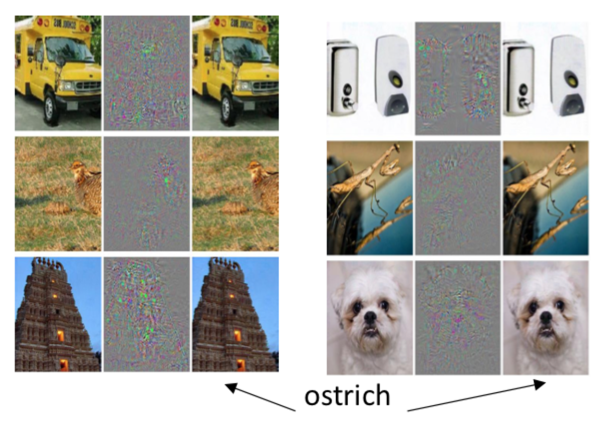

# **数据驱动安全**面临的挑战

由于机器学习在图像识别、语音识别等领域的应用已经获得显著成效，在广义信息安全领域机器学习应用已经做出了一批代表性产品，主要包括：内容安全（智能鉴黄、非法网页检测）、身份认证安全（刷脸登录）、金融交易风险控制和管理（芝麻信用、银行的风控体系）等。在这些成功案例的背后，我们也应该冷静的分析一下目前机器学习以及数据驱动安全方法论所面临的一些风险和挑战。

## 安全攻防领域的应用挑战

标记数据获取成本高，难度大导致网络安全领域的标记数据非常稀有：相比较于在图像识别、语音识别等领域更容易获取标记数据，安全攻防领域能标记数据的人只有安全专家，获取标记数据的人力成本和时间成本更高。

不同于真实世界的图像、语音识别处理的是从真实物体、物质经过数字化之后得到的数据，网络空间的行为识别与分类要处理的对象本身就只有数字化的载体：二进制数据。攻击者在真实世界伪造图像和语音需要经过从数字化到实体化再回到数字化的过程，而且可能还会面临一些图灵测试（例如人脸识别过程中的张嘴、转头等挑战动作检测）、**真人现场监督和实时录像存档**等挑战，数据伪造和污染成本较高。攻击者在网络空间伪造和污染数据更容易通过软件自动化和规模化，这对于现有机器学习算法来说是一个巨大挑战。

网络空间安全攻防手段持续更新改变，模型调参耗时赶不上。调参分类模型通常需要调很久才能够训练出来一个比较准确的模型，我们需要考虑攻防手段是不是能和花费的时间匹配上，攻击方完成一次攻击留给防御方“调参”的时间能有多少。

张钹院士在2017年7月31日在清华大学举办的“人工智能与信息安全”清华前沿论坛暨得意音通信息技术研究院成立大会上做了精彩的分享[《深度学习与信息安全，如何从“事后诸葛亮”到“防患于未然”？》](https://mp.weixin.qq.com/s/6L5B2DuZLTSnSr_TSamoyg)，其中对于AlphaGo的成功做了非常精辟的分析：

> Alpha Go大家讲的非常多了，有些地方宣传得有点神秘。实际上，下围棋这件事对计算机来讲是不难的，对人来讲倒有些难。为什么对计算机来讲不难呢？因为它满足以下四个条件：**确定性**、**完全性**、**问题边界清晰**以及**有大量的数据和经验**。凡是满足这四条，对计算机来讲都比较容易，尽管这个问题可能非常复杂，但是计算机处理信息的速度比人快，因此做起来比人容易。过去为什么觉得难？因为没有找到一个合适的办法，因此过去的围棋程序只能跟业余棋手下，错在我们使用下象棋的方法来下围棋。

> 下象棋是利用知识与经验的推理过程。马这么走，大师们能说清楚为什么这么走。围棋不然，白子为什么落在这个地方？说不清楚，这是一种棋感或直觉。所以深蓝打败了卡斯帕洛夫，不是计算机打败了人类，而是大量的大师在一起打败了一个大师，因为编制和调整象棋程序时有很多象棋高手参与，包括利用了卡斯帕洛夫过去下棋的经验，所以深蓝实际上汇聚了许多大师的智慧，包括卡斯帕洛夫的智慧在内，打败了卡斯帕洛夫。

> 围棋不是如此，围棋的编程人员最高的是业余五段，少数懂得一点围棋，大多数人不懂围棋。所以Alpha Go打败了李世石或其他冠军，是真正意义上机器打败了人。

对照上述4个条件关键词：**确定性**、**完全性**、**问题边界清晰**以及**有大量的数据和经验**，安全攻防领域的应用普遍无法完全具备这4个条件。机器学习算法在其他领域获得的成功，如果希望能直接复制和移植到安全攻防领域，依然需要做很多具体的测试和改进工作。

## 现有的机器学习算法本身依然面临一些挑战

大量的机器学习算法是在封闭静态环境中训练和测试的，数据样本属性和类别相对固定，数据样本分布基本相同，性能评价指标相对单一。这些实验室中训练好的算法一旦拿到真实场景中去应用，将面临的是开放动态环境，样本属性和类别都会有增减，样本分布会有更多变化，并且最终的性能评价指标更加多样化。以深度学习技术为代表的一大类机器学习算法目前就普遍存在着**鲁棒性差**或**推广能力差**的缺陷，当机器学会判别若干攻击方法之后，如果攻击方法稍加变化，机器就判别不了。

除此之外，对于直接拿来现成机器学习算法（特别是深度学习算法）用于安全领域应用的做法，还面临着**算法黑箱，模型缺乏可解释性** 。很多机器学习 算法都有算法黑箱的性质，它训练出来的模型只是有统计上的准确，并不能说它有安全意义。从软件安全的角度来看，一个既无法通过形式化描述刻画的程序，也无法通过系统化安全测试的程序，一定存在较大的系统安全风险。一旦机器做出错误的决策、错误的判断，人无法进行纠正，因为他不能理解（解释），这一点非常危险：这可能就是一种通常意义上的“错误的安全感”，与此同时，系统已经被入侵和控制、数据已经被窃取和篡改，管理员还以为天下太平。

## 隐私保护束缚数据获取和使用

> [深度学习 AI 正在或者将会变的违法](https://zhuanlan.zhihu.com/p/28845194)。收集 28 个欧洲国家公民数据的人或公司应在 2018 年 5 月 25 日起遵循《一般数据保护条例》（GDPR），届时欧洲的一些 APP 将被禁止使用深度学习，这导致初创公司拼命寻找深度学习的替代方案，否则将面临罚款的危险。罚款金额为全球营收的 4%，包括美国部分。关于自动化决策的 GDPR 要求深度学习具有解释其决策的能力，防止基于种族、观点等的歧视的发生。类似于 GDPR 的法律已在全球广泛制定，这只是时间问题。《美国公平信用报告法》要求披露所有对消费者信用评分产生不利影响的因素，数量上限是 4 个。深度学习的因素可谓海量，而不仅仅是 4 个，如何将其简化为 4 个呢？

一方面，不管是采用哪种人工智能分析方法，采集数据、获取足够多种类和数量的数据样本是改进和提高“学习”模型的必要措施。另一方面，越来越多的国家和行业监管部门开始意识到公民个人数据除了蕴含的价值之外，还面临着严重的隐私被滥用和侵害的风险。例如，[2017年8月24日，为落实网络安全法对个人信息保护的相关要求，中央网信办、工信部、公安部、国家标准委等四部门组成的专家工作组24日结束对首批10款网络产品和服务的隐私条款评审，规范其收集、保存、使用、转让用户个人信息的行为，督促整改不合法的条款。](http://news.xinhuanet.com/newmedia/2017-08/24/c_136552237.htm)

以入侵检测领域的学术研究为例，现有的公开评测用数据集普遍使用的数据来源要么是实验室流量发生器或模拟器产生的流量，要么是经过人工筛选和匿名化处理之后的结构化数据，而真实的网络流量数据则由于担心隐私泄漏问题而无法公开分享。这就导致一方面基于这些公开数据集“学习”和建立的分类、预测模型可以获得很好的算法指标。而另一方面，由于缺少真实数据或真实数据特征维度，这些学术成果很难被直接应用于真实网络环境。

## 新IT形态与模式之挑战

当物联网正在把虚拟世界和真实世界相连，网络安全事件开始对真实物理世界造成很大的影响。而相比针对个人的攻击，针对国家社会基础设施的攻击会造成更恶劣的社会影响。2016年12月，乌克兰电力部门再次遭遇黑客攻击并停电30分钟。所以无论是哪个国家，在网络安全方面都在考虑如何保护包括能源、电力、交通等基础设施。物联网带来的海量设备和与之伴随的海量数据、异构软硬件架构和网络拓扑等等，必将成为数据驱动网络安全的又一个巨大挑战。

## 来自数据驱动黑客的对抗

不仅是安全公司、安全专家和安全研究人员在研究人工智能，使用数据驱动方法研究安全问题。我们的对手，黑产从业人员、敌对国家资助的网络军队等等也在使用相同的思路和方法。但两方力量的研究目的是针锋相对的，并且历史已经证明：攻击者总是紧跟新技术发展（甚至有时引领新技术发展）。特别是由于人工智能驱动的IT产业领域越来越多，人工智能控制了越来越多的系统，攻击者的动机越来越强。同时，人工智能的能力越来越强，攻击者滥用的后果会越来越严重。科幻小说和电影中“虚构”的人工智能被用来攻击和控制人类以及其他机器人、其他信息系统的事件，伴随数据驱动黑客的发展和成长似乎越来越有可能成为现实。为了对抗这个可能性，一些安全研究者已经开始着手研究机器学习领域的各种“对抗”问题。

如上图所示，Szegedy等人在2014年发表的论文[Intriguing properties of neural networks](https://arxiv.org/abs/1312.6199)中展示了如何欺骗一个图像识别机器学习系统将几幅完全不相关的图片全部都识别为“鸵鸟”。

Dawn Song团队在2017年发表的论文[Adversarial Examples for Generative Models](https://arxiv.org/abs/1702.06832)以[MNIST](http://yann.lecun.com/exdb/mnist/)手写数字识别数据集为例，展示了如何“改造”原始输入数据，使得学习模型把所有人眼看上去正常的不同数字全部识别为0。

当我们的防御方在应用机器学习的时候， 攻击方也在应用机器学习进行攻击手段的演进 。比如说有人用机器学习创建恶意软件突破防病毒系统；也有人假冒域名和注册者的关系去污染威胁情报系统，让他们的攻击被归类到另外一个组织里面。

更多关于人工智能面临的来自数据驱动黑客的挑战与应对思路的讨论，可以查看加州大学柏克莱分校 Dawn Song 在微软举办的 Faculty Summit 2017 学术峰会上关于[AI 与安全的演讲](https://www.microsoft.com/en-us/research/wp-content/uploads/2017/07/AI_and_Security_Dawn_Song.pdf)，在此摘录Dawn Song关于人工智能与安全研究的4个趋势预测观点：

* 如何更好的理解安全性对于AI和学习系统的意义？如何检测到学习系统已经被欺骗或攻陷？

> How to better understand what security means for AI, learning systems? How to detect when a learning system has been fooled/compromised?

* 如何更好的保证构建更具弹性的系统？

>How to build more resilient systems with stronger guarantees?

* 如何缓解AI滥用的风险？

>How to mitigate misuse of AI?

* 确保安全AI的正确策略是什么？

> What should be the right policy to ensure secure AI?

# **数据驱动安全**面临的机遇

**数据驱动安全**的本质是一种高层次、跨学科的自动化手段，其内涵包括了数据分析、人工智能、大数据、云计算等等。在安全领域使用**数据分析**相关技术最终不是为了替代掉安全工程师职位，当然也无法替代掉（毕竟**数据分析**的相关算法还要依赖于人去不断改进和完善，攻击者也不会给防御者停滞不前不更新的机会）。**数据分析**技术作为一种重要的自动化手段，必然会消灭掉一部分简单、重复工作内容，进一步提高行业从业人员的进入门槛。在未来可以预期的很长一段时间内，**数据分析**都将是安全工程师和研究人员的有力工作助手。这是因为**数据分析**相关技术具有以下几个显著高于人力手工分析技术的特点：

* **维度高**。 跟现有的安全技术团队相比，它能够关联更多的数据、更高的维度。
* **善总结**。 它有很强的总结能力。通过聚类、分类或者是深度学习这样的手段，总结出历史的安全事件和历史的安全数据里面体现出来的安全规律和安全知识。
* **速度快，数量大**。 它能够用更快的速度，在更短的时间内处理更大量的数据。

**数据分析**在安全领域应用的定位其实是一个辅助发现的手段。**数据分析**可以帮助我们的安全人员、安全运营者去聚焦我们所关注的领域里面的威胁，并且优化运营的效率和机制。所以**数据驱动安全**应该是安全研究员的瑞士军刀和安全运营者的忠实伙伴。

目前常见的数据分析流程可以归纳为：先广泛采集数据，然后深入分析数据，对数据质量有一个评估，之后把分析结果用机器的分析结果交给后台的专家进行后验。后验是为了验证算法的性能指标，并且把专家的经验进行总结，最后反馈给运营团队，让运营团队能够根据我们所发现的这些威胁、事件等进行下一步应急和主动改进现有防御体系。整个流程并不会局限于使用一种数据分析的方法，也不会限于一种数据分析相关工具和技术。专家团队的经验在这里所起到的作用可以被定义为：**知识驱动安全**。知识驱动方法需要知识，当你对需要解决的问题的规律了解很少，甚至不了解时，又如何做好这项工作呢？知识驱动属**白盒**方法，要求你对所要解决的问题有透彻的了解。数据驱动需要充分的数据，可以不需要领域知识（**黑盒**方法）。可是，在实际问题里，这两点（完全知识与完全数据）都很不容易达到。通常情况是掌握的知识有限，掌握的数据也有限，介乎这两者之间，我们只有通过这两种方法的结合来解决。所以，**数据驱动安全**是一种高层次、跨学科的自动化手段，但并不意味着能够独立支撑起整个信息安全行业方方面面的需求解决。

## 参考资料

* [Szegedy, C., Zaremba, W., Sutskever, I., Bruna, J., Erhan, D., Goodfellow, I., & Fergus, R. Intriguing properties of neural networks. ICLR 2014.](https://arxiv.org/abs/1312.6199)
* [Jernej Kos, Ian Fischer, Dawn Song: Adversarial Examples for Generative Models](https://arxiv.org/abs/1702.06832)

