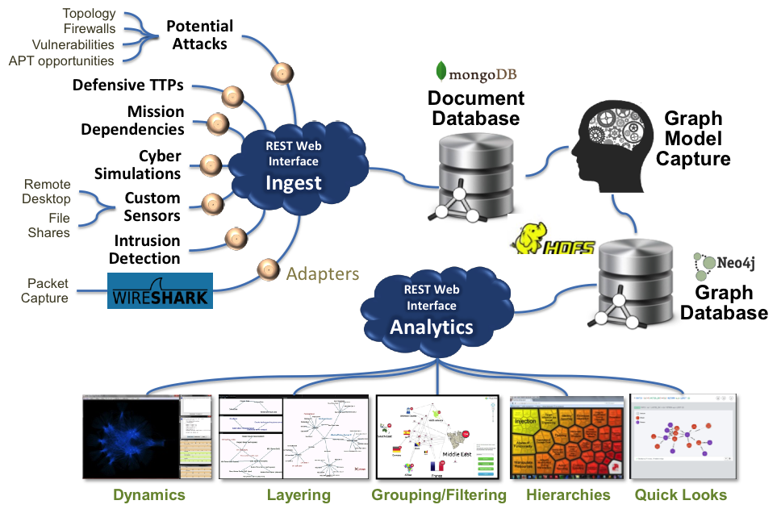
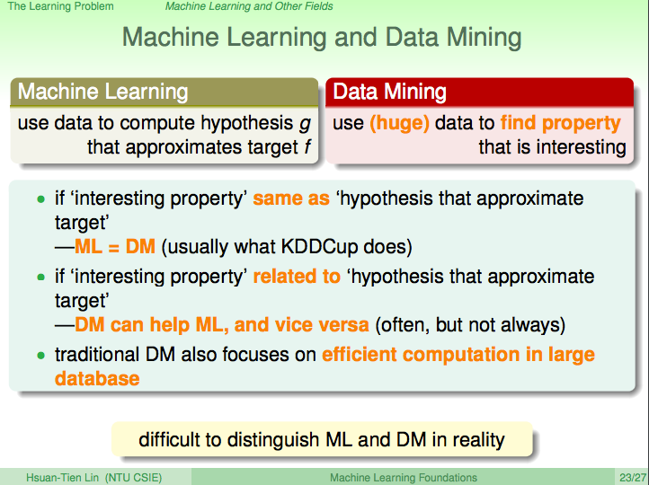
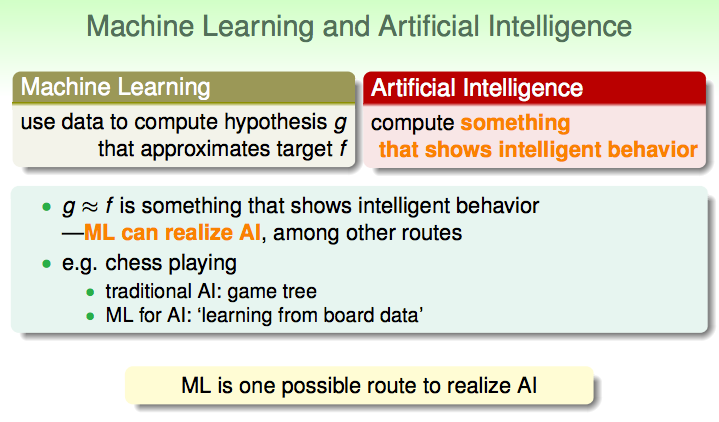
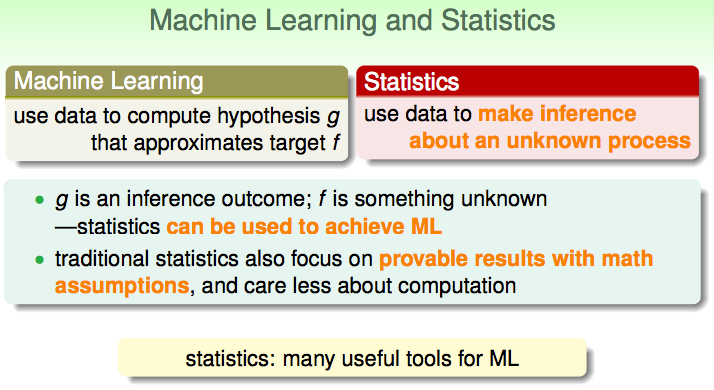
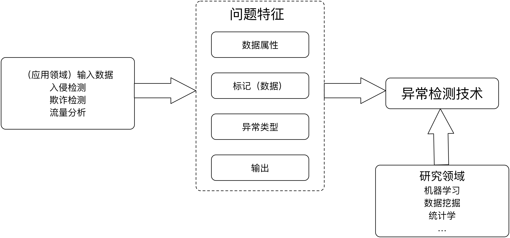
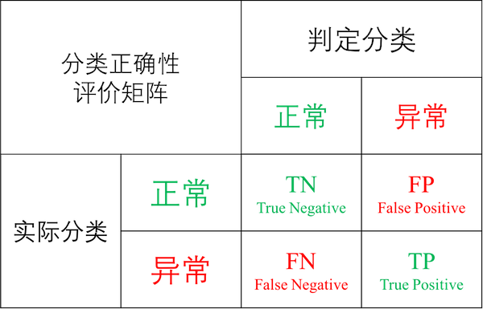
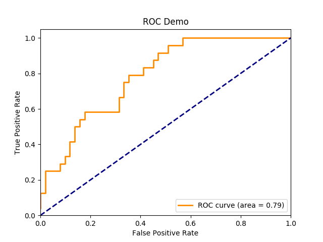

# **数据驱动安全**怎么做

## **数据驱动安全**历史

依赖数据，使用数据分析和处理技术来解决网络安全问题到目前（2017年）为止大致经历了3个阶段：

第一个阶段的主要应用领域是入侵检测。具体来说，按照数据来源的差异，入侵检测技术又被分为基于主机的入侵检测和基于网络的入侵检测。按照数据分析的方法差异，可以分为基于误用（特征）的检测和基于异常的检测。数据挖掘、机器学习开始被安全研究人员引入到检测和对抗网络与系统入侵，不管是数据挖掘还是机器学习，本质上都是在建立一个分类器模型，把输入的数据识别为不同的分类结果输出，100%分类正确的分类器是不存在的。基于这个基本认知，100%的检测和防护能力也是无法实现的，因此，为了提高整个网络与系统的安全性，纵深防御理念逐渐成为了网络空间安全研究的一个共识：通过增加多种异构的“安全分类器”，以图实现更高的分类准确性，进而逼近100%的检测和防护准确率。这个阶段的数据分析方法主要缺陷在于没有有效的整合不同数据源产生的数据、信息、日志和报警等，局部的安全设备、网络设备和服务系统产生的日志和报警没有被放在全局视角进行深度关联分析，SIEM (Security Information and Event Management)就是在这样的背景下应运而生。

第二个阶段的代表性产品形态是SIEM。把安全信息和事件统一管理起来的第一步就是把不同入侵检测系统和产品的报警信息统一收集和集中关联分析，挖掘出具备可行动能力的信息提供给安全专家，辅助运维和管理人员采取及时有效的安全响应措施，应对更为复杂的网络安全态势变化。然后随着需要收集的数据规模越来越大，需要处理和分析的数据种类越来越多，SIEM底层的数据能力和计算能力需要更上一层楼，这个时候，大数据分析能力就呼之欲出了。

第三个阶段就是现在，应用领域非常广泛，包括入侵检测、漏洞挖掘与分析、欺诈检测、钓鱼攻击检测、SPAM检测等等。主要依赖的就是大数据分析能力，具体来说包括云计算、数据分析、数据挖掘、机器学习和人工智能等。由于底层数据能力和计算能力的质变提升，现在的**数据驱动**安全产品除了像SIEM一样对报警信息和日志进行关联分析，还可以对包括源代码、二进制文件、音视频和图像等海量非结构化数据进行分析，关联分析的数据时间跨度也不再局限于小时、天级别，以月度、甚至是年为分析时间跨度的关联分析也正在成为可能。

攻击行为的长期碎片化现在有机会被关联和还原出来，大量试探性扫描和信息收集行为也能更好的与实质入侵行为区分开来，避免海量低危报警淹没了真正的高危行为。更重要的是，安全专家可以将更多原本需要人工分析和人工判定的工作交给以深度学习技术为代表的新一代机器学习和人工智能技术来处理，节省出来的人力资源和时间将可以被用在更为复杂和棘手的未知威胁检测和高危事件应急响应。除此之外，随着移动互联网和物联网技术的发展，越来越多的设备连入互联网，全天候在线设备越来越多。而移动设备、BYOD (Bring Your Own Device)的快速发展使得企业的内外网边界越来越模糊，传统的入侵检测、访问控制、防火墙等技术面临着更加复杂的挑战。

工业革命时期，水、电、交通、电信都已经实现了社会化、集约化和专业化，成为社会的公共基础设施；今天，我们处在后工业革命时期，云计算正在让信息技术和信息服务实现社会化、集约化和专业化，让信息服务成为社会的公共基础设施。越来越多的企业开始选择将其原来的内网业务搬上公有云平台，越来越多的数据开始在云计算平台上流通，这也意味着安全风险变得越来越集中。安全问题要么被消灭在萌芽阶段，要么一旦出现问题，很可能在短时间内集中爆发一大片。时间紧、任务重，就是当下信息安全防御者的最现实的概括和总结。

自动化安全防御的唯一出路就是充分挖掘大数据分析技术的能力，将大量原本需要当作个案、个例去人工分析、定制编程处理的安全事件交给“人工智能模型”去自动化分析、自动化处理。将尽可能多的任务都实现自动化处理，是避免具体安全事件中安全响应时间长的唯一选择。

## 数据分析、数据挖掘、机器学习、深度学习与人工智能

基于数据库系统和应用程序，可以直观查看统计分析系统中的数据，从而可以很快得到我们想要的结果，这就是最基本的数据分析。近几年随着数据规模的增长，单纯查看统计数据的方式已经无法直观的揭示出数据规律和特点，数据可视化成为新的热门数据分析技术。但相比较于数据挖掘、机器学习、深度学习和人工智能等概念和技术，数据分析的工作内容更偏重于人力资源消耗型工作，需要大量人力和手工操作来完成任务。

一个典型的利用可视化来辅助人工数据分析的例子是[CyGraph: Cybersecurity Situational Awareness That’s More Scalable, Flexible & Comprehensive](https://neo4j.com/blog/cygraph-cybersecurity-situational-awareness/)，如下图所示是MITRE公司的研究人员基于数据分析理念和方法，借助mongoDB、Neo4j、HDFS等工具，尝试将不同来源的网络安全数据汇总、关联分析并可视化。数据分析人员通过交互式的图匹配查询和可视化缩小数据分析范围、深入洞察数据之间的内在联系和外在特征，为解决安全问题提供了入手点。

基于这个工具的数据分析过程可以归纳总结为：

> 以通用形式捕获数据、根据通用模型构建分析方法，这样的方式为数据模型的扩展、变形甚至分析方法的变形（在本例中指的是图表查询）都提供了很大的灵活性。

> 不过一旦完成了图表查询后，你会做什么？部分工作是理解如何将问题范围表现为图表；节点是什么，关系是什么，需要捕获的属性是什么？如何对解决重要分析问题的查询作出明确表述？

上述方法虽然已经在使用数据分析的思路解决网络安全问题，但对于分析人员的专业素质水平要求会很高。同时，对于日益增长的网络数据量和报警事件数量、日益复杂的网络威胁形式，依赖分析师团队的人力分析是无法持续提供安全检测和防护能力的。让机器学习起来，让机器来代替掉更多的分析师重复工作，让分析师专注于机器暂时无法处理的高级复杂威胁的分析挖掘是一个意义重大的研究和发展方向。

根据台湾大学林轩田老师的[《机器学习基石》](http://www.csie.ntu.edu.tw/~htlin/mooc/doc/01_present.pdf)课程中的相关概念定义：

> 机器学习（Machine Learning, ML）是从假设空间 ***H*** 中寻找假设函数 ***g*** 的近似目标函数 ***f*** ，数据挖掘（Data Mining / Knowledge Discovery in Database, KDD）是从 ***大量*** 的数据中寻找数据相互之间的特性。如果“有趣的属性”和“近似目标假设”一样，则**机器学习**=**数据挖掘**。如果“有趣属性”和“近似目标假设”相关，数据挖掘可以辅助机器学习，反之在大多数情况下亦然。传统的数据挖掘技术同样关注大数据集合上的有效计算问题。所以在实践中，很难严格区分数据挖掘和机器学习技术。

> 人工智能（Artificial Intelligence, AI）是在计算某个对象过程中表现出智能行为的技术，有很多应用领域。机器学习是实现人工智能的一种手段，但是不限于此。如果机器学习算法中得到 ***g ≈ f*** 过程表现出智能性，则该机器学习算法可以视为实现了人工智能。例如，以计算机下棋为例，经典AI算法采用的是博弈树，而用机器学习算法实现的AI算法采用的是“从棋谱数据学习”的方式。

> 统计学（Statistical）方法使用数据来对未知情形进行推断的过程，机器学习算法中的假设函数 ***g*** 是推断的结果， 近似目标函数 ***f*** 是属于未知情形。统计学方法可以被用于实现机器学习算法，例如：聚类、贝叶斯等等。传统统计学方法也关注“数学假设可证明”，但不太重视可计算性。统计学为机器学习提供了很多有用的工具。

深度学习（Deep Learning, DL）和神经网络（Neural Networking, NN）都是具体的机器学习实现方法，神经网络是深度学习的基础，目前深度学习采用的主要方法就是多（隐藏）层的深度神经网络。

机器学习基本是一个方法和工具，就像数学和统计学一样。按照学习方法的差异，[机器学习主要可以分为](http://www.csie.ntu.edu.tw/~htlin/mooc/doc/03_present.pdf)：监督学习（Supervised Learning）、无监督学习（Unsupervised Learning）、半监督学习（Semi-supervised Learning）和强化学习（Reinforcement Learning）等。按照各自的典型用途进行分类，4大类学习方法又可以分别进一步细分为具体算法。

监督学习的主要用途是分类和回归问题，常见的分类算法有：K-近邻、决策树、朴素贝叶斯、逻辑回归、支持向量机（SVM, Support Vector Machine）、分类回归树（CART, Classification And Regression Tree）、[Softmax回归](http://ufldl.stanford.edu/wiki/index.php/Softmax%E5%9B%9E%E5%BD%92)等。回归问题又可以进一步细分为线性问题和非线性问题，对应线性回归算法和CART算法。

无监督学习的主要用途包括聚类问题（K-均值）、密度估计（FP-Growth算法）和关联分析（Apriori算法）。

半监督学习综合利用有标记的数据和没有标记的数据，来生成合适的分类函数，其基本思想是利用数据分布上的模型假设, 建立学习器对未标记样本进行标记。半监督学习问题从样本的角度而言是利用少量标注样本和大量未标注样本进行机器学习。

强化学习是一种“非常不同”但又十分朴素自然的学习方法，在这种学习模式下，输入数据作为对模型的反馈，不像监督模型那样，输入数据仅仅是作为一个检查模型对错的方式，在强化学习下，输入数据直接反馈到模型，模型必须对此立刻作出调整。常见的应用场景包括动态系统以及机器人控制等。

按照机器学习领域的领军人物吴恩达（Andrew Ng）对机器学习的定义：

> The science of getting computers to act without being explicitly programmed.

机器学习的最终目的就是为了把人类从重复劳动中解放出来，这对于网络安全领域目前所面临的大数据挑战而言是十分有吸引力的。

## 以**入侵检测**应用机器学习为例

基于误用的入侵检测方法的主要局限性在于：无法识别未知威胁、误用特征库维护成本高昂、误用特征数量越来越大导致实时在线匹配性能消耗越来越高等等，而基于异常的入侵检测方法能够被广泛应用于网络安全的各个细分领域其中一个重要的**先验**知识是：网络中恶意流量占总流量的比重是较小的，网络中恶意用户总数占总用户数的比例是较小的，网络中恶意行为占总用户行为数的比例是较小的。因此，通过**观察**和**发现**异常，可以发现威胁流量、威胁用户和威胁行为。不仅网络中如此，现实社会中总体来说各类犯罪行为占总体社会公民活动行为的比例也是极小的，这些恶意行为都可以被标记为**异常**行为。所以，入侵检测领域应用机器学习方法的基本思想就是：把不同来源的数据通过机器学习方法识别和分类为正常和异常。当然，对于正常和异常的进一步细分 **定义** 与 **刻画** 也可以通过机器学习方法来实现。如下图所示为基于异常的检测技术所涉及到的主要关键词及其依赖关系：

从输入数据的角度来看，输入数据可能是单变量或者多变量类型，数据属性可能包括二进制类型、枚举类型、连续型和混合型。混合型数据又被称为复杂数据类型，其可能刻画了数据之间的时空关系。数据的来源既可以是主动获取的，例如通过网络爬虫去采集威胁情报数据，通过网络扫描器去采集互联网开放端口、开放服务和漏洞信息等。数据也可以通过被动捕获获得，例如网络流量的分光镜像存储、交换机端口映射抓包、主机网卡混杂模式抓包等。除了网络流量之外，操作系统和应用软件的日志数据、网络中的数字资产信息数据等，均可以成为异常检测的输入数据。

按照输入数据是否包含标记（数据），基于异常检测的机器学习算法可以被分为监督型、半监督型和无监督型。其中如果正常数据和异常数据都有标记，则可以使用监督型学习算法；如果标记数据只有正常数据才有，异常数据缺失标记，则只能使用半监督学习算法；如果没有任何标记数据，则应该使用无监督学习算法，当然，这里暗含的数据分布假设是：异常数据在总数据中占比较少（[为什么需要**数据驱动安全**](why.md)）一节我们已经展示过了不同网络、不同用户场景下，确实恶意数据占总数据量的比例是符合较少这个条件的。因此，在入侵检测领域是有机会使用无监督学习算法的。

入侵检测领域主要涉及到的异常类型有：点数据异常、上下文信息异常和混合异常。点数据异常举例：网络中不同应用层协议流量的单个报文大小是有先验统计规律可查的，一旦发现某个已知应用层协议报文的大小不在这个经验值区间范围内，则说明该报文可能来自于一次异常网络活动流量。上下文信息异常的检测首先需要先定义正常上下文的一些特征和属性，例如工作日和节假日、工作日白天和工作日夜间的网络流量峰值变化规律是有迹可循的，而对上下文异常的定义和刻画方法很难有统一的表示方法。混合异常则较前两者异常类型要更复杂、更难以刻画和定义，例如网络中突然出现的应用层定时心跳连接、DNS的请求成功率突然降低、出现大量来自于陌生IP地址的入站和出站数据连接等。

异常检测的输出结果可能是标记（异常、正常、C&C连接、蠕虫、DDoS等）或打分（延迟决策和响应，可以进一步对打分进行排序或阈值区间筛选等）。

### 以分类为基础的异常检测技术

分类学习算法的主要思想是：，基于**训练数据**构建一个能分类正常（和异常）事件的模型，基于该模型可以对新的事件进行分类。需要注意的是，分类模型对输入数据的类别分布应具备较强的适应能力，应能处理输入数据（集合）可能存在的**类不平衡(class imbalance)**现象（例如网络在遭受攻击时，恶意流量占比可能会大大高于正常流量占比，而模型在训练时使用的训练数据可能恶意流量占比远远小于正常流量占比）。

伴随近几年深度学习技术火起来的神经网络算法就是一种分类学习算法，具体来说是一种包含多隐藏层的神经网络算法构建了深度学习的基础，在处理大数据集合和噪音数据时多层神经网络算法表现出了较好的健壮性和分类性能，但模型的训练时间普遍较长。除此之外，现有被广泛应用于图像识别、音频识别和生物行为识别等领域的神经网络算法普遍需要在大型监督型数据集上训练。所谓监督型数据集，即每条数据都有一个对应的标签。比如流行的 ImageNet 数据集，有一百万张人为标记的图像。一共有 1000 个类，每个类有 1000 张图像。创建这样的数据集需要花费大量的精力，同时也需要很多的时间。而在网络安全领域，类似规模的公开数据集虽然也可以找到一些，例如[SecRepo.com - Samples of Security Related Data](http://www.secrepo.com/)上就收集了大量包括恶意代码、网络流量、系统日志等在内的多个有标记数据集，但对于入侵检测来说，由于网络数据中可能包含真实用户隐私数据、企业内部机密数据等原因，现有的可以被用于入侵检测领域使用的公开训练数据集普遍都采用的是流量发生软硬件模拟产生的网络抓包数据或者经过匿名化处理的网络抓包数据集合甚至是已预处理好的特征工程文件，无论是数据的真实性还是数据的多样性都被打了折扣。因此，基于这些公开数据集训练出来的分类器，很难在真实网络中表现出很好的分类性能。

从规避数据标记工作量的角度出发，以聚类为基础的异常检测技术可能是未来入侵检测技术领域的一个重要研究方向。

### 以聚类为基础的异常检测技术

聚类学习算法能够被应用在入侵检测领域的一个关键假设就是：正常数据归属于一个规模大、密度高的集合，异常数据则不会被归属（聚类）到任何一个正常数据集合或者异常数据按照自身的相似性归属（聚类）到一个个规模小、密度低的集合。

聚类学习算法也是可以利用有标记的正常数据进行模型训练的，如果训练数据都没有标记，也没有影响，聚类算法可以正常的训练和建模。但从现阶段的研究成果来看，有监督学习算法训练出来的分类器性能要普遍优于无监督学习算法训练出来的聚类模型的分类性能，数据特征的理解和预处理对于最后的分类性能提升是有积极贡献作用的。

### 深度学习驱动的异常检测技术

针对入侵检测系统存在面向海量数据检测速度慢、检测性能低的问题，充分考虑深度学习在高维非线性的海量数据降维方面的优势，把深度学习算法和经典机器学习算法（如SVM、k-近邻、朴素贝叶斯算法等）结合起来构造异常检测模型是目前的一个研究热点。除此之外，如何提高深度学习平台的计算能力、缩短训练时间；选择合适的大数据处理平台（如Google的Tensorflow，微软的DMTK，Facebook的Torchnet等）；开发人工智能专用芯片，提高机器学习算法运算速度；选用多服务器多GPU并行计算硬件平台，实现算法的并行化，加快模型训练速度，并且，通过扩大学习模型规模，不仅可以提升效率，也会实现更高的准确率。可以说，深度学习技术的快速发展，直接推动了异常检测技术的加快发展。

关于深度学习具体算法理论与技术实践，推荐一本免费电子书[Neural Networks and Deep Learning](http://neuralnetworksanddeeplearning.com/)和台湾大学林轩田老师的[《机器学习基石》和《机器学习技术》](http://www.csie.ntu.edu.tw/~htlin/mooc/)，在此对具体机器学习技术就不再做展开。

### 评价指标与评价体系

由于异常检测的底层计算模型和算法主要来自于机器学习领域成果，因此评价一个异常检测算法好坏的方法也可以借鉴机器学习领域的通用算法评价方法和评价指标。以分类算法（输出结果是数据标记）评价为例：

在上图“分类正确性评价矩阵”（``混淆矩阵``，``Confusion Matrix``）中，在事先已知分类数据正常还是异常的前提下，经过分类器判定的数据标记可能正确，也可能会和数据实际分类有偏差。对于异常检测的输出结果是标记且标记种类只有2种的情形来说，正确的分类结果只有2种，分别是：

* True Negative (TN) 数据实际分类为正常（在入侵检测领域，经验告诉我们大多数情况下获得的样本数据都是正常数据，对于正常数据我们不会产生警报，所以，``negative``对应的``阴性``输出分类就像医学诊断上的意义一样，表示``正常``），分类器判定输出结果也是正常；
* True Positive (TP) 数据实际分类为异常（按照上述``negative``在入侵检测和医学诊断领域的释义，这里用``positive``代表``阳性``结果，是需要产生``报警``的``异常``结果），分类器判定输出结果也是异常；

其他2种情况，都说明分类器判定错误，具体的错误类型分别被命名为：

* False Negative (FN) 数据实际分类为异常，分类器判定输出结果是正常。在入侵检测领域，我们将这种分类结果称为``漏报``；
* False Positive (FP) 数据实际分类为正常，分类器判定输出结果是异常。在入侵检测领域，我们将这种分类结果称为``误报``；

在明确了以上基本评价指标之后，我们先来约定以下符号表示：

$$
N = TN + FP
$$

$$
P = TP + FN
$$

其中，``N``表示所有正常（``Negative``）样本的总数，``P``表示所有异常（``Positive``）样本的总数。

接下来，我们可以来详细了解一下更有实际意义的一组评价指标：

``真阳性率``（``True Positive Rate, TPR``），又称为``命中率``（``Hit Rate``）、``敏感度``（``Sensitivity``），刻画了分类模型识别出的异常样本占所有异常样本的比例；

$$
TPR = TP / P = \frac{TP}{TP + FN}
$$

``假阴性率``（``False Negative Rate, FPR``），又称为``错误命中率``、``误报率``或``虚警率``（``False Alarm Rate``），刻画了分类模型将正常样本**错误**的识别为异常样本的概率；

$$
FPR = FP / N = \frac{FP}{TN + FP}
$$

ROC空间将将``FPR``定义为``X``轴，``TPR``定义为``Y``轴，给定一个二元分类模型和它的阈值，就能从所有样本的（阳性／阴性）真实值和预测值计算出一个 ``(X=FPR, Y=TPR)`` 座标点。

从 (0, 0) 到 (1,1) 的对角线将ROC空间划分为左上／右下两个区域，在这条线的以上的点代表了一个好的分类结果（胜过随机分类），而在这条线以下的点代表了差的分类结果（劣于随机分类）。

完美的预测是一个在左上角的点，在ROC空间座标 (0,1) 点，X=0 代表着没有``误报``，Y=1 代表着没有``漏报``（命中率100%）；也就是说，不管分类器输出结果是阳性或阴性，都是100%正确。一个随机的预测会得到位于从 (0, 0) 到 (1, 1) 对角线（也叫无识别率线）上的一个点；最直观的随机预测的例子就是抛硬币。

在实践中，对于同一组确定性样本数据，一个基于阈值参数的分类算法在设置不同阈值的情况下，FPR和TPR会随着阈值的改变而改变。将同一模型每个阈值的 (FPR, TPR) 座标都画在ROC空间里，就成为特定模型的**ROC曲线**。

如上图所示是一个SVM算法的 **ROC曲线** 示意图，阈值的设定对ROC曲线的影响从这张图上可以反映出一些规律：

* 当阈值设定为最高时，亦即所有样本都被预测为阴性，没有样本被预测为阳性，此时在伪阳性率 FPR = FP / ( FP + TN ) 算式中的 FP = 0，所以 FPR = 0%。同时在真阳性率（TPR）算式中， TPR = TP / ( TP + FN ) 算式中的 TP = 0，所以 TPR = 0%。当阈值设定为最高时，必得出ROC座标系左下角的点 (0, 0)。
* 当阈值设定为最低时，亦即所有样本都被预测为阳性，没有样本被预测为阴性，此时在伪阳性率FPR = FP / ( FP + TN ) 算式中的 TN = 0，所以 FPR = 100%。同时在真阳性率 TPR = TP / ( TP + FN ) 算式中的 FN = 0，所以 TPR=100%。当阈值设定为最低时，必得出ROC座标系右上角的点 (1, 1)。
* 因为TP、FP、TN、FN都是累积次数，TN和FN随着阈值调低而减少（或持平），TP和FP随着阈值调低而增加（或持平），所以FPR和TPR皆必随着阈值调低而增加（或持平）。随着阈值调低，ROC点 往右上（或右／或上）移动，或不动；但绝不会往左下(或左／或下)移动。

``准确率``（``Accuracy``，一般简写为``Acc``）刻画了分类模型对总体样本的识别正确比例；

$$
Acc = \frac{TP + TN}{N + P} = \frac{TP + TN}{TP + FN + TN + FP}
$$

对于入侵检测领域来说，仅仅关注**准确率(Accuracy)**指标是不够的，这是因为我们在（[为什么需要**数据驱动安全**](why.md)）一节中已经探讨过很多实际场景中，异常数据占比是极小的。举一个极端的例子：假设网络流量中99.9%的数据都是正常的，只有0.1%的异常数据。那么，一个永远只会输出“正常”的分类器可以在这个网络中获得99.9%的分类“准确率”。然而，这样的分类器是没有应用价值的，因为对于“异常”数据，该分类器的检出能力（命中率和敏感度）为0。

对于分类器输出结果是标记的异常检测算法来说，评价算法分类分的准不准，主要看 ``精度(Precision)``，精度高低体现了分类模型对负样本（异常样本）的区分能力，***精度越高，说明模型对负样本的区分能力越强***；

$$
Precision = \frac{TP}{TP + FP}
$$

对于输出标记的分类器来说，召回率（recall）指标也是评价分类器性能的一个重要指标。召回率体现了分类模型对正样本（正常样本）的识别能力，***召回率值越高，说明模型对正样本的识别能力越强***。

$$
Recall = \frac{TP}{TP + FN} 
$$

对于分类器输出结果是打分的异常检测算法来说，评价算法分类能力高低主要关注AUC(Area Under the [ROC] Curve) 值：被定义为 **ROC曲线下的面积**，显然这个面积的数值不会大于1。又由于ROC曲线一般都处于``y=x``这条直线的上方，所以AUC的取值范围在0.5和1之间。使用AUC值作为评价标准是因为很多时候ROC曲线并不能清晰的说明哪个分类器的效果更好，而作为一个数值，对应AUC更大的分类器效果更好。那么AUC值的含义是什么呢？根据[(Fawcett, 2006)](http://people.inf.elte.hu/kiss/12dwhdm/roc.pdf)，AUC的值的含义是：

>  the AUC of a classifier is equivalent to the probability that the classifier will rank a randomly chosen positive instance higher than a randomly chosen negative instance.

这句话有些绕，我尝试解释一下：首先AUC值是一个概率值，当你随机挑选一个正样本以及一个负样本，当前的分类算法根据计算得到的打分值将这个正样本排在负样本前面的概率就是AUC值。当然，AUC值越大，当前的分类算法越有可能将正样本排在负样本前面，即能够更好的分类。

除了**精度**、**召回率**和**ROC**，分类算法的稳定性如何则可以通过$$F_1$$值来衡量。$$F_1$$值就是**精确率**和**召回率**的调和均值，即：

$$
\frac{2}{F_1} = \frac{1}{Precison} + \frac{1}{Recall} 
$$

$$
F_1 = \frac{2 \times TP}{2TP + FN + FP} = \frac{2 \times Precision \times Recall}{Precision+Recall}
$$

$$F_1$$ 值越高，说明分类模型越稳健。$$F_1$$ 值的计算公式认为精确率和召回率的权重是一样的，但在有些场景下我们可能认为精确率会更加重要，这时我们会用到 $$F_1$$ 值的一个带参数衍生形式： $$F_{\beta}$$ 值，通过调整 $$\beta$$ 值大小可以帮助我们更好的评价分类器性能指标。

$$
F_\beta = (\beta^2 + 1) \times \frac{Precision \times Recall}{\beta^2 \times (Precision+Recall)}
$$

## 2017热点 - 威胁追踪(Threat Hunting)

Threat Hunting是2017年特别火的一个词，主要理念是对于威胁要积极主动、要主动出击、主动查询和追踪威胁，而不是被动等待和响应，国内社区较常见翻译为“威胁追踪”，港澳台地区较常见范围为“威胁猎杀”、“威胁狩猎”。本文采纳“威胁追踪”这个翻译，并在接下来用英文术语缩写**TH**来简记指代**威胁追踪**。

深度了解该技术之后，我们会发现其技术内核就是广泛使用了**数据驱动安全**的原则和技术，对该主题感兴趣的读者可以查看[威胁追踪——数据驱动安全@2017](threat-hunting.md)一节内容。

## 延伸阅读

* [Dive into Machine Learning](https://github.com/hangtwenty/dive-into-machine-learning)
    * [一个使用随机森林算法检测SQL注入的机器学习实战例子](https://github.com/c4pr1c3/data_hacking/blob/master/sql_injection/sql_injection.ipynb)

> 适合有python语言基础的机器学习实践入门者。

* [动手学深度学习，这是一个全中文深度学习教学项目。这个项目可以作为一本书，上课用的材料，现场演示的案例，和一个可以尽情拷贝的代码库](https://zh.gluon.ai/)

