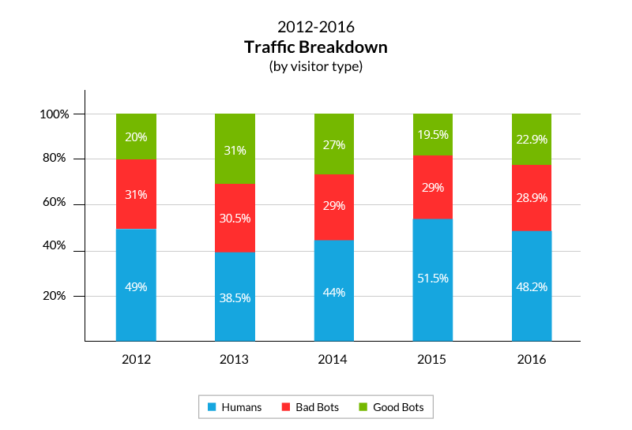
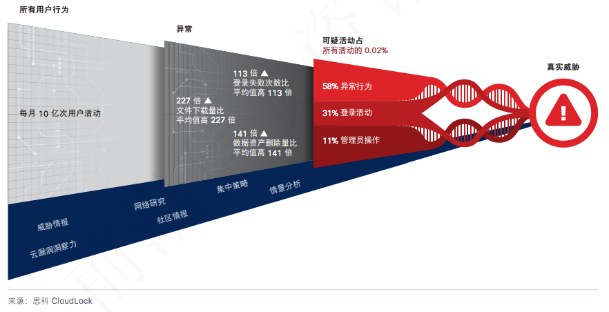

# 为什么需要**数据驱动安全**

企业的计算机网络系统产生大量日志数据，大数据可以针对所有的系统运行记录进行分析，可以弥补时间点检测技术的不足，发现网络攻击的蛛丝马迹。在这个基础上，结合传统的检测技术，可以组成基于记忆的检测系统，这是由国内安全厂商启明星辰提出的思路。

应用大数据分析，需要强大的数据采集平台，以及强大的数据分析处理能力。最理想的情况是建立全球化的数据分析引擎，在全球范围内进行相关数据的关联性分析。这样就能克服信息分布孤岛带来的调查取证难的问题，更容易发现攻击。针对具体的网络、系统和应用的运行数据采集分析，捕获、挖掘、修复漏洞;对全球已经发生以及正在发生的网络攻击行为进行记录，并将这些海量的数据经过多维度的整合分析，自动生成漏洞库、黑客行为特征等数据库。对于具体的网络系统，全球化的安全监测，运用大数据技术，可以提前发现攻击，提前阻止攻击，减少攻击带来的经济损失。

对于大数据的定义，简单来讲就是，无法在一定时间内用常规软件工具对其内容进行存储、管理和处理的数据集合。它主要有5个维度特征，即5个“V”：Volume（容量），Variety（多样性），Velocity（速度），Veracity（准确性）和Value（价值）。我们把这5个V放到数据驱动安全的对抗技术研究的背景下，会发现新兴网络威胁和对网络空间安全防御的挑战也同时具备这5个特征：

## Volume

计算机通信网络技术在最近几年的快速发展，特别是各国、各个城市、各个企业、各个家庭的互联网带宽都在逐年翻番。跨国、城际互联和IDC的网络带宽早以Gbps，甚至是10Gbps为单位衡量。家庭宽带网络接入和4G移动通信的100Mbps时代带来，使得单位时间内需要处理和分析的数据包数量呈现爆炸式几何级数增长。与此同时，信息化趋势借助互联网在世界各国都进入到了一个新的阶段。在我国，李克强总理在2015年的十二届全国人大三次会议提出的“互联网+”行动计划，推动移动互联网、云计算、大数据、物联网等与现代制造业结合，促进电子商务、工业互联网和互联网金融健康发展，引导互联网企业拓展国际市场，这会进一步推动网络传输和本地存储、处理的数据量规模快速膨胀。即使是传统的基于单个数据报文和网络会话级别数据流的安全检测机制面对这种规模的网络数据都有力不从心之感，在这样的海量数据级别进行入侵检测是真正的大海捞针。

根据思科2017年6月更新的流量统计报告[《The Zettabyte Era: Trends and Analysis》](http://www.cisco.com/c/en/us/solutions/collateral/service-provider/visual-networking-index-vni/vni-hyperconnectivity-wp.html)：

* 全球IP流量在2021年将达到3.3 ZB，平均月度流量将达到278 EB（1 ZB = 1024 EB = 1024 \* 1024 PB = 1024 \* 1024 \* 1024 TB）。
* 根据Arbor网络第12次年度基础设施安全报告，2014，2015和2016年，全球DDoS攻击的流量峰值分别达到了400，500和800Gbps；平均一次DDoS攻击的流量已经稳步达到1.2Gbps；一次DDoS攻击流量可以占去一个国家总流量的18%！
    与此同时，攻击者为了完成一次网络攻击，同样需要收集和处理关于被攻击目标的海量情报数据。从这个角度来说，攻防双方谁能处理更多的数据，谁就能在网络空间安全对抗中获得更多的信息。

## Variety

信息技术本身就呈现着多样化发展的特点，操作系统、应用软件、通信协议等软件技术百家齐放，PC、手机、平板、嵌入式设备等硬件产品快速更新换代，万物互联时代的APT攻击已经不再局限于针对PC、服务器的入侵和控制，任何可以联网、任何可以处理数据的设备与系统都是潜在的攻击目标。例如，对于入侵检测来说，仅仅一个基本的终端安全防护的任务就将面临终端设备多样性的挑战。同时，已有的通信协议多样化、加密等问题，一直以来都是网络流量识别与分类技术研究领域的难题。流量识别技术是网络入侵检测与保护的共性基础技术，无法准确分类流量就意味着无法准确识别出网络流量中夹杂的恶意代码、攻击负载和泄密数据。

根据Imperva Incapsula公司的2015年和2016年爬虫流量年度报告（统计数据采集自Incapsula网络中100万随机选取域名的167亿次页面访问），[Web访问流量中的恶意爬虫在2015年的流量占比大约是29%](https://www.incapsula.com/blog/bot-traffic-report-2015.html)，[Web访问流量中的恶意爬虫在2016年的流量占比大约是28.9%](https://www.incapsula.com/blog/bot-traffic-report-2016.html) 。从2012年到2016年的这5年流量分类占比统计数据和趋势来看，真人用户产生的流量行为在Web流量中的占比并不是压倒性优势。同时，爬虫（机器人）流量占比一直居高不下，恶意爬虫的流量占比甚至超过正常爬虫流量。

新技术的应用，新应用的产生，新威胁的出现都意味着会不断产生新类型的数据，数据的多样性既是数据分析的机遇，更是数据分析的挑战。

## Velocity

Verizon发布的《2013年数据泄漏调查报告》已经揭示了数据窃密行为一旦发生，攻击者完全有可能在数小时，甚至是分钟、秒级别达成机密数据的窃取目的。泄密行为一旦产生，和系统被攻陷后通过应急响应可以夺回系统控制权不同，数据失窃应急控制措施只能终止未泄密数据的非法访问，对已泄密数据已经无力挽回。以APT攻击为例，APT攻击虽然普遍潜伏周期长，但留给APT防御一方的检测时间往往也是仅限于数据回传期间，而这个回传的持续时间窗口往往并不长。所以，APT防御者尽早发现入侵、尽早检测到APT攻击驻留行为，在数据回传行为还没开始之前及时处置掉所有驻留的恶意代码至关重要。

攻击者的终极目标是希望越早结束攻击对自己越有利，时间拖得越长其实也是增加了自己暴露和被发现的风险。以漏洞生命周期为例，攻击者在发掘出新漏洞之后，希望抢在软硬件厂商修补漏洞之前利用该未知漏洞攻击尽可能多的系统。厂商即使开发出漏洞补丁，但只要在终端用户没有安装补丁之前，攻击者依然有时间去利用漏洞攻击用户。从漏洞攻防过程来看，攻防双方争夺的目标就是漏洞暴漏于未修补状态的时间长短：谁先掌握未知漏洞信息，谁就在这场漏洞攻防战之中处于优势地位。
    从这个角度来说，网络与系统攻防双方都希望提高自己的数据处理效率，缩短信息提取周期，更快的为自己下一步行动得出决策意见，抢先对手行动。

## Veracity

网络和系统攻击行为不论是借助于社会工程学手段还是0day漏洞利用，一定会在网络流量或被攻击系统里留下蛛丝马迹。由于攻防双方的信息不对称问题，特别是攻防双方由于守方在明，攻方在暗，攻方可以通过大量的信息收集和交换行为获得关于守方的更准确信息。而守方对攻方信息的收集不仅缺少准确性，甚至大部分时间里对攻方信息一无所知。无论是网络入侵检测、主机入侵检测还是数据泄漏检测的系统构建者，误用检测和异常检测是最基本的安全检测理论基础。其中误用检测的基本原理是对已知攻击行为特征和模式的总结、建模，很显然这个检测理论在面对日益增长的网络攻击行为数量和类型是非常被动的。攻击者通过长时间的信息收集工作，可以设计出针对性的误用检测模型绕过技术来悄无声息的进出于目标网络和系统。即使是基于异常检测模型，无论是基于模式的异常检测，还是基于行为的异常检测，攻击者同样可以通过大量信息收集工作，推断出关于异常检测系统对“正常”模式和行为的判定标准和算法，进而可以针对性的伪装成正常业务和行为模式，躲避异常检测。
    对于攻击者来说，在情报不足或掌握的是错误情报信息的情况下展开的攻击行为会极大的提升被发现风险。所有已公开的网络防御成功事件有一个共性特征：攻击者落入了防御者精心设计的检测陷进（典型的如DNSSinkholing技术、沙盒检测技术等）。
    从这个角度来说，安全攻防双方一方面都希望获得关于对方的正确数据，同时，希望对方从自己这里获得的数据都是错误的。基于错误的数据，是无法得到一个有效的行动决策的。

另外，根据[《思科2017年年度网络安全报告》](http://b2me.cisco.com/zh-cn-annual-cybersecurity-report-2017)中的说明，``在联网型第三方云应用相关的 5000 个用户 活动中，仅有 1 个活动(占 0.02%)是可疑的``（如下图所示）：

因此，在海量正常用户行为数据中找到“稀少”的攻击行为要解决好“虚警率”高的问题。由于用户行为数据基数大，即使是百分之一的“虚警”也是十分可观的数据规模。“狼来了”的故事告诉我们：误报太多，一方面会造成用户的安全警惕性下降，在真正的威胁到来时失去及时响应能力。另一方面也会对用户的正常业务造成过多打扰，增加日常运营负担。

## Value

信息化带来的一个重要长期成果和不断累积价值就是大数据。安全虽然不“创造”价值，但“守护”价值。汽车跑的快靠油门，汽车卖得好靠刹车。一方面，所有人都享受和体验到了信息化、互联互通带来的良好用户体验，同时，随着越来越多的重大信息安全事件曝光在公众视野之中，消费者对产品和服务供给中信息安全的理解和要求也在不断提高，这必将迫使相关行业和产业链的参与者不得不投入更多资源在信息安全建设上。

APT攻击者的普遍动机就是为了窃取高价值数据，与此同时，对于很多被攻击对象来说，他们自己甚至都不如攻击者清楚自己企业中哪些信息资产是有高价值的。由于被攻击者自身对数据价值的认识不足，导致很多APT攻击事件中攻击者轻易的就访问到了这些高价值数据，根本就没有遇到任何有效的防御机制。换句话来说，如果企业能提前认识到自己的这些高价值数据，就有机会抢在攻击者发起APT攻击之前对这些数据进行更为有效的保护。

2015年开始兴起的勒索软件攻击件正成为一个日益严重的问题。企业通常认为支付赎金是取回数据最划算的办法，现实情况也可能正是这样。但是，我们所面临的问题是，每一个企业为了取回其文件而支付的赎金，会直接用于下一代勒索软件的开发。因此，我们看到勒索软件正以惊人的速度不断发展。勒索能够得逞的前提正是被加密数据本身的价值远远高于勒索赎金，从这个角度来看，网络空间数据的价值是真实存在且不断增加的。

通过以上的网络空间安全大数据特征分析我们可以得到3个重要结论：    

1.  网络空间安全攻防的研究对象都具备了大数据的5个典型特征。
2.  网络空间安全攻防双方都已在自觉或不自觉的运用大数据理论和技术。
3.  网络空间安全攻防成败的核心就是大数据能力的全面对抗。

